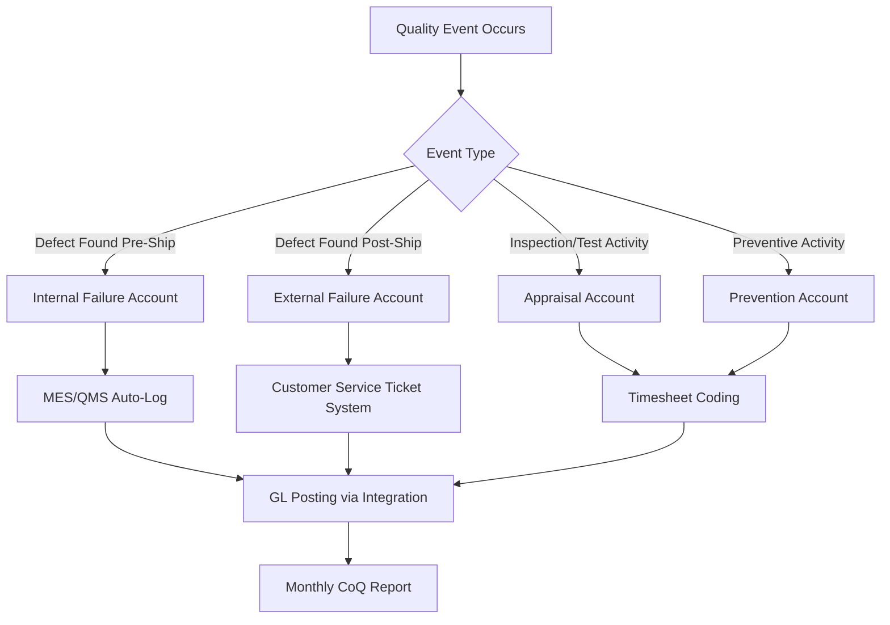

## Establishing Quality Cost Categories and Accounts

### Overview and Purpose

Establishing quality cost categories and accounts is the foundational structural step in implementing a Cost of Quality (CoQ) program. Before any data can be collected, tracked, or analyzed, an organization must define a taxonomy of cost categories and map them to specific, traceable financial accounts. This step transforms CoQ from an abstract concept into an operational accounting practice.

The core objective is to answer three questions for every dollar spent related to quality: (1) What category of quality cost does this represent? (2) Which department or process incurred it? (3) How does it map to the existing general ledger (GL) structure? Without this mapping, CoQ reporting becomes a one-time estimation exercise rather than a repeatable management system.

### The Four Standard Categories (PAF Model)

The Prevention-Appraisal-Failure (PAF) model, originally formalized by Feigenbaum and later adopted into ASQ standards, remains the baseline taxonomy.

**Prevention Costs** — Costs incurred to prevent defects before they occur.

- Quality planning and engineering
- Process capability studies
- Supplier quality surveys and qualification
- Training programs (quality-specific)
- Design reviews and Design for Six Sigma (DFSS) activities
- Preventive maintenance programs

**Appraisal Costs** — Costs incurred to detect defects through inspection and testing.

- Incoming/receiving inspection
- In-process and final inspection
- Test equipment calibration
- Quality audits
- Supplier certification/verification testing

**Internal Failure Costs** — Costs incurred when defects are found before the customer receives the product/service.

- Scrap and rework
- Re-inspection and re-testing
- Failure analysis and root cause investigation
- Downgrading/downtime due to defects

**External Failure Costs** — Costs incurred when defects are found after delivery.

- Warranty claims and returns
- Customer complaint handling
- Field service and recalls
- Liability claims
- Lost sales/reputation damage (often tracked qualitatively as [Inference] these figures are frequently estimated rather than directly ledgered, since goodwill loss has no direct cash transaction)

This structure directly underpins the 1-10-100 Rule: prevention (1x) is categorically cheapest, appraisal/internal failure (10x) moderate, and external failure (100x) most expensive — the category boundaries you establish here are what let you later prove that multiplier with real data.

### Step 1: Conduct a Cost Discovery Workshop

Before building accounts, interview stakeholders across departments (Quality, Manufacturing/Operations, Customer Service, Finance, Engineering) to inventory *where* quality-related spending currently hides. Quality costs are frequently buried inside general overhead accounts (e.g., "Manufacturing Overhead," "Customer Support Opex") rather than isolated.

**Key Points**

- Map existing GL accounts against the PAF categories to identify gaps
- Identify costs currently untracked entirely (e.g., engineering time spent on failure analysis, often absorbed into salaried headcount with no cost code)
- Document assumptions where costs must be allocated/estimated rather than directly measured

### Step 2: Design the Chart of Accounts Extension

Rather than replacing the existing chart of accounts (COA), CoQ implementation typically adds a *sub-ledger dimension* or *cost center tagging layer* on top of it. Two common architectural approaches exist:

**Approach A: Dedicated GL Sub-Accounts**

Create new GL accounts nested under existing cost centers, e.g.:



```
6100 - Quality Costs (parent)
  6110 - Prevention
    6111 - Quality Planning
    6112 - Training
    6113 - Supplier Qualification
  6120 - Appraisal
    6121 - Incoming Inspection
    6122 - Final Test
    6123 - Calibration
  6130 - Internal Failure
    6131 - Scrap
    6132 - Rework
    6133 - Failure Analysis
  6140 - External Failure
    6141 - Warranty
    6142 - Returns/RMA
    6143 - Field Service
```

**Approach B: Cost Center Tags/Dimensions (ERP-native)**

In modern ERP systems (SAP, NetSuite, Oracle), use a secondary dimension (cost element, project code, or analysis code) layered on existing accounts, avoiding COA proliferation. This is generally preferred for organizations with mature ERP systems since it avoids duplicating account structures.

$$\text{Total CoQ} = \sum_{i=1}^{n} P_i + \sum_{j=1}^{m} A_j + \sum_{k=1}^{p} IF_k + \sum_{l=1}^{q} EF_l$$

where $P$, $A$, $IF$, and $EF$ represent individual line items within Prevention, Appraisal, Internal Failure, and External Failure respectively.

### Step 3: Define Account Ownership and Allocation Rules

Each account requires a documented owner and an allocation methodology for shared/indirect costs.

**Example**

| Account | Owner | Allocation Method |
| --- | --- | --- |
| 6112 - Training | Quality Manager | Direct cost + labor hours × loaded rate |
| 6131 - Scrap | Plant Manager | Direct material cost at standard cost, per work order |
| 6133 - Failure Analysis | Engineering Lead | Labor hours (timesheet-coded) × fully burdened rate |
| 6141 - Warranty | Customer Service Director | Direct claim payout + estimated labor allocation |

For labor-based categories (a large share of Prevention and Internal Failure costs), a **fully burdened labor rate** is typically applied:

$$C_{labor} = h \times r_{base} \times (1 + b)$$

where $h$ = hours logged, $r_{base}$ = base hourly rate, and $b$ = burden rate (benefits, overhead allocation, typically 0.3–0.6 depending on industry) [Unverified — burden rate ranges vary significantly by industry and geography and should be sourced from Finance, not assumed].

### Step 4: Establish Data Capture Mechanisms

Accounts are only as good as the data feeding them. Three primary capture mechanisms:

1. **Timesheet/Labor Coding** — Employees code hours against quality cost accounts (e.g., "Failure Analysis - Job #4521") in existing time tracking or ERP labor modules.
2. **Transaction Tagging** — AP/Procurement tags invoice line items with the relevant quality cost code at time of entry (e.g., supplier audit invoice → 6113).
3. **System-Generated Triggers** — MES/QMS systems automatically log scrap quantities, rework hours, or NCR (Non-Conformance Report) costs and push them to the corresponding GL account via integration.



### Step 5: Set Reporting Granularity and Rollup Structure

Decide the level at which costs will be reported and rolled up:

- **Product line** — useful for identifying which products drive disproportionate failure costs
- **Process/work center** — useful for operational root-cause targeting
- **Business unit/site** — useful for executive-level benchmarking across facilities

A well-structured account hierarchy supports rollup along all three dimensions simultaneously, typically via dimensional tagging (cost center + product code + PAF category) rather than separate account trees per dimension, since maintaining parallel COA structures for each reporting axis creates reconciliation overhead.

### Common Pitfalls

- **Double-counting**: A rework labor hour coded both to "Internal Failure" and to standard production labor inflates totals. Establish clear mutual-exclusivity rules.
- **Omitting hidden costs**: Engineering and management time spent on quality firefighting is the most commonly underreported category, since it's rarely logged against a specific job code by default.
- **Over-engineering the COA**: Excessive account granularity (e.g., 50+ sub-accounts) creates data entry burden that reduces compliance. Start with the four top-level categories and 3–5 sub-accounts each; expand only where analysis demands it.
- **Static account structures**: CoQ accounts should be revisited annually as product lines and processes change; treating the COA as permanent leads to miscategorized "other" costs accumulating over time.

**Next Steps**

- Building the CoQ Data Collection Process and Cadence
- Assigning Departmental Cost Ownership and Accountability
- Integrating CoQ Accounts with ERP/MES Systems
- Calculating Baseline CoQ as a Percentage of Revenue/COGS
- Designing CoQ Dashboards and Executive Reporting Formats