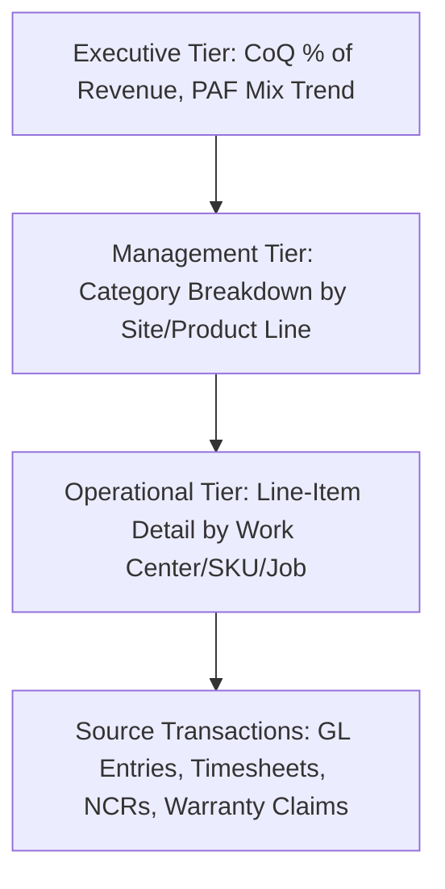
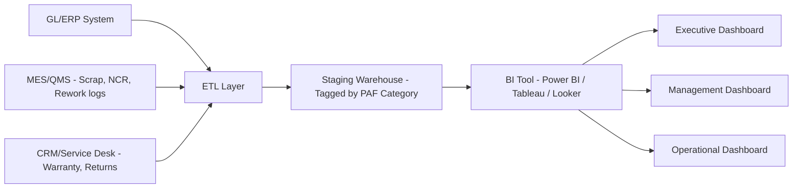

## Building Quality Cost Dashboards and KPIs


### Overview and Purpose

Once quality cost categories and accounts are established and data capture mechanisms are operational, the next step is translating raw CoQ data into decision-grade dashboards and KPIs. A dashboard's purpose is not merely to display totals — it is to make the 1-10-100 cost multiplier visible to decision-makers, surface trends before they become crises, and drive resource allocation toward prevention.

A well-designed CoQ dashboard answers: Where is money currently being spent across the PAF categories? Is the mix shifting toward prevention over time? Which products/processes/sites are outliers? And is the total CoQ trending toward the benchmark target (commonly cited as 2–5% of revenue for mature quality organizations, versus 15–20%+ for unmanaged environments) [Unverified — benchmark percentages vary substantially by industry, and sourcing should be validated against industry-specific studies rather than treated as universal].

### Core KPI Categories

**1. CoQ as a Percentage of Revenue/Sales**

The primary executive-level metric, enabling cross-period and cross-industry comparison.

$$\text{CoQ}\% = \frac{P + A + IF + EF}{\text{Net Sales}} \times 100$$

where $P$, $A$, $IF$, $EF$ are the summed Prevention, Appraisal, Internal Failure, and External Failure costs for the period.

**2. CoQ as a Percentage of Cost of Goods Sold (COGS)**

Preferred in manufacturing contexts where revenue fluctuates independently of production cost structure:

$$\text{CoQ}\%_{COGS} = \frac{P + A + IF + EF}{\text{COGS}} \times 100$$

**3. PAF Category Mix Ratio**

Tracks the *distribution* across categories rather than the absolute total — the key indicator for the 1-10-100 Rule's validation. A healthy trend shows Prevention share increasing while Failure share (Internal + External) decreases over time.

$$\text{Prevention Ratio} = \frac{P}{P + A + IF + EF} \times 100$$

**Key Points**

- A common maturity benchmark: mature programs target roughly 10% Prevention / 25–30% Appraisal / 55–65% Failure moving toward higher Prevention shares over time [Inference — exact target ratios are organization- and industry-dependent, and should be calibrated against historical baselines rather than applied as a fixed rule]
- External Failure share trending upward is typically the highest-priority red flag, since it indicates defects are reaching customers and confirms the 100x cost tier is being incurred

**4. Cost of Poor Quality (COPQ) Trend**

COPQ isolates Internal + External Failure costs (i.e., CoQ minus the "good cost" categories of Prevention and Appraisal):

$$\text{COPQ} = IF + EF$$

This is often the single most-watched line since it represents costs that are pure waste — no value delivered to the customer or the business.

**5. First Pass Yield (FPY) / Rolled Throughput Yield (RTY)**

Not a cost metric directly, but a leading operational indicator that correlates strongly with Internal Failure costs:

$$FPY = \frac{\text{Units passing without rework}}{\text{Total units started}} \times 100$$

**6. Warranty/Return Rate and Cost per Unit**

$$\text{Warranty Cost per Unit} = \frac{\text{Total Warranty \$}}{\text{Units Shipped}}$$

Note the escaped dollar sign above (`\$`) to prevent unintended LaTeX triggering in prose contexts.

### Dashboard Architecture

**Layered Design Pattern**

Effective CoQ dashboards use a three-tier drill-down structure:



- **Executive Tier**: Single-page view — CoQ% trend line, PAF mix stacked bar, top 3 cost drivers. Refreshed monthly/quarterly.
- **Management Tier**: Category-level breakdowns segmented by department, product line, or plant. Refreshed weekly.
- **Operational Tier**: Transaction-level detail enabling root-cause drill-down (e.g., which specific work order drove a scrap spike). Refreshed daily or real-time where MES integration exists.

### Example Dashboard Layout (Conceptual)

**Example**



```
┌─────────────────────────────────────────────────────────┐
│  CoQ Executive Dashboard — Q3 FY26                       │
├─────────────────────────────────────────────────────────┤
│  CoQ % of Revenue: 4.2%  (▼ 0.6pp vs Q2)                  │
│  COPQ: $1.84M            (▼ 12% vs Q2)                    │
│                                                            │
│  [PAF Mix - Stacked Bar, 6 quarter trend]                 │
│   Prevention ██  Appraisal ████  Int.Fail ██████ Ext.Fail █│
│                                                            │
│  Top 3 Cost Drivers:                                      │
│   1. Warranty - Product Line C   $412K                    │
│   2. Scrap - Work Center 4       $298K                    │
│   3. Rework - Final Assembly     $205K                    │
└─────────────────────────────────────────────────────────┘
```

### Inline SVG: PAF Category Trend Visualization (svg_diagram)

<svg xmlns="http://www.w3.org/2000/svg" viewBox="0 0 640 340" font-family="Arial, sans-serif">
<text x="320" y="24" font-size="16" font-weight="bold" text-anchor="middle" fill="#1a1a1a">PAF Cost Mix Trend Over Time (svg_diagram)</text>
<line x1="60" y1="290" x2="600" y2="290" stroke="#333" stroke-width="2" />
<line x1="60" y1="50" x2="60" y2="290" stroke="#333" stroke-width="2" />
<text x="30" y="295" font-size="11" fill="#333">0%</text>
<text x="20" y="175" font-size="11" fill="#333">50%</text>
<text x="20" y="60" font-size="11" fill="#333">100%</text>
<g>
<rect x="100" y="260" width="60" height="30" fill="#2e7d32" />
<rect x="100" y="210" width="60" height="50" fill="#66bb6a" />
<rect x="100" y="120" width="60" height="90" fill="#ef6c00" />
<rect x="100" y="50" width="60" height="70" fill="#c62828" />
<text x="130" y="305" font-size="11" text-anchor="middle">Q1</text>
</g>
<g>
<rect x="220" y="255" width="60" height="35" fill="#2e7d32" />
<rect x="220" y="195" width="60" height="60" fill="#66bb6a" />
<rect x="220" y="115" width="60" height="80" fill="#ef6c00" />
<rect x="220" y="50" width="60" height="65" fill="#c62828" />
<text x="250" y="305" font-size="11" text-anchor="middle">Q2</text>
</g>
<g>
<rect x="340" y="245" width="60" height="45" fill="#2e7d32" />
<rect x="340" y="185" width="60" height="60" fill="#66bb6a" />
<rect x="340" y="130" width="60" height="55" fill="#ef6c00" />
<rect x="340" y="50" width="60" height="80" fill="#c62828" />
<text x="370" y="305" font-size="11" text-anchor="middle">Q3</text>
</g>
<g>
<rect x="460" y="235" width="60" height="55" fill="#2e7d32" />
<rect x="460" y="170" width="60" height="65" fill="#66bb6a" />
<rect x="460" y="125" width="60" height="45" fill="#ef6c00" />
<rect x="460" y="50" width="60" height="75" fill="#c62828" />
<text x="490" y="305" font-size="11" text-anchor="middle">Q4</text>
</g>
<rect x="60" y="315" width="12" height="12" fill="#2e7d32" />
<text x="76" y="325" font-size="10">Prevention</text>
<rect x="160" y="315" width="12" height="12" fill="#66bb6a" />
<text x="176" y="325" font-size="10">Appraisal</text>
<rect x="255" y="315" width="12" height="12" fill="#ef6c00" />
<text x="271" y="325" font-size="10">Internal Failure</text>
<rect x="390" y="315" width="12" height="12" fill="#c62828" />
<text x="406" y="325" font-size="10">External Failure</text>
</svg>

### Data Pipeline for Dashboard Automation

A production-grade CoQ dashboard is typically fed via a scheduled ETL/ELT pipeline rather than manual spreadsheet consolidation:



**Key Points**

- Source systems: ERP (GL postings), MES/QMS (scrap, rework, NCR), CRM/Service Desk (warranty, returns), Timesheet/HR systems (labor allocation)
- Staging layer applies PAF category tagging rules consistently, using the account/dimension structure defined during the Chart of Accounts step
- BI tool selection (Power BI, Tableau, Looker, or custom) should align with existing organizational BI standards to reduce training/maintenance overhead rather than introducing a new tool solely for CoQ

### Common Pitfalls

- **Vanity metrics without action thresholds**: A dashboard showing "CoQ = 4.2%" is meaningless without a target, trend line, and escalation trigger (e.g., "escalate to Ops VP if External Failure exceeds 1.5% of revenue for 2 consecutive months").
- **Lagging-only indicators**: Dashboards built solely on monthly financial actuals miss early warning signs. Pairing CoQ with leading indicators (FPY, supplier defect PPM, audit findings) closes this gap.
- **Inconsistent period boundaries**: Comparing a calendar-month CoQ figure against a fiscal-month revenue figure distorts the ratio; ensure numerator and denominator use identical accounting periods.
- **Dashboard sprawl**: Building a new dashboard per department without a shared underlying data model leads to conflicting numbers being presented in different meetings — a common credibility killer for CoQ programs.
- **Ignoring statistical noise**: Small sample sizes (e.g., a single quarter's warranty claims for a low-volume product) can create misleading trend lines; apply moving averages or control limits before flagging as a true trend.

**Related Topics**

- Setting CoQ Targets and Escalation Thresholds
- Leading vs. Lagging Quality Indicators
- Statistical Process Control (SPC) Integration with CoQ Reporting
- Benchmarking CoQ Against Industry Standards
- Communicating CoQ Findings to Executive Leadership