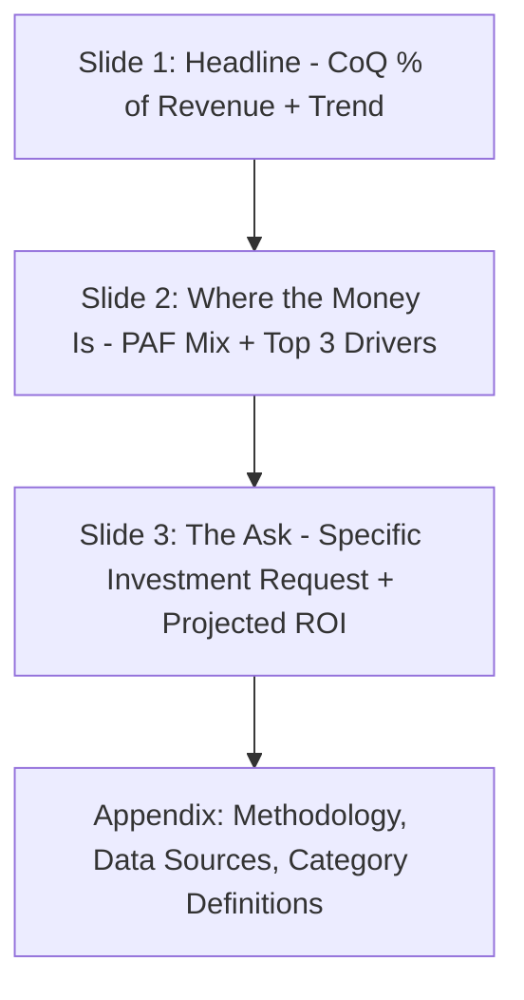

## Communicating Quality Costs to Executives

### Overview and Purpose

Establishing accounts and building dashboards produces accurate CoQ data, but data alone rarely changes executive behavior or unlocks budget for prevention investment. This step addresses the *translation* problem: converting technical quality metrics into the financial and strategic language that resonates with C-suite and board-level audiences, whose primary decision criteria are typically revenue impact, risk exposure, and return on investment — not defect counts or process capability indices.

The central communication challenge is bridging two mental models. Quality professionals think in terms of PAF categories, defect rates, and process control. Executives think in terms of EBITDA impact, competitive positioning, and capital allocation trade-offs. A CoQ communication strategy that fails to make this translation typically results in the program being deprioritized during budget cycles, regardless of the accuracy of the underlying data.

### Framing Principle: Cost of Poor Quality as an Investment Opportunity, Not a Blame Report

The most common failure mode in executive CoQ communication is presenting failure cost data as a retrospective scorecard of what went wrong, which triggers defensiveness from operational leaders rather than resource allocation decisions. The more effective frame positions COPQ as **unrealized margin** — money currently being spent on non-value-added rework and failure that could instead flow to the bottom line or fund growth initiatives.

**Key Points**

- Reframe "$1.8M in failure costs" as "$1.8M in recoverable margin, equivalent to X% of this year's operating income target"
- Anchor every failure cost figure to a comparable business metric the executive team already tracks (revenue %, EPS impact, headcount-equivalent)
- Present the 1-10-100 Rule not as a quality slogan but as a capital allocation argument: a marginal dollar spent in Prevention displaces roughly ten to a hundred dollars of downstream cost, framed the way any other ROI-positive investment would be

### The 1-10-100 Rule as an Executive Narrative Device

$$\text{Relative Cost} = 1 \times (\text{Prevention}) \; : \; 10 \times (\text{Correction}) \; : \; 100 \times (\text{Failure})$$

This ratio is the single most executive-legible artifact in the entire CoQ toolkit because it maps directly onto financial leverage concepts executives already use (e.g., operating leverage, compounding cost of delay). It should typically appear on the first slide of any executive CoQ presentation, illustrated with a real, recent internal example rather than the generic textbook version, since executives respond more strongly to their own company's numbers than to a hypothetical.

**Example**

"A design flaw caught during peer review in Q1 cost approximately $400 in engineering time. The same class of defect, caught during final test in Q2, cost $4,200 in rework and re-test. A similar defect that reached three customers in Q3 cost $61,000 in field service, replacement units, and one lost contract renewal." — this progression, using the organization's own incidents, operationalizes the 1-10-100 Rule far more persuasively than the abstract ratio alone.

### Structuring the Executive Report

A three-layer structure, mirroring the dashboard architecture from earlier CoQ work, keeps executive materials concise while allowing drill-down on request:

- **Slide 1 (Headline)**: A single trend line — CoQ as % of revenue over 4–8 quarters — with one sentence of context. No category breakdown yet; the goal is orienting the audience to magnitude and direction before detail.
- **Slide 2 (Diagnosis)**: PAF mix and top 2–3 specific cost drivers by dollar value, each tied to a named product, process, or customer segment. Avoid presenting more than 3 drivers — additional detail belongs in the appendix.
- **Slide 3 (The Ask)**: A specific, costed proposal (e.g., "$150K investment in supplier qualification tooling") paired with a projected reduction in a named failure cost line, using conservative rather than best-case assumptions to preserve credibility.

### Financial Translation Techniques

**1. Convert to Income Statement Impact**

$$\Delta \text{Operating Margin} = \frac{\Delta \text{COPQ}}{\text{Net Sales}} \times 100$$

Presenting a COPQ reduction as a direct operating margin percentage point improvement is typically the single most persuasive conversion, since margin percentage is a metric most executive teams are evaluated against externally (by boards, analysts, or PE sponsors).

**2. Express as Payback Period / ROI**

$$\text{Payback (months)} = \frac{\text{Prevention Investment}}{\text{Projected Monthly COPQ Reduction}}$$

Executives evaluating competing capital requests routinely default to payback period and ROI as comparison metrics; a CoQ investment proposal lacking this framing is often disadvantaged relative to competing requests from other departments that do include it.

**3. Benchmark Against Peers or Industry**

Where available, external benchmark data (industry association studies, analyst reports) contextualizes whether the organization's CoQ% is competitively positioned or lagging. This should be sourced and cited carefully rather than asserted, since benchmark ranges vary considerably by sector and methodology [Unverified — always verify benchmark figures against a current, named source before presenting them as fact to an executive audience].

### Visualization Guidance for Executive Audiences

Executive-facing visuals should prioritize single-metric clarity over comprehensive detail. A dense multi-axis chart appropriate for an operational dashboard is generally the wrong artifact for a board slide.

<svg xmlns="http://www.w3.org/2000/svg" viewBox="0 0 640 300" font-family="Arial, sans-serif">
<text x="320" y="26" font-size="16" font-weight="bold" text-anchor="middle" fill="#1a1a1a">CoQ as % of Revenue — Executive View (svg_diagram)</text>
<line x1="70" y1="240" x2="580" y2="240" stroke="#333" stroke-width="2" />
<line x1="70" y1="60" x2="70" y2="240" stroke="#333" stroke-width="2" />
<text x="40" y="245" font-size="11">0%</text>
<text x="40" y="150" font-size="11">4%</text>
<text x="40" y="65" font-size="11">8%</text>
<polyline points="110,90 220,110 330,150 440,175 550,190" fill="none" stroke="#c62828" stroke-width="3" />
<circle cx="110" cy="90" r="4" fill="#c62828" />
<circle cx="220" cy="110" r="4" fill="#c62828" />
<circle cx="330" cy="150" r="4" fill="#c62828" />
<circle cx="440" cy="175" r="4" fill="#c62828" />
<circle cx="550" cy="190" r="4" fill="#c62828" />

<text x="110" y="260" font-size="11" text-anchor="middle">Q1</text>

<text x="220" y="260" font-size="11" text-anchor="middle">Q2</text>

<text x="330" y="260" font-size="11" text-anchor="middle">Q3</text>

<text x="440" y="260" font-size="11" text-anchor="middle">Q4</text>

<text x="550" y="260" font-size="11" text-anchor="middle">Q5</text>

<text x="565" y="185" font-size="12" fill="`#c62828`" font-weight="bold">3.1%</text>

<text x="115" y="80" font-size="12" fill="`#c62828`" font-weight="bold">6.8%</text>

<text x="320" y="285" font-size="11" text-anchor="middle" fill="#555">Target line: 2.5% by Q6 (dashed, not shown at this scale)</text>

</svg>

### Tailoring the Message by Stakeholder

**Key Points**

- **CFO**: Emphasize margin impact, ROI, and payback period; provide auditable data lineage back to GL accounts
- **CEO/COO**: Emphasize competitive positioning, customer retention risk, and strategic capacity freed up by reducing firefighting
- **Board**: Emphasize risk exposure (regulatory, liability, brand) and trend direction over multi-year horizon; avoid operational granularity entirely
- **Sales/Customer-facing leadership**: Emphasize external failure cost linkage to customer churn and reference-ability, since this audience often controls anecdotal evidence valuable for the narrative

### Common Pitfalls

- **Leading with methodology**: Opening a presentation with how costs were categorized and allocated loses executive attention before the business case is made; methodology belongs in the appendix, referenced only if questioned.
- **Overstating precision**: Presenting COPQ figures to the exact dollar when significant portions rely on labor allocation estimates creates a false sense of precision that undermines credibility once scrutinized; round appropriately and disclose estimation where material.
- **No specific ask**: A report that describes the problem without a costed, specific investment request rarely results in budget action; every executive CoQ communication should end with a decision the audience is being asked to make.
- **Ignoring the denominator**: Reporting absolute CoQ dollar figures without normalizing to revenue or COGS makes trend comparison across periods of business growth or contraction misleading.
- **One-time reporting**: Treating executive communication as a single presentation rather than a recurring cadence (quarterly business review inclusion, for example) causes the program to lose visibility and funding priority over time.

**Next Steps**

- Building the Business Case for Prevention Investment
- Establishing a Quarterly CoQ Executive Review Cadence
- Linking CoQ Metrics to Executive Compensation/Incentive Structures
- Handling Executive Pushback on Quality Cost Estimates
- Case Study Development: Turning Failure Incidents into Investment Narratives