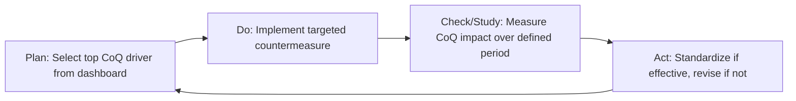

## Sustaining a Continuous Improvement Culture

### Overview and Purpose

Establishing categories, dashboards, and executive communication builds the *infrastructure* of a Cost of Quality program. Sustaining a continuous improvement culture is the final and most difficult chapter: ensuring the program continues generating value after the initial implementation excitement fades, the executive sponsor moves on, or the founding quality team members leave. Most CoQ programs that fail do so not because the data or methodology was wrong, but because the organizational habits needed to act on the data were never institutionalized.

This step shifts focus from *measurement systems* to *behavioral and organizational systems* — the incentive structures, cadences, and cultural norms that make continuous improvement self-sustaining rather than dependent on a single champion.

### Why CoQ Programs Regress

**Key Points**

- **Champion dependency**: The program was driven by an individual's personal initiative rather than embedded process; when that person changes roles, momentum collapses
- **Initiative fatigue**: CoQ launches alongside multiple other improvement initiatives (Lean, Six Sigma, digital transformation) and gets deprioritized once the "flavor of the month" perception sets in
- **Data without consequence**: Dashboards are reviewed but no decisions or resource reallocations follow from them, teaching the organization that the metrics are cosmetic
- **Success complacency**: Early wins reduce visible failure costs, and the perceived urgency drops even though sustained vigilance is required to prevent regression to baseline

### The PDCA/PDSA Cycle as the Sustaining Mechanism

Continuous improvement culture is operationalized through a recurring Plan-Do-Check-Act (or Plan-Do-Study-Act) cycle applied specifically to CoQ findings, rather than as a one-time deployment.

- **Plan**: Use the CoQ dashboard's ranked cost drivers to select the highest-value target for the next improvement cycle, rather than allowing teams to self-select comfortable or visible problems
- **Do**: Implement a specific, time-boxed countermeasure with a named owner and completion date
- **Check/Study**: Compare the relevant CoQ sub-account trend before and after the intervention, holding other variables as constant as reasonably possible
- **Act**: If effective, standardize the change into procedure/training (moving cost from Failure toward Prevention); if ineffective, document the learning and select the next driver

### Governance Structures That Sustain the Cycle

**1. Recurring Review Cadence**

A CoQ program without a mandatory, calendared review cadence tends to be reviewed only when someone remembers to raise it — an unreliable sustaining mechanism. Effective programs typically nest CoQ review into existing governance rhythms rather than creating a new standalone meeting:

| Cadence | Audience | Focus |
| --- | --- | --- |
| Weekly | Quality/Ops team | Operational tier detail, active countermeasure tracking |
| Monthly | Department heads | Management tier trends, PAF mix shifts |
| Quarterly | Executive team | Executive tier, business case updates, resource asks |
| Annual | Board/Leadership offsite | Multi-year trend, strategic target-setting |

**2. Ownership and Accountability Structure**

$$\text{Sustained Program} = \text{Data} + \text{Cadence} + \text{Named Accountability} + \text{Consequence}$$

Each PAF category or major cost driver should have a named accountable owner whose performance review incorporates progress on that metric — without this linkage, CoQ metrics compete unsuccessfully against owners' primary KPIs for attention.

**3. Cross-Functional Improvement Teams**

Sustained programs typically rotate a standing cross-functional team (Quality, Engineering, Operations, sometimes Finance) through the PDCA cycle on a defined cadence, rather than relying on the Quality department to drive improvements unilaterally — findings often require authority or expertise (e.g., process redesign, supplier renegotiation) outside Quality's direct control.

### Embedding Improvement Into Daily Work

**Key Points**

- **Visual management**: Displaying current CoQ/COPQ trends on shop floor or team dashboards (not just executive decks) keeps the metric visible to the people who directly influence it day-to-day
- **Front-line suggestion pathways**: A structured mechanism (e.g., a kaizen/idea submission process tied to estimated CoQ impact) channels front-line knowledge of failure causes into the improvement pipeline, since operators and technicians often identify root causes before formal investigation does
- **Standard work updates**: Successful countermeasures must be codified into updated work instructions, training materials, and control plans — an improvement that isn't standardized tends to erode as personnel turn over
- **Recognition tied to prevention, not firefighting**: Organizational culture often inadvertently rewards visible "heroic" failure recovery (the engineer who saves a shipment at 2 a.m.) more than the quieter, invisible success of failures that never occurred; recognition programs should be deliberately rebalanced toward prevention outcomes

### Measuring Cultural Sustainment (Leading Indicators)

Beyond the CoQ dashboard's financial metrics, several softer indicators signal whether continuous improvement is becoming self-sustaining versus dependent on top-down push:

- Number of improvement suggestions submitted per employee per period, and the trend over time
- Percentage of PDCA cycles that reach the "Act/Standardize" stage versus stalling at "Check"
- Time-to-implementation for approved countermeasures (lengthening cycle times suggest declining organizational priority)
- Survey-based quality culture assessments (e.g., employee perception of whether raising a quality concern is encouraged and acted upon)

[Inference] These leading indicators typically predict CoQ regression several quarters before it appears in the lagging financial metrics, since cultural disengagement precedes measurable cost increases.

### Common Pitfalls

- **Treating certification as the finish line**: Achieving an ISO 9001 or similar certification milestone is sometimes treated internally as program completion, when certification only confirms a system exists — not that it continues driving improvement.
- **Metric ossification**: Continuing to track the same cost drivers years after they were resolved, while new emerging drivers go unmeasured, gives a false sense of stability; category structures should be periodically revisited (as noted in the account-setup step) to stay relevant.
- **Punitive use of failure data**: Using CoQ failure attribution to assign blame or discipline individuals rapidly suppresses honest reporting of defects and near-misses, starving the system of the data it depends on.
- **No budget line for prevention follow-through**: Identifying a prevention investment opportunity without a standing budget mechanism to fund it forces every countermeasure through ad hoc approval, slowing the PDCA cycle and discouraging proposal submission.
- **Leadership turnover discontinuity**: Failing to formally transfer program sponsorship and institutional knowledge when an executive sponsor changes roles is one of the most common single points of failure for otherwise mature programs.

**Related Topics**

- Building a Structured Kaizen/Suggestion System Linked to CoQ
- Designing Incentive and Recognition Programs for Prevention Behavior
- Integrating CoQ into ISO 9001 Management Review Requirements
- Succession Planning for Quality Program Sponsorship
- Long-Term CoQ Trend Analysis and Statistical Process Control