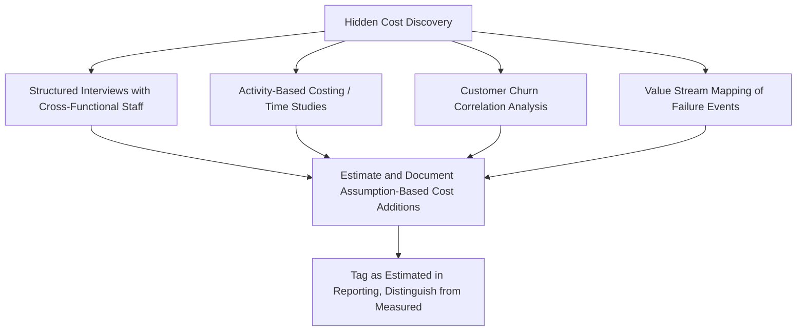

## Underreporting of Hidden and Indirect Costs

### Overview and Purpose

This item shifts the chapter from implementation guidance to critical analysis. Underreporting of hidden and indirect costs is arguably the most persistent and consequential criticism of Cost of Quality programs in practice: the visible, easily-ledgered costs (scrap, warranty payouts, inspection labor) are captured with reasonable accuracy, while a substantial share of true quality cost — often the majority, by some accounts — remains invisible to the accounting system entirely. This systematically understates CoQ totals, distorts the PAF mix, and can lead organizations to underinvest in prevention because the true magnitude of failure cost is never surfaced.

Understanding this limitation is essential not to abandon CoQ measurement, but to interpret reported figures with appropriate epistemic humility and to actively hunt for the categories most prone to invisibility.

### Why Hidden Costs Exist Structurally

The core structural reason is that standard cost accounting systems were designed to track direct, transactional costs (materials, direct labor, purchased services) — not the diffuse, cross-functional time and opportunity cost that quality failures generate. A defect rarely triggers a single, cleanly-coded transaction; it triggers a cascade of activity across departments, most of which is absorbed into existing salaried headcount with no dedicated cost code.

$$\text{CoQ}_{reported} = \text{CoQ}_{true} - \text{CoQ}_{hidden}$$

Feigenbaum himself, and later analysts including Wayne Fisher and others associated with the American Society for Quality, have argued the hidden/invisible portion often exceeds the measured portion — sometimes characterized as an iceberg model, where the visible failure costs (scrap, warranty, rework) represent only the portion above the waterline. [Unverified — the specific ratio between visible and hidden costs is frequently asserted in quality literature but is difficult to independently verify and varies enormously by organization and industry; treat any specific multiplier as illustrative rather than measured fact.]

### The Iceberg Model (Conceptual Illustration)

<svg xmlns="http://www.w3.org/2000/svg" viewBox="0 0 640 380" font-family="Arial, sans-serif">
<text x="320" y="26" font-size="16" font-weight="bold" text-anchor="middle" fill="#1a1a1a">Cost of Quality Iceberg Model (svg_diagram)</text>
<rect x="0" y="180" width="640" height="200" fill="#cfe8f5" opacity="0.6" />
<line x1="0" y1="180" x2="640" y2="180" stroke="#0277bd" stroke-width="2" stroke-dasharray="6,4" />
<text x="10" y="175" font-size="11" fill="#0277bd">Waterline — costs typically captured in the GL</text>
<polygon points="270,180 370,180 340,60 300,60" fill="#37474f" />
<text x="320" y="100" font-size="11" fill="#fff" text-anchor="middle">Scrap</text>
<text x="320" y="120" font-size="11" fill="#fff" text-anchor="middle">Rework</text>
<text x="320" y="140" font-size="11" fill="#fff" text-anchor="middle">Warranty</text>
<text x="320" y="160" font-size="11" fill="#fff" text-anchor="middle">Inspection</text>
<polygon points="270,180 370,180 480,370 160,370" fill="#455a64" />
<text x="320" y="215" font-size="11" fill="#fff" text-anchor="middle">Excess capacity/downtime</text>
<text x="320" y="235" font-size="11" fill="#fff" text-anchor="middle">Engineering firefighting time</text>
<text x="320" y="255" font-size="11" fill="#fff" text-anchor="middle">Customer goodwill/churn</text>
<text x="320" y="275" font-size="11" fill="#fff" text-anchor="middle">Management attention diverted</text>
<text x="320" y="295" font-size="11" fill="#fff" text-anchor="middle">Lost sales / reputation</text>
<text x="320" y="315" font-size="11" fill="#fff" text-anchor="middle">Excess inventory buffers</text>
<text x="320" y="335" font-size="11" fill="#fff" text-anchor="middle">Employee morale/turnover</text>
<text x="320" y="355" font-size="11" fill="#fff" text-anchor="middle">Expediting/premium freight</text>
</svg>

### Categories Most Prone to Underreporting

**Key Points**

- **Salaried professional time**: Engineering, management, and sales time spent on failure analysis, customer escalation calls, or root-cause investigation is rarely coded against a quality cost account, since these employees are not typically timesheet-tracked at that granularity
- **Opportunity cost of capacity**: Production capacity consumed by rework or re-inspection displaces capacity that could have produced sellable output; this displaced contribution margin is almost never captured in standard CoQ ledgers
- **Customer goodwill and lifetime value erosion**: A customer who reduces future orders or fails to renew after a quality incident represents a real economic cost with no corresponding invoice or GL entry
- **Excess inventory and buffer stock**: Safety stock carried specifically to buffer against known process variability or supplier unreliability is a quality-driven cost, but is almost universally coded simply as "inventory carrying cost" with no quality attribution
- **Expediting and premium freight**: Rush shipping or expedited production runs triggered by late-detected defects are typically coded to logistics/freight accounts, disconnected from the triggering quality event
- **Employee morale and turnover**: Chronic firefighting culture driven by unresolved quality issues can contribute to burnout and attrition in operations and engineering roles; the resulting recruiting/training/ramp-up cost is essentially never linked back to CoQ
- **Design and development rework**: Late-stage design changes triggered by quality issues discovered post-launch consume engineering capacity that is budgeted and tracked as ordinary development cost, not failure cost
- **Supplier-side hidden costs**: When a customer absorbs supplier defects through incoming inspection or line-side sorting rather than rejecting shipments, the true cost of poor supplier quality is underreported industry-wide, appearing only as "inspection labor" on the customer's books

### Quantitative Illustration of Underreporting Impact

$$\text{CoQ}\%_{reported} = 4.2\%, \quad \text{CoQ}\%_{true, estimated} = 4.2\% + \Delta_{hidden}$$

Where $\Delta_{hidden}$ represents the unmeasured increment. Some organizations that have undertaken deliberate hidden-cost discovery exercises (e.g., structured interviews, activity-based costing studies, time-and-motion analysis of engineering functions) have found the *reported* CoQ figure understated the *true* figure by a substantial margin — though the specific percentage varies too widely across published case studies to state as a generalizable constant [Speculation — without a specific, current, well-sourced study in hand, any numeric multiplier presented as a rule of thumb should be treated skeptically rather than cited as established fact].

### Detection and Mitigation Approaches

- **Structured interviews and time-use surveys**: Periodically survey engineering, sales, and management staff on the percentage of time spent on quality-failure-related activity, converting to a labor cost estimate using the burdened rate methodology established in the account-setup step
- **Activity-Based Costing (ABC)**: A more rigorous approach that traces indirect and overhead costs to specific activities (including failure-response activities) rather than allocating them via blanket overhead rates, surfacing quality-driven cost that traditional costing conceals
- **Customer churn/retention correlation analysis**: Statistically correlating customer attrition or order volume reduction with prior quality incidents (complaints, returns, field failures) to estimate a goodwill-cost proxy, even though this remains inherently an estimate rather than a directly measured figure
- **Value stream mapping of failure events**: Walking a specific failure incident end-to-end across all departments it touched (not just the department that logged the initial cost) frequently reveals 3–5x more touchpoints than the originally ledgered cost accounts capture
- **Explicit estimation tagging**: Rather than omitting hidden costs entirely or presenting unreliable estimates as hard fact, mature programs report a "Measured CoQ" figure alongside a separately labeled "Estimated Hidden CoQ" range, preserving credibility while acknowledging the gap

### Common Pitfalls in Addressing This Criticism

- **Overcorrecting with speculative multipliers**: Applying a generic "hidden costs are typically 3-4x visible costs" multiplier without organization-specific validation replaces one inaccuracy (undercounting) with another (fabricated precision); any hidden-cost estimate should be clearly labeled as such.
- **Abandoning CoQ measurement due to imperfection**: Some critics use the underreporting problem to argue CoQ measurement is not worthwhile; the more defensible position is that directionally accurate, consistently-measured CoQ (even if incomplete) still drives better decisions than no measurement at all, provided its limitations are understood.
- **Failing to trend hidden-cost estimates consistently**: If hidden-cost estimation methodology changes between periods (e.g., a new interview panel, a different ABC model), period-over-period comparisons become invalid even though the numbers appear continuous.
- **Ignoring the incentive to undercount**: In organizations where CoQ figures affect performance reviews or bonus calculations, there can be an unconscious or conscious incentive for department owners to under-attribute ambiguous costs to their own quality accounts; governance should account for this bias.

**Next Steps**

- Overreliance on Quantifiable Metrics at the Expense of Qualitative Factors
- Gaming and Manipulation of Quality Cost Reporting
- Activity-Based Costing as a CoQ Measurement Enhancement
- The Debate Over Including Customer Goodwill in Formal CoQ Models
- Cross-Industry Case Studies on Hidden Cost Discovery