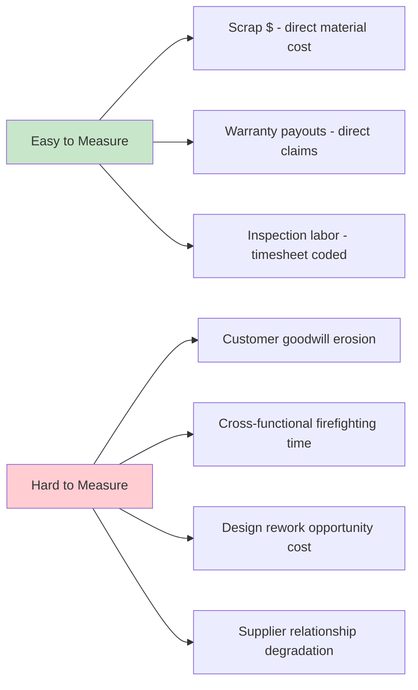

## Overemphasis on Easily Measured Cost Categories

### Overview and Purpose

This item examines a closely related but distinct failure mode from hidden-cost underreporting: even among costs that *are* captured in the accounting system, CoQ programs systematically gravitate toward categories that are easiest to measure precisely, while categories requiring judgment, estimation, or cross-functional data assembly receive disproportionately less attention and investment — regardless of their actual economic significance. This is a manifestation of the broader measurement principle sometimes summarized as "what gets measured gets managed," with the inverse corollary that what is *hard* to measure tends to get under-managed even when it matters more.

The practical consequence is a CoQ program that appears rigorous and data-driven while systematically misallocating improvement resources toward the categories that are simplest to report on rather than those offering the greatest return.

### The Measurement Ease Gradient

Cost categories exist on a spectrum from "directly transactional" (a single GL entry, unambiguous) to "diffuse and judgment-dependent" (requiring allocation, estimation, or synthesis across data sources). CoQ programs tend to over-invest measurement and management attention at the transactional end.

**Key Points**

- Scrap, rework material cost, and warranty payouts are typically measured to the dollar because they map to single, unambiguous transactions
- Categories requiring allocation logic (labor time across multiple activities) or estimation (goodwill, morale, opportunity cost) receive systematically less rigor, not because they matter less, but because they are harder to defend numerically in a review meeting
- Over time, management attention follows the metrics that are reported crisply, reinforcing a feedback loop where easily-measured categories receive disproportionate improvement investment relative to their true economic weight

### Manifestations of This Bias

**1. Prevention Underinvestment Relative to Failure Measurement**

Ironically, Prevention costs — the category the entire CoQ philosophy argues should receive the most investment — are often themselves difficult to measure precisely (e.g., how much of an engineer's design review time counts as "prevention" versus ordinary design work?), while Failure costs are comparatively easy to isolate (a rejected unit, a warranty claim). This creates a paradoxical dynamic where the measurement system's own ease-of-capture bias works against the 1-10-100 Rule's core recommendation to shift spending toward Prevention.

$$\text{Measurement Rigor} \neq \text{Economic Significance}$$

**2. Overweighting Manufacturing/Production Costs Relative to Service and Transactional Quality**

In many organizations, CoQ programs originated in manufacturing contexts where physical scrap and rework are naturally unit-countable. When such frameworks are extended to service, software, or transactional business lines, the absence of a physical, countable defect unit often results in those cost categories being tracked far more loosely — or omitted from CoQ scope entirely — even when service-quality failures (SLA breaches, support escalations, billing errors) carry substantial and sometimes larger economic cost. [Inference — the degree of this imbalance is organization-specific and depends heavily on where the CoQ program originated organizationally.]

**3. External Failure Cost Categories Receiving Uneven Treatment**

Within External Failure itself, warranty claims (a clean, invoiced transaction) tend to be tracked meticulously, while customer churn attributable to quality issues, brand/reputation damage, and lost future sales — arguably the largest components of true external failure cost for many businesses — are frequently excluded from formal CoQ reporting altogether because they cannot be cleanly attributed to a single transaction.

### Illustrative Comparison

**Example**

| Cost Category | Measurement Method | Typical Reporting Rigor | Actual Economic Weight (illustrative) |
| --- | --- | --- | --- |
| Scrap material | Standard cost × quantity from MES | High — exact | Moderate |
| Warranty claims | Direct claim payout | High — exact | Moderate |
| Rework labor | Timesheet job coding | Medium — depends on coding discipline | Moderate |
| Engineering firefighting time | Rarely tracked at all | Low — often untracked | Potentially high |
| Customer churn from quality issues | Requires correlation analysis | Very low — usually absent | Potentially very high |
| Prevention design review time | Requires activity allocation | Low — often bundled into general engineering cost | High (by CoQ philosophy's own logic) |

This table is illustrative of the *pattern*, not a universal ranking — actual economic weight varies by industry, business model, and specific organization, and should be independently assessed rather than assumed from this example.

### Root Causes of the Bias

**Key Points**

- **Accounting system design**: General ledger and ERP systems are architected around transactional precision, naturally privileging categories that map cleanly to invoices, purchase orders, or standard costs
- **Audit and governance pressure**: Finance and audit functions favor defensible, traceable figures; estimation-heavy categories attract scrutiny and are sometimes excluded to avoid audit complications, even when material
- **Cognitive ease and reporting incentives**: It is simpler for a quality team to report "scrap decreased 8% this quarter" with precision than to defend an estimated figure for cross-functional firefighting time, creating a natural preference for reporting what is easy to defend
- **Historical inertia**: CoQ frameworks descended from manufacturing quality control traditions where physical, countable defects were the natural unit of measurement; this legacy persists in category definitions even as businesses diversify into services and software

### Mitigation Approaches

- **Deliberate inclusion of estimated categories with clear labeling**: Rather than excluding hard-to-measure costs, include them as explicitly labeled estimates (as discussed in the hidden-costs item) so they remain visible in decision-making even without transactional precision
- **Activity-Based Costing (ABC) for indirect categories**: Applying ABC methodology specifically to Prevention and cross-functional Failure activities helps counteract the natural bias toward transactional categories by giving diffuse activities a defensible cost basis
- **Periodic "blind spot" audits**: Scheduling a recurring review (e.g., annually) specifically asking "which quality costs are we not measuring, and why?" institutionalizes a countermeasure against the natural drift toward easy metrics
- **Weighting improvement priorities by estimated total cost, not measurement confidence**: When ranking PDCA improvement targets, resist the tendency to default to the most precisely-quantified driver; an estimated high-cost category may warrant equal or greater priority than a precisely-measured moderate-cost one
- **Cross-functional ownership of category definitions**: Involving Sales, Customer Success, and Engineering (not just Quality and Finance) in defining what counts as a quality cost helps surface categories that a Quality-and-Finance-only process would naturally overlook

### Common Pitfalls

- **Mistaking measurement precision for economic importance**: The most quantifiable number in a report is not necessarily the most important one; presenting only precisely-measured categories in executive dashboards can systematically misdirect strategic attention.
- **Using measurement difficulty as a reason for exclusion**: Omitting a cost category entirely because it resists precise measurement effectively assigns it a value of zero in decision-making, which is generally a worse error than including a reasoned estimate.
- **Static category weighting**: As a business shifts from manufacturing-heavy to service-heavy revenue mix (or vice versa), CoQ category emphasis should be periodically re-evaluated rather than assumed to remain appropriate indefinitely.
- **Conflating "hard to measure" with "not measurable"**: Many categories perceived as immeasurable (e.g., customer churn correlation) can be approximated with reasonable rigor using statistical methods; the barrier is often organizational will rather than genuine methodological impossibility.

**Related Topics**

- Underreporting of Hidden and Indirect Costs
- Activity-Based Costing for Prevention and Indirect Quality Activities
- Extending CoQ Frameworks to Service and Software Business Models
- Gaming and Manipulation of Quality Cost Reporting
- Balancing Quantitative Rigor with Qualitative Judgment in Quality Metrics