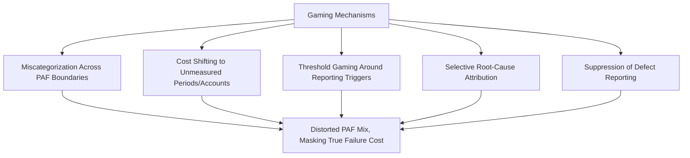

## Gaming and Manipulation of Quality Metrics

### Overview and Purpose

This item addresses a criticism distinct from measurement limitations discussed previously: even when a CoQ system is technically capable of capturing accurate data, the metrics themselves create incentives that can be deliberately or semi-consciously exploited by the people and departments being measured. Wherever a metric becomes tied to performance evaluation, budget allocation, or reputational standing, some degree of gaming pressure emerges — a manifestation of the general principle sometimes called Goodhart's Law: "when a measure becomes a target, it ceases to be a good measure." CoQ systems are particularly susceptible because cost categorization frequently involves judgment calls that can be quietly steered in a self-interested direction.

Recognizing these failure modes is essential for designing CoQ governance structures resilient to manipulation, rather than assuming good-faith reporting will persist indefinitely once incentives are attached to the numbers.

### Mechanisms of Gaming

**1. Miscategorization Across PAF Boundaries**

Because category boundaries often require judgment (is this rework "Internal Failure" or ordinary "process adjustment"? is this inspection "Appraisal" or standard production step?), a department under pressure to show improving CoQ metrics may consistently classify ambiguous costs into the less scrutinized category. This is frequently not conscious fraud but a gradual drift in judgment calls that accumulates into meaningful reporting distortion over time.

**Key Points**

- Rework can be recoded as "engineering change" or "process improvement" rather than Internal Failure, removing it from the failure cost total entirely
- Scrap can be attributed to "yield loss" or "process learning curve" in accounts separate from the formal CoQ structure, especially for new product introductions
- Appraisal activities can be relabeled as "process control" or "continuous monitoring" to avoid appearing as a cost that a lean/efficiency initiative might target for reduction

**2. Cost Shifting to Unmeasured Periods or Accounts**

$$\text{Reported CoQ}_t = \text{True CoQ}_t - \text{Shifted}_{t \to t+1}$$

Costs can be deferred into a future reporting period (e.g., delaying a rework batch's completion date to push it past a quarter-end review) or shifted into an account outside the CoQ measurement boundary entirely (e.g., coding failure-related engineering time to a general R&D project code rather than a quality account).

**3. Threshold Gaming Around Reporting Triggers**

Where CoQ governance includes escalation thresholds (as discussed in the dashboard-building step — e.g., "escalate if External Failure exceeds 1.5% of revenue"), individual transactions or claims can be structured to stay just below the threshold, or aggregated reporting periods can be adjusted to avoid a single period crossing the trigger line.

**4. Selective Root-Cause Attribution**

When failure costs are attributed to a root cause for accountability purposes, there is incentive to attribute blame to an external or less-controllable factor (supplier quality, customer misuse, "one-off" anomaly) rather than an internal process deficiency, even when the evidence is ambiguous. This does not necessarily change the reported CoQ total but distorts the *diagnosis*, misdirecting improvement resources.

**5. Suppression of Defect and Near-Miss Reporting**

Perhaps the most damaging gaming mechanism: if raising a quality concern or logging a non-conformance report is perceived to reflect poorly on the reporting individual or their department, front-line staff may simply under-report defects and near-misses. This doesn't manipulate existing data — it prevents data from entering the system at all, an effect that is by definition invisible in the resulting CoQ figures.

### Why CoQ Systems Are Particularly Vulnerable

**Key Points**

- **Judgment-dependent category boundaries**: Unlike hard financial metrics (revenue, cash), PAF categorization frequently requires subjective classification, creating latitude for self-interested interpretation
- **Distributed data entry**: CoQ data is captured by many different individuals across departments (technicians, engineers, customer service reps) rather than centralized in a single controlled process, multiplying the number of points where gaming can occur
- **Performance linkage**: Once CoQ metrics feed into performance reviews, bonus calculations, or departmental budget competition (as recommended in the sustainment step to drive accountability), the same linkage that creates positive accountability pressure also creates gaming incentive — this is an inherent tension in CoQ governance design, not a flaw unique to poorly-designed programs
- **Asymmetric visibility**: Finance and executive reviewers typically see aggregated CoQ totals, not the underlying transaction-level judgment calls, making subtle miscategorization difficult to detect without deliberate audit

### Detection Approaches

- **Statistical trend anomaly detection**: A category showing an unusually smooth or suspiciously convenient improvement trend (e.g., External Failure dropping just before a review while Internal Failure or an adjacent unmeasured account rises correspondingly) warrants investigation; genuine improvement is rarely perfectly monotonic
- **Cross-validation against independent data sources**: Comparing CoQ-reported warranty costs against actual cash disbursements from Finance, or comparing reported scrap against physical inventory shrinkage, can reveal discrepancies indicating miscategorization
- **Periodic account definition audits**: Sampling a subset of transactions coded to each PAF category and having an independent reviewer (not the original coder) assess whether categorization was appropriate
- **Near-miss and defect reporting rate monitoring**: A declining defect/near-miss reporting rate that is not accompanied by independently verified process capability improvement (e.g., stable Cpk/Ppk) is a warning sign of suppression rather than genuine improvement
- **Whistleblower/anonymous reporting channels**: Providing a safe, non-attributable channel for employees to flag suspected miscategorization or reporting pressure surfaces issues that formal audit processes often miss

### Governance Design to Reduce Gaming Incentive

$$\text{Gaming Pressure} \propto \frac{\text{Punitive Consequence of Metric}}{\text{Psychological Safety of Reporting Process}}$$

This is a directional relationship rather than a precise formula: gaming incentive tends to rise with the punitive weight attached to a metric and fall as psychological safety around honest reporting increases [Inference — the relationship is qualitative; no validated quantitative model of this trade-off is established in the quality literature].

**Key Points**

- **Separate "improvement accountability" from "blame attribution"**: Hold departments accountable for demonstrating a PDCA response to failure trends, rather than purely for the absolute failure number, reducing incentive to hide the number itself
- **Independent categorization review**: Route ambiguous categorization decisions through a Quality/Finance function independent of the department whose performance the categorization affects, rather than allowing self-reporting to stand unreviewed
- **Reward defect discovery, not just defect absence**: Explicitly recognize and reward employees who surface previously-hidden quality issues, directly counteracting the incentive to suppress reporting
- **Transparent, published category definitions**: Publishing clear, example-based definitions for what belongs in each PAF sub-account (as established in the account-setup step) reduces the ambiguity that enables good-faith miscategorization drift
- **Rotate account ownership periodically**: Where feasible, periodically rotating who reviews/approves categorization for a given account reduces the risk of entrenched, systematic miscategorization by a single long-tenured owner

### Common Pitfalls

- **Assuming malicious intent**: Most gaming behavior originates from ambiguous category boundaries and misaligned incentives rather than deliberate fraud; governance responses should generally address structural incentive first, reserving punitive response for clear, repeated bad-faith cases.
- **Over-auditing and eroding trust**: Excessive scrutiny or a punitive audit culture directed at the people entering CoQ data can itself suppress honest reporting, becoming self-defeating; audit processes should be framed as system validation, not individual policing.
- **Ignoring the near-miss reporting rate as a signal**: Organizations often celebrate declining defect counts without checking whether the decline reflects genuine improvement or suppressed reporting — the near-miss rate and independent process capability data should always be reviewed alongside declining failure costs.
- **Failing to update thresholds/definitions after detecting gaming**: When a specific gaming pattern is identified, failing to close the specific loophole (redefine the ambiguous category boundary, adjust the threshold structure) allows the same pattern to recur with the next reporting cycle.

**Next Steps**

- Designing Psychologically Safe Quality Reporting Cultures
- Independent Audit Structures for Quality Cost Data
- Goodhart's Law and Metric Design in Operational Management
- Balancing Accountability and Blame in Quality Governance
- Statistical Anomaly Detection Techniques for Financial and Operational Metrics