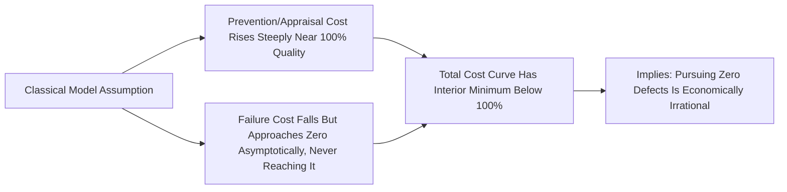

## Criticisms of the Optimal Quality Cost Curve

### Overview and Purpose

This item examines the theoretical foundation of traditional Cost of Quality economics: the classical "optimal quality cost curve," which posits that Prevention/Appraisal costs and Failure costs move in opposite directions as conformance quality increases, producing a U-shaped total cost curve with an identifiable minimum representing the economically optimal quality level — commonly termed the Acceptable Quality Level (AQL). This model, while foundational to CoQ pedagogy since Juran's original formulation, has been substantially challenged by quality theorists (most notably Philip Crosby) and by empirical observation in modern manufacturing and software contexts. Understanding these criticisms is essential to applying CoQ economics without inheriting a flawed assumption about where the optimum actually lies.

### The Classical Model

The traditional model plots two curves against increasing conformance quality (x-axis): Prevention + Appraisal cost, which rises monotonically as quality improves, and Failure cost, which falls monotonically. Their sum produces a U-shaped Total Cost curve with a minimum at some quality level below 100% conformance.

$$TC(q) = PA(q) + F(q)$$

where $PA(q)$ is increasing in $q$ (quality level) and $F(q)$ is decreasing in $q$, producing a minimum at $q^* < 100\%$ where $\frac{d(PA)}{dq} = -\frac{dF}{dq}$.

### The Core Criticism: Crosby's "Zero Defects" Challenge

Philip Crosby, in *Quality Is Free* (1979), directly challenged the classical U-curve, arguing that the model's assumption — that Prevention/Appraisal costs rise sharply and unboundedly as quality approaches 100% — does not hold empirically once modern quality management techniques (statistical process control, error-proofing/poka-yoke, design for manufacturability) are properly applied. Crosby's position, captured in the phrase "quality is free," is that the marginal cost of Prevention does *not* rise steeply near perfection; rather, well-designed prevention systems can drive Failure cost toward zero without a corresponding runaway increase in Prevention cost, shifting the effective optimum toward significantly higher conformance levels than the classical curve suggests — potentially approaching, though not literally reaching, zero defects.

**Key Points**

- Crosby's critique is not that the U-shape is mathematically wrong, but that the *empirical shape* of the Prevention/Appraisal curve was mismeasured in the original formulation — it is far flatter over a much wider range than classical models assumed
- Modern process capability improvements (Six Sigma methodologies, automated in-line inspection, design for reliability) have generally shifted the empirical curve rightward and flattened its slope, consistent with Crosby's argument, since these techniques allow near-elimination of certain defect classes without proportionally escalating cost [Inference — the degree of curve-flattening varies by industry and defect type, and should not be assumed uniform across all quality dimensions]
- This directly informs modern practice: most contemporary quality programs treat "zero defects" as a legitimate aspirational target rather than an economically irrational one, in contrast to the classical model's implication

### Additional Criticisms of the Optimal Curve Model

**1. Static, Single-Period Framing**

The classical curve is typically presented as a static snapshot, implicitly holding technology, process capability, and cost structures constant. In reality, Prevention investment (e.g., in automation, training, or process redesign) shifts the entire curve over time rather than representing a fixed trade-off to be optimized once. A one-time "find the optimal point" exercise misses that the curve itself is a moving target subject to continuous improvement.

$$TC_t(q) \neq TC_{t+1}(q) \text{ — the curve itself shifts with cumulative Prevention investment}$$

**2. Underweighting External Failure and Reputation Effects**

The classical model, developed primarily in a manufacturing context with relatively contained failure consequences, tends to underweight the compounding, sometimes nonlinear cost of External Failure in modern contexts — particularly for safety-critical, reputation-sensitive, or platform/network-effect businesses where a single significant defect can trigger cost far exceeding any smooth curve's prediction (e.g., product recalls, regulatory action, viral reputational damage via social media). This suggests the Failure cost curve is not smoothly decreasing but may include discontinuous jump risk that the classical continuous curve formulation does not capture.

**3. Inapplicability to Zero-Marginal-Cost and Software Contexts**

In software and digital product contexts, the classical curve's cost structure assumptions frequently break down: the marginal cost of "appraisal" (automated testing, static analysis) can be near-zero once built, while a single Failure (a security vulnerability, a data breach, a critical outage) can carry catastrophic and highly asymmetric cost. This context is poorly represented by a model developed for physical manufacturing defect economics, and applying the classical U-curve logic uncritically to software quality investment can produce systematically wrong conclusions about optimal testing/QA investment levels.

**4. Measurement Difficulty Undermines the Model's Practical Use**

As explored in prior items on hidden costs and easily-measured-cost bias, since Failure cost (particularly external and hidden components) is frequently underreported, any empirically-plotted version of the classical curve is likely to understate the true Failure cost curve, artificially shifting the *apparent* optimum toward lower quality levels than the *true* economic optimum. This means organizations relying on their own imperfect CoQ data to identify "the optimal point" risk anchoring on a systematically biased curve.

### Illustrative Comparison: Classical vs. Crosby-Influenced Curve

<svg xmlns="http://www.w3.org/2000/svg" viewBox="0 0 640 360" font-family="Arial, sans-serif">
<text x="320" y="24" font-size="15" font-weight="bold" text-anchor="middle" fill="#1a1a1a">Classical vs. Crosby-Influenced Cost Curves (svg_diagram)</text>
<line x1="60" y1="300" x2="600" y2="300" stroke="#333" stroke-width="2" />
<line x1="60" y1="60" x2="60" y2="300" stroke="#333" stroke-width="2" />
<text x="320" y="325" font-size="12" text-anchor="middle">Conformance Quality →</text>
<text x="30" y="180" font-size="12" text-anchor="middle" transform="rotate(-90 30 180)">Total Cost</text>
<text x="590" y="315" font-size="10" text-anchor="middle">100%</text>
<path d="M 80 100 Q 250 280 300 200 Q 400 100 580 260" fill="none" stroke="#c62828" stroke-width="3" />
<text x="480" y="150" font-size="11" fill="#c62828" font-weight="bold">Classical U-Curve</text>
<circle cx="330" cy="197" r="4" fill="#c62828" />
<text x="335" y="190" font-size="10" fill="#c62828">Classical optimum (below 100%)</text>
<path d="M 80 100 Q 300 260 450 250 Q 520 245 580 230" fill="none" stroke="#1565c0" stroke-width="3" stroke-dasharray="7,4" />
<text x="460" y="290" font-size="11" fill="#1565c0" font-weight="bold">Crosby-Influenced Flatter Curve</text>
<circle cx="560" cy="234" r="4" fill="#1565c0" />
<text x="450" y="220" font-size="10" fill="#1565c0">Optimum shifts near 100%</text>
</svg>

### Reconciling the Two Views in Practice

Most contemporary quality management practice treats the classical curve and Crosby's critique as describing different regions or contexts rather than one being simply "correct" and the other "wrong":

- For defect classes where prevention technology is mature (e.g., dimensional tolerance in automated machining), the Crosby view — that near-zero failure is achievable without runaway prevention cost — is generally well-supported by modern practice
- For defect classes involving genuine physical/economic limits (e.g., certain material property variations, rare-event environmental conditions), some residual Failure cost floor may remain economically rational to accept, more consistent with a modified classical view
- The practical implication for CoQ programs is to avoid treating "the optimal point" as a fixed, calculable target and instead treat Prevention investment as an ongoing effort to continuously flatten and shift the curve, revisiting the apparent trade-off as capability matures rather than solving for a single static optimum

### Common Pitfalls

- **Treating the classical curve as prescriptive rather than illustrative**: Using the U-curve to argue against further quality investment ("we've reached the optimal point") without testing whether modern prevention techniques could flatten the curve further risks under-investing based on outdated economic assumptions.
- **Ignoring context-dependence**: Applying the same curve logic uniformly across safety-critical, consumer, and low-stakes internal-tooling contexts ignores that the shape and asymmetry of the Failure cost curve differs dramatically by domain.
- **Anchoring on biased empirical data**: As noted, an organization's own measured curve is likely skewed by hidden-cost underreporting; presenting a "data-driven optimal point" without acknowledging this measurement limitation overstates the model's precision.
- **Conflating Crosby's philosophy with a literal cost claim**: "Quality is free" is a directional argument about curve-flattening, not a literal claim that quality initiatives carry zero cost; treating it as a literal accounting statement misrepresents the underlying economic argument.

**Related Topics**

- Philip Crosby's Quality Management Philosophy and "Zero Defects"
- Dynamic vs. Static Models in Quality Economics
- Applying CoQ Frameworks to Software and Digital Products
- Six Sigma's Influence on Modern Prevention Cost Curves
- Risk-Adjusted Failure Cost Modeling for Safety-Critical Systems