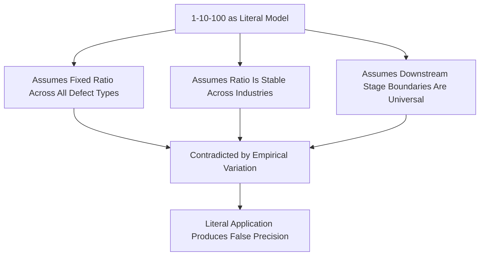

## Limitations of the 1-10-100 Rule as a Literal Model

### Overview and Purpose

This item closes the "Common Pitfalls and Criticisms" chapter by turning critical attention onto the very framework that has anchored this entire syllabus: the 1-10-100 Rule itself. While the rule has proven durable and pedagogically powerful as a directional heuristic, treating it as a literal, precise, universally-applicable multiplier — as though every defect obeys a fixed 1:10:100 cost ratio regardless of context — is a misapplication that can lead to flawed investment justification, false precision in business cases, and vulnerability to credibility challenges when the literal ratio fails to hold in a specific organization's data.

### Origins and Intended Purpose of the Rule

The 1-10-100 Rule is commonly attributed to quality management literature from the mid-to-late 20th century (frequently associated with George Labovitz and others writing on cost of quality, though exact origin attribution varies across sources) [Unverified — precise original attribution is inconsistently reported across secondary sources and should be verified against primary literature if precise citation is required]. Its intended purpose was pedagogical: to illustrate, in a single memorable ratio, the *directional* principle that cost escalates as a defect moves further downstream — not to assert a precisely measured, universal multiplier applicable to every defect type, industry, and context.

$$\text{Illustrative Ratio: } 1 : 10 : 100 \text{ (Prevention : Correction : Failure)}$$

The rule's power lies in its simplicity as a communication device — as established in the executive-communication item — not in its use as a calculation input for financial modeling.

### Why the Literal Ratio Does Not Hold Universally

**1. Defect Severity and Type Variation**

Not all defects escalate at the same rate. A cosmetic finish defect caught late may cost only marginally more than catching it early, while a safety-critical or systemic design defect caught late (e.g., after mass production tooling is committed, or after regulatory certification) can escalate at a ratio far exceeding 100x — sometimes by orders of magnitude when recalls, litigation, or regulatory action are involved. A single fixed ratio cannot represent this heterogeneity.

**2. Industry and Product Context Variation**

$$\text{Ratio}_{industry} \neq \text{constant across contexts}$$

- In software, a bug caught in code review versus one caught in production can vary enormously in cost depending on whether it is a minor UI issue or a data-corrupting/security vulnerability — the "downstream" multiplier for security defects in some documented incidents has been argued to far exceed 100x, while for minor cosmetic bugs it may be considerably less [Speculation — specific multiplier figures circulated in software engineering commentary are frequently anecdotal rather than rigorously benchmarked, and should not be treated as validated constants]
- In pharmaceuticals or aerospace, a defect reaching the field can trigger cost categories (regulatory recall, liability, loss of certification) that have no equivalent bounded cost even conceptually, making a finite ratio potentially understate the tail risk entirely
- In low-consequence consumer goods, the downstream multiplier may be considerably more modest than 100x, since return/replacement processes can be relatively low-cost and reputational impact limited

**3. The "Stage" Boundaries Are Not Universally Defined**

The rule implicitly assumes three cleanly separable stages (roughly: prevention/design-time, internal correction, external failure), but real defect lifecycles often involve more granular stages (design review, prototype testing, pilot production, full production, distribution, point-of-sale, in-use), each with different cost implications. Compressing this into three multiplier points is a simplification that can obscure meaningful intermediate escalation points relevant to specific process improvement decisions.

**4. Nonlinear and Discontinuous Cost Behavior**

The rule implies smooth, multiplicative escalation, but real failure costs often behave discontinuously — a defect that stays below a regulatory reporting threshold or a customer-noticeable severity level may cost relatively little even late in the lifecycle, while a defect that crosses such a threshold can trigger a step-change cost increase unrelated to how "late" it was caught. This threshold-driven behavior is not well-represented by a smooth multiplicative ratio.

### Illustrative Comparison of Multiplier Variation by Context

**Example**

| Context | Prevention Stage Cost (illustrative) | Correction Stage Cost (illustrative) | Failure Stage Cost (illustrative) | Approx. Ratio Pattern |
| --- | --- | --- | --- | --- |
| Minor UI/cosmetic software bug | Low | Low-Moderate | Moderate | Roughly 1:3:8 (compressed) |
| Manufacturing dimensional defect | Low | Moderate | High | Roughly 1:10:100 (classical) |
| Safety-critical automotive defect reaching field | Low | Moderate-High | Extreme (recall/litigation) | Potentially 1:15:1000+ (extended) |
| Data security vulnerability reaching production | Low | Moderate | Extreme (breach/legal/reputational) | Highly variable, potentially extreme and non-comparable |

This table illustrates the *pattern of variation*, not validated figures for any specific organization or industry — actual ratios should always be derived from an organization's own CoQ data rather than assumed from illustrative examples.

### Consequences of Literal Misapplication

**Key Points**

- **False precision in business cases**: Justifying a specific prevention investment by asserting "this will save exactly 100x its cost" based on the generic rule, rather than the organization's own measured escalation pattern for the relevant defect type, creates a business case vulnerable to challenge if actual results diverge from the assumed ratio
- **Credibility risk with sophisticated financial audiences**: A CFO or board member familiar with the rule's illustrative origin may discount an entire proposal if the literal ratio is presented as empirically derived fact rather than acknowledged as a heuristic supported by organization-specific data
- **Misallocation across defect types**: Applying a uniform ratio across all defect categories can lead to under-investing in prevention for high-tail-risk defect types (where true escalation may vastly exceed 100x) while over-justifying investment for low-consequence defect types (where the true ratio may be considerably more modest)
- **Underestimating catastrophic tail risk**: For safety-critical, regulatory, or reputation-sensitive contexts, treating 100x as an upper bound rather than an illustrative midpoint can lead to systematically underestimating the true cost of catastrophic External Failure scenarios (recalls, loss of certification, class-action liability)

### Recommended Practice: Using the Rule as Intended

- **Retain it as a communication and orientation device**: The rule remains valuable for building organizational intuition about directional cost escalation, particularly for audiences encountering CoQ concepts for the first time
- **Replace the generic ratio with organization-specific data wherever a real business case is being built**: As demonstrated in the executive-communication item's example (the $400 → $4,200 → $61,000 progression), using the organization's own actual, defect-specific cost data is both more credible and more accurate than citing the generic 1-10-100 figures
- **Segment by defect severity class rather than applying a single ratio**: Where sufficient data exists, developing separate escalation patterns for different defect severity/type categories (cosmetic, functional, safety-critical, security) produces a more defensible and more useful decision-making tool than a single blended ratio
- **Treat the upper end as open-ended for high-consequence categories**: For defect types with plausible catastrophic tail outcomes (safety, security, regulatory), explicitly model the tail risk as a distribution or scenario range rather than capping expectations at a fixed 100x multiplier

### Common Pitfalls

- **Presenting the rule as an empirically derived law rather than a heuristic**: Describing the 1-10-100 Rule in formal documentation or executive materials as though it were a rigorously validated economic law, rather than the illustrative device it was intended to be, sets up an unnecessary credibility vulnerability.
- **Using the generic ratio in place of available organization-specific data**: When actual internal cost escalation data exists (as it typically does once the CoQ program from earlier chapters is operational), defaulting to the generic textbook ratio instead is a missed opportunity for a more persuasive and more accurate argument.
- **Applying the rule uniformly across fundamentally different risk profiles**: Using the same ratio to justify prevention investment for a cosmetic defect and a safety-critical defect ignores that the underlying risk and cost distributions are not comparable.
- **Dismissing the rule's directional validity because the literal ratio doesn't hold**: The appropriate critical response is refining and contextualizing the rule, not discarding the underlying directional principle — that earlier intervention is generally, though not universally or precisely, cheaper — which remains well-supported across the quality literature even where the specific numbers do not.

**Next Steps**

- Developing Organization-Specific Cost Escalation Curves by Defect Severity Class
- Tail-Risk and Scenario Modeling for Safety-Critical and Security Defects
- Communicating Heuristic Models Honestly to Financial Stakeholders
- Chapter Review: Synthesizing Common Pitfalls and Criticisms of CoQ Programs
- Comparative Analysis: CoQ Frameworks Across Manufacturing, Software, and Service Industries