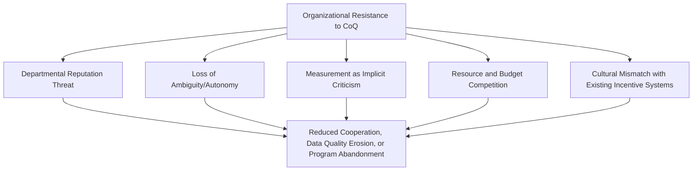
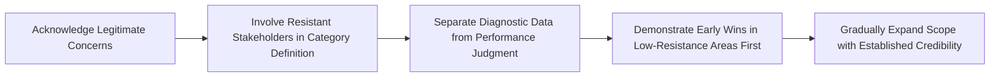

## Organizational Resistance to Quality Costing

### Overview and Purpose

This item examines a criticism distinct from the measurement and modeling limitations covered earlier in this chapter: even a technically well-designed CoQ program, with accurate categorization and sound governance, frequently encounters organizational and political resistance that has little to do with the methodology's validity and everything to do with how the program threatens existing power structures, departmental reputations, and established ways of working. Understanding this resistance as a predictable organizational dynamic — rather than a series of isolated objections to be argued down individually — is essential for successfully sustaining a CoQ program past its initial launch.

### Sources of Resistance

**1. Departmental Reputation Threat**

Once CoQ data reliably attributes cost to specific departments or processes, it inevitably creates winners and losers in the eyes of leadership — a department whose failure costs are prominently visible becomes a target for scrutiny in a way it may not have been under blended overhead accounting. This creates a rational, self-protective incentive to resist the visibility the program creates, independent of whether the department's actual performance is good or poor.

**Key Points**

- Departments with historically high failure costs often resist most strongly, since they have the most to lose from increased visibility
- Middle managers whose performance reviews might be affected by newly visible metrics have a direct personal incentive to question the program's validity or push back on its scope
- Resistance is frequently expressed as methodological criticism ("the categorization isn't accurate," "you're not accounting for X") rather than openly as self-interest, making it harder to address directly — the criticism may even be partially valid (as the earlier items in this chapter demonstrate), which complicates distinguishing legitimate methodological concern from defensive resistance

**2. Loss of Ambiguity and Operational Autonomy**

Before formal quality costing, cost and blame attribution for defects is often genuinely ambiguous, which paradoxically provides operational flexibility — teams can informally negotiate responsibility, absorb minor issues without escalation, and manage quality trade-offs with discretion. A rigorous CoQ system reduces this ambiguity, which some managers experience as a loss of legitimate operational autonomy rather than purely as improved accountability.

**3. Measurement as Implicit Criticism of Historical Leadership**

Introducing formal CoQ measurement can be perceived — sometimes accurately — as an implicit critique of prior leadership decisions that allowed quality costs to remain unmeasured and unmanaged. Executives or managers who were part of that prior leadership structure may resist the program not on its technical merits but because its success narrative implicitly frames the past as deficient.

**4. Resource and Budget Competition**

$$\text{Resistance Intensity} \propto \text{Perceived Threat to Existing Budget/Headcount Allocation}$$

A CoQ program that identifies Prevention investment opportunities is implicitly proposing to reallocate budget — often from departments whose current spending patterns the data suggests are suboptimal. Departments facing potential budget reallocation have direct incentive to resist the data supporting that reallocation, particularly during constrained budget cycles where CoQ-justified requests compete directly against other departments' priorities.

**5. Cultural Mismatch with Existing Incentive Systems**

In organizations where existing incentive structures reward speed, volume, or short-term output over long-term quality (a common pattern in sales-driven or growth-stage organizations), a CoQ program's emphasis on Prevention investment and longer-term payback periods can conflict structurally with what the organization actually rewards day-to-day, creating passive resistance even absent any specific individual's active opposition.

### Manifestations of Resistance

**Key Points**

- **Data quality degradation**: Departments facing scrutiny may become less diligent (consciously or not) in timesheet coding, transaction tagging, or defect reporting — a softer, harder-to-detect form of the gaming behavior discussed earlier in this chapter, but rooted in resistance rather than deliberate manipulation
- **Scope negotiation and boundary disputes**: Persistent argument over what should or shouldn't count within a given cost category, disproportionate to the actual ambiguity involved, often signals underlying resistance rather than genuine methodological disagreement
- **Meeting non-attendance and deprioritization**: CoQ review meetings being consistently rescheduled, delegated to junior staff, or treated as lower priority than other governance cadences
- **Selective citation of the chapter's own criticisms**: Ironically, the legitimate methodological criticisms covered elsewhere in this chapter (hidden costs, measurement bias, the 1-10-100 Rule's limitations) can be selectively weaponized by resistant stakeholders to discredit the program's validity wholesale, rather than engaged with constructively to improve it
- **Executive sponsor erosion**: Sustained organizational resistance, if not actively managed, gradually wears down the political capital of the program's executive sponsor, increasing the champion-dependency risk discussed in the culture-sustainment item

### Change Management Approaches to Address Resistance

- **Acknowledge legitimate methodological concerns directly**: Since some resistance is grounded in genuinely valid criticism (as this chapter demonstrates), dismissing all pushback as political self-interest is both inaccurate and counterproductive; distinguishing valid critique from defensive resistance, and responding to each appropriately, preserves credibility
- **Involve resistant stakeholders in the design process rather than presenting a finished system**: Departments that participate in defining category boundaries and allocation methodology for their own area tend to exhibit substantially less resistance than those presented with an externally-imposed measurement system
- **Explicitly separate diagnostic purpose from disciplinary purpose**: Reiterating (as discussed in the sustainment item) that CoQ data is intended to drive PDCA improvement cycles, not individual performance discipline, reduces the direct threat perception that drives much departmental resistance
- **Sequence rollout to build credibility incrementally**: Launching in an area with a supportive stakeholder and clear early win, then expanding scope using that demonstrated success as social proof, tends to reduce resistance in subsequent areas compared to an organization-wide simultaneous rollout
- **Maintain visible executive sponsorship through the resistance period**: Since resistance often intensifies precisely when the data starts surfacing uncomfortable findings, sustained and visible executive backing during this specific period is disproportionately important relative to the calmer initial rollout phase

### Common Pitfalls

- **Treating all resistance as illegitimate**: Framing every objection as political self-interest rather than engaging with the substance ignores that some resistance stems from genuinely valid measurement concerns covered elsewhere in this chapter, and dismissing it erodes trust in the program's fairness.
- **Underestimating the time required to shift incentive structures**: Attempting to layer a CoQ program on top of fundamentally misaligned existing incentive systems (e.g., a sales-driven culture with no quality-linked compensation) without addressing the underlying incentive conflict tends to produce persistent, low-grade resistance regardless of the program's technical quality.
- **Rolling out organization-wide before establishing credibility**: A simultaneous full-scope launch maximizes the number of stakeholders who can mount resistance before any demonstrated success exists to counter it.
- **Failing to protect data integrity during politically sensitive periods**: Not implementing the independent review and audit mechanisms discussed in the gaming-and-manipulation item leaves the program vulnerable precisely when resistance-driven data degradation is most likely to occur.
- **Allowing the program to become associated with a single executive faction**: If CoQ becomes perceived as "the CFO's initiative" or "the Quality VP's pet project" rather than a shared organizational capability, it becomes vulnerable to political dynamics unrelated to its actual merit.

**Related Topics**

- Change Management Frameworks for Measurement System Rollouts
- Aligning Incentive Structures with Quality Investment Priorities
- Chapter Review: Synthesizing Common Pitfalls and Criticisms of CoQ Programs
- Building Cross-Functional Buy-In During Program Design
- Political Dynamics in Cross-Departmental Performance Measurement Systems