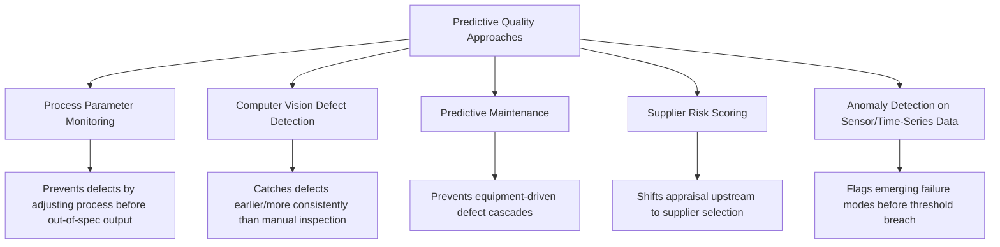

## Predictive Quality and Machine Learning for Defect Prevention

### Overview and Purpose

This item opens a new chapter examining how Cost of Quality principles are evolving alongside modern data and computing capability. Predictive quality applies machine learning (ML) techniques to anticipate defects before they occur, rather than detecting them after the fact through traditional inspection or appraisal activities. This represents a structural shift in the PAF model itself: ML-driven prediction occupies a hybrid space between classical Prevention (acting before a defect occurs) and Appraisal (using data/measurement to identify quality risk), and its economics directly reinforce — and in some cases dramatically amplify — the 1-10-100 Rule's underlying logic by pushing intervention further upstream than traditional prevention methods could reach.

### Why Predictive Quality Changes the CoQ Cost Structure

Traditional Appraisal costs (inspection, testing) scale roughly linearly with production volume — more units generally require more inspection labor or equipment time. ML-based predictive quality systems, once developed and trained, exhibit fundamentally different cost economics: high upfront development cost (data engineering, model training, validation) followed by low marginal cost per prediction at inference time.

$$C_{traditional\_appraisal}(n) \approx c_0 \cdot n$$

$$C_{predictive\_quality}(n) \approx C_{dev} + c_1 \cdot n, \quad \text{where } c_1 \ll c_0$$

where $n$ is production volume, $c_0$ is per-unit traditional inspection cost, $C_{dev}$ is the fixed model development cost, and $c_1$ is the marginal inference cost per unit — typically much smaller than $c_0$ at scale. This cost structure means predictive quality investment behaves more like a Prevention capital investment (high fixed cost, amortized over volume) than a traditional Appraisal operating cost, which has implications for how it should be categorized in the account structure established earlier in this syllabus. [Inference — the specific magnitude of $c_1$ relative to $c_0$ is highly implementation- and domain-dependent, and should be validated with actual pilot data rather than assumed.]

### Core Technical Approaches

**1. Process Parameter Monitoring and Control**

ML models trained on historical process data (temperature, pressure, speed, humidity, material batch characteristics) can predict, in real time, whether current process parameters are trending toward an out-of-spec outcome — enabling intervention *before* a defective unit is produced, rather than detecting it afterward. This is conceptually the most direct realization of shifting cost from Appraisal/Failure toward true Prevention.

**2. Computer Vision for Automated Defect Detection**

Convolutional neural networks and related architectures applied to in-line camera or sensor data can detect surface defects, assembly errors, or dimensional anomalies with consistency and speed exceeding manual visual inspection, reducing both the direct labor cost of Appraisal and the variability/miss-rate inherent in human inspection — though this application remains fundamentally an Appraisal-category activity (detecting existing defects) rather than true Prevention, since the defect has already occurred by the time it is detected.

**3. Predictive Maintenance**

Sensor-based ML models predicting equipment failure or drift before it causes a defect cascade (e.g., a worn tool producing increasingly out-of-tolerance parts) directly prevent a class of Internal Failure cost that traditional preventive maintenance schedules (time-based rather than condition-based) often miss or over-address.

**4. Supplier Risk Scoring**

ML models incorporating historical supplier performance, external data (financial health signals, geopolitical risk indicators, weather/logistics disruption data), and incoming inspection history can predict supplier-driven quality risk before a purchase order is placed, shifting Appraisal activity further upstream in the supply chain than traditional incoming inspection allows.

**5. Anomaly Detection on Time-Series and Sensor Data**

Unsupervised or semi-supervised anomaly detection techniques applied to continuous process or equipment sensor streams can flag emerging failure modes that do not match any previously labeled defect category — valuable for catching novel failure modes that supervised models (trained only on historical labeled defects) would miss entirely.

### Data and Infrastructure Requirements

**Key Points**

- **Historical labeled defect data**: Supervised approaches (computer vision defect classification, process parameter prediction) require a substantial history of labeled defect/non-defect examples; organizations with poor historical CoQ data capture (as discussed in the hidden-costs and easily-measured-cost items earlier) often find this data simply doesn't exist in usable form, creating a direct dependency between CoQ program maturity and predictive quality feasibility
- **Sensor/IoT infrastructure**: Real-time process monitoring approaches require instrumented equipment capable of streaming relevant parameters; retrofitting older equipment can represent a substantial capital cost that must be factored into the Prevention investment business case
- **Data pipeline and MLOps infrastructure**: Beyond model development, sustained predictive quality requires infrastructure for model monitoring, retraining as processes drift, and integration with existing MES/QMS systems — an ongoing operational cost distinct from the one-time model development cost
- **Cross-functional data science capability**: Organizations without existing data science/ML engineering capability face a build-vs-buy-vs-partner decision, since this skill set is typically not native to traditional Quality or Manufacturing Engineering functions

### Integrating Predictive Quality into the CoQ Account Structure

Following the account architecture established earlier in this syllabus, predictive quality investment requires explicit categorization decisions:

| Activity | Recommended CoQ Category | Rationale |
| --- | --- | --- |
| Model development, training, validation | Prevention (new sub-account, e.g., "Predictive Quality Systems") | Fixed, upfront investment analogous to other prevention infrastructure |
| Ongoing model monitoring/retraining | Prevention (operating cost) | Sustains prevention capability; distinct from appraisal labor |
| Computer vision inspection replacing manual inspection | Appraisal | Detection remains fundamentally appraisal, despite automation |
| Sensor/IoT hardware for process monitoring | Prevention (capital) | Enables real-time correction before defect occurrence |
| False positive investigation labor | Appraisal or a distinct sub-account | Represents cost of imperfect model precision, worth tracking separately for ROI transparency |

**Key Points**

- Explicitly tracking false-positive investigation cost as its own line item is important for honest ROI assessment, since an aggressive model tuned for high recall (catching most true defects) may generate substantial false-positive investigation labor that partially offsets Appraisal savings
- Model development cost should generally be capitalized/amortized across its expected useful life for CoQ reporting purposes, consistent with how other capital prevention investments (e.g., automated test equipment) are typically treated, rather than expensed entirely in the development period

### ROI and Business Case Considerations

$$\text{Payback (periods)} = \frac{C_{dev} + C_{infrastructure}}{\Delta(A + IF + EF) \text{ per period, attributable to the system}}$$

Isolating the *attributable* reduction in Appraisal and Failure costs is methodologically important and non-trivial: concurrent process improvements, personnel changes, or product mix shifts can confound a naive before/after comparison. Where feasible, a controlled rollout (e.g., piloting on a subset of production lines while maintaining a comparison baseline on others) produces more defensible attribution than an organization-wide simultaneous rollout.

### Common Pitfalls

- **Underestimating data preparation cost**: Model development timelines and budgets frequently underestimate the effort required to clean, label, and structure historical quality data, particularly in organizations where the hidden-cost and easily-measured-cost issues discussed earlier in this syllabus have left significant categories of failure history undocumented or inconsistently coded.
- **Treating model deployment as project completion**: Predictive quality models require ongoing monitoring for data drift (process changes, new product introductions, raw material substitutions) that can silently degrade model accuracy; treating deployment as a one-time project rather than an ongoing capability mirrors the sustainment challenges discussed in the culture chapter.
- **Ignoring false-positive cost in ROI calculations**: Presenting only the true-positive defect-catch value of a predictive system while omitting the labor cost of investigating false alarms overstates the model's net economic benefit.
- **Applying predictive quality uniformly regardless of defect economics**: Investing heavily in predictive capability for low-consequence defect categories (where traditional appraisal is already cheap and adequate) while under-investing in high-consequence categories misallocates the same easily-measured-cost bias discussed earlier in this chapter, now applied to a new technology.
- **Overestimating model generalizability**: A model trained on one production line, product variant, or facility's historical data frequently underperforms when deployed to a superficially similar but operationally distinct context without retraining or validation; assuming direct transferability without revalidation is a common and costly implementation error.

**Related Topics**

- Digital Twins for Quality Simulation and Prevention
- MLOps and Model Governance for Manufacturing Quality Systems
- Integrating Predictive Quality Data into CoQ Dashboards (building on earlier dashboard architecture)
- Build vs. Buy Decisions for Quality-Focused ML Capability
- Ethical and Explainability Considerations in Automated Quality Decisions