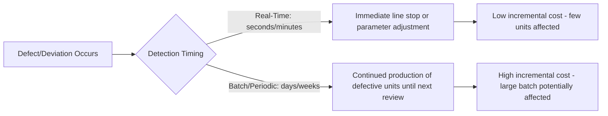
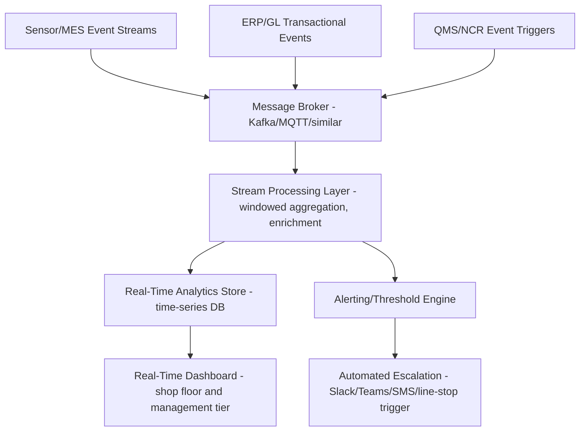

## Real Time Quality Cost Analytics and Dashboards

### Overview and Purpose

This item extends the dashboard architecture established earlier in this syllabus into the modern digital era, where the traditional monthly or weekly CoQ reporting cadence is increasingly supplemented — or in some functions replaced — by real-time or near-real-time analytics. Rather than reviewing last month's scrap totals in a governance meeting, modern quality organizations increasingly aim to surface cost-relevant quality events as they occur, enabling intervention within the same production shift rather than after a full reporting cycle has elapsed. This shift changes not just the refresh frequency of existing dashboards but the underlying data architecture required to support them.

### Why Real-Time Changes the Economics of Intervention

The core value proposition of real-time CoQ analytics is directly tied to the 1-10-100 Rule's underlying logic: the longer a cost-relevant deviation goes undetected, the further downstream it travels before correction, and the more expensive that correction becomes. Real-time analytics compress the detection-to-intervention window, effectively shifting cost incidents from later, more expensive stages of the PAF escalation toward earlier, cheaper ones.

$$\text{Cost Avoided} \approx \int_{t_{detect,real-time}}^{t_{detect,batch}} \frac{dC}{dt}\,dt$$

This expresses, conceptually rather than as a precisely computable formula, that the cost avoided by real-time detection is related to the *rate* at which cost accumulates during the gap between when a real-time system would catch an issue and when a traditional batch/periodic reporting cycle would have caught it [Inference — this is a conceptual framing rather than a validated quantitative model; actual cost-avoidance calculations should be grounded in specific incident cost data].



### Architecture for Real-Time CoQ Analytics

Building on the ETL-based dashboard pipeline described earlier in this syllabus, real-time analytics requires a shift from batch processing to streaming data architecture.



**Key Points**

- **Message brokers** (such as Apache Kafka, MQTT for lightweight IoT scenarios, or cloud-native equivalents like AWS Kinesis/Azure Event Hubs) decouple event producers (sensors, MES, ERP) from consumers (analytics, alerting), allowing the architecture to scale and evolve without tightly coupling every data source to every downstream system
- **Stream processing frameworks** (such as Apache Flink, Kafka Streams, or Spark Structured Streaming) perform windowed aggregation — for example, calculating a rolling defect rate over the last 100 units rather than waiting for shift-end totals
- **Time-series databases** (such as InfluxDB, TimescaleDB, or cloud-native time-series services) are generally better suited than traditional relational GL-style databases for storing and querying high-frequency sensor and event data at the volumes real-time quality monitoring generates
- **Alerting/threshold engines** translate real-time metric breaches into actionable notifications, ideally integrated into tools operators and engineers already use (shift communication channels, existing andon/line-stop systems) rather than requiring a separate dashboard to be actively monitored

### Distinguishing Real-Time Operational Metrics from Real-Time Financial CoQ

An important architectural and conceptual distinction: not every real-time quality metric is itself a real-time *cost* metric. Real-time systems most naturally surface *operational* leading indicators (defect rate, process parameter deviation, cycle time anomalies) which correlate with future cost but are not themselves dollar-denominated CoQ figures until translated through a costing model.

$$\text{Real-Time CoQ Estimate} = \text{Real-Time Operational Signal} \times \text{Standard Unit Cost Factor}$$

**Key Points**

- Applying a pre-calculated standard cost factor (e.g., standard scrap cost per unit, standard rework labor cost per occurrence) to a real-time operational count allows an approximate real-time dollar figure to be displayed, even though the fully-loaded, allocation-adjusted true cost (as discussed in the hidden-costs item) may only be reconcilable at period-end
- Real-time dashboards should generally be labeled as showing an "estimated" or "directional" CoQ figure rather than presented with the same precision claim as period-end reconciled financial reporting, to avoid the false-precision pitfall discussed in the 1-10-100 Rule limitations item
- The relationship between real-time operational dashboards (operational tier) and period-end reconciled financial CoQ reporting (management/executive tier) should be explicit and consistent, with real-time figures serving as early-warning indicators that are later validated and reconciled against actual GL postings, rather than presented as a replacement for financial reconciliation

### Example Real-Time Dashboard Layout (Shop Floor Tier)

**Example**



```
┌───────────────────────────────────────────────────────────┐
│  Line 4 — Real-Time Quality Monitor        [Live - 14:32]  │
├───────────────────────────────────────────────────────────┤
│  Rolling Defect Rate (last 100 units): 2.3%  ▲ (Target: 1.5%)│
│  Est. Scrap Cost (shift-to-date): $1,240                    │
│  Process Parameter Status: Temp OK | Pressure ⚠ Drifting    │
│                                                               │
│  [Live sparkline: defect rate, last 4 hours]                │
│  ─╮   ╭─╮       ╭──╮                                        │
│   ╰───╯ ╰───────╯  ╰──── (rising trend flagged)              │
│                                                               │
│  Active Alert: Pressure sensor #3 trending toward upper      │
│  control limit — predicted threshold breach in ~12 min       │
└───────────────────────────────────────────────────────────┘
```

### Implementation Considerations

**Key Points**

- **Latency requirements should be use-case-driven, not maximized by default**: A line-stop-triggering alert genuinely needs sub-second to few-second latency, while a management-tier real-time dashboard refreshing every few minutes is often entirely sufficient and considerably cheaper to build and maintain; over-engineering latency requirements beyond what the intervention actually requires adds unnecessary infrastructure cost
- **Data quality at the edge matters more, not less, in real-time systems**: Batch processes have historically allowed opportunity for manual review and correction before data reaches reporting; real-time systems that skip this step can propagate sensor errors or transient noise directly into alerts, so validation logic (outlier rejection, sensor health checks) needs to be built into the streaming pipeline itself
- **Alert fatigue is a significant adoption risk**: Poorly tuned threshold engines that generate excessive false alerts train operators to ignore notifications entirely, undermining the entire real-time investment; threshold tuning and false-positive rate monitoring (similar to the model-monitoring discipline discussed in the predictive-quality item) should be an ongoing operational discipline, not a one-time setup task
- **Integration with existing systems reduces adoption friction**: Real-time quality alerts delivered through channels operators already actively use (existing andon systems, shift communication tools) see substantially better response rates than a new, separate dashboard requiring active monitoring

### Relationship to Predictive Quality and ML

Real-time analytics infrastructure is a foundational prerequisite for many of the predictive quality approaches discussed in the previous item — process parameter monitoring and anomaly detection specifically require the streaming data pipeline described here to function in production, rather than being usable only in an offline/batch analysis context. Organizations building real-time CoQ analytics and predictive quality capability should generally architect the underlying data pipeline jointly, since duplicating streaming infrastructure separately for each initiative is typically inefficient.

### Common Pitfalls

- **Building real-time infrastructure without a clear intervention pathway**: Real-time data has value only if it triggers a faster response than the batch alternative; deploying real-time dashboards that are reviewed on the same weekly cadence as before captures the infrastructure cost without capturing the cost-avoidance benefit.
- **Conflating dashboard refresh rate with data accuracy**: A dashboard refreshing every few seconds using estimated standard-cost factors is not necessarily more accurate than a monthly reconciled figure — only more current; presenting real-time figures without this caveat can create false confidence in their precision.
- **Underinvesting in alert governance**: Treating alert threshold-setting as a one-time configuration task rather than an ongoing tuning discipline predictably leads to alert fatigue and eventual disengagement.
- **Siloed real-time infrastructure per initiative**: Building separate, redundant streaming pipelines for real-time dashboards, predictive maintenance, and computer vision inspection independently, rather than a shared streaming data architecture, multiplies infrastructure cost and maintenance burden unnecessarily.
- **Neglecting reconciliation with period-end financial figures**: Allowing real-time estimated CoQ figures to drift permanently unreconciled from actual GL-based financial reporting undermines trust in both systems once discrepancies are eventually noticed.

**Next Steps**

- Streaming Data Architecture Fundamentals for Manufacturing Analytics
- Alert Threshold Design and Alarm Management Best Practices
- Digital Twins for Quality Simulation and Prevention
- Integrating Real-Time Analytics with MES and ERP Systems
- Change Management for Shop-Floor Adoption of Real-Time Quality Tools