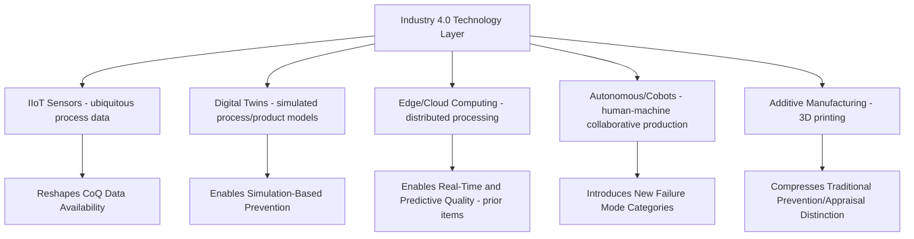

## Cost of Quality in Industry 4.0 and Smart Manufacturing

### Overview and Purpose

This item synthesizes the preceding modern-era topics — predictive quality/ML and real-time analytics — into the broader Industry 4.0 paradigm, examining how the convergence of cyber-physical systems, IoT connectivity, digital twins, and pervasive automation reshapes the entire Cost of Quality framework rather than simply digitizing individual components of it. Industry 4.0 does not merely add new tools to existing CoQ categories; it fundamentally alters the cost structure, category boundaries, and even the applicability of the classical PAF model in ways that quality professionals must actively account for rather than assume away.

### Defining the Industry 4.0 Quality Context

Industry 4.0 is generally characterized by the integration of cyber-physical systems, the Industrial Internet of Things (IIoT), cloud/edge computing, digital twins, and increasing autonomy in production decision-making. For CoQ purposes, the relevant shift is that quality-relevant data — previously captured through manual inspection, periodic sampling, or isolated equipment logs — becomes pervasively generated, interconnected, and available for cost attribution at a granularity and frequency that classical CoQ frameworks (designed in an era of manual data collection) did not anticipate.

### Digital Twins as a Prevention Category

Digital twins — dynamic virtual replicas of physical processes, products, or production lines, continuously updated with real operational data — represent a category of Prevention investment with no clean classical-era analog. Rather than preventing defects through physical process control alone, digital twins enable *simulation-based* prevention: testing process changes, tolerance adjustments, or new product designs virtually before physical implementation, catching potential quality issues at the design/simulation stage rather than during physical production.

$$C_{simulated\_defect} \ll C_{prevention\_stage} < C_{correction\_stage} < C_{failure\_stage}$$

This effectively extends the 1-10-100 escalation curve one stage further upstream than the classical model anticipated — a defect caught in simulation, before any physical unit is produced, carries a cost structurally lower even than traditional Prevention-stage activities like design review, since no physical resources are consumed in the discovery process at all.

**Key Points**

- Digital twin development and maintenance costs should generally be categorized as Prevention (capital/infrastructure), similar to the predictive quality ML systems discussed in the prior item, given their high-upfront/low-marginal-cost economics
- The fidelity of a digital twin's predictive value depends heavily on the quality and completeness of the real-world data feeding it — a twin built on the same incomplete or hidden-cost-affected data discussed earlier in this syllabus inherits those same blind spots
- Digital twins are increasingly used for supplier and process qualification simulation, potentially reducing traditional physical Appraisal activity (first-article inspection, pilot runs) that previously served the same qualification purpose

### New Failure Mode Categories Introduced by Industry 4.0

**Key Points**

- **Cybersecurity-driven quality failures**: A cyber-physical production system's quality outcomes are now vulnerable to failure modes with no classical-era analog — a compromised sensor feeding false process data, a manipulated PLC (programmable logic controller) command, or a ransomware-driven production stoppage all represent quality-relevant risk that traditional CoQ category definitions (established before pervasive connectivity) did not contemplate
- **Software/firmware-driven equipment failures**: As production equipment increasingly relies on software and firmware rather than purely mechanical/electrical control, defects can originate from code deployment errors or version mismatches rather than traditional mechanical wear, requiring quality organizations to develop new diagnostic and categorization competency
- **Human-robot collaboration failure modes**: Collaborative robots (cobots) working alongside human operators introduce failure modes at the human-machine interface (miscalibrated handoff timing, sensor misdetection of human presence/position) that differ qualitatively from either pure-manual or pure-automated failure mode categories
- **Additive manufacturing-specific defects**: 3D-printed components introduce defect categories (layer adhesion failures, print orientation-dependent material properties, powder bed inconsistency) that traditional subtractive/formative manufacturing CoQ frameworks were not designed to categorize, requiring extension of the account structure established earlier in this syllabus

### Cost Structure Implications: Compression of the PAF Boundaries

A recurring theme across Industry 4.0 technologies is the compression of traditionally distinct PAF category boundaries. Where classical CoQ frameworks assumed reasonably clean separation between Prevention (design-time), Appraisal (measurement/inspection), and Failure (defect occurrence), several Industry 4.0 capabilities blur these lines:

| Technology | Traditional Category Assumption | Industry 4.0 Complication |
| --- | --- | --- |
| In-line computer vision (from predictive quality item) | Appraisal (detection) | Increasingly triggers automated real-time correction, blending detection and prevention |
| Digital twin simulation | N/A (no classical analog) | Occurs before physical production entirely, extending "prevention" upstream of traditional design review |
| Autonomous process adjustment | N/A (assumed human-in-loop) | Machine autonomously corrects drift without human intervention, blurring Appraisal (detecting drift) and Prevention (correcting before defect) into a single automated action |
| Additive manufacturing in-process monitoring | Appraisal | Some systems adjust print parameters mid-print, again blending detection and correction into one continuous automated process |

[Inference — this table describes a general directional trend toward category blending observed across Industry 4.0 implementations; the degree of blending varies considerably by specific technology maturity and implementation choice, and organizations should adapt category definitions to their own specific systems rather than assuming universal applicability of this pattern.]

### Recommended Adaptations to the CoQ Framework

Building on the account structure and governance practices established earlier in this syllabus:

- **Extend the account structure deliberately rather than forcing new activity types into legacy categories**: Where a genuinely new cost driver emerges (cybersecurity-quality intersection, digital twin investment), creating a new, clearly-defined sub-account is generally preferable to awkwardly forcing it into an existing category where it doesn't cleanly fit, consistent with the account-extension guidance from the original account-setup item
- **Involve IT/OT (Operational Technology) stakeholders in CoQ governance**: As quality-relevant risk increasingly originates from cybersecurity and software domains traditionally outside Quality's functional scope, the cross-functional governance structures discussed in the sustainment chapter should explicitly include IT/OT representation
- **Revisit categorization rules for automated/autonomous corrective actions**: Where a system detects and corrects a deviation without human intervention, organizations should make an explicit, documented decision about whether to categorize this as Appraisal, Prevention, or a new blended category, rather than leaving it ambiguous and vulnerable to the miscategorization risk discussed in the gaming-and-manipulation item
- **Build Industry 4.0 technology cost-benefit analysis on the CoQ foundations already established**: Digital twin, predictive quality, and real-time analytics investments (from prior items) should be justified using the same ROI/payback framing developed in the executive-communication item, rather than treated as a separate "digital transformation" business case disconnected from the organization's existing CoQ methodology

### Common Pitfalls

- **Treating Industry 4.0 technologies as pure Appraisal/inspection upgrades**: Viewing computer vision, IIoT sensors, or digital twins solely as "better inspection tools" misses their genuine Prevention-shifting potential and can lead to underinvestment relative to their true economic value under the 1-10-100 logic.
- **Ignoring new failure mode categories until an incident forces recognition**: Organizations that fail to proactively extend their CoQ account structure to capture cybersecurity-driven or software-driven failure modes often only discover the gap after a costly incident has already occurred, at which point the absence of historical baseline data (as discussed in the hidden-costs item) hampers effective response and prevention going forward.
- **Underestimating the organizational change required**: Adopting Industry 4.0 quality technologies without addressing the organizational resistance dynamics discussed earlier in this chapter — particularly around new cross-functional IT/OT governance requirements — tends to produce the same sustainment failures discussed in the culture chapter, now compounded by genuine technical complexity.
- **Assuming digital twin/simulation fidelity without validation**: Relying on digital twin predictions without periodic validation against real physical outcomes risks compounding errors, especially if the twin was built on historically incomplete or hidden-cost-affected data.
- **Fragmenting Industry 4.0 investment across disconnected initiatives**: Pursuing predictive quality, real-time analytics, and digital twins as separate, uncoordinated projects (echoing the siloed-infrastructure pitfall from the prior item) rather than a coherent Industry 4.0 quality strategy multiplies both infrastructure cost and organizational change burden.

**Related Topics**

- Cybersecurity Risk as a Quality Cost Category
- IT/OT Convergence Governance for Manufacturing Quality
- Digital Twin Validation and Fidelity Assessment Methods
- Additive Manufacturing Quality Assurance Frameworks
- Chapter Synthesis: The Future Trajectory of Cost of Quality Frameworks