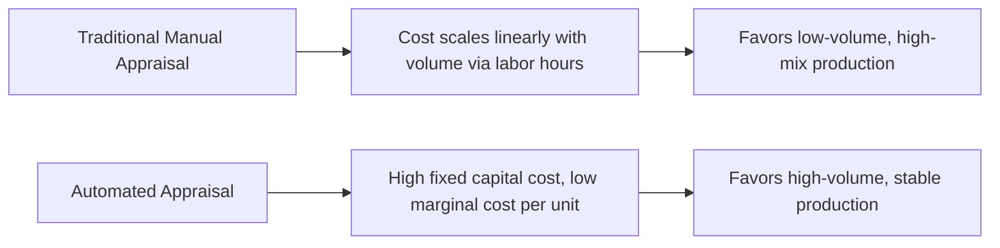
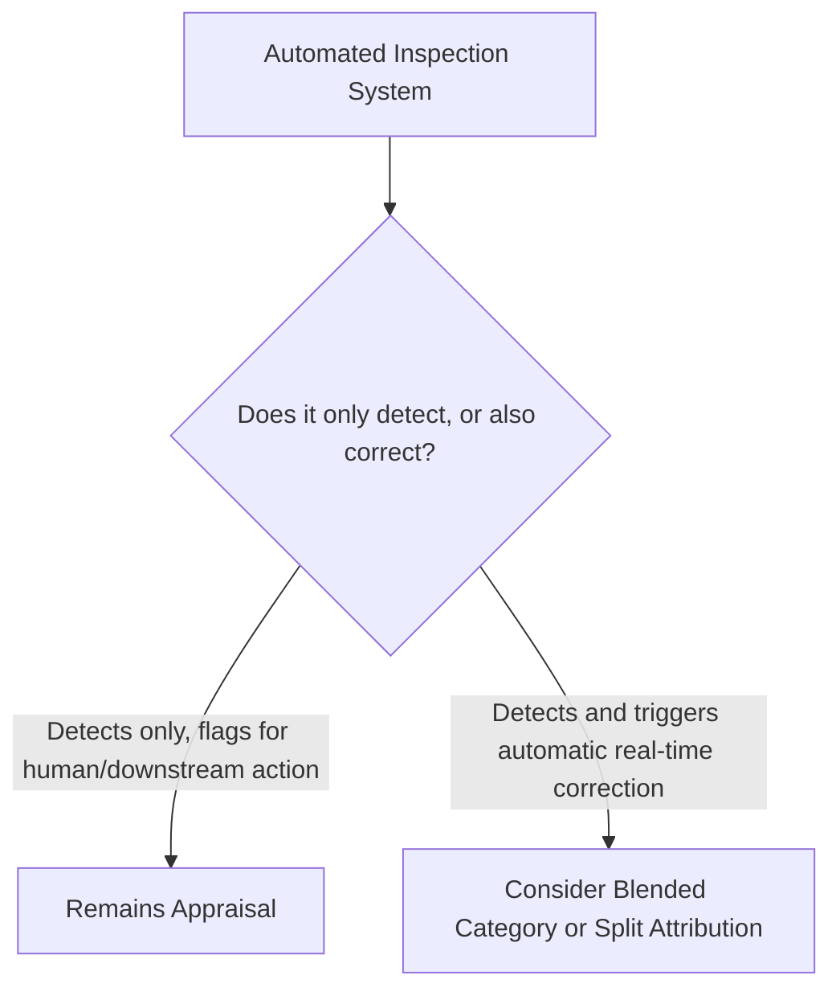

## Automation's Impact on Appraisal Costs

### Overview and Purpose

This item narrows focus specifically onto the Appraisal category within the PAF model, examining how automation technologies — spanning robotic inspection, automated test equipment, and the computer vision and ML approaches introduced earlier in this chapter — restructure Appraisal cost economics. While previous items in this chapter addressed prevention-shifting and infrastructure broadly, this item isolates a more targeted question directly relevant to CoQ practitioners maintaining the account structure established earlier in this syllabus: what happens to the Appraisal cost category specifically as inspection, testing, and measurement activities become increasingly automated.

### The Traditional Appraisal Cost Structure

Classical Appraisal costs are predominantly labor-intensive and scale approximately linearly with production or transaction volume: incoming inspection, in-process inspection, final test, and audit activities each require inspector or technician time proportional to the number of units, batches, or transactions reviewed.

$$C_{Appraisal,traditional} = n \times (t_{inspect} \times r_{labor}) + C_{equipment,fixed}$$

where $n$ is volume, $t_{inspect}$ is inspection time per unit, $r_{labor}$ is the loaded labor rate, and $C_{equipment,fixed}$ represents fixed costs of test/measurement equipment (calibration, maintenance, depreciation).

### How Automation Restructures This Cost Function

Automated inspection technologies — robotic vision systems, automated optical inspection (AOI), coordinate measuring machines (CMM) with automated part handling, and the ML-based computer vision approaches discussed in the predictive-quality item — shift the cost structure from labor-dominated and linear to capital-dominated with a much flatter marginal cost curve.

$$C_{Appraisal,automated} = C_{capital,fixed} + n \times c_{marginal}, \quad \text{where } c_{marginal} \ll t_{inspect} \times r_{labor}$$

**Key Points**

- This cost restructuring creates a volume-dependent crossover point below which manual inspection remains more economical and above which automated inspection's amortized fixed cost becomes lower per-unit than continued labor cost — identifying this crossover volume is a standard capital investment analysis relevant to Appraisal automation decisions
- Automation economics favor high-volume, relatively stable production environments where the fixed capital cost amortizes over many units; low-volume, high-mix, or frequently-changing production contexts may not clear the crossover threshold, making continued manual appraisal the more economically rational choice in those specific contexts
- The crossover analysis should incorporate not just direct labor cost but the loaded/burdened labor rate methodology established in the account-setup item, since benefits, overhead, and other burden costs are also avoided by automation, not just base wages

### Categories of Appraisal Automation

**1. Automated Optical/Vision Inspection**

Building on the computer vision approaches introduced in the predictive-quality item, automated visual inspection systems for surface defects, assembly verification, and dimensional checking replace or supplement manual visual inspection, typically achieving both lower marginal cost and improved consistency (reduced inspector fatigue-driven variability) relative to manual inspection.

**2. Automated Test Equipment (ATE) and Functional Test**

In electronics and complex assembled products, automated test equipment performs functional verification (electrical testing, calibration checks, performance benchmarking) at speeds and consistency levels manual testing cannot match, with the capital cost of ATE development amortized across the product's production volume.

**3. Coordinate Measuring Machines (CMM) and Automated Dimensional Metrology**

Automated CMM systems, particularly when integrated with automated part-loading/handling, reduce the labor cost of precision dimensional inspection while typically improving measurement repeatability relative to manual gauge-based inspection.

**4. Statistical Sampling Optimization via Automated Data Collection**

Automation does not only reduce cost per inspection — it also enables inspection strategies that were previously impractical, such as 100% inspection of high-volume production where sampling-based inspection was previously necessary due to labor constraints. This can shift the Appraisal cost-vs-risk trade-off, since higher inspection coverage generally reduces the escape rate of defects into Internal or External Failure categories, directly interacting with the 1-10-100 Rule's escalation logic.

$$\text{Escape Rate} = f(\text{Sampling Coverage}), \quad \frac{\partial(\text{Escape Rate})}{\partial(\text{Coverage})} < 0$$

### Impact on the CoQ Category Balance

Automation's effect on Appraisal costs has downstream implications for the PAF mix ratio tracked in the dashboard framework established earlier in this syllabus:

**Key Points**

- A declining Appraisal cost line, driven by automation rather than by reduced inspection scope or coverage, should generally be viewed favorably — it represents genuine cost reduction rather than reduced quality vigilance, provided detection effectiveness (not just cost) is monitored alongside the cost trend
- However, a declining Appraisal cost line accompanied by a rising Internal or External Failure cost line would indicate automation-driven cost reduction has come at the expense of detection effectiveness — a scenario requiring immediate investigation rather than being celebrated as pure efficiency gain
- Organizations should track detection effectiveness metrics (e.g., defect escape rate, inspection coverage percentage) alongside the dollar-denominated Appraisal cost trend specifically to distinguish genuine efficiency improvement from a false economy where cost savings mask reduced detection capability

### Reclassification Considerations

As automated appraisal systems increasingly incorporate real-time correction capability (as discussed in the Industry 4.0 item's discussion of category blending), some previously pure-Appraisal activities may warrant reclassification:

Consistent with the account-extension guidance established earlier in this syllabus, organizations implementing increasingly autonomous appraisal-plus-correction systems should make an explicit, documented categorization decision rather than defaulting to legacy classification by inertia.

### Labor and Workforce Implications

**Key Points**

- Appraisal automation typically reduces demand for manual inspection labor while increasing demand for automation maintenance, calibration, and data science/ML monitoring skill sets — a workforce composition shift that has both cost and organizational change management implications
- Displaced or redeployed inspection labor represents a genuine organizational change management consideration; the resistance dynamics discussed in the organizational-resistance item can apply directly to inspection staff whose roles are affected by automation investment
- Retained human inspection roles increasingly shift toward exception handling, edge-case judgment, and oversight of automated systems rather than routine high-volume inspection — a role redefinition that has training and job design implications beyond pure cost accounting

### Common Pitfalls

- **Justifying automation solely on labor cost reduction without validating detection effectiveness**: A business case built purely on projected labor savings, without a validation plan confirming the automated system's detection accuracy meets or exceeds the manual process it replaces, risks trading a visible cost reduction for a less visible increase in defect escape rate.
- **Ignoring the crossover volume analysis and over- or under-automating**: Investing in automated appraisal capital for production volumes below the economic crossover point, or conversely persisting with manual inspection well beyond the point where automation would be more economical, both represent suboptimal capital allocation relative to the volume-dependent cost structure described above.
- **Failing to update the CoQ account structure to reflect new cost composition**: Continuing to report "Appraisal" as a single blended line item without distinguishing the capital/depreciation component from any remaining labor component obscures the underlying cost structure shift and can complicate future automation investment decisions.
- **Underestimating automation system maintenance and calibration cost**: Treating automated appraisal capital cost as a one-time expense without adequately budgeting for ongoing calibration, software updates, and eventual equipment replacement understates the true total cost of ownership relative to the labor cost it displaces.
- **Neglecting workforce transition planning**: Pursuing appraisal automation purely as a cost initiative without a deliberate plan for affected inspection staff (redeployment, retraining toward automation oversight roles) can generate the organizational resistance dynamics discussed earlier in this chapter, undermining both the automation program and broader CoQ program credibility.

**Next Steps**

- Capital Investment Analysis and Crossover Volume Calculations for Automation
- Workforce Transition Planning for Quality Automation Initiatives
- Detection Effectiveness Metrics: Escape Rate and Coverage Analysis
- Total Cost of Ownership Modeling for Automated Test Equipment
- Chapter Synthesis: The Future Trajectory of Cost of Quality Frameworks