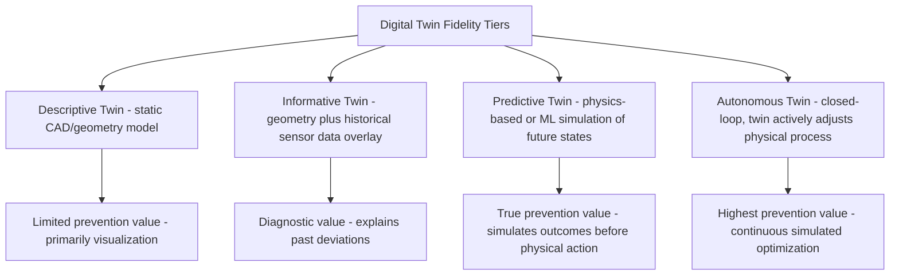

## Digital Twins for Prevention Stage Testing

### Overview and Purpose

This item provides focused, technical depth on digital twins specifically as a Prevention-stage tool — a topic introduced at a survey level in the Industry 4.0 item but warranting dedicated treatment given its distinct implementation architecture, validation requirements, and cost-categorization implications. Where the Industry 4.0 item established digital twins as one of several converging technologies, this item addresses the specific technical mechanics of how digital twins are built, validated, and operationalized for prevention-stage quality testing, and how that implementation detail should inform CoQ accounting treatment.

### Defining Digital Twin Fidelity Levels for Quality Applications

Not all digital twins offer equivalent prevention value, and the appropriate CoQ investment level depends heavily on which fidelity tier is being built. A useful technical distinction for quality applications:

**Key Points**

- **Descriptive twins** (static 3D/CAD representations) offer minimal direct CoQ prevention value on their own, functioning primarily as a visualization and communication aid rather than a predictive tool
- **Informative twins** (incorporating historical sensor/process data) support root-cause diagnostic work — useful for the failure analysis activities categorized under Internal Failure or Prevention depending on context — but do not yet simulate future outcomes
- **Predictive twins**, incorporating either physics-based simulation (finite element analysis, computational fluid dynamics, thermal modeling) or ML-based surrogate models trained on historical data, are the tier genuinely capable of testing "what if" scenarios before physical implementation — this is the tier most directly relevant to Prevention-stage cost avoidance
- **Autonomous/closed-loop twins**, which not only predict but actively adjust the physical process based on simulation output, represent the most advanced tier and blur into the real-time analytics and automated correction territory discussed in earlier items in this chapter

### Technical Architecture of a Predictive Digital Twin

A predictive digital twin for quality applications typically comprises several distinct technical layers:

**1. Sensor and Data Integration Layer**

This layer overlaps substantially with the streaming data architecture discussed in the real-time analytics item — a digital twin intended for ongoing calibration against real-world performance requires the same sensor infrastructure and data pipeline investment already discussed, reinforcing the earlier point that these Industry 4.0 initiatives should share underlying infrastructure rather than duplicate it.

**2. Model Layer: Physics-Based vs. Data-Driven Approaches**

- **Physics-based models** (finite element analysis for structural behavior, computational fluid dynamics for flow/thermal behavior, first-principles process models) offer strong extrapolation capability — they can predict behavior in conditions not previously observed, since they're grounded in physical laws rather than historical pattern-matching, but typically require greater upfront engineering effort and specialized simulation expertise to develop
- **Data-driven/ML surrogate models** (trained on historical sensor and outcome data, similar to the predictive quality approaches discussed earlier in this chapter) can be faster to develop and computationally cheaper to run at inference time, but generally offer weaker extrapolation beyond the range of conditions represented in training data — a meaningful limitation for testing genuinely novel design or process changes
- **Hybrid approaches**, using physics-based models for core behavior and ML surrogates for computationally expensive sub-components (reducing simulation runtime while preserving physical grounding), are increasingly common where pure physics-based simulation would be too computationally expensive for rapid iterative testing

**3. Validation Layer: Continuous Calibration Against Reality**

$$\text{Twin Fidelity Error} = |\hat{y}_{twin} - y_{actual}|$$

A predictive digital twin's value for prevention-stage testing depends entirely on its demonstrated accuracy against real-world outcomes; without continuous validation tracking (comparing twin predictions against subsequently observed actual results), an organization has no defensible basis for trusting twin-based prevention decisions over traditional physical testing. This validation discipline should be built into the twin's operational governance from initial deployment, not treated as an optional add-on.

### Applying Digital Twins to Specific Prevention Use Cases

**1. Design-Stage Tolerance Stack-Up Simulation**

Simulating how individual component tolerances combine (tolerance stack-up analysis) across an assembly before physical prototyping can identify designs likely to produce high defect rates due to cumulative tolerance interaction — catching this class of defect entirely before any physical unit exists, which represents Prevention-stage cost avoidance in its most literal form.

**2. Process Parameter Optimization Before Physical Trial Runs**

Rather than conducting physical Design of Experiments (DOE) trials across a full parameter space — consuming material, machine time, and labor — a validated process digital twin allows the parameter space to be explored virtually first, narrowing the physical trial set to the most promising candidate configurations identified through simulation.

$$\text{Physical Trials Required} = n_{full\_DOE} \rightarrow n_{narrowed}, \quad n_{narrowed} \ll n_{full\_DOE}$$

**3. Supplier and New Material Qualification Simulation**

Simulating how a new supplier's material or component would behave within the broader assembly/process, before committing to physical qualification runs, can identify likely incompatibilities earlier in the supplier evaluation process, potentially reducing the number of physical qualification cycles required.

**4. Predictive "Digital Shadow" Testing for Software-Defined Products**

For products with significant embedded software/firmware, a digital twin of the control system logic can test edge-case scenarios and failure modes in simulation before deployment to physical units — directly relevant to the software/firmware-driven failure modes introduced in the Industry 4.0 item.

### CoQ Accounting Treatment

Consistent with the categorization guidance established in the predictive-quality and Industry 4.0 items:

| Cost Component | Recommended Category | Notes |
| --- | --- | --- |
| Initial twin model development (physics-based or ML) | Prevention (capital, amortized) | Analogous to other prevention infrastructure investment |
| Sensor/data infrastructure supporting the twin | Prevention (capital) — shared with real-time analytics infrastructure where applicable | Avoid duplicate accounting if infrastructure is shared across initiatives |
| Ongoing validation and recalibration effort | Prevention (operating) | Necessary to maintain trustworthy fidelity over time |
| Physical trials avoided (cost avoidance, not a direct cost) | Tracked as an estimated benefit, not a cost account | Should be reported as attributed savings, following the ROI methodology from the predictive-quality item, with appropriate caution against false precision |

### Common Pitfalls

- **Overinvesting in twin fidelity beyond what the use case requires**: Building a full physics-based, high-fidelity twin for a use case that a simpler informative twin or even traditional statistical process control could adequately address wastes Prevention investment that could be better allocated elsewhere; fidelity tier should be matched deliberately to the specific decision the twin is meant to support.
- **Deploying a predictive twin without an ongoing validation discipline**: A twin whose predictions are never systematically compared against actual outcomes can silently drift into inaccuracy, particularly as the underlying physical process, materials, or equipment change over time — undermining the trust the entire prevention use case depends on.
- **Assuming ML surrogate models generalize beyond their training data range**: Using a data-driven twin to simulate genuinely novel design or process conditions outside the range represented in its training data risks confidently wrong predictions, a particularly dangerous failure mode precisely because the simulation appears authoritative.
- **Failing to track physical-trial cost avoidance with appropriate rigor**: Claiming digital twin ROI based on an assumed reduction in physical trials without a documented before/after comparison (mirroring the attribution challenge discussed in the predictive-quality item) risks the same false-precision and credibility issues discussed in the 1-10-100 Rule limitations item.
- **Building twin capability in isolation from existing real-time analytics infrastructure**: Duplicating sensor and data pipeline investment already built for real-time CoQ analytics (from the earlier item in this chapter) rather than extending shared infrastructure multiplies cost unnecessarily.

**Related Topics**

- Physics-Based vs. Machine Learning Simulation Approaches in Manufacturing
- Design of Experiments (DOE) Methodology and Its Integration with Simulation
- Model Validation and Continuous Calibration Governance
- Tolerance Stack-Up Analysis Techniques
- Chapter Synthesis: The Future Trajectory of Cost of Quality Frameworks