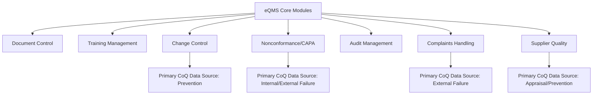
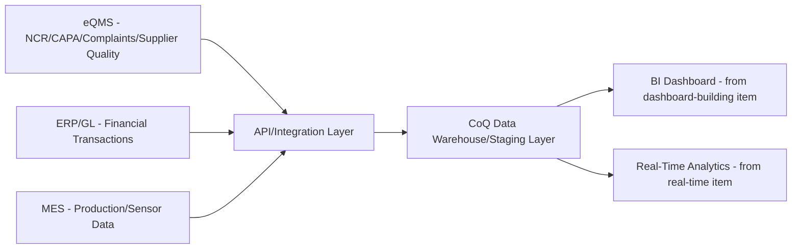

## Quality Management System Software Platforms

### Overview and Purpose

This item shifts focus from the technical/architectural themes of this chapter (predictive quality, real-time analytics, digital twins) to the software category that typically underpins operational execution of the CoQ program as a whole: the electronic Quality Management System (eQMS). While earlier items addressed specific analytical capabilities, the eQMS platform is generally the system of record connecting document control, corrective action, audit management, and — critically for this syllabus — the transactional data feeding the CoQ account structure established earlier. Understanding the eQMS category, its architecture, and its relationship to CoQ measurement is foundational to implementing the technical vision described in the rest of this chapter.

### What an eQMS Manages

An eQMS centralizes quality workflows into a controlled environment with full traceability, typically managing document control, training management, change control, deviations, nonconformances, CAPA (Corrective and Preventive Action), audit management, complaints, and supplier quality at minimum. More advanced platforms extend into risk management, equipment management, design controls, and quality analytics. [dotcompliance](https://www.dotcompliance.com/?p=14320)[dotcompliance](https://www.dotcompliance.com/?p=14320)

**Key Points**

- The **Nonconformance/CAPA module** is typically the richest native CoQ data source within an eQMS, since NCRs (Non-Conformance Reports) directly capture the defect event, its disposition (scrap, rework, use-as-is), and often the labor hours associated with investigation and correction
- The **Complaints module** captures the primary transactional record for External Failure costs (warranty claims, returns, field issues), directly feeding the account structure established earlier in this syllabus
- The **Supplier Quality module** typically houses supplier scorecards, incoming inspection results, and supplier corrective action requests (SCARs) — relevant to both Appraisal (incoming inspection) and Prevention (supplier qualification) categories
- The **Change Control module**, while less directly cost-bearing, provides the audit trail connecting Prevention-stage design/process changes to their downstream quality impact, useful for the PDCA cycle attribution discussed in the sustainment chapter

### eQMS Category Landscape

In 2026, the QMS landscape has fractured into specialists, generalists, legacy giants, and modern challengers, each making claims about compliance, configurability, and AI, making the market harder for buyers to navigate. A useful way to segment the landscape for CoQ implementation purposes: [propelsoftware](https://converged.propelsoftware.com/blogs/the-7-best-qms-software-platforms-for-2026)

| Category | Characteristics | CoQ Data Implications |
| --- | --- | --- |
| Enterprise/regulated life sciences platforms (e.g., MasterControl, Veeva QMS) | Strong in enterprise pharmaceutical and medical device compliance, with deep regulatory workflow support | Rich structured data but often rigid category definitions requiring configuration work to map to a custom PAF account structure |
| Configurable no-code/mid-market platforms (e.g., Qualio, QT9, Greenlight Guru) | Positioned toward growing companies needing document control, CAPA, and nonconformance tracking without heavy enterprise overhead | Generally easier to customize categorization fields to match a specific CoQ account taxonomy |
| ERP-embedded quality modules | Quality functionality built into a broader ERP suite rather than standalone | Potentially simpler GL integration (discussed in the account-setup item) since quality and financial data share the same underlying system |
| Shop-floor/lightweight tools | Lighter-weight tools aimed at operations-led teams rather than full regulatory compliance scope | May lack native cost-attribution fields, requiring custom development or spreadsheet bridging to feed the CoQ dashboard pipeline |

[Inference — this categorization reflects a general pattern across the eQMS market; specific vendor capabilities change frequently, and organizations should validate current feature sets directly with vendors rather than relying on a fixed characterization, since this software category evolves rapidly.]

### Selection Criteria From a CoQ Perspective

Beyond the general eQMS selection criteria (compliance coverage, usability, integration depth) that a broader buyer's guide would cover, a CoQ-focused evaluation should specifically assess:

**Key Points**

- **Custom field and category configurability**: Can the NCR/CAPA disposition fields be configured to map directly onto the PAF category structure and sub-accounts established in the account-setup item, or does the platform impose its own fixed taxonomy that would require a translation layer?
- **Cost/labor capture at the transaction level**: Does the platform natively capture labor hours, material cost, and disposition cost per nonconformance record, or does it only track qualitative disposition (pass/fail, accept/reject) without an attached cost field — the latter would require the timesheet/ERP integration approaches discussed in the account-setup item to bridge the gap
- **Integration depth with ERP, MES, and analytics tools**: Connectivity to ERP, MES, PLM, LIMS, and CRM systems determines whether the eQMS can feed the real-time analytics streaming architecture and BI dashboard pipeline discussed earlier in this chapter, or whether it will require custom middleware/ETL development to bridge [guideflow](https://www.guideflow.com/et-ee/blog/quality-management-software)
- **API availability for custom analytics extraction**: A modern REST API (or equivalent) allowing programmatic extraction of nonconformance, complaint, and audit data is generally necessary to feed the dashboard automation pipeline described in the dashboard-building item, rather than relying on manual export/import cycles
- **AI-driven analytics and closed-loop quality claims**: Vendors increasingly market AI functionality and "closed-loop quality" capability; these claims should be evaluated concretely against the specific predictive quality and real-time analytics use cases discussed earlier in this chapter rather than accepted as marketing differentiation alone, since platform-native AI features vary substantially in actual sophistication and applicability to a given organization's specific defect types [propelsoftware](https://converged.propelsoftware.com/blogs/the-7-best-qms-software-platforms-for-2026)

### Integration Architecture: eQMS as a CoQ Data Source

This integration pattern extends the ETL pipeline architecture introduced in the dashboard-building item, with the eQMS serving as a primary upstream source specifically for Failure-category (Internal and External) transaction records, alongside the ERP/GL source for financial reconciliation and MES for production/sensor-derived Appraisal and Prevention data.

### Regulatory Context Affecting Platform Selection

For organizations in regulated industries, eQMS selection is also shaped by compliance requirements that indirectly affect CoQ implementation timelines and validation burden. In medical devices specifically, the FDA's Quality Management System Regulation took effect February 2, 2026, replacing the legacy Quality System Regulation and incorporating ISO 13485:2016 by reference, meaning medical device manufacturers evaluating or migrating eQMS platforms during this period face compliance considerations layered on top of the CoQ-specific evaluation criteria above. [Unverified — regulatory requirements and effective dates should always be confirmed against current official regulatory guidance rather than secondary sources, given the direct compliance consequences of getting this wrong.] [meddeviceguide](https://meddeviceguide.com/blog/best-eqms-software-medical-devices-2026-guide)

### Common Pitfalls

- **Selecting an eQMS purely on regulatory/compliance criteria without evaluating CoQ data extraction capability**: A platform can be fully adequate for audit and regulatory purposes while being poorly suited to feeding a CoQ dashboard pipeline if cost/labor fields are absent or category taxonomy is rigid; both dimensions should be evaluated together rather than treating CoQ as an afterthought to the compliance selection process.
- **Assuming vendor "quality analytics" modules replace the custom CoQ account structure**: Native analytics dashboards bundled with an eQMS platform are often generic (defect counts, CAPA closure rates) rather than aligned to the organization-specific PAF account structure and allocation methodology established earlier in this syllabus; these built-in dashboards should be evaluated as a possible supplement, not assumed to replace the custom CoQ reporting pipeline.
- **Underestimating configuration and integration effort during platform selection**: Vendor demonstrations often show idealized, pre-configured workflows; actual implementation effort to map an eQMS's native fields onto a specific CoQ account taxonomy and integrate with existing ERP/MES systems is frequently underestimated during the selection process.
- **Treating AI/closed-loop marketing claims as validated capability**: Given the rapidly evolving and competitively marketed nature of this software category, specific AI-driven features should be piloted and validated against the organization's actual defect data and use cases (as discussed in the predictive-quality item) rather than accepted on the basis of vendor marketing materials alone.
- **Choosing a platform without confirming ERP/MES integration feasibility upfront**: Discovering post-purchase that the selected eQMS lacks adequate API or integration support for the organization's existing ERP/MES stack can force costly custom middleware development or manual data bridging that undermines the automated dashboard pipeline goals discussed earlier in this chapter.

**Related Topics**

- eQMS Implementation and Validation Project Planning
- API Integration Patterns Between eQMS, ERP, and MES Systems
- Regulatory Compliance Considerations in Quality Software Selection (ISO 13485, FDA QMSR, IATF 16949)
- Evaluating AI-Driven Quality Analytics Claims Critically
- Chapter Synthesis: The Future Trajectory of Cost of Quality Frameworks