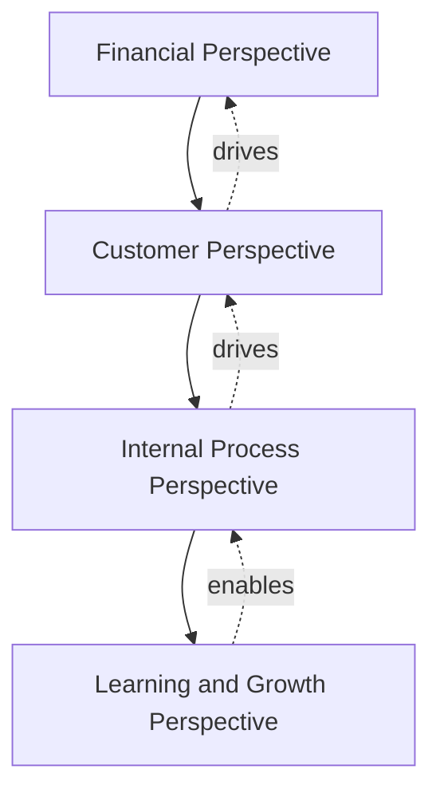
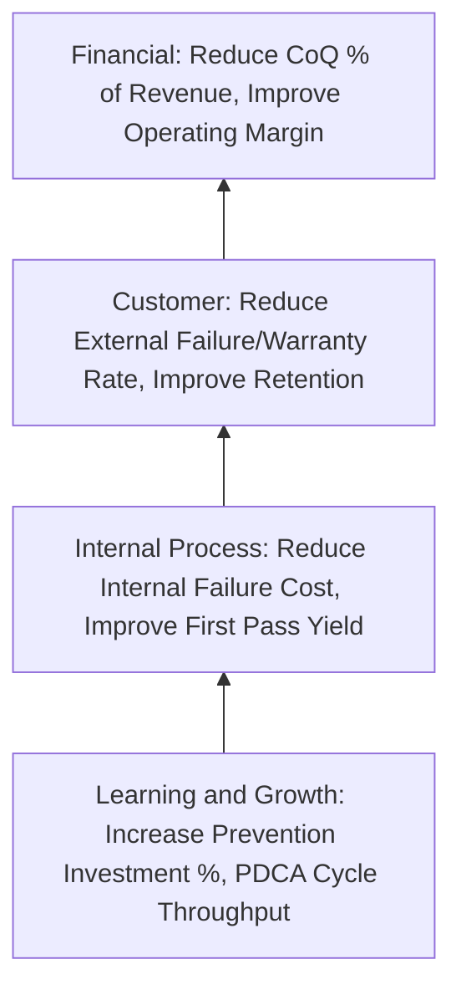
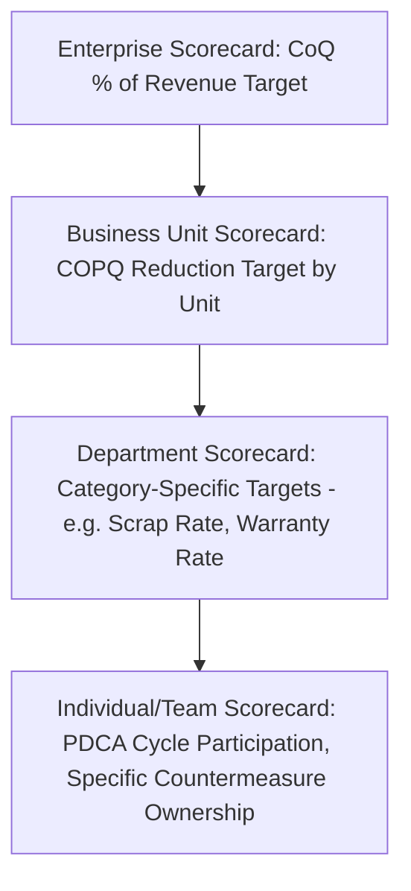

## Linking Cost of Quality to the Balanced Scorecard

### Overview and Purpose

This item opens a new chapter examining how Cost of Quality integrates with broader strategic management frameworks, beginning with the Balanced Scorecard (BSC) — the strategic performance management framework developed by Robert Kaplan and David Norton in the early 1990s. Where earlier chapters addressed CoQ as a standalone measurement and improvement system, this item addresses how CoQ metrics should be positioned within an organization's overall strategic measurement architecture, ensuring quality cost data informs strategic decision-making at the same level as financial, customer, and operational metrics rather than remaining a siloed departmental report.

### The Balanced Scorecard Framework: Brief Overview

The Balanced Scorecard organizes organizational performance metrics into four traditionally defined perspectives, each linked through cause-and-effect relationships intended to translate strategy into measurable action:

- **Financial Perspective**: Traditional lagging financial outcomes (revenue, margin, ROI)
- **Customer Perspective**: Customer satisfaction, retention, market share
- **Internal Process Perspective**: Operational efficiency, quality, cycle time
- **Learning and Growth Perspective**: Employee capability, systems infrastructure, organizational culture

The framework's central premise is that financial outcomes are lagging indicators driven by customer outcomes, which are themselves driven by internal process performance, which is in turn enabled by learning and growth capability — a causal chain intended to give leadership a leading-indicator view of future financial performance rather than managing by financial results alone.

### Where CoQ Metrics Map Within the Four Perspectives

CoQ metrics are not confined to a single BSC perspective — different CoQ measures naturally align with different perspectives, and mapping them explicitly clarifies how quality cost data supports the broader strategic narrative rather than existing as an isolated quality-department concern.

| BSC Perspective | Relevant CoQ Metric | Strategic Rationale |
| --- | --- | --- |
| Financial | CoQ % of Revenue, COPQ trend (from dashboard-building item) | Direct lagging financial impact of quality performance |
| Customer | External Failure cost, warranty rate, complaint volume | Leading indicator of customer satisfaction and retention risk |
| Internal Process | Internal Failure cost, First Pass Yield, Appraisal efficiency | Core process performance driving downstream customer and financial outcomes |
| Learning and Growth | Prevention investment as % of CoQ, training hours, PDCA cycle completion rate (from sustainment item) | Capability-building investment that enables future process and quality improvement |

**Key Points**

- Positioning Prevention investment specifically within the Learning and Growth perspective reinforces the strategic argument, made in the executive-communication item, that prevention spending is a capability investment rather than a discretionary cost — aligning it with how the BSC framework treats other capability-building metrics like training and systems investment
- Positioning External Failure and customer-facing CoQ metrics within the Customer perspective creates an explicit, visible link between quality performance and the customer retention/satisfaction metrics executives already track under that perspective, reducing the risk (discussed in the executive-communication item) that quality metrics are perceived as disconnected from customer and revenue outcomes
- The causal chain implicit in the BSC structure — Learning and Growth enables Internal Process, which drives Customer outcomes, which drives Financial results — mirrors the 1-10-100 Rule's own underlying logic that upstream investment (Prevention) reduces downstream cost (Failure), giving CoQ practitioners a ready-made strategic narrative structure to leverage when presenting to BSC-literate executive audiences

### Constructing CoQ-Informed Strategy Maps

Kaplan and Norton's strategy map extends the BSC by making the cause-and-effect linkages between perspectives explicit and visual, typically read bottom-to-top from Learning and Growth through to Financial outcomes.

**Key Points**

- A CoQ-specific strategy map segment like this can be embedded within the organization's broader strategy map rather than existing as a separate quality-only artifact, reinforcing that quality cost management is integral to overall strategy execution rather than a parallel initiative
- Each linkage in the map represents a testable hypothesis (e.g., "increased Prevention investment causes reduced Internal Failure cost with an expected lag of N periods") that can be validated against actual CoQ trend data over time, similar in spirit to the PDCA validation discipline discussed in the sustainment item — this hypothesis-testing framing gives the strategy map genuine analytical value beyond illustration
- Where the hypothesized linkage fails to materialize in the data (e.g., Prevention investment increases without corresponding Internal Failure reduction), this signals either a measurement problem (potentially the hidden-cost or gaming issues discussed in the pitfalls chapter) or a genuine strategic misalignment (the wrong prevention investments were selected) warranting investigation

### Cascading CoQ Objectives Through the Scorecard Hierarchy

Balanced Scorecards are typically cascaded from an enterprise-level scorecard down through business unit, departmental, and sometimes individual-level scorecards, with each level's objectives supporting the level above.

This cascading structure directly reinforces the governance and ownership recommendations from the sustainment chapter — by embedding CoQ targets within the same cascading scorecard mechanism used for other strategic objectives, quality cost accountability inherits the same organizational rigor and visibility as financial and operational targets, rather than depending on a separate, potentially less-enforced quality governance structure.

### Practical Integration Steps

**Key Points**

- **Audit existing BSC/strategy map for CoQ representation gaps**: Many organizations' existing scorecards, if built before a formal CoQ program existed, likely underrepresent quality cost metrics relative to their strategic importance; a gap audit against the four-perspective mapping above is a natural starting point
- **Align CoQ reporting cadence with existing BSC review cadence**: Rather than maintaining the CoQ review cadence established in the sustainment chapter as an entirely separate governance rhythm, integrating CoQ metric review into existing BSC/strategy review meetings (where they already occur) reduces governance fragmentation and reinforces the strategic (not siloed) positioning of quality cost data
- **Use BSC target-setting processes to set CoQ targets**: Rather than the Quality function unilaterally setting CoQ improvement targets, incorporating them into the same strategic target-setting process used for other BSC objectives (typically involving cross-functional leadership negotiation) increases organizational buy-in and reduces the resistance dynamics discussed in the organizational-resistance item
- **Validate causal linkages periodically, not just report the numbers**: As noted above, the strategy map's value depends on periodically testing whether hypothesized linkages (Prevention investment → reduced Internal Failure → improved Customer metrics → improved Financial results) actually hold in the organization's own data, refining the map's structure where they do not

### Common Pitfalls

- **Treating BSC integration as a reporting exercise rather than genuine strategic alignment**: Simply adding a CoQ metric to an existing scorecard template without validating its causal linkage to the broader strategy map, or without genuine executive engagement in target-setting, produces a superficial integration that does not achieve the deeper strategic alignment this item describes.
- **Duplicating governance structures rather than integrating them**: Maintaining a fully separate CoQ review cadence and a separate BSC review cadence, rather than integrating CoQ metrics into existing strategic reviews, recreates the governance fragmentation and initiative-fatigue risk discussed in the sustainment chapter.
- **Over-simplifying the causal chain**: Assuming a direct, immediate, and purely linear relationship between Prevention investment and Financial outcomes ignores the lag effects, confounding variables, and measurement limitations (hidden costs, gaming risk) discussed throughout the pitfalls chapter; strategy map linkages should be treated as hypotheses to validate, not guaranteed relationships.
- **Applying a rigid four-perspective structure without adapting to organizational context**: Some organizations use modified BSC structures (e.g., adding a Sustainability or Risk perspective); CoQ metrics should be mapped thoughtfully to whatever perspective structure the organization actually uses rather than forcing the classical four-perspective model where it doesn't fit.
- **Losing CoQ-specific granularity in aggregated scorecard metrics**: A single high-level "Quality" metric in an enterprise scorecard can obscure the PAF category mix insights that make CoQ data actionable; the cascading structure should preserve enough granularity at lower scorecard levels for the PDCA cycle to function effectively.

**Next Steps**

- Building CoQ-Specific Strategy Maps and Testing Causal Hypotheses
- Aligning CoQ Governance Cadence with Enterprise Strategic Review Cycles
- Cross-Functional Target-Setting Processes for Quality Cost Objectives
- Integrating Cost of Quality into Strategic Planning and Annual Budgeting
- Comparative Frameworks: OKRs vs. Balanced Scorecard for Quality Objectives