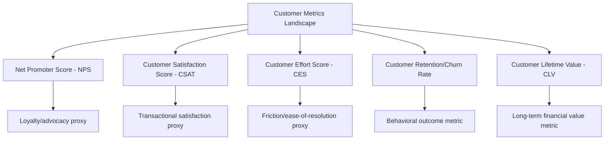
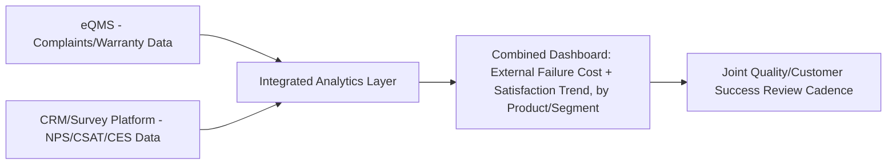

## Quality Costs and Customer Satisfaction Metrics

### Overview and Purpose

This item deepens the Customer perspective linkage introduced in the Balanced Scorecard item, examining specifically how Cost of Quality data — particularly External Failure costs — relates to, predicts, and should be triangulated against formal customer satisfaction and loyalty metrics. While the BSC item established that External Failure cost belongs conceptually within the Customer perspective, this item addresses the practical measurement relationship between quality cost data and the specific customer metrics organizations already track, and how integrating the two data streams strengthens both.

### The Core Relationship: External Failure Cost as a Customer Experience Proxy

External Failure costs (warranty claims, returns, complaints, field service, recalls) are, by definition, quality events that have already reached and affected the customer — making this CoQ category the most direct financial proxy available for a subset of negative customer experience. However, the relationship is asymmetric and incomplete in ways that matter for correct interpretation.

$$\text{External Failure Cost} \subseteq \text{Negative Customer Experience}, \quad \text{but} \quad \text{External Failure Cost} \neq \text{Customer Satisfaction}$$

**Key Points**

- External Failure cost captures only quality issues that generate a *transaction* (a claim filed, a return processed, a complaint logged) — a customer who experiences a minor quality issue but does not formally complain or return the product generates no External Failure cost entry, yet may still experience reduced satisfaction and be less likely to repurchase, directly echoing the hidden-cost underreporting issue discussed earlier in this syllabus
- Conversely, not all customer dissatisfaction stems from quality issues at all — price perception, service responsiveness, delivery timing, and other non-quality factors also drive satisfaction metrics, meaning External Failure cost is one input among several rather than a complete satisfaction proxy
- The relationship between External Failure cost and satisfaction metrics is therefore best used as a *triangulation* — validating and enriching each data source against the other — rather than treating either as a substitute for the other

### Standard Customer Satisfaction and Loyalty Metrics

To triangulate effectively, CoQ practitioners should understand the customer metrics most organizations already track:

- **Net Promoter Score (NPS)**: Measures likelihood to recommend, typically on a 0-10 scale, segmented into Promoters, Passives, and Detractors
- **Customer Satisfaction Score (CSAT)**: Typically a transaction-specific or periodic satisfaction rating, often on a 1-5 scale
- **Customer Effort Score (CES)**: Measures the perceived ease of resolving an issue or completing an interaction — particularly relevant when a quality issue required customer service intervention
- **Retention/Churn Rate**: A behavioral (not stated-preference) outcome metric, arguably the most economically consequential customer metric for CoQ triangulation purposes
- **Customer Lifetime Value (CLV)**: Incorporates retention, purchase frequency, and average transaction value into a single long-term value estimate

### Triangulation Methodology

**1. Correlating External Failure Events with Subsequent Satisfaction Scores**

For organizations with transaction-level customer data, correlating individual External Failure events (a specific warranty claim, a specific complaint) against that same customer's subsequent NPS/CSAT responses provides a direct, defensible link between quality cost and customer sentiment — considerably more rigorous than an aggregate, organization-wide correlation.

$$\Delta CSAT_{post-incident} = CSAT_{post} - CSAT_{pre}$$

**Key Points**

- This pre/post comparison methodology is analogous to the attribution challenge discussed in the predictive-quality item — isolating the incident's specific effect requires controlling for other factors that might independently affect the customer's satisfaction score during the same period
- Segmenting this analysis by defect severity (echoing the 1-10-100 Rule limitations item's point about severity-dependent cost escalation) typically reveals that severity of the quality issue correlates with the magnitude of satisfaction impact, though the specific relationship should be empirically validated against the organization's own data rather than assumed

**2. Using CES to Validate the "Cost of Poor Resolution" Beyond the Direct Failure Cost**

A quality failure that is resolved with high customer effort (multiple contacts, long resolution time, repeated escalation) generates a worse customer experience than an equivalent failure resolved smoothly — even though both may generate identical direct External Failure cost (e.g., the same warranty payout amount). Tracking CES alongside External Failure cost surfaces this distinction, which pure dollar-cost tracking misses entirely.

**3. Cohort-Based Churn Analysis by Quality Incident History**

Comparing retention/churn rates between customer cohorts with versus without a recorded quality incident (controlling as much as feasible for other differences between cohorts) provides an empirical estimate of the *goodwill/lifetime-value cost* component that the hidden-costs item flagged as chronically underreported in standard CoQ ledgers.

$$\text{Estimated Goodwill Cost per Incident} \approx (\text{Churn Rate}_{no\_incident} - \text{Churn Rate}_{incident}) \times CLV_{avg}$$

This calculation should be presented with appropriate caveats about correlation versus causation and cohort comparability — it produces a *reasoned estimate* suitable for the explicitly-labeled "Estimated Hidden CoQ" category discussed in the hidden-costs item, not a precise, audit-grade figure.

### Building an Integrated Reporting View

Extending the dashboard architecture established earlier in this syllabus, a combined quality-cost/customer-satisfaction view allows both data streams to inform the same decision-making process rather than living in separate departmental reports (Quality's CoQ dashboard versus Customer Success's NPS dashboard).

**Key Points**

- This integration requires connecting the eQMS (discussed in the prior item) with whatever CRM or survey platform houses satisfaction data — a data engineering task similar in kind to the ERP/MES integration challenges discussed throughout this chapter
- A joint review cadence, bringing Quality and Customer Success/Support functions together around the combined view, directly supports the cross-functional governance recommendation from the sustainment chapter and helps counteract the departmental-silo resistance dynamics discussed in the organizational-resistance item
- Segmenting the combined view by product line or customer segment (rather than only an aggregate organization-wide figure) typically reveals that the External Failure cost-to-satisfaction relationship is not uniform, informing more targeted improvement prioritization than either metric alone would suggest

### Strategic Implications for Prevention Investment Justification

Building on the executive-communication item's framing of Prevention investment as unrealized margin, the customer-satisfaction linkage adds a second, complementary justification: Prevention investment protects not only immediate margin but also customer lifetime value and retention, particularly valuable in subscription, recurring-revenue, or high-switching-cost business models where customer retention is a primary driver of enterprise value.

$$\text{Total Business Case} = \Delta COPQ_{avoided} + \Delta CLV_{protected}$$

Presenting both components together, where estimable, generally produces a more complete and more persuasive business case than the direct cost-avoidance argument alone, particularly for executive audiences (as discussed in the executive-communication item) who are evaluated on customer retention metrics as much as on margin.

### Common Pitfalls

- **Treating External Failure cost as a complete customer satisfaction proxy**: As established above, External Failure cost captures only the subset of quality issues that generate a formal transaction; presenting it as equivalent to overall customer sentiment ignores the substantial portion of customer experience that never generates a claim or complaint.
- **Conflating correlation with causation in incident-satisfaction analysis**: A customer's satisfaction score declining after a quality incident does not automatically prove the incident caused the decline; other concurrent factors (pricing changes, competitive alternatives, unrelated service issues) should be considered before attributing the full satisfaction change to the quality event.
- **Ignoring resolution experience (CES) in favor of direct cost alone**: Two quality incidents with identical direct External Failure cost can produce very different customer outcomes depending on resolution quality; a CoQ program that tracks only dollar cost misses this important dimension of the customer impact.
- **Failing to integrate data across departmental silos**: Maintaining Quality's CoQ dashboard and Customer Success's satisfaction dashboard as entirely separate systems, reviewed in separate meetings by separate stakeholders, prevents the triangulation and joint prioritization this item describes from occurring in practice.
- **Overstating the precision of goodwill/CLV cost estimates**: Presenting the estimated goodwill cost calculation above as a precise, audit-grade figure rather than a clearly-labeled estimate risks the same false-precision credibility issue discussed in both the hidden-costs item and the 1-10-100 Rule limitations item.

**Related Topics**

- Customer Lifetime Value Modeling Methodologies
- Root Cause Analysis Linking Support Ticket Data to Quality Categorization
- Joint Quality and Customer Success Governance Structures
- Segmentation Strategies for Quality-Customer Impact Analysis
- Integrating Cost of Quality into Strategic Planning and Annual Budgeting