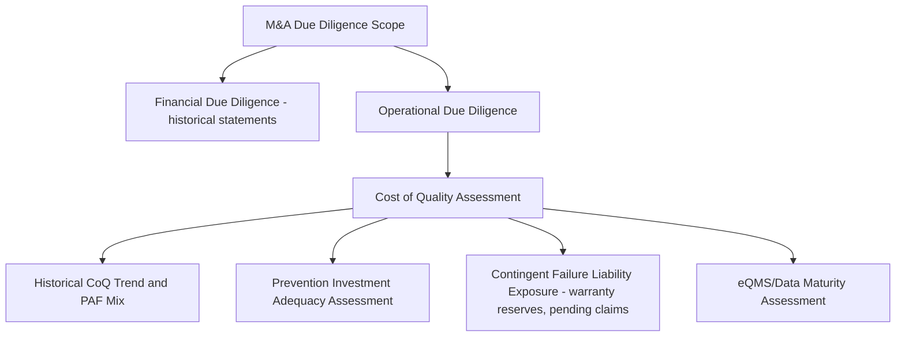
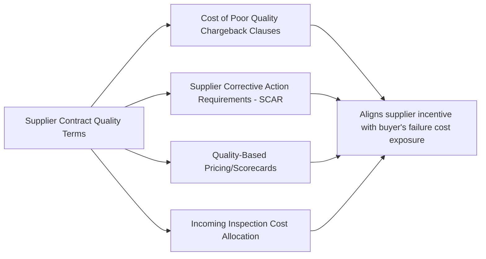

## Quality Costs in Mergers, Acquisitions, and Supplier Contracts

### Overview and Purpose

This item extends Cost of Quality analysis beyond internal operational management into two high-stakes external transaction contexts: mergers and acquisitions (M&A) due diligence, and formal supplier contract structuring. In both contexts, CoQ data — when available and properly interpreted — provides a quantitative lens on quality-related risk and value that traditional financial due diligence or standard contract terms often miss, since quality issues frequently carry deferred, contingent, or off-balance-sheet cost implications that only surface after a deal closes or a contract is executed.

### Part One: Cost of Quality in M&A Due Diligence

**Why CoQ Matters in Deal Evaluation**

Traditional financial due diligence examines historical financial statements, which — consistent with the hidden-cost underreporting and easily-measured-cost bias issues discussed earlier in this syllabus — frequently understate the true quality-related risk embedded in a target company's operations. A target's reported profitability may reflect deferred quality investment (underspent Prevention, aging equipment, accumulated technical/process debt) that will require future capital to remediate, representing a liability not visible on a standard balance sheet.

**Key Points**

- **Historical CoQ trend and PAF mix analysis**: Where the target maintains CoQ data (or where data can be reconstructed from underlying financial and quality records), examining the trend and category mix reveals whether the target has been investing adequately in Prevention or has been extracting short-term profitability at the expense of deferred quality risk — a pattern sometimes associated with businesses being prepared for sale
- **Prevention investment adequacy assessment**: Comparing the target's Prevention spending (as a percentage of revenue or of total CoQ) against industry benchmarks or against the acquirer's own internal standards can surface underinvestment that will require post-acquisition capital to remediate
- **Contingent failure liability exposure**: Warranty reserves, pending litigation related to product quality, and open regulatory findings (particularly relevant in regulated industries, as discussed in the eQMS platforms item) represent quantifiable or estimable future cash outflows that should be explicitly modeled into the valuation, not treated as immaterial footnote disclosures
- **eQMS and data maturity assessment**: The sophistication of the target's quality data infrastructure (per the eQMS platforms item) affects both the acquirer's ability to conduct thorough diligence and the post-acquisition integration cost/timeline if systems need replacement or migration

**Quantifying Quality Risk in Valuation**

$$\text{Adjusted Enterprise Value} = \text{EV}_{reported} - \text{Est. Deferred Prevention Investment} - \text{Est. Contingent Failure Liability}$$

This adjustment should be treated as a negotiating and risk-quantification tool rather than a precise valuation formula — the estimation components carry the same epistemic caution flagged throughout the hidden-costs and 1-10-100 Rule limitations items, and should be presented to deal teams as a range with explicit assumptions rather than a single point estimate.

**Common Due Diligence Data Limitations**

**Key Points**

- Target companies frequently lack formal CoQ measurement entirely, particularly smaller or founder-led businesses, requiring the diligence team to reconstruct approximate figures from available financial statements, warranty reserve history, and quality department interviews — a process directly analogous to the hidden-cost discovery techniques discussed earlier in this syllabus
- Where a target does maintain CoQ data, the diligence team should apply the same skepticism toward gaming and measurement bias discussed in the pitfalls chapter, since a target preparing for sale has heightened incentive to present favorable quality metrics
- Post-acquisition integration planning should explicitly address whether the target's CoQ measurement approach (if any) will be replaced with the acquirer's account structure (from the account-setup item) or run in parallel during a transition period, since inconsistent category definitions between combining entities can distort combined post-merger CoQ trend reporting if not deliberately reconciled

### Part Two: Cost of Quality in Supplier Contracts

**Structuring Contractual Quality Cost Allocation**

Where the M&A context uses CoQ to evaluate a target's historical quality risk, the supplier contract context uses CoQ principles prospectively — structuring agreements that allocate the *future* financial consequences of quality failures between buyer and supplier in a manner that creates appropriate incentives for the supplier to invest in their own Prevention capability.

**Key Points**

- **Cost of Poor Quality (COPQ) chargeback clauses**: Contractual terms specifying that the supplier bears defined costs when their defective components or materials cause buyer-side failure costs (rework, scrap, or downstream customer-facing failure) directly transfer a portion of Internal and External Failure cost exposure back to the party best positioned to prevent it — echoing the 1-10-100 Rule's logic that the party closest to the defect's origin should bear responsibility for its escalating downstream cost
- **Supplier Corrective Action Requirements (SCAR)**: Formal contractual mechanisms requiring documented root-cause analysis and corrective action from the supplier following a quality escape, often with defined response-time requirements, mirror the PDCA discipline discussed in the sustainment chapter but extended contractually across the organizational boundary
- **Quality-based pricing or scorecards**: Structuring pricing tiers or renewal terms partly on supplier quality performance metrics (defect PPM, on-time delivery, SCAR closure rate) creates an ongoing financial incentive for supplier-side Prevention investment, rather than relying solely on reactive chargebacks after failures occur
- **Incoming inspection cost allocation**: Contract terms can explicitly address who bears the Appraisal cost of incoming inspection — a supplier with a strong quality track record might negotiate reduced buyer-side incoming inspection (a practice sometimes called "certified supplier" or "ship-to-stock" status), directly reducing the buyer's Appraisal cost category in exchange for demonstrated supplier reliability

**Designing Chargeback Mechanisms to Avoid Perverse Incentives**

$$\text{Chargeback Amount} = f(\text{Defect Severity, Root Cause Attribution, Contractual Cap})$$

**Key Points**

- Chargeback clauses should generally be tiered by defect severity and clearly tied to demonstrated root cause, rather than applying a flat penalty regardless of severity — an undifferentiated penalty structure can create disputes over attribution (echoing the selective root-cause attribution gaming risk discussed in the pitfalls chapter) rather than genuine collaborative improvement
- Excessively punitive chargeback terms can create an adversarial supplier relationship that discourages the transparent defect and near-miss reporting discussed in the sustainment and gaming-and-manipulation items — from the supplier's side, the same suppression dynamics can occur if disclosure is perceived as directly triggering severe financial penalty
- The most effective supplier quality contract structures generally balance financial accountability mechanisms with collaborative elements (joint improvement programs, shared PDCA participation, transparent scorecarding) rather than relying on punitive chargeback clauses alone — mirroring the sustainment chapter's broader point that punitive metric use tends to suppress the honest reporting a quality system depends on

**Integrating Supplier CoQ Data into the Buyer's Account Structure**

Consistent with the account-setup item's original PAF taxonomy, supplier-attributable costs recovered through chargeback should generally be tracked as a contra-account or recovery line against the buyer's own Internal/External Failure accounts, rather than being netted invisibly against the underlying failure cost — this preserves the transparency needed for the PDCA improvement cycle to correctly identify the true gross failure cost, independent of how much of it was ultimately recovered contractually.

### Common Pitfalls

- **Relying solely on target-provided CoQ data in M&A diligence without independent validation**: A target preparing for sale has direct incentive to present favorable quality metrics; diligence teams should apply the gaming-detection approaches discussed in the pitfalls chapter (cross-validation against independent data, statistical anomaly review) rather than accepting provided figures at face value.
- **Treating post-acquisition CoQ integration as a low priority relative to financial system integration**: Inconsistent quality account structures between merging entities can persist for years if not deliberately addressed during integration planning, permanently complicating combined-entity CoQ trend analysis.
- **Structuring supplier chargeback clauses that create adversarial rather than collaborative dynamics**: Overly punitive or ambiguously-attributed chargeback terms can suppress transparent supplier disclosure of quality issues, ultimately increasing the buyer's own risk exposure rather than reducing it.
- **Failing to model contingent failure liability with appropriate ranges in valuation**: Presenting a single-point estimate of acquired quality risk, rather than a range reflecting genuine estimation uncertainty, overstates the precision of what is fundamentally a judgment-based adjustment.
- **Neglecting to define clear root-cause attribution processes in supplier contracts before disputes arise**: Ambiguous or undefined attribution methodology in chargeback clauses tends to surface as contentious, relationship-damaging disputes only after a significant quality incident occurs, when it is far more difficult to negotiate calmly than during initial contract drafting.

**Next Steps**

- Structuring Supplier Scorecards and Quality-Based Pricing Models
- Post-Merger Integration Planning for Quality Systems and Account Structures
- Contract Law Considerations in Quality Chargeback and SCAR Clauses
- Due Diligence Frameworks for Operational and Quality Risk Assessment
- Chapter Synthesis: Cost of Quality as a Strategic Business Function