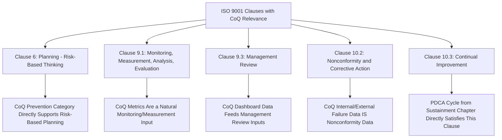

## Aligning Cost of Quality with ISO 9001 Quality Management Systems

### Overview and Purpose

This item closes out the strategic integration chapter by examining the relationship between Cost of Quality measurement and ISO 9001, the internationally recognized standard for quality management systems. While CoQ and ISO 9001 originate from distinct traditions — CoQ from cost accounting and quality economics, ISO 9001 from process-based quality management and conformity assessment — the two frameworks are highly complementary in practice, and organizations pursuing both often find that CoQ data directly satisfies several ISO 9001 requirements while ISO 9001's structure provides institutional scaffolding that helps sustain the CoQ program itself, connecting back to the culture-sustainment concerns raised earlier in this syllabus.

### ISO 9001 Structure: Brief Overview Relevant to CoQ

ISO 9001 is organized around a Plan-Do-Check-Act structure at the system level, with clauses covering context of the organization, leadership, planning, support, operation, performance evaluation, and improvement. Several specific clauses have direct, substantive overlap with CoQ practice:

### Clause-by-Clause Alignment

**1. Clause 6 (Planning) — Risk-Based Thinking**

ISO 9001's requirement for risk-based thinking — identifying risks and opportunities that could affect the QMS's ability to achieve intended results — aligns directly with the Prevention category's core purpose. Organizations conducting formal risk assessments (FMEA, risk registers) as part of ISO 9001 compliance are, in effect, generating the analytical basis for Prevention-stage investment decisions; explicitly linking risk assessment outputs to Prevention account allocation (from the account-setup item) avoids maintaining these as two disconnected activities.

**2. Clause 9.1 (Monitoring, Measurement, Analysis, and Evaluation)**

$$\text{ISO 9001 Required Data} \cap \text{CoQ Data} = \text{Substantial Overlap}$$

ISO 9001 requires organizations to determine what needs monitoring and measuring, and to analyze and evaluate this data — but deliberately leaves the specific metrics to organizational discretion. CoQ metrics (CoQ % of revenue, PAF mix, COPQ trend, as established in the dashboard-building item) are well-suited to directly satisfy this clause's intent, since they represent exactly the kind of quantified, trend-analyzed performance data the clause calls for, rather than requiring a separate, redundant measurement system built solely for audit purposes.

**3. Clause 9.3 (Management Review)**

ISO 9001 mandates periodic management review of the QMS, with defined required inputs including performance of processes, conformity of products/services, nonconformities and corrective actions, and monitoring/measurement results. The CoQ dashboard architecture and executive reporting cadence established earlier in this syllabus map directly onto this requirement — an organization already conducting the quarterly executive CoQ review described in the executive-communication item is substantively satisfying a significant portion of the management review input requirement, rather than needing to construct a separate reporting package solely for ISO audit purposes.

**4. Clause 10.2 (Nonconformity and Corrective Action)**

This clause requires organizations to react to nonconformities, evaluate the need for corrective action, and implement and review the effectiveness of that action — which is, in substance, the PDCA cycle discussed in the sustainment chapter applied specifically to Internal and External Failure events. The eQMS Nonconformance/CAPA module discussed in the eQMS platforms item is typically the system of record for this clause's compliance evidence, and is simultaneously the primary data source feeding Internal and External Failure cost accounts — meaning the same underlying data serves both compliance and cost-management purposes without duplication.

**5. Clause 10.3 (Continual Improvement)**

The broad continual improvement requirement is directly satisfied by a functioning CoQ program's PDCA cycle, and the leading/lagging indicator framework discussed in the dashboard-building and sustainment items provides exactly the kind of trend evidence an ISO auditor looks for to confirm genuine, sustained improvement rather than a one-time compliance exercise.

### Practical Integration Approach

**Key Points**

- **Map CoQ data flows directly onto ISO 9001 required records rather than building parallel systems**: Since Clause 9.1 and 9.3 leave specific metrics to organizational discretion, formally designating the existing CoQ dashboard (from the dashboard-building item) as the primary evidentiary artifact for these clauses avoids the common pitfall of quality teams maintaining separate "compliance metrics" and "management metrics" that measure substantially the same underlying reality
- **Use the eQMS as the single system of record for both purposes**: As noted above, the Nonconformance/CAPA module serving both ISO 9001 Clause 10.2 evidence and CoQ Failure-cost data capture is a natural convergence point; ensuring the categorization fields configured in the eQMS (per the eQMS platforms item) support both purposes simultaneously avoids costly duplicate data entry or reconciliation
- **Position CoQ-driven risk assessment as the substantive input to Clause 6 risk-based thinking**: Rather than conducting risk assessment as a standalone compliance activity disconnected from actual cost data, using historical CoQ failure data (which categories and processes have generated the most Internal/External Failure cost) as direct input to risk prioritization gives the risk assessment genuine analytical grounding rather than being a paperwork exercise
- **Leverage ISO 9001 certification cycles to reinforce CoQ program sustainment**: The external accountability created by periodic ISO 9001 surveillance and recertification audits can serve as an additional sustaining mechanism for the CoQ program's governance cadence, directly addressing the champion-dependency and initiative-fatigue risks discussed in the sustainment chapter, since external audit requirements persist independent of internal champion turnover

### Where the Frameworks Diverge

**Key Points**

- **ISO 9001 is a conformance/compliance framework; CoQ is fundamentally an economic optimization framework**: ISO 9001 certification confirms that a documented system exists and is being followed — it does not, by itself, evaluate whether the system's investment allocation across Prevention, Appraisal, and Failure is economically optimal, which remains CoQ's distinct contribution; an organization can be fully ISO 9001 certified while still exhibiting the easily-measured-cost bias or classical-curve limitations discussed earlier in this syllabus
- **ISO 9001 does not require financial quantification of quality performance**: The standard's monitoring and measurement requirements can technically be satisfied with non-financial metrics (defect counts, on-time delivery percentages) alone; CoQ's translation of these into financial terms (as emphasized throughout the executive-communication item) is a value-add beyond baseline ISO 9001 compliance, not a compliance requirement in itself
- **Certification audit cycles and CoQ review cadence may not naturally align without deliberate coordination**: ISO surveillance audits typically occur annually with recertification on a multi-year cycle, while the CoQ governance cadence recommended in the sustainment chapter operates weekly through quarterly; deliberately timing key CoQ program reviews to precede audit cycles can ensure the program presents current, audit-ready evidence rather than treating the two cadences as unrelated

### Common Pitfalls

- **Building separate, duplicative measurement and reporting systems for ISO compliance versus internal CoQ management**: This is the single most common inefficiency in organizations pursuing both frameworks independently; the substantial data overlap described above means most organizations can and should consolidate these into a single reporting architecture.
- **Treating ISO 9001 certification as evidence that CoQ economics are sound**: As noted, certification confirms process conformance and documentation, not economic optimality; an organization should not assume ISO certification alone validates that its Prevention/Appraisal/Failure investment mix is well-calibrated, particularly given the pitfalls discussed throughout the earlier chapter of this syllabus.
- **Under-leveraging the eQMS's dual-purpose potential**: Configuring an eQMS (from the prior item) purely for ISO audit-trail purposes, without also configuring its categorization fields to feed the CoQ account structure, forfeits a natural efficiency opportunity and risks the exact kind of siloed, duplicated infrastructure flagged as a pitfall in earlier chapter items.
- **Losing sight of continual improvement's substantive intent in favor of audit-readiness theater**: Some organizations optimize documentation and evidence presentation specifically for audit success without genuinely operating the underlying PDCA cycle between audits — precisely the "certification as finish line" pitfall identified in the sustainment chapter, now viewed through the ISO lens specifically.
- **Failing to update ISO-referenced risk assessments as CoQ data reveals new priority areas**: Risk assessments conducted once during initial ISO 9001 implementation and never revisited, despite ongoing CoQ data revealing shifting failure patterns, represent stale compliance documentation rather than the living, data-informed risk management the standard intends.

**Related Topics**

- IATF 16949 and AS9100D as Industry-Specific Extensions of ISO 9001
- Structuring Management Review Meetings to Satisfy Both ISO and Strategic Governance Needs
- Risk-Based Thinking and FMEA Methodology Integration with CoQ Data
- Audit Preparation Strategies Leveraging Existing CoQ Reporting Infrastructure
- Chapter Synthesis: Cost of Quality as a Strategic Business Function