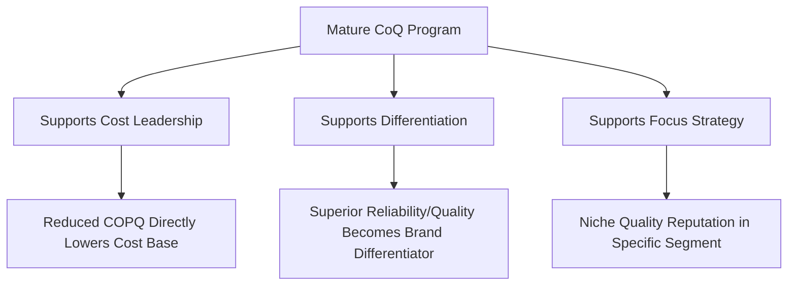
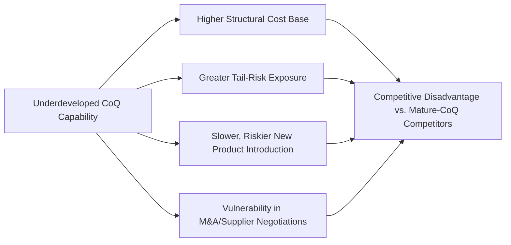

## Cost of Quality as a Driver of Competitive Advantage

### Overview and Purpose

This item closes the "Integrating Cost of Quality into Business Strategy" chapter by elevating the discussion from operational and functional integration (Balanced Scorecard, customer metrics, M&A/supplier contracts, ISO 9001) to the level of competitive strategy itself. The central argument is that a mature CoQ program, properly integrated with the strategic frameworks discussed throughout this chapter, does not merely reduce cost — it can function as a genuine source of sustainable competitive advantage, distinct from and complementary to other strategic levers like cost leadership, differentiation, or focus strategies described in classical strategic management frameworks.

### Connecting CoQ to Classical Competitive Strategy Frameworks

Michael Porter's generic strategies framework identifies cost leadership, differentiation, and focus as the primary routes to competitive advantage. A mature CoQ program can substantively support more than one of these simultaneously, which is part of what makes it strategically distinctive relative to initiatives that support only a single generic strategy.

**Key Points**

- **Cost leadership support**: Reduced COPQ (as tracked via the metrics established in the dashboard-building item) directly lowers the organization's cost base relative to competitors carrying higher failure costs, supporting price competitiveness without margin sacrifice — this is the most direct and commonly cited strategic linkage
- **Differentiation support**: Consistently low External Failure rates and high reliability, sustained over time, can become a genuine brand attribute that customers value and are willing to pay a premium for — particularly in industries where product reliability carries high switching cost or safety consequence (automotive, medical devices, industrial equipment, aerospace)
- **Focus strategy support**: In markets where a specific customer segment values quality/reliability disproportionately (e.g., safety-critical B2B buyers, luxury consumer segments), a demonstrably superior CoQ profile can support a focus strategy targeting that segment specifically, rather than competing broadly

### The Resource-Based View: CoQ Capability as a Strategic Asset

Beyond Porter's generic strategies, the Resource-Based View (RBV) of strategy — which argues sustainable competitive advantage derives from resources and capabilities that are valuable, rare, difficult to imitate, and non-substitutable (the VRIN framework) — offers a useful lens for understanding why a mature CoQ program can constitute genuine strategic advantage rather than merely operational efficiency.

$$\text{Sustainable Advantage} = f(\text{Valuable} \times \text{Rare} \times \text{Inimitable} \times \text{Non-substitutable})$$

**Key Points**

- **Valuable**: A CoQ capability that genuinely reduces cost while maintaining or improving quality outcomes creates measurable economic value, satisfying the first VRIN criterion directly
- **Rare**: Given the organizational resistance, measurement difficulty, and sustainment challenges documented throughout the pitfalls chapter of this syllabus, a genuinely mature, sustained CoQ program (as opposed to a superficial or abandoned one) is empirically uncommon — most organizations attempt but fail to sustain such programs past initial implementation, making genuine maturity a rarer capability than it might first appear
- **Inimitable**: The specific combination of organizational culture (from the sustainment chapter), data infrastructure (from the modern/digital chapter), and accumulated institutional learning (years of PDCA cycles, refined category definitions, calibrated cost models) that constitutes a mature CoQ program is difficult for a competitor to replicate quickly, even if they understand the general methodology — this path-dependent, tacit-knowledge quality is what makes the capability genuinely inimitable rather than easily copied from a textbook
- **Non-substitutable**: While competitors could pursue alternative approaches to cost reduction or quality improvement, few alternative organizational capabilities provide the same integrated combination of cost discipline, customer protection, and continuous improvement infrastructure that a mature CoQ program delivers simultaneously

### Empirical Manifestations of Competitive Advantage

**1. Pricing Power Through Demonstrated Reliability**

Organizations with a sustained track record of low External Failure rates can sometimes command premium pricing, extended warranty terms, or preferred-supplier status in B2B contexts (directly connecting to the supplier-contract dynamics discussed in the prior item) — effectively converting quality cost discipline into pricing leverage rather than solely into internal cost savings.

**2. Reduced Cost of Capital and Risk Premium**

In some contexts, a demonstrably lower and well-governed quality risk profile — particularly relevant in the M&A due diligence context discussed in the prior item — can reduce the risk premium investors, lenders, or insurers apply, since documented quality cost discipline signals lower probability of catastrophic tail-risk events (recalls, major litigation, regulatory action) discussed in the 1-10-100 Rule limitations item. [Inference — the magnitude of this effect is difficult to isolate empirically from other factors affecting cost of capital, and should be treated as a directional argument rather than a precisely quantifiable relationship.]

**3. Talent Attraction and Retention**

An organizational culture genuinely committed to quality and continuous improvement (as discussed in the sustainment chapter) can function as a talent differentiator, particularly for engineering and quality professionals who often prefer working in environments where their expertise is valued and acted upon rather than treated as a compliance afterthought — indirectly supporting the Learning and Growth perspective of the Balanced Scorecard discussed earlier in this chapter.

**4. Faster, Lower-Risk New Product Introduction**

Organizations with mature Prevention capability (robust design review processes, digital twin simulation per the earlier chapter, supplier qualification rigor) can generally introduce new products with lower quality risk and potentially faster time-to-market than competitors relying more heavily on post-launch Appraisal and Failure-stage correction — directly leveraging the upstream-shift logic of the 1-10-100 Rule as a competitive speed advantage, not merely a cost advantage.

### Strategic Risks of Underdeveloped CoQ Capability

The competitive advantage argument implies a corresponding competitive risk: organizations that fail to develop CoQ capability — or that develop it superficially, falling prey to the pitfalls discussed throughout this syllabus — face not merely higher costs but genuine competitive disadvantage relative to competitors who have achieved the rarer, more mature capability described above.

### Practical Implications for Strategic Planning

**Key Points**

- **Position CoQ maturity explicitly within strategic planning processes**: Rather than treating CoQ program maturity purely as an operational metric, strategic planning discussions (informed by the Balanced Scorecard integration discussed earlier in this chapter) should explicitly consider CoQ capability as a strategic asset to be deliberately developed, analogous to how organizations deliberately invest in other VRIN-qualifying capabilities like proprietary technology or brand equity
- **Benchmark CoQ maturity against competitors where possible**: While direct competitor CoQ data is rarely available, proxy indicators (warranty terms offered, public recall history, ISO certification scope, customer satisfaction benchmarks discussed in the earlier item) can inform a relative maturity assessment useful for strategic positioning
- **Communicate CoQ-driven reliability as a market-facing differentiator where genuinely earned**: Organizations with genuinely strong, sustained quality performance should consider whether and how this can be communicated externally (marketing, sales positioning, extended warranty offerings) rather than treating CoQ improvement purely as an internal efficiency matter — though this should only be pursued where the underlying performance genuinely supports the claim, given both reputational and potential regulatory/advertising-standards risk in overstating quality claims
- **Recognize that competitive advantage from CoQ compounds over time rather than appearing quickly**: Consistent with the RBV framing above, the inimitability of a mature CoQ capability stems partly from its cumulative, path-dependent development; strategic planning should treat CoQ capability-building as a multi-year investment horizon rather than expecting competitive differentiation to emerge from a single implementation cycle

### Common Pitfalls

- **Overclaiming competitive advantage before genuine maturity is achieved**: Asserting a quality-based competitive positioning externally (in marketing or sales) before the underlying CoQ program has achieved the sustained maturity discussed in the sustainment chapter risks a credibility gap if performance does not hold up under scrutiny or a subsequent quality incident occurs.
- **Treating CoQ purely as a defensive/cost function rather than an offensive strategic asset**: Organizations that view CoQ solely through a cost-reduction or risk-mitigation lens may fail to recognize and capture the pricing power, talent attraction, and market positioning opportunities a mature program can support.
- **Ignoring the compounding, path-dependent nature of the capability**: Expecting rapid competitive differentiation from a newly-launched CoQ program, without accounting for the multi-year maturation process discussed in the sustainment chapter, can lead to premature program abandonment when quick competitive wins fail to materialize.
- **Assuming CoQ maturity alone guarantees competitive advantage**: Consistent with the VRIN framework, value alone is insufficient — if a capability is easily imitated or substituted (for instance, if competitors can straightforwardly replicate specific practices without the underlying cultural and data maturity), it does not confer sustainable advantage regardless of its operational value.
- **Failing to integrate the competitive-advantage narrative with the other strategic frameworks in this chapter**: Treating this item's competitive-strategy framing as disconnected from the Balanced Scorecard, customer-metrics, and M&A/supplier-contract discussions earlier in this chapter misses the intended synthesis — competitive advantage is the strategic outcome that these more operational integration mechanisms are ultimately designed to produce.

**Related Topics**

- Porter's Generic Strategies and Their Application to Operations Management
- Resource-Based View and VRIN Framework in Strategic Management
- Marketing and Communicating Quality-Based Differentiation Responsibly
- Long-Term Capability Development Planning for Sustainable Advantage
- Comprehensive Course Review: Synthesizing Cost of Quality Across All Chapters