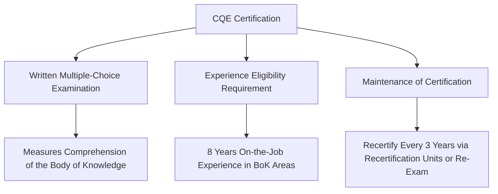
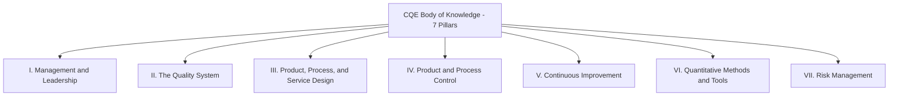

## ASQ Certified Quality Engineer Body of Knowledge Overview

### Overview and Purpose

This item opens the final chapter of this syllabus by connecting the conceptual and practical material covered throughout — Cost of Quality fundamentals, implementation, pitfalls, modern digital applications, and strategic integration — to a recognized professional credentialing pathway: the American Society for Quality's Certified Quality Engineer (CQE) certification. Understanding the CQE Body of Knowledge (BoK) structure serves two purposes for the learner: it provides an externally validated framework confirming that CoQ concepts sit within a broader, professionally recognized quality engineering discipline, and it offers a practical study roadmap for those pursuing formal certification as a career milestone.

### What the CQE Certification Represents

The Certified Quality Engineer is a professional who understands the principles of product and service quality evaluation and control, with the body of knowledge and applied technologies encompassing development and operation of quality control systems, application and analysis of testing and inspection procedures, metrology and statistical methods, human factors, familiarity with quality cost concepts and techniques, and the ability to develop and administer management information systems and audit quality systems for deficiency identification and correction. The explicit inclusion of quality cost concepts directly validates this syllabus's subject matter as core, examinable professional knowledge rather than a peripheral topic. The certification traces back to 1968, when the first ASQ Certified Quality Engineer examination was given to recognize individuals demonstrating proficiency within the quality sciences body of knowledge, and it has since become a marketplace requirement for quality professionals in many industries. [asq](https://asq.org.in/cert/CQE)[6sq](https://www.6sq.net/question/249812)

### Eligibility and Examination Structure

**Key Points**

- Candidates need 8 years of on-the-job experience in one or more of the areas of the Certified Quality Engineer Body of Knowledge, with at least 3 of those years in a "decision-making" position — defined as having the authority to define, execute, or control projects/processes and responsibility for the outcome, which need not be a formal management or supervisory role [asq](https://www.asq.org/cert/quality-engineer)
- Completed education can waive part of the experience requirement: a diploma from a technical or trade school waives one year, an associate degree waives two years, a bachelor's degree waives four years, and a master's or doctorate waives five years [6sq](https://www.6sq.net/article/38892)
- Individuals currently or previously certified by ASQ as a Quality Auditor, Reliability Engineer, Software Quality Engineer, or Quality Manager can apply that qualifying experience toward CQE certification as well [6sq](https://www.6sq.net/article/38892)
- The certification program is accredited by the ANSI National Accreditation Board (ANAB) under the ISO 17024 standard, providing third-party validation of the program's development and maintenance standards — directly relevant to the credibility considerations discussed in the executive-communication item of this syllabus, since a CQE-holder's expertise carries externally validated weight in professional and organizational contexts [asq](https://www.asq.org/cert/quality-engineer)
- All CQEs must participate in the Maintenance of Certification program, recertifying every three years either by accumulating 18 recertification units or by successfully completing the certification examination again, reinforcing the continuous-learning principle that echoes the sustainment chapter's emphasis on ongoing capability development rather than one-time achievement [6sq](https://www.6sq.net/article/38892)

### The Seven-Pillar Structure of the BoK

ASQ organizes the CQE Body of Knowledge into seven "Pillars" (Categories/Topics), with each pillar further broken down into sub-topics, and ASQ assigns both an exam question count and a Bloom's Taxonomy-based cognition level to each topic, indicating whether a candidate must merely "Remember," "Understand," "Apply," or "Analyze/Evaluate" that specific content area. [cqeacademy](https://cqeacademy.com/?p=47)

**Key Points**

- **Pillar I: Management and Leadership** — includes Quality Philosophies and Foundations, covering the Evolution of Quality, which directly encompasses the historical figures (Feigenbaum, Juran, Crosby) discussed throughout this syllabus, particularly in the optimal-quality-cost-curve criticism item; this pillar also typically covers quality system leadership, organizational structures, and — most directly relevant to this syllabus — quality cost concepts and management [cqeacademy](https://cqeacademy.com/?p=47)
- **Pillar II: The Quality System** covers the design, documentation, and implementation of a formal quality management system, directly connecting to the ISO 9001 alignment item covered earlier in this syllabus's strategy chapter, along with the eQMS software platforms discussed in the modern-era chapter
- **Pillar III: Product, Process, and Service Design** addresses design controls, reliability, and design verification/validation — connecting to the Prevention-category emphasis throughout this syllabus and specifically to the digital twin prevention-stage testing item
- **Pillar IV: Product and Process Control** covers measurement systems, statistical process control, and material control — directly relevant to the Appraisal category discussion and the automation's-impact-on-appraisal-costs item
- **Pillar V: Continuous Improvement** covers quality improvement methodologies and tools (including PDCA/PDSA cycles) — directly mirroring the sustainment chapter's core content and the organizational-resistance item's change-management themes
- **Pillar VI: Quantitative Methods and Tools** covers statistical fundamentals, sampling, experimental design, and related quantitative techniques — providing the statistical foundation underlying the ROI and payback calculations discussed in the executive-communication and predictive-quality items
- **Pillar VII: Risk Management** covers risk assessment methodologies (FMEA and related tools) — directly connecting to the ISO 9001 Clause 6 risk-based thinking discussion in the strategy chapter and to the tail-risk modeling discussed in the 1-10-100 Rule limitations item

[Unverified — the specific pillar titles, exact sub-topic breakdown, and question-count allocation per pillar are periodically revised by ASQ following job analysis studies, similar to the update pattern seen in other ASQ certifications; candidates preparing for the actual exam should download and reference ASQ's current official CQE Body of Knowledge document directly, since this overview reflects the general structural pattern rather than a guaranteed current-version outline.]

### Where This Syllabus's Content Maps to the CQE BoK

**Example**

| This Syllabus's Chapter | Primary CQE Pillar Alignment |
| --- | --- |
| Implementing a Cost of Quality Program | Pillar I (Management and Leadership) — quality cost concepts and techniques |
| Common Pitfalls and Criticisms | Pillar I and Pillar VI — critical evaluation of quality cost models and quantitative methods |
| Cost of Quality in the Modern and Digital Era | Pillar III and Pillar IV — design prevention tools, automated process control |
| Integrating Cost of Quality into Business Strategy | Pillar I and Pillar II — leadership integration and quality system alignment |

This mapping illustrates that the CoQ-specific material in this syllabus, while comprehensive on its own subject, represents a meaningful but partial subset of the full CQE Body of Knowledge — candidates pursuing certification should treat this syllabus as reinforcing depth in the quality-cost-specific portions of Pillar I while requiring substantially broader study across the other six pillars, particularly the statistical and quantitative methods content in Pillar VI, which this syllabus has not covered in the depth an exam would require.

### Recommended Study Approach for CQE Candidates

**Key Points**

- **Obtain ASQ's official current Body of Knowledge document directly** before beginning structured study, since this is the authoritative and most current source for exam scope, pillar weighting, and cognition levels — third-party study guides and summaries should supplement, not replace, this primary source
- **Use the ASQ CQE Handbook as an in-exam reference**: the exam is open-book in format, with the official handbook serving as companion reference material permitted during the test itself, making familiarity with its organization (not just its content) a meaningful part of exam preparation
- **Prioritize quantitative methods practice given the exam's applied, scenario-based question style**: third-party practice materials generally emphasize that CQE exam questions test scenario-based and applied understanding rather than pure recall, meaning conceptual familiarity with the material in this syllabus should be paired with practice applying statistical and quantitative tools to realistic engineering scenarios
- **Treat the multi-year experience requirement as an opportunity for genuine on-the-job application**: since the eligibility structure explicitly weights decision-making experience, candidates working through this syllabus's implementation-focused chapters (account setup, dashboard building, executive communication) may find direct professional application of these concepts strengthens both genuine competency and the practical experience basis the certification is designed to validate

### Common Pitfalls in Certification Preparation

- **Relying solely on general quality management knowledge without reviewing the current official BoK document**: Since ASQ periodically updates body-of-knowledge structures following job analysis studies, assuming an older or third-party summary reflects the current exam scope risks preparation misalignment.
- **Underweighting the quantitative methods pillar relative to conceptual/managerial content**: Candidates strong in the strategic and cultural material covered throughout much of this syllabus should ensure proportional preparation time for the statistical and quantitative tool competencies the exam also requires.
- **Treating the open-book exam format as reducing preparation need**: An open-book format tests the ability to efficiently apply and locate reference material under time pressure for applied, scenario-based questions — this is a different and not necessarily lesser preparation challenge than a closed-book, pure-recall exam format.
- **Assuming this syllabus alone provides sufficient exam preparation**: While this syllabus provides substantive depth on Cost of Quality specifically (mapping most directly to portions of Pillar I), it does not comprehensively cover the full seven-pillar scope, particularly detailed statistical methods, reliability engineering, and specific quality tool techniques the exam also requires.

**Related Topics**

- ASQ CQE Quantitative Methods and Statistical Tools Deep Dive
- Comparing ASQ Certifications: CQE, CMQ/OE, CQA, and Six Sigma Belts
- Building a Personal Study Plan Across the Seven CQE Pillars
- Applying On-the-Job CoQ Implementation Experience Toward Certification Eligibility
- Career Pathways in Quality Engineering Beyond Initial Certification