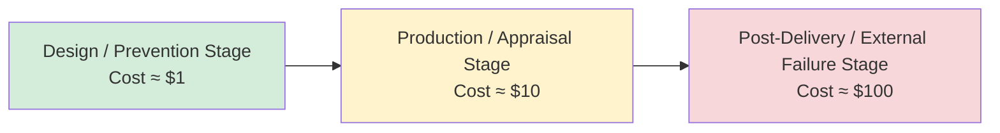

## ASQ Certified Manager of Quality and Organizational Excellence Overview

### Purpose and Scope

The Certified Manager of Quality/Organizational Excellence (CMQ/OE) is an ASQ credential for professionals who lead process-improvement initiatives, manage quality functions, and drive organizational excellence across service and industrial settings. Unlike technically-focused ASQ certifications (e.g., CQE, CSSBB), the CMQ/OE emphasizes managerial and leadership competencies: strategic planning, workforce management, customer/supplier relationships, and organization-wide performance measurement. It sits at the intersection of two pillars covered elsewhere in this curriculum — the **Cost of Quality (CoQ)** framework and the **1-10-100 Rule** — both of which appear directly in the exam's Body of Knowledge (BoK) as tools a quality manager must apply to justify prevention investment and evaluate financial impact of quality decisions.

### Certification Body and Accreditation

- Issued by ASQ (American Society for Quality).

  The program is accredited by the ANSI National Accreditation Board (ANAB) under the ISO 17024 standard, which provides third-party validation that the certification program meets recognized national and international credentialing industry standards. [asq](https://asq.org/cert/manager-of-quality)
- The CMQ/OE evolved from the earlier Certified Quality Manager credential; a Quality Management Division survey of certified quality managers and subject matter experts found that both the Body of Knowledge and the program's scope needed to broaden, leading the ASQ Certification Board to approve the renamed and expanded program. [asq](https://asq.org/cert/manager-of-quality)

### Who Should Pursue This Certification

The target candidate leads and champions process-improvement initiatives across organizations ranging from small businesses to multinational corporations, in service and industrial settings with regional or global focus. Typical responsibilities the certification validates: [asq](https://asq.org/cert/manager-of-quality)

- Facilitating and leading team efforts to establish and monitor customer/supplier relations. [asq](https://asq.org/cert/manager-of-quality)
- Supporting strategic planning and deployment initiatives. [asq](https://asq.org/cert/manager-of-quality)
- Developing measurement systems to determine organizational improvement. [asq](https://asq.org/cert/manager-of-quality)
- Motivating and evaluating staff, managing projects and human resources, analyzing financial situations, determining and evaluating risk, and employing knowledge management tools and techniques to resolve organizational challenges. [asq](https://asq.org/cert/manager-of-quality)

### Eligibility Requirements

| Requirement | Detail |
| --- | --- |
| Work experience | 10 years of on-the-job experience in one or more areas of the CMQ/OE Body of Knowledge. |
| Decision-making experience | 5 of those years must be in a "decision-making" position — defined as having the authority to define, execute, or control projects/processes and being responsible for the outcome, which may or may not include a formal management/supervisory title. |
| Employment type | Candidates must have worked in a full-time, paid role. |
| Cross-credit | Experience used to qualify for ASQ certification as a Quality Auditor, Reliability Engineer, Software Quality Engineer, or Quality Engineer applies toward the CMQ/OE, provided the 10-year minimum is still met. |

**Education waivers** (only one may be claimed):

- Diploma from a technical or trade school — one year waived
- Associate degree — two years waived
- Bachelor's degree — four years waived
- Master's or doctorate — five years waived [asq](https://asq.org/cert/manager-of-quality)

### Exam Format

| Attribute | Computer-Based (CBT) | Paper-Based (PBT) |
| --- | --- | --- |
| Question count | 180 multiple-choice questions (165 scored, 15 unscored) | 165 multiple-choice questions |
| Time | 4 hours 18 minutes exam time; 4.5-hour total appointment | 4 hours |
| Language | English only | English and Mandarin in certain locations |
| Book policy | Open book — all reference materials must be bound and remain bound during the exam | Same |
| Delivery partner | Prometric | Prometric (seating letter, not eligibility email) |

**Fees (as posted on ASQ's site):**

Exam fee: $585; retake fee: $385. ASQ members save $100 on the initial examination fee. [asq](https://asq.org/cert/manager-of-quality)

**Calculator/reference policy:** A basic on-screen scientific calculator is provided in CBT exams; Prometric Test Center Administrators can supply a hand-held basic calculator on request. Any silent, battery-operated calculator with no programmable memory is allowed — programmable models such as the TI-89 are prohibited. Reference material must be bound (stitched, glued, or fastened with penetrating fasteners such as ring binders or spiral binders); hand-stapled or unbound materials are not permitted, and Post-Its are allowed only as book tabs. [asq](https://asq.org/cert/manager-of-quality)[asq](https://asq.org/cert/manager-of-quality)

### Body of Knowledge (BoK) — 2026 Revision

A new CMQ/OE Body of Knowledge takes effect starting with the July 2026 testing window, superseding the 2019 version. The seven main BoK sections remain structurally unchanged from 2019 to 2026, but question-distribution weighting has shifted across sections, and new emphasis areas have been added. [asq](https://asq.org/cert/manager-of-quality)[qualitygurus](https://www.qualitygurus.com/?p=516421)

**New/expanded emphasis areas in the 2026 BoK:**

- Engagement, ethics, compliance, and confidentiality
- Hybrid and virtual work environments
- Artificial intelligence and cybersecurity
- Practical problem-solving tools used in modern organizations [qualitygurus](https://www.qualitygurus.com/?p=516421)

**The seven traditional BoK domains** (structure retained from the 2019 BoK; exact question counts per domain shift under the 2026 revision):

1. Leadership
2. Strategic Plan Development and Deployment
3. Management Elements and Methods
4. Quality Management Tools
5. Customer-Focused Organizations
6. Supply Chain Management
7. Training and Development

[Inference] Precise question-count weighting per domain for the 2026 BoK was not directly retrievable from the fetched source content; the official 2026 BoK PDF and BoK comparison map (linked from ASQ's certification page) contain the authoritative percentage breakdown and should be consulted directly for exam-blueprint precision.

### Cost of Quality (CoQ) and the 1-10-100 Rule Within the CMQ/OE Context

This is the connective tissue between the chapter topic and the broader curriculum context. Within the "Management Elements and Methods" and "Quality Management Tools" domains, a CMQ/OE candidate is expected to:

- **Classify costs** into the four traditional CoQ categories: prevention, appraisal, internal failure, and external failure.
- **Apply the 1-10-100 Rule** — the principle that the cost of correcting a quality problem increases by roughly an order of magnitude at each stage it escapes detection (approximately $1 to prevent at the design/source stage, $10 to correct during production/appraisal, $100 to remediate after it reaches the customer as an external failure).
- **Use CoQ data to build the business case** for prevention-stage investment (training, poka-yoke, design reviews) versus reactive failure costs, translating quality performance into financial language for executive stakeholders — a core managerial competency distinct from the technical-engineer certifications.
- **Report CoQ trends** as part of strategic quality planning and management review, linking cost trends to strategic deployment (Hoshin Kanri-style goal alignment) covered under the Strategic Plan Development and Deployment domain.

$$\text{Total CoQ} = C_{prevention} + C_{appraisal} + C_{internal\ failure} + C_{external\ failure}$$

**1-10-100 Rule (illustrative, order-of-magnitude relationship):**

$$C_{correction}(stage_n) \approx C_{correction}(stage_{n-1}) \times 10$$

### Recertification

[Inference] Standard ASQ recertification (every 3 years via recertification journal/CEUs or retake) applies to CMQ/OE as with other ASQ certifications, though specific point/unit requirements should be confirmed on ASQ's Recertification page, as this was not directly verified in the fetched content.

### Preparation Resources

ASQ offers a CMQ/OE Question Bank with sample exam questions, simulated timed exam mode, and review mode; the CMQ/OE Handbook, a companion guide to the Body of Knowledge that may be used during the open-book exam; and classroom, self-paced online, and virtual certification preparation courses. ASQ's self-paced prep course (aligned to the 2026 BoK) is designed as a comprehensive refresher, opens with a diagnostic pretest to identify strengths and gaps, and closes with a post-test to measure progress. [asq](https://asq.org/cert/manager-of-quality)[asq](https://asq.org/training/spcmqoe2025asq-certified-manager-of-quality-org-excellence-certification-prep)

Third-party prep providers have also updated their materials: at least one Udemy course is explicitly built on the BoK effective July 1, 2026, and another vendor's 780-question practice bank has been realigned to the July 2026 updated Body of Knowledge. [udemy](https://www.udemy.com/course/certified-manager-of-quality-cmqoe-exam-prep-course)[ctgoodjobs](https://www2.ctgoodjobs.hk/Learning/1590816674/udemy/certified-manager-of-quality-training)

### Career Positioning

The CMQ/OE is generally regarded as ASQ's senior-most managerial (as opposed to technical) credential, typically pursued by:

- Quality directors/managers transitioning from technical roles (CQE, CSSBB) into leadership.
- Operations or continuous-improvement leaders responsible for organization-wide quality systems (ISO 9001 program ownership, management review, supplier quality governance).
- Professionals building toward VP of Quality / Chief Quality Officer career tracks, where CoQ reporting and strategic deployment are core deliverables to the executive team.

**Related Topics:**

- The Seven BoK Domains of CMQ/OE (Leadership; Strategic Planning; Management Elements; Quality Tools; Customer Focus; Supply Chain; Training & Development)
- Building a CoQ Reporting Dashboard for Executive Management Review
- ISO 9001 Management Review Requirements and Their Link to CoQ Metrics
- ASQ Certified Six Sigma Black Belt (CSSBB) vs. CMQ/OE — Technical vs. Managerial Career Tracks
- Hoshin Kanri (Strategic Policy Deployment) as a CMQ/OE Exam Topic
- Ethics, Compliance, and Confidentiality Requirements in the 2026 CMQ/OE BoK
- AI and Cybersecurity Considerations in Modern Quality Management (new 2026 BoK emphasis area)