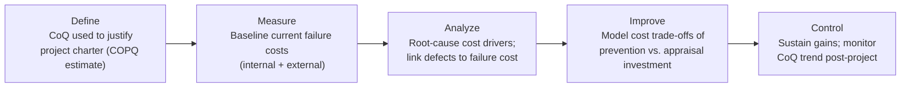

## Six Sigma Green Belt and Black Belt Coverage of Cost of Quality

### Purpose and Scope

This topic maps how the Cost of Quality (CoQ) framework and the 1-10-100 Rule appear across ASQ's Six Sigma Green Belt (CSSGB) and Black Belt (CSSBB) Bodies of Knowledge (BoK). Unlike the CMQ/OE, which treats CoQ as a strategic/managerial reporting tool, the Green Belt and Black Belt BoKs treat CoQ primarily as a **project selection, financial justification, and DMAIC (Define-Measure-Analyze-Improve-Control) driver** — the mechanism by which a Six Sigma practitioner proves a project's value in dollar terms before, during, and after execution.

### Where CoQ Sits in the DMAIC Cycle

### Green Belt (CSSGB) Coverage

The CSSGB BoK treats CoQ at an application/comprehension level — a Green Belt is expected to recognize and use the concept, not necessarily architect an organization-wide CoQ system.

**Key BoK touchpoints:**

- **Cost of Poor Quality (COPQ)** as a category within the Define phase — Green Belts learn to identify and roughly quantify COPQ (scrap, rework, warranty, returns) to build a project's business case.
- **The four CoQ categories** (prevention, appraisal, internal failure, external failure) — Green Belts are expected to classify given costs into the correct bucket, a common exam-item format.
- **Basic financial metrics** tied to CoQ: cost-benefit analysis, payback period, and simple ROI calculations for improvement projects, generally at an application cognitive level rather than a synthesis/evaluation level.
- **Team-level use**, i.e., a Green Belt typically works on projects *identified* by CoQ signals (e.g., high scrap cost, high warranty spend) rather than being responsible for designing the CoQ measurement system itself — that ownership more often sits with a Black Belt or quality manager.

**Typical Green Belt exam framing:** "Which of the following is an example of an internal failure cost?" or "A company spends money on incoming inspection; this is classified as a(n) ___ cost." — recognition and classification-level questions.

### Black Belt (CSSBB) Coverage

The CSSBB BoK extends CoQ into evaluation and synthesis-level competency — a Black Belt is expected to build, defend, and act on CoQ data at the project-portfolio and organizational level.

**Key BoK touchpoints:**

- **Full CoQ model construction**: building a Cost of Quality reporting structure across all four categories, often integrated with the Balanced Scorecard or a broader cost-accounting system.
- **Project selection and prioritization** using CoQ/COPQ data across a portfolio of candidate Six Sigma projects — a Black Belt uses CoQ trend data to rank which processes yield the greatest financial return if improved, tying directly into strategic deployment.
- **The 1-10-100 Rule as a quantitative justification tool** for shifting organizational spend from appraisal/failure toward prevention — Black Belts are expected to model and communicate this escalation to leadership as part of the financial case for Design for Six Sigma (DFSS) or upstream process control investment.
- **Advanced financial analysis**: Net Present Value (NPV), Internal Rate of Return (IRR), and hard-vs-soft savings distinctions when reporting project financial impact to a finance/controller function — a hallmark difference from Green Belt-level coverage.
- **Statistical linkage**: connecting process capability ($C_p$, $C_{pk}$) and defect rate (DPMO, sigma level) directly to failure-cost projections, i.e., translating a shift in sigma level into an expected dollar reduction in CoQ.
- **Change management and communication** of CoQ findings to executive sponsors as part of project closure and control-phase sustainment reporting.

### Comparative Summary

| Dimension | Green Belt (CSSGB) | Black Belt (CSSBB) |
| --- | --- | --- |
| Cognitive level | Recognition / Application | Analysis / Synthesis / Evaluation |
| Primary use of CoQ | Justify and scope individual projects | Build CoQ systems; prioritize project portfolios |
| Financial tools | Basic cost-benefit, simple ROI | NPV, IRR, hard/soft savings, portfolio-level financial modeling |
| 1-10-100 Rule usage | Conceptual awareness | Quantitative modeling and executive communication tool |
| Scope of responsibility | Project-level | Organization/portfolio-level |
| Typical stakeholder interface | Process owner, project team | Finance/controller function, executive sponsors, strategic planning |

### Worked Example: COPQ-Driven Project Selection (Black Belt Level)

A Black Belt evaluating three candidate processes for Six Sigma project selection, using estimated annual CoQ:

| Process | Prevention Cost | Appraisal Cost | Internal Failure | External Failure | Total CoQ |
| --- | --- | --- | --- | --- | --- |
| A | $5,000 | $20,000 | $150,000 | $300,000 | $475,000 |
| B | $10,000 | $40,000 | $60,000 | $50,000 | $160,000 |
| C | $2,000 | $5,000 | $10,000 | $8,000 | $25,000 |

**Analysis:** Process A shows the highest total CoQ and the highest failure-to-prevention ratio ($\frac{\$450{,}000}{\$5{,}000} = 90:1$), consistent with the 1-10-100 Rule's implication that inadequate upstream investment produces disproportionate downstream cost. A Black Belt would prioritize Process A for a Six Sigma project, since improving it offers the largest theoretical CoQ reduction and return on the DMAIC investment.

$$\text{Failure-to-Prevention Ratio} = \frac{C_{internal\ failure} + C_{external\ failure}}{C_{prevention}}$$

### Key Points

- Both belts use the same four-category CoQ taxonomy; the difference is depth of application, not the framework itself.
- Green Belt: CoQ as a *diagnostic and justification tool* for a single project.
- Black Belt: CoQ as a *strategic financial system* for portfolio prioritization and executive communication.
- The 1-10-100 Rule functions as a persuasive/quantitative bridge between technical process improvement and financial decision-making at both levels, but is applied with greater rigor and higher-stakes communication at the Black Belt level.
- [Inference] Exact BoK question-count weighting for CoQ-related items varies by ASQ BoK revision cycle; candidates should consult the current published CSSGB/CSSBB Body of Knowledge documents for precise percentage allocation, as this was not independently re-verified against the latest ASQ BoK PDF for this response.

**Next Steps:**

- DMAIC Define Phase: Building a Project Charter with COPQ Justification
- Hard Savings vs. Soft Savings: Black Belt Financial Reporting Standards
- Linking Process Capability ($C_{pk}$) to Cost of Poor Quality Projections
- Design for Six Sigma (DFSS) as a Prevention-Stage Investment Strategy
- Balanced Scorecard Integration with Organizational CoQ Reporting
- ASQ CSSBB vs. CMQ/OE: Technical Depth vs. Managerial Breadth in CoQ Ownership