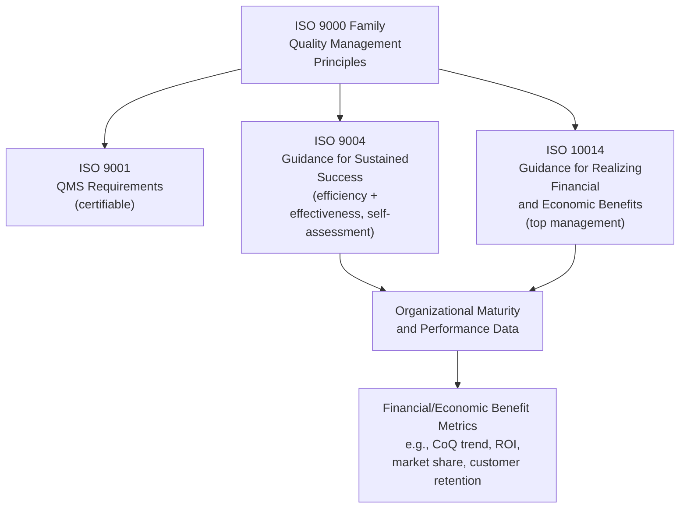

## ISO 9004 and ISO 10014 Guidance on Economic Benefits of Quality

### Purpose and Scope

This topic covers two complementary, non-certifiable ISO guidance documents that formalize the link between quality management and financial performance: **ISO 9004** (performance improvement/sustained success) and **ISO 10014** (financial and economic benefits realization). Neither standard is used for third-party certification like ISO 9001 — both are guidance documents intended to help organizations, particularly top management, translate quality management principles into measurable economic outcomes, directly complementing the Cost of Quality (CoQ) and 1-10-100 Rule frameworks covered elsewhere in this curriculum.

### ISO 9004 — Quality Management for the Sustained Success of an Organization

**Current edition:** ISO 9004:2018, titled "Quality management — Quality of an organization — Guidance to achieve sustained success."

**Position relative to ISO 9001:**

- ISO 9001 specifies *requirements* for a quality management system and is used for certification/audit purposes.
- ISO 9004 provides *guidance* (non-certifiable) for organizations that want to go beyond ISO 9001 compliance toward broader organizational excellence and long-term, sustained success — encompassing efficiency as well as effectiveness.
- ISO 9004 introduces a **self-assessment tool** that allows an organization to evaluate its maturity level across key elements (leadership, strategy, resources, processes, monitoring, improvement, learning, and innovation) on a five-level maturity scale, from a reactive approach up to "best-in-class" performance.

**Relevance to economic benefits and CoQ:**

- ISO 9004 frames quality performance as a driver of organizational *efficiency* (cost, resource use) in addition to *effectiveness* (meeting customer/stakeholder requirements) — directly paralleling the CoQ logic that quality investment reduces waste and failure cost while improving value delivered.
- It emphasizes monitoring, measurement, analysis, and review of organizational performance data — the same data infrastructure that feeds a CoQ reporting system.
- It positions quality management as a strategic, board-level concern rather than a compliance function, echoing the CMQ/OE's strategic-deployment emphasis.

### ISO 10014 — Guidance for Realizing Financial and Economic Benefits

**Current edition:** ISO 10014:2021, titled "Quality management systems — Managing an organization for quality results — Guidance for realizing financial and economic benefits." It supersedes the ISO 10014:2006 edition.

**Scope (as defined by the standard):**

This document gives guidelines for realizing financial and economic benefits by applying a top-down structured approach to achieving financial and economic benefits, using the quality management principles and QMS described in the ISO 9000 family to monitor and manage trends in key performance metrics and take improvement action based on the observed metrics. It is directed specifically to the top management of an organization and is applicable to any organization regardless of sector, business model, revenue, size, or complexity.

**Relationship to ISO 9001 and ISO 9004:**

ISO 10014:2021 explicitly complements ISO 9001:2015 and ISO 9004:2018 for performance improvements, providing examples of achievable benefits from applying the concepts in those standards and identifying practical management methods and tools to help realize those benefits.

**Structural approach:**

ISO 10014 is built around the seven quality management principles (as codified in ISO 9000:2015) — customer focus, leadership, engagement of people, process approach, improvement, evidence-based decision making, and relationship management — and provides, for each principle, guidance on:

1. Key inputs (organizational context, strategic objectives)
2. Activities top management can take to apply the principle
3. Financial and economic outputs/benefits expected from doing so

### Linking ISO 9004/10014 to CoQ and the 1-10-100 Rule

- Both standards provide the **governance and reporting scaffolding** that makes formal CoQ tracking meaningful at the top-management level: ISO 9004's maturity self-assessment identifies where an organization sits on the reactive-to-best-in-class spectrum, while ISO 10014 provides the method for translating quality-principle activity into financial metrics leadership can act on.
- The 1-10-100 Rule's core argument — that prevention-stage investment is dramatically cheaper than downstream failure cost — is precisely the kind of "financial and economic benefit" ISO 10014 is designed to help an organization quantify and communicate at the top-management level, even though ISO 10014 does not name the 1-10-100 Rule explicitly as a named tool.
- Where CoQ (as taught in Six Sigma and CMQ/OE contexts) is a **measurement framework**, ISO 9004 and ISO 10014 are **governance/guidance frameworks** — they tell top management *how* to structure the organization and its decision processes so that CoQ-type data actually drives strategic action rather than sitting in a static report.

### Comparative Summary

| Standard | Type | Primary Audience | Core Contribution | Certifiable? |
| --- | --- | --- | --- | --- |
| ISO 9001:2015 | Requirements | QMS implementers, auditors | Baseline QMS requirements | Yes |
| ISO 9004:2018 | Guidance | Top management, quality leaders | Sustained success via efficiency + effectiveness; maturity self-assessment | No |
| ISO 10014:2021 | Guidance | Top management specifically | Structured method to realize and report financial/economic benefits from QMS principles | No |

### Key Points

- ISO 9004:2018 is guidance-only, is not used for certification, and introduces a five-level maturity self-assessment model spanning leadership, strategy, resources, processes, monitoring, improvement, learning, and innovation.
- ISO 10014:2021 replaced the 2006 edition and explicitly states it complements ISO 9001:2015 and ISO 9004:2018 for performance improvement, providing benefit examples and practical management tools.
- ISO 10014 is structured around the seven ISO 9000 quality management principles and is aimed specifically at top management, not quality department practitioners alone.
- Neither standard names "Cost of Quality" or the "1-10-100 Rule" as defined terms, but both provide the governance and financial-translation scaffolding that CoQ-based project justification (as used in Six Sigma and CMQ/OE practice) depends on. [Inference] This connective framing is a synthesis drawn from the stated scope/purpose of both standards rather than an explicit cross-reference published within ISO 10014's own text; readers building formal audit or certification documentation should consult the full standard text (purchased from ISO or a national standards body) rather than this summary.
- [Unverified] The specific five maturity levels and detailed self-assessment scoring criteria in ISO 9004:2018 are described in general terms here; exact wording and scoring rubrics should be confirmed against the purchased standard text, as full-text access was not available for direct verification in this response.

**Related Topics:**

- ISO 9000:2015 — The Seven Quality Management Principles in Depth
- Building a Top-Management CoQ Dashboard Aligned to ISO 10014's Structured Approach
- ISO 9004 Maturity Self-Assessment: Conducting an Organizational Gap Analysis
- Sustained Success vs. Certification Compliance: ISO 9004 vs. ISO 9001 Objectives
- Translating Quality Principles into Financial Language for the C-Suite
- Balanced Scorecard and ISO 10014: Complementary Reporting Frameworks