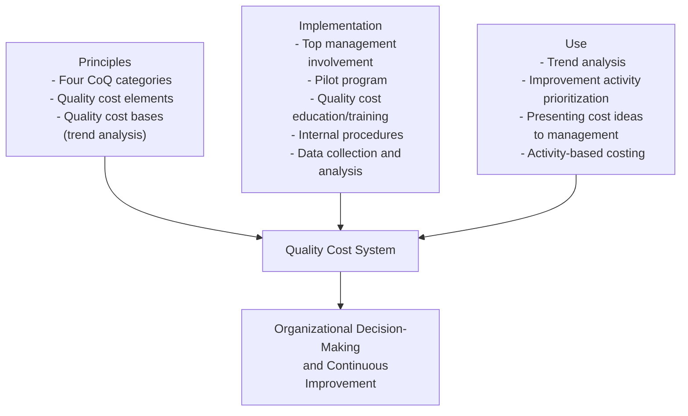

## Campanella's Principles of Quality Costs Reference Framework

### Purpose and Scope

*Principles of Quality Costs: Principles, Implementation, and Use*, edited by Jack Campanella under ASQ's Quality Costs Committee (Quality Management Division), is the field's most widely cited reference text for building, implementing, and using a formal Cost of Quality (CoQ) system. It functions as the practitioner-level companion to the theoretical CoQ frameworks taught in CMQ/OE and Six Sigma curricula — moving from "what CoQ is" to "how to actually build a quality cost system inside a real organization."

### Editions and Publication History

| Edition | Year | Publisher | Notable Additions |
| --- | --- | --- | --- |
| 1st edition | 1983 (approx.) | ASQC Quality Press | Foundational CoQ categories and implementation guidance |
| 2nd edition | 1990 | ASQC Quality Press | Expanded case studies |
| 3rd edition | 1999 | ASQ Quality Press | Expanded coverage of service industries (education, banking, software development), small-business quality cost systems, activity-based costing, team-based problem-solving, customer satisfaction linkage, defense-industry costs, the Taguchi Quality Loss Function, and supplier quality costs. Over 50 illustrations. |
| 4th edition | Later revision | ASQ Quality Press | An updated perspective building on the 3rd edition, incorporating revised ISO 9000 material, an expanded software cost-of-quality section, activity-based costing updates, and updated automotive-standards material, credited to multiple ASQ Quality Management Division contributors alongside Campanella's original framework. |

Jack Campanella, an ASQ Fellow with a long tenure on the Corporate Quality and Reliability staff at Underwriters Laboratories, chaired ASQ's Quality Management Division Quality Costs Committee and served as Chairman of the Advisory Committee for the *Quality Engineering* journal.

### Core Framework Structure

The book's reference framework is organized around three functional pillars, consistently reflected across editions and in derivative university course syllabi built on it:

### 1. Principles — The Classification System

Campanella's framework formalizes the same four-category CoQ taxonomy used across ASQ certifications, but adds a rigorous **quality cost elements** layer beneath each category — granular, auditable cost line items an organization can actually track in its accounting system, rather than the abstract category labels alone.

| Category | Definition | Representative Elements |
| --- | --- | --- |
| Prevention | Costs incurred to keep failures and appraisal costs to a minimum | Quality planning, training, process control, supplier quality assurance |
| Appraisal | Costs of determining the degree of conformance to quality requirements | Incoming inspection, in-process inspection, final inspection, test equipment calibration |
| Internal Failure | Costs from nonconformances found before delivery to the customer | Scrap, rework, re-inspection, downgrading |
| External Failure | Costs from nonconformances found after delivery to the customer | Warranty claims, complaint adjustment, returned product, liability costs |

The framework also introduces **quality cost bases** — the denominators against which raw CoQ dollars are normalized for trend analysis (e.g., CoQ as a percentage of sales, of direct labor cost, or of manufacturing cost), enabling meaningful comparison across time periods and business units of different sizes.

**A process-approach extension** in later course adaptations of the framework incorporates the Turtle diagram methodology to map process inputs/outputs against conformity and nonconformity costs, integrating the CoQ system with an organization's broader ISO 9001-based process architecture.

### 2. Implementation — The Practitioner Roadmap

Campanella's implementation sequence, widely adopted in university and corporate training syllabi based on the book, follows this order:

1. **Secure top management involvement** — without executive sponsorship, a CoQ system lacks the authority to drive cross-departmental data collection and improvement action.
2. **Run a pilot program** — validate data collection methodology and cost element definitions in a limited scope before organization-wide rollout.
3. **Provide quality cost education/training** — ensure finance, operations, and quality personnel share a common understanding of cost category definitions to avoid misclassification.
4. **Establish an internal quality cost procedure** — a documented, repeatable method for identifying, capturing, and categorizing cost data (often integrated with existing cost-accounting systems).
5. **Collect and analyze quality cost data** — ongoing measurement feeding trend reports back to management.

### 3. Use — Turning Data into Action

The "use" pillar covers:

- **Trend analysis** — tracking CoQ as a percentage of a chosen base over time to detect whether prevention investment is reducing failure costs, directly operationalizing the 1-10-100 Rule's underlying claim.
- **Activity-based costing (ABC)** — a refinement, expanded significantly in the 4th edition, that allocates quality costs based on actual activities consumed rather than broad overhead allocation, improving the accuracy of quality cost attribution.
- **Presenting quality cost ideas to management** — Campanella's framework explicitly treats communication and persuasion as a distinct implementation skill, recognizing that a technically sound CoQ system fails if it cannot secure continued management buy-in.
- **The Taguchi Quality Loss Function (QLF)** as a complementary concept — quantifying the cost of any deviation from a target value (not just costs from exceeding specification limits), extending the classical four-category model into a continuous-loss view of quality cost.

$$L(y) = k(y - T)^2$$

Where $L(y)$ is the loss associated with a deviation from the target, $y$ is the measured value, $T$ is the target value, and $k$ is a cost coefficient — illustrating how Campanella's framework incorporates Taguchi's view that quality loss begins at any deviation from target, not only at the point of specification-limit failure.

### Relevance to This Curriculum

- Campanella's book is the primary literature reference underlying the CoQ content tested in ASQ's CMQ/OE and CQE Bodies of Knowledge, and is commonly cited in Six Sigma Black Belt training materials covering CoQ-driven project justification.
- It supplies the **implementation mechanics** (pilot programs, training, data collection procedures) that the more strategic/managerial CMQ/OE BoK and the more financially-analytical CSSBB BoK both assume already exist inside a functioning organization.
- Its quality-cost-elements taxonomy is the practical bridge between the abstract 1-10-100 Rule concept and an auditable general-ledger-level cost accounting implementation.

### Key Points

- Campanella's framework is organized around Principles (classification), Implementation (rollout method), and Use (analysis and communication).
- The four CoQ categories are broken into granular, trackable **quality cost elements**, and normalized via **quality cost bases** for trend analysis.
- The 4th edition significantly expanded activity-based costing guidance and software/service-industry CoQ coverage beyond the 3rd edition's scope.
- The Taguchi Quality Loss Function is incorporated as a complementary continuous-loss model alongside the traditional four-category discrete classification.
- [Unverified] Exact page-level content, chapter numbering, and specific case-study details vary by edition and were not independently re-verified against full source text in this response; readers should consult the specific edition referenced by their certification body or coursework, as ASQ BoKs may cite a particular edition.

**Related Topics:**

- Building an Internal Quality Cost Procedure: Data Collection and Categorization
- Activity-Based Costing (ABC) Applied to Quality Cost Systems
- The Taguchi Quality Loss Function vs. Traditional Four-Category CoQ Models
- Quality Cost Bases: Choosing the Right Normalization Denominator for Trend Analysis
- Presenting Cost of Quality Data to Executive Management: Communication Strategies
- Turtle Diagrams and the Process Approach to Quality Cost Classification