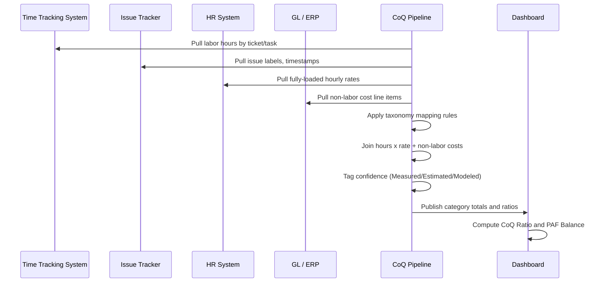

## Building a Cost of Quality Model for a Real Organization


### Overview

A Cost of Quality (CoQ) model is a financial instrumentation layer laid over an organization's existing processes. It does not require new software by default — it requires a taxonomy, a data-collection protocol, and a reporting cadence that convert scattered evidence of rework, defects, and inspection effort into a single comparable currency: money. Building one for a real organization is fundamentally a change-management and data-engineering exercise, not a pure accounting one.

The end deliverable is typically:

1. A cost taxonomy (Prevention, Appraisal, Internal Failure, External Failure)
2. A mapped set of data sources per category
3. A collection and normalization pipeline
4. A reporting model (dashboards, ratios, trend lines)
5. A governance process that keeps the model alive after the initial build

---

### Why Organizations Struggle to Build This

**Key Points**

- Failure costs are usually the easiest to find (defect tickets, warranty claims, returns) and the most likely to already exist in some system.
- Prevention costs are the hardest to find because they are embedded inside salaries, training budgets, and tooling licenses rather than tracked as discrete line items.
- Appraisal costs sit in between — testing time and audit hours are trackable but rarely tagged as "quality cost" in existing timesheets or ERPs.
- Most organizations have the data to build a rough model already; the barrier is almost always taxonomy and attribution, not data availability.

---

### Step 1: Define Scope and Boundary

Before touching data, define:

- **Unit of analysis** — a product line, a department, a project, or the whole organization. Wider scope means more approximation.
- **Time horizon** — monthly is standard for operational tracking; quarterly for board-level reporting.
- **Cost boundary** — decide whether to include opportunity costs (e.g., lost future sales from reputational damage) or restrict to direct, bookable costs only. Most first-generation models restrict to direct costs to keep the model auditable.
- **Currency and cost basis** — fully loaded labor cost (salary + benefits + overhead) vs. raw salary. Fully loaded is more accurate but harder to source from finance.

[Inference] Organizations building their first CoQ model generally underestimate scope-definition time; in practice this phase often consumes 20–30% of total project effort because it forces cross-departmental agreement on definitions that were previously implicit.

---

### Step 2: Build the Cost Taxonomy

Map the four PAF (Prevention-Appraisal-Failure) categories to categories that already exist in the organization's chart of accounts, ticketing system, and time-tracking tool.

| CoQ Category | Typical Real-World Data Sources |
| --- | --- |
| Prevention | Training budget lines, quality engineering salaries, process/tooling investment, design review time, supplier quality audits |
| Appraisal | QA/test engineer time, inspection labor, calibration costs, code review time, compliance audit fees |
| Internal Failure | Bug-fix engineering time (pre-release), scrap/rework material costs, retest cycles, failed deployment rollbacks |
| External Failure | Support tickets tied to defects, refunds, warranty claims, SLA penalty payments, incident response labor, churn attributable to quality issues |

Each row needs a **mapping rule** — an explicit, written definition of what counts. Example mapping rule for a software organization:

> "Internal Failure = any engineering hours logged against a ticket labeled `bug` where the ticket was created before the release the code shipped in. Hours logged against `bug` tickets discovered post-release are External Failure."

This precision matters because ambiguous rules produce inconsistent classification across teams, which silently corrupts the trend data the model exists to produce.

---

### Step 3: Identify and Instrument Data Sources

For each taxonomy row, identify the system of record and the extraction method.

**Example — Software/civic-tech organization data source map:**

- Time tracking (Jira/Tempo, Harvest, or internal timesheets) → labor allocation to Prevention/Appraisal/Internal Failure
- Issue tracker labels and creation/resolution timestamps → failure classification and cycle time
- Finance/ERP general ledger → training spend, tooling licenses, audit fees
- Support desk (Zendesk, Freshdesk, or a ticketing module) → External Failure volume and resolution cost
- HR system → fully loaded labor rates per role, for converting hours into currency

**Practical Example**

A department wants to cost "Internal Failure" for Q3. The pipeline:

```plaintext
1. Pull all Jira issues labeled `bug`, filtered to created_date < release_date
2. Sum logged hours per issue from Tempo worklogs
3. Join against HR fully-loaded hourly rate by assignee role
4. cost = Σ (hours_i × rate_i) for all i in filtered issue set
5. Add scrap/rework non-labor costs pulled from ERP GL account 6210 ("Rework Materials")
6. Output: Internal Failure cost, Q3, Department X
```

This same five-step pattern (filter → aggregate hours → join rate → sum → add non-labor cost) repeats across all four categories with different filters and GL accounts.

---

### Step 4: Handle Missing or Poor-Quality Data

Real organizations rarely have clean, pre-tagged CoQ data on day one. Standard mitigation techniques:

- **Sampling and extrapolation** — if only one team tags time accurately, measure their CoQ ratio and extrapolate proportionally to similar teams, flagged explicitly as an estimate.
- **Retrospective tagging** — have team leads retroactively classify the last 1–2 months of tickets/time entries to seed a baseline, accepting the imprecision of memory-based classification.
- **Proxy metrics** — where direct cost data doesn't exist, use a defensible proxy (e.g., average support ticket handling time × ticket volume, instead of exact per-ticket costing).
- **Confidence tiers** — label each cost line as Measured, Estimated, or Modeled, so the report doesn't imply false precision.

[Unverified] Whether a given proxy metric is accurate enough for a specific organization's decision-making needs depends on that organization's cost structure and cannot be generalized; each proxy should be validated against a small sample of ground-truth data before being trusted at scale.

---

### Step 5: Build the Reporting Model

**Core Ratios**

$$\text{CoQ Ratio} = \frac{\text{Total CoQ}}{\text{Revenue (or Operating Budget)}} \times 100$$


$$\text{PAF Balance} = \frac{\text{Prevention} + \text{Appraisal}}{\text{Internal Failure} + \text{External Failure}}$$

A PAF Balance below 1 generally indicates the organization is spending more reactively (fixing failures) than proactively (preventing them) — the classic signature of a quality program that needs investment redirected upstream, consistent with the 1-10-100 Rule's cost-escalation logic.

**Example Dashboard Structure (described, not rendered as UI):**

- Top-line: Total CoQ, CoQ Ratio, trend vs. prior period
- Category breakdown: stacked bar of Prevention/Appraisal/Internal/External per month
- Drill-down: cost by team, by product line, by defect type
- Confidence indicator: % of underlying cost data that is Measured vs. Estimated

---

### Step 6: Governance and Sustainability

A CoQ model that isn't maintained decays within one or two reporting cycles. Sustaining it requires:

- **A named owner** (often Quality, Finance, or Engineering Operations) accountable for data freshness
- **A recurring cadence** — monthly extraction, quarterly executive review
- **A change log** — when taxonomy mapping rules change, historical data must be re-baselined or clearly annotated as non-comparable pre/post-change
- **Feedback loop into budgeting** — the model's real value is realized only when Prevention/Appraisal budget requests are justified using the Internal/External Failure trend it produces

---

### Process Flow (svg_diagram)

<svg xmlns="http://www.w3.org/2000/svg" viewBox="0 0 900 560" font-family="sans-serif">
<text x="450" y="30" text-anchor="middle" font-size="18" font-weight="bold">CoQ Model Build Process (svg_diagram)</text>

<rect x="40" y="60" width="180" height="70" rx="8" fill="#e8f0fe" stroke="#4285f4" stroke-width="2" />
<text x="130" y="90" text-anchor="middle" font-size="13" font-weight="bold">1. Scope &amp;</text>
<text x="130" y="108" text-anchor="middle" font-size="13" font-weight="bold">Boundary</text>
<rect x="260" y="60" width="180" height="70" rx="8" fill="#e8f0fe" stroke="#4285f4" stroke-width="2" />
<text x="350" y="90" text-anchor="middle" font-size="13" font-weight="bold">2. Cost</text>
<text x="350" y="108" text-anchor="middle" font-size="13" font-weight="bold">Taxonomy</text>
<rect x="480" y="60" width="180" height="70" rx="8" fill="#e8f0fe" stroke="#4285f4" stroke-width="2" />
<text x="570" y="90" text-anchor="middle" font-size="13" font-weight="bold">3. Data Source</text>
<text x="570" y="108" text-anchor="middle" font-size="13" font-weight="bold">Mapping</text>
<rect x="700" y="60" width="160" height="70" rx="8" fill="#e8f0fe" stroke="#4285f4" stroke-width="2" />
<text x="780" y="90" text-anchor="middle" font-size="13" font-weight="bold">4. Handle</text>
<text x="780" y="108" text-anchor="middle" font-size="13" font-weight="bold">Data Gaps</text>
<rect x="480" y="200" width="180" height="70" rx="8" fill="#fef7e0" stroke="#f9a825" stroke-width="2" />
<text x="570" y="230" text-anchor="middle" font-size="13" font-weight="bold">5. Reporting</text>
<text x="570" y="248" text-anchor="middle" font-size="13" font-weight="bold">Model / Ratios</text>
<rect x="260" y="200" width="180" height="70" rx="8" fill="#fef7e0" stroke="#f9a825" stroke-width="2" />
<text x="350" y="230" text-anchor="middle" font-size="13" font-weight="bold">6. Governance</text>
<text x="350" y="248" text-anchor="middle" font-size="13" font-weight="bold">&amp; Ownership</text>
<rect x="40" y="340" width="820" height="80" rx="8" fill="#e6f4ea" stroke="#34a853" stroke-width="2" />
<text x="450" y="370" text-anchor="middle" font-size="14" font-weight="bold">Feedback Loop: Failure trend data justifies</text>
<text x="450" y="390" text-anchor="middle" font-size="14" font-weight="bold">Prevention / Appraisal budget requests</text>

<line x1="220" y1="95" x2="255" y2="95" stroke="#555" stroke-width="2" marker-end="url(#arrow)" />
<line x1="440" y1="95" x2="475" y2="95" stroke="#555" stroke-width="2" marker-end="url(#arrow)" />
<line x1="660" y1="95" x2="695" y2="95" stroke="#555" stroke-width="2" marker-end="url(#arrow)" />
<line x1="780" y1="130" x2="780" y2="165" stroke="#555" stroke-width="2" />
<line x1="780" y1="165" x2="570" y2="165" stroke="#555" stroke-width="2" />
<line x1="570" y1="165" x2="570" y2="195" stroke="#555" stroke-width="2" marker-end="url(#arrow)" />
<line x1="480" y1="235" x2="445" y2="235" stroke="#555" stroke-width="2" marker-end="url(#arrow)" />
<line x1="350" y1="270" x2="350" y2="335" stroke="#555" stroke-width="2" marker-end="url(#arrow)" />
<line x1="570" y1="270" x2="570" y2="335" stroke="#555" stroke-width="2" marker-end="url(#arrow)" />
<line x1="130" y1="340" x2="130" y2="145" stroke="#34a853" stroke-width="2" stroke-dasharray="6,4" />
<line x1="130" y1="145" x2="130" y2="135" stroke="#34a853" stroke-width="2" marker-end="url(#arrow)" />
<text x="150" y="240" font-size="11" fill="#34a853" font-style="italic">informs next</text>
<text x="150" y="253" font-size="11" fill="#34a853" font-style="italic">cycle's scope</text>
</svg>

---

### Data Pipeline Sequence



---

### Common Pitfalls

- **Double-counting** — a defect fixed pre-release but re-opened post-release can be counted in both Internal and External Failure if mapping rules aren't mutually exclusive.
- **Survivorship bias in tagging** — only well-organized teams tag tickets consistently, which skews early models toward showing those teams as "worse" simply because their failures are visible while others' are not.
- **Treating the first model as final** — taxonomy and mapping rules should be expected to iterate for at least 2–3 reporting cycles before stabilizing.
- **Ignoring fully loaded cost** — using raw salary instead of fully loaded cost (including overhead) systematically understates true CoQ, sometimes by 30–50%. [Inference] The exact understatement magnitude depends on an organization's specific overhead structure and benefits ratio.

---

### Worked Example: Civic/Government Software Context

For an organization like a local government unit's document management system team:

- **Prevention**: hours spent on requirements review with the records office before development; automated test suite maintenance; staff training on the data schema
- **Appraisal**: manual QA testing before each release; security/compliance review cycles (relevant given government data handling requirements)
- **Internal Failure**: bugs caught in staging or UAT before deployment, rework on rejected pull requests
- **External Failure**: production incidents affecting live document retrieval, citizen-facing downtime, support tickets from records office staff post-deployment, any SLA or compliance penalty tied to data loss or downtime

Because government software often has compliance-driven Appraisal costs (mandated audits, accessibility reviews) that are non-negotiable overhead rather than discretionary spend, the PAF Balance interpretation should separate mandatory Appraisal costs from discretionary Prevention investment when presenting the ratio to non-technical stakeholders — otherwise the "quality is proactive vs. reactive" narrative gets muddied by compliance costs that exist regardless of internal failure rates.

---

**Next Steps**

- Statistical Process Control (SPC) charts for tracking CoQ ratio stability over time
- Activity-Based Costing (ABC) as an alternative/complementary costing methodology for Appraisal and Prevention allocation
- Building executive-level CoQ dashboards and communicating quality ROI to non-technical stakeholders
- Integrating CoQ tracking into Agile/Scrum ceremonies (e.g., tagging failure cost at sprint retrospectives)
- Benchmarking CoQ ratios against industry standards (typical mature CoQ ratios by sector)
- Extending the model to supplier/vendor-caused failure costs (Category: External Failure — Supplier)