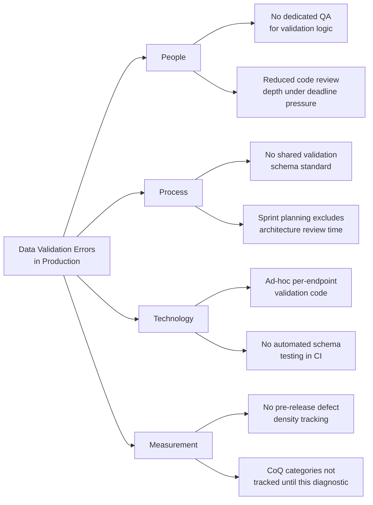

## Capstone Case Study: Diagnosing and Reducing Cost of Poor Quality


### Case Setup

This capstone synthesizes the full CoQ toolchain — taxonomy, 1-10-100 escalation logic, root cause analysis, and PAF rebalancing — into a single end-to-end diagnostic exercise. The scenario is a composite, representative pattern rather than a specific real company, constructed to exercise every technique covered in this track.

**Organization Profile**

A mid-sized software delivery team (e.g., a civic-tech or enterprise SaaS team) ships a document/records management platform. Over three quarters, customer complaints and support load have risen, and engineering is spending an increasing share of sprint capacity on hotfixes rather than new features. Leadership commissions a CoQ diagnostic to determine whether quality investment is misallocated.

---

### Phase 1: Data Collection and Taxonomy Mapping

**Key Points**

- The diagnostic begins by instrumenting the four PAF categories against existing systems (issue tracker, time tracking, support desk, GL), following the mapping-rule discipline established in the CoQ model-building process.
- Three quarters of historical data are retroactively tagged using issue-creation timestamps relative to release dates to classify Internal vs. External Failure.

**Collected Data (Quarterly Summary)**

| Category | Q1 | Q2 | Q3 |
| --- | --- | --- | --- |
| Prevention | $18,000 | $14,000 | $9,000 |
| Appraisal | $42,000 | $38,000 | $31,000 |
| Internal Failure | $55,000 | $71,000 | $96,000 |
| External Failure | $30,000 | $68,000 | $142,000 |
| **Total CoQ** | $145,000 | $191,000 | $278,000 |

$$\text{PAF Balance}_{Q1} = \frac{18000 + 42000}{55000 + 30000} = \frac{60000}{85000} \approx 0.71$$


$$\text{PAF Balance}_{Q3} = \frac{9000 + 31000}{96000 + 142000} = \frac{40000}{238000} \approx 0.17$$

The PAF Balance collapsing from 0.71 to 0.17 across three quarters is the single most important diagnostic signal in this case: the organization has been steadily disinvesting from Prevention and Appraisal while Failure costs compound. This is the 1-10-100 Rule manifesting at the organizational level — defects not caught early (low Prevention/Appraisal) are being caught late, at 10x–100x the cost, in production.

---

### Phase 2: Root Cause Diagnosis

**Symptom Triage**

Before attributing cause, the External Failure spike is decomposed by defect type, using the issue tracker's labels and support ticket categories.

| Defect Category | % of External Failure Cost (Q3) |
| --- | --- |
| Data validation / input errors | 41% |
| Permission/access control bugs | 27% |
| Performance/timeout issues under load | 19% |
| UI/workflow confusion (non-bug) | 13% |

The dominant category (data validation errors, 41%) becomes the focus of a deeper root cause pass.

**5 Whys Applied to the Dominant Failure Mode**

```plaintext
Problem: Data validation errors are the leading cause of production incidents (41% of External Failure cost)

Why 1: Why are invalid records reaching production?
→ Input validation is inconsistent across API endpoints

Why 2: Why is validation inconsistent?
→ Each endpoint implements its own ad-hoc validation logic instead of a shared schema

Why 3: Why is there no shared validation schema?
→ No architectural standard was established when the API surface was first built

Why 4: Why was no standard established?
→ The original delivery timeline had no allocated time for cross-cutting design review (a Prevention activity)

Why 5: Why was Prevention time not allocated?
→ Sprint planning has consistently deprioritized non-feature work as release pressure increased over three quarters

Root Cause: Sustained deprioritization of Prevention-category work (design/architecture review) in sprint planning, driven by release-pressure trade-offs
```

**Fishbone (Ishikawa) Categories for Corroboration**



The fishbone corroborates the 5 Whys: the Process branch (no shared validation standard, no architecture review time) is the structural root cause, with Technology (no automated schema testing) as the mechanism that let it reach production undetected, and Measurement (no prior CoQ tracking) explaining why the trend went unnoticed for three quarters.

---

### Phase 3: Intervention Design

**Key Points**

- Interventions target the root cause (Process/Prevention gap), not just the symptom (patching individual validation bugs).
- Each intervention is mapped explicitly to a PAF category shift, since the goal is to move cost upstream, not merely reduce total cost in the short term.

| Intervention | PAF Category Invested | Rationale |
| --- | --- | --- |
| Adopt shared schema validation library (e.g., JSON Schema or a typed validation layer) across all API endpoints | Prevention | Eliminates root cause: ad-hoc per-endpoint logic |
| Add automated schema/contract testing to CI pipeline | Appraisal | Catches violations before merge, shifting detection left |
| Reinstate architecture/design review as a mandatory sprint ceremony | Prevention | Restores the process step removed under release pressure |
| Define defect density and escaped-defect tracking as a sprint metric | Appraisal | Creates the measurement feedback loop that was missing |
| Time-box a "failure backlog burn-down" sprint to retire the worst-offending legacy endpoints | Internal Failure (short-term) | Deliberate short-term Internal Failure spend to prevent continued External Failure bleed |

[Inference] The failure backlog burn-down is expected to produce a temporary uptick in Internal Failure cost before External Failure begins declining, since rework is being pulled forward from production into pre-release; this pattern is consistent with 1-10-100 dynamics but the exact magnitude and timing will vary by codebase size and team capacity.

---

### Phase 4: Projected Outcome Model

Using the 1-10-100 Rule as a first-order estimating tool: if the shared validation layer and CI contract testing catch the 41% data-validation defect class at the Appraisal stage instead of in production, and Appraisal-stage cost per defect is roughly 1/10th of External Failure cost per defect (per the 1-10-100 relative cost curve), the projected Q4 impact is estimated as:

$$\text{Projected External Failure Reduction} \approx 0.41 \times \$142{,}000 \times 0.9 \approx \$52{,}400$$

This is a **modeled**, not measured, projection — it assumes the 1-10-100 cost ratio holds approximately for this defect class and that CI contract testing catches the majority of instances before release. Actual results should be re-measured in the following quarter's CoQ cycle rather than assumed.

**Projected PAF Trajectory**

```mermaid
xychart-beta
    title "Projected CoQ Category Trend (Q1-Q4)"
    x-axis [Q1, Q2, Q3, Q4-Projected]
    y-axis "Cost (USD Thousands)" 0 --> 300
    bar [18, 14, 9, 22]
    bar [42, 38, 31, 46]
    bar [55, 71, 96, 78]
    bar [30, 68, 142, 90]
```



*(Series order: Prevention, Appraisal, Internal Failure, External Failure)*

The projection shows Prevention and Appraisal investment rising in Q4 (reversing the three-quarter decline), Internal Failure rising modestly (the backlog burn-down effect), and External Failure declining materially — the intended reshaping of the PAF Balance from 0.17 back toward a healthier ratio.

---

### Phase 5: Governance to Prevent Recurrence

**Example**

To prevent the same disinvestment cycle (Prevention/Appraisal quietly deprioritized under deadline pressure) from recurring:

- CoQ ratio and PAF Balance are added as a standing quarterly business review metric, not a one-time diagnostic
- A **floor threshold** is set: if Prevention + Appraisal spend as a % of total CoQ drops below an agreed minimum (e.g., 30%) for two consecutive months, it triggers an automatic review rather than waiting for failure costs to visibly spike
- Architecture/design review time is protected as a non-negotiable sprint ceremony, with an explicit owner accountable for enforcing it against release-pressure trade-offs

[Unverified] The specific 30% floor threshold used here is illustrative; the appropriate threshold for a given organization depends on its industry, defect tolerance, and existing baseline PAF ratio, and should be calibrated from that organization's own historical data rather than adopted as a universal standard.

---

### Diagnostic Workflow Summary (svg_diagram)

<svg xmlns="http://www.w3.org/2000/svg" viewBox="0 0 900 320" font-family="sans-serif">
<text x="450" y="28" text-anchor="middle" font-size="17" font-weight="bold">CoPQ Diagnostic Workflow (svg_diagram)</text>
<rect x="20" y="60" width="150" height="60" rx="8" fill="#fce8e6" stroke="#d93025" stroke-width="2" />
<text x="95" y="85" text-anchor="middle" font-size="12" font-weight="bold">1. Collect &amp;</text>
<text x="95" y="101" text-anchor="middle" font-size="12" font-weight="bold">Tag CoQ Data</text>
<rect x="210" y="60" width="150" height="60" rx="8" fill="#fce8e6" stroke="#d93025" stroke-width="2" />
<text x="285" y="85" text-anchor="middle" font-size="12" font-weight="bold">2. Compute PAF</text>
<text x="285" y="101" text-anchor="middle" font-size="12" font-weight="bold">Balance Trend</text>
<rect x="400" y="60" width="150" height="60" rx="8" fill="#fef7e0" stroke="#f9a825" stroke-width="2" />
<text x="475" y="85" text-anchor="middle" font-size="12" font-weight="bold">3. Decompose</text>
<text x="475" y="101" text-anchor="middle" font-size="12" font-weight="bold">Failure by Type</text>
<rect x="590" y="60" width="150" height="60" rx="8" fill="#fef7e0" stroke="#f9a825" stroke-width="2" />
<text x="665" y="85" text-anchor="middle" font-size="12" font-weight="bold">4. Root Cause</text>
<text x="665" y="101" text-anchor="middle" font-size="12" font-weight="bold">(5 Whys / Fishbone)</text>
<rect x="780" y="60" width="110" height="60" rx="8" fill="#e6f4ea" stroke="#34a853" stroke-width="2" />
<text x="835" y="85" text-anchor="middle" font-size="12" font-weight="bold">5. Design</text>
<text x="835" y="101" text-anchor="middle" font-size="12" font-weight="bold">Intervention</text>
<rect x="590" y="200" width="150" height="60" rx="8" fill="#e6f4ea" stroke="#34a853" stroke-width="2" />
<text x="665" y="225" text-anchor="middle" font-size="12" font-weight="bold">6. Model Projected</text>
<text x="665" y="241" text-anchor="middle" font-size="12" font-weight="bold">1-10-100 Impact</text>
<rect x="400" y="200" width="150" height="60" rx="8" fill="#e8f0fe" stroke="#4285f4" stroke-width="2" />
<text x="475" y="225" text-anchor="middle" font-size="12" font-weight="bold">7. Re-measure</text>
<text x="475" y="241" text-anchor="middle" font-size="12" font-weight="bold">Next Quarter</text>
<rect x="210" y="200" width="150" height="60" rx="8" fill="#e8f0fe" stroke="#4285f4" stroke-width="2" />
<text x="285" y="225" text-anchor="middle" font-size="12" font-weight="bold">8. Set Governance</text>
<text x="285" y="241" text-anchor="middle" font-size="12" font-weight="bold">Floor Thresholds</text>
<line x1="170" y1="90" x2="205" y2="90" stroke="#555" stroke-width="2" marker-end="url(#a2)" />
<line x1="360" y1="90" x2="395" y2="90" stroke="#555" stroke-width="2" marker-end="url(#a2)" />
<line x1="550" y1="90" x2="585" y2="90" stroke="#555" stroke-width="2" marker-end="url(#a2)" />
<line x1="740" y1="90" x2="775" y2="90" stroke="#555" stroke-width="2" marker-end="url(#a2)" />
<line x1="835" y1="120" x2="835" y2="160" stroke="#555" stroke-width="2" />
<line x1="835" y1="160" x2="665" y2="160" stroke="#555" stroke-width="2" />
<line x1="665" y1="160" x2="665" y2="195" stroke="#555" stroke-width="2" marker-end="url(#a2)" />
<line x1="590" y1="230" x2="555" y2="230" stroke="#555" stroke-width="2" marker-end="url(#a2)" />
<line x1="400" y1="230" x2="365" y2="230" stroke="#555" stroke-width="2" marker-end="url(#a2)" />
<line x1="285" y1="200" x2="285" y2="125" stroke="#34a853" stroke-width="2" stroke-dasharray="6,4" marker-end="url(#a2)" />
<text x="300" y="165" font-size="10" fill="#34a853" font-style="italic">closes the loop</text>
</svg>

---

### Capstone Deliverable Checklist

**Example**

A completed capstone submission for this case study should include:

1. A taxonomy mapping table with explicit inclusion/exclusion rules per PAF category
2. At least three quarters (or equivalent periods) of CoQ data, tagged with confidence level (Measured/Estimated/Modeled)
3. A computed CoQ Ratio and PAF Balance trend
4. A defect decomposition identifying the dominant failure category
5. A completed root cause analysis (5 Whys and/or Fishbone) tracing the dominant failure to a process-level cause
6. A set of interventions explicitly mapped to PAF category shifts
7. A projected outcome model using 1-10-100 cost-escalation logic, clearly labeled as [Inference]/[Speculation] where projections are used
8. A governance mechanism to prevent recurrence of the diagnosed root cause

---

### Conclusion

The capstone demonstrates that CoQ diagnosis is not a single calculation but a closed loop: instrument the taxonomy, detect PAF imbalance as a leading indicator, decompose failure cost to find the dominant defect class, trace it to a process-level root cause (not just a code-level bug), design interventions that shift spend upstream, and re-measure to confirm the shift actually occurred. The 1-10-100 Rule's value throughout is as an estimating and prioritization heuristic — it explains *why* PAF imbalance is costly and helps rank which interventions will yield the largest failure-cost reduction, not as a precise multiplier to be applied uncritically to every defect class.

**Related Topics**

- Statistical Process Control (SPC) for post-intervention monitoring
- Building a defect density / escaped-defect KPI dashboard
- Facilitating cross-functional root cause analysis workshops
- Writing an executive CoQ diagnostic report for non-technical stakeholders
- Designing quality gates in CI/CD pipelines as an Appraisal-category investment
- Change management strategies for reinstating deprioritized process ceremonies