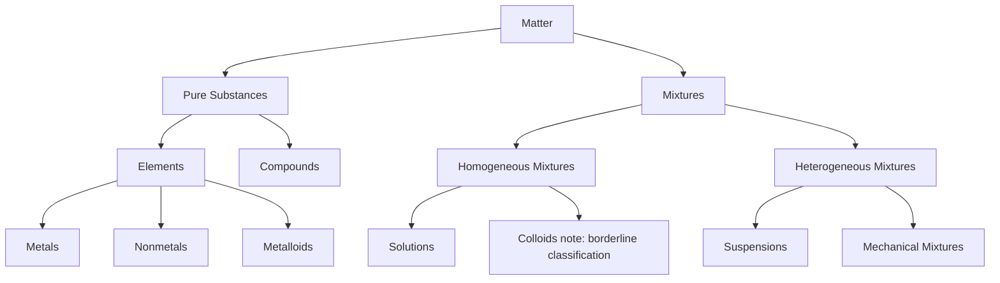

## Matter and its Classification

### Definition of Matter

Matter is anything that has mass and occupies space (volume). Matter is detected and measured through its physical presence and interactions, typically via mass measurement (using a balance) and volume measurement (using graduated instruments or displacement methods).

The two fundamental properties defining matter are:

- **Mass**: the quantity of matter contained in an object, measured in kilograms (kg) or grams (g)
- **Volume**: the amount of space occupied by matter, measured in liters (L), milliliters (mL), or cubic meters ($m^3$)

Mass is distinct from weight. Mass is an intrinsic property that does not change with location, while weight is the force exerted on mass due to gravity, given by:

$$W = mg$$

where $W$ is weight, $m$ is mass, and $g$ is the local gravitational acceleration.

### States of Matter

Matter exists in several physical states, distinguished by particle arrangement, spacing, and energy.

#### Solid

- Particles are tightly packed in fixed, ordered positions (crystalline) or disordered fixed positions (amorphous)
- Definite shape and definite volume
- Particles vibrate about fixed positions but do not translate freely
- Strong intermolecular/interatomic forces dominate over kinetic energy

#### Liquid

- Particles are close together but can move past one another
- Definite volume but indefinite shape (takes the shape of its container)
- Intermolecular forces are weaker than in solids but still significant
- Exhibits properties like viscosity and surface tension

#### Gas

- Particles are widely separated with large spaces between them
- Indefinite shape and indefinite volume (expands to fill its container)
- Intermolecular forces are minimal; particle motion is dominated by kinetic energy
- Highly compressible relative to solids and liquids

#### Plasma

- An ionized gas consisting of free electrons and ions
- Occurs at very high temperatures or under strong electromagnetic fields
- Considered the most abundant state of matter in the visible universe (e.g., stars), though rare under everyday terrestrial conditions

**Key Points**

- Phase changes between these states (melting, freezing, vaporization, condensation, sublimation, deposition, ionization) involve energy transfer without necessarily changing chemical composition
- The state of matter for a given substance depends on temperature and pressure conditions

#### Phase Change Diagram (svg_diagram)

<svg xmlns="http://www.w3.org/2000/svg" viewBox="0 0 700 340">
<text x="350" y="25" font-size="16" font-weight="bold" text-anchor="middle">States of Matter and Phase Transitions (svg_diagram)</text>

<rect x="40" y="130" width="140" height="80" fill="#cfe8ff" stroke="#333" stroke-width="2" />
<text x="110" y="175" font-size="16" text-anchor="middle">SOLID</text>

<rect x="280" y="130" width="140" height="80" fill="#a8d8ff" stroke="#333" stroke-width="2" />
<text x="350" y="175" font-size="16" text-anchor="middle">LIQUID</text>

<rect x="520" y="130" width="140" height="80" fill="#e0f0ff" stroke="#333" stroke-width="2" />
<text x="590" y="175" font-size="16" text-anchor="middle">GAS</text>

<line x1="180" y1="150" x2="278" y2="150" stroke="#000" stroke-width="2" marker-end="url(#arrow)" />
<text x="229" y="140" font-size="12" text-anchor="middle">Melting</text>

<line x1="278" y1="190" x2="180" y2="190" stroke="#000" stroke-width="2" marker-end="url(#arrow)" />
<text x="229" y="205" font-size="12" text-anchor="middle">Freezing</text>

<line x1="420" y1="150" x2="518" y2="150" stroke="#000" stroke-width="2" marker-end="url(#arrow)" />
<text x="469" y="140" font-size="12" text-anchor="middle">Vaporization</text>

<line x1="518" y1="190" x2="420" y2="190" stroke="#000" stroke-width="2" marker-end="url(#arrow)" />
<text x="469" y="205" font-size="12" text-anchor="middle">Condensation</text>

<path d="M 110 128 Q 350 40 590 128" fill="none" stroke="#000" stroke-width="2" marker-end="url(#arrow)" />
<text x="350" y="55" font-size="12" text-anchor="middle">Sublimation</text>

<path d="M 590 212 Q 350 300 110 212" fill="none" stroke="#000" stroke-width="2" marker-end="url(#arrow)" />
<text x="350" y="300" font-size="12" text-anchor="middle">Deposition</text>
</svg>

### Classification of Matter

Matter is classified based on composition and the ability to be separated by physical or chemical means.

#### Pure Substances

A pure substance has a fixed, uniform chemical composition throughout, with consistent physical and chemical properties (e.g., constant melting point, constant boiling point, constant density).

**Elements**

- The simplest form of pure substance; cannot be broken down into simpler substances by ordinary chemical means
- Composed of only one type of atom (defined by atomic number, i.e., number of protons)
- Currently 118 elements are recognized on the periodic table
- Classified into metals, nonmetals, and metalloids based on physical and chemical properties

**Example**

- Oxygen ($O_2$), gold (Au), carbon (C), and hydrogen ($H_2$) are elements

**Compounds**

- Formed when two or more elements chemically combine in a fixed, definite ratio by mass
- Can be broken down into simpler substances (elements or simpler compounds) only through chemical reactions, not physical processes
- Properties of a compound are generally distinct from the properties of its constituent elements

**Example**

- Water ($H_2O$) is a compound of hydrogen and oxygen in a 2:1 atomic ratio; it has different properties from either $H_2$ gas or $O_2$ gas individually
- Sodium chloride (NaCl), formed from reactive sodium metal and toxic chlorine gas, is a stable, edible compound

#### Mixtures

A mixture is a physical combination of two or more substances (elements and/or compounds) that retain their individual chemical identities and can be separated by physical methods.

**Homogeneous Mixtures**

- Uniform composition and properties throughout the mixture
- Components are not visually distinguishable; a single phase is observed
- Also referred to as solutions

**Example**

- Salt dissolved in water, air (a mixture of gases), and brass (an alloy of copper and zinc)

**Heterogeneous Mixtures**

- Non-uniform composition; distinct regions or phases are visibly distinguishable
- Components can often be separated by simple physical means such as filtration or decantation

**Example**

- Sand mixed with water, oil and water, a salad, granite rock

**Colloids and Suspensions** [Inference: classification placement may vary by textbook]

- **Colloids**: Mixtures with particle sizes between those of true solutions and suspensions (roughly 1–1000 nm); particles do not settle and exhibit the Tyndall effect (light scattering). Examples include milk, fog, and gelatin. Some curricula classify colloids as a distinct intermediate category rather than strictly under homogeneous or heterogeneous mixtures.
- **Suspensions**: Mixtures with larger particles that are visibly distinct and will settle over time under gravity. Examples include muddy water and paint (before mixing).

### Methods of Separating Mixtures

Because mixtures involve only physical combination, they can be separated by physical processes that exploit differences in physical properties.

| Method | Principle | Common Application |
| --- | --- | --- |
| Filtration | Difference in particle size | Separating solid from liquid (e.g., sand from water) |
| Evaporation | Difference in boiling points/volatility | Recovering dissolved solid from solution (e.g., salt from saltwater) |
| Distillation | Difference in boiling points | Separating miscible liquids (e.g., ethanol from water) |
| Chromatography | Difference in adsorption/solubility rates | Separating dissolved pigments or solutes |
| Magnetic separation | Difference in magnetic properties | Separating iron filings from a mixture |
| Sublimation | Direct solid-to-gas transition | Separating a sublimable solid (e.g., iodine) from a non-sublimable one |
| Decantation | Difference in density (settling) | Separating an immiscible liquid or settled solid from a liquid |
| Centrifugation | Difference in density under rotational force | Separating fine particles from a liquid (e.g., blood components) |

### Physical vs. Chemical Properties and Changes

Distinguishing physical from chemical properties/changes is essential to classifying and understanding matter's behavior.

#### Physical Properties

- Observable/measurable without altering the chemical composition of the substance
- Examples: color, density, melting point, boiling point, hardness, malleability, solubility, odor

#### Chemical Properties

- Describe a substance's ability to undergo a chemical change, forming new substances
- Examples: flammability, reactivity with acids, oxidation tendency, toxicity from decomposition

#### Physical Changes

- Alter the form or appearance of matter without changing its chemical identity
- Generally reversible
- Example: melting ice, dissolving sugar in water, tearing paper

#### Chemical Changes

- Result in the formation of one or more new substances with different chemical compositions
- Often accompanied by observable indicators: gas evolution, precipitate formation, color change, temperature change, or light emission
- Generally not reversible by physical means

**Example**

- Rusting of iron ($4Fe + 3O_2 \rightarrow 2Fe_2O_3$) is a chemical change, since a new substance (iron oxide) with different properties is formed
- Boiling water into steam is a physical change, since the steam is still $H_2O$

### Law of Conservation of Mass

In any physical or chemical change occurring in a closed system, matter is neither created nor destroyed; the total mass of reactants equals the total mass of products.

$$m_{reactants} = m_{products}$$

This principle, established through the experimental work of Antoine Lavoisier in the late 18th century, underlies the practice of balancing chemical equations.

**Conclusion**

Matter is classified hierarchically based on composition: pure substances (elements and compounds) have fixed compositions and defined properties, while mixtures (homogeneous and heterogeneous) have variable compositions and can be separated by physical means. This classification framework, combined with the distinction between physical and chemical properties/changes, forms the conceptual foundation for all subsequent study in chemistry, including atomic structure, stoichiometry, and chemical reactions.

**Related Topics**

- Atomic structure and the periodic table
- Physical and chemical changes in detail
- Law of conservation of mass and stoichiometry
- States of matter and the kinetic molecular theory
- Techniques of separating mixtures (laboratory methods)
- Properties of metals, nonmetals, and metalloids
- Solutions, solubility, and concentration units
- Phase diagrams and phase equilibria