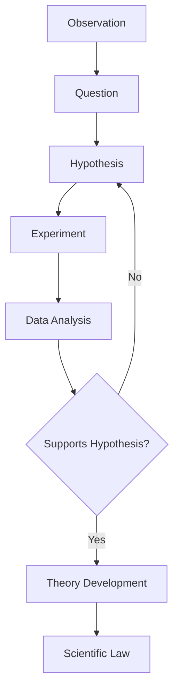

## The Scientific Method and Measurement

### The Scientific Method

The scientific method is a systematic, empirical approach to acquiring knowledge through observation, experimentation, and logical reasoning. It provides a structured framework that allows hypotheses to be tested, validated, or refuted based on reproducible evidence.

#### Steps of the Scientific Method

1. **Observation**: Noting a phenomenon through the senses or instruments
2. **Question formulation**: Defining a specific, testable question about the observation
3. **Hypothesis**: Proposing a tentative, testable explanation or prediction
4. **Experimentation**: Designing and conducting controlled experiments to test the hypothesis
5. **Data collection and analysis**: Recording quantitative/qualitative results and analyzing patterns
6. **Conclusion**: Determining whether the data supports or refutes the hypothesis
7. **Theory/Law formulation**: Developing broader explanatory frameworks after repeated validation across many experiments

#### Key Terminology

- **Hypothesis**: A tentative, testable explanation for an observation; must be falsifiable
- **Theory**: A well-substantiated explanation of some aspect of the natural world, based on extensive, repeatedly confirmed observations and experiments (e.g., atomic theory)
- **Scientific Law**: A concise statement, often mathematical, that describes a consistently observed pattern in nature without necessarily explaining why it occurs (e.g., the law of conservation of mass)

**Key Points**

- A theory does not become a law; theories explain *why* something happens, while laws describe *what* happens, typically in mathematical form
- A hypothesis must be falsifiable to be scientifically valid — there must be a conceivable experiment that could disprove it

#### Variables in Experimentation

- **Independent variable**: The factor deliberately changed by the experimenter
- **Dependent variable**: The factor measured, which responds to changes in the independent variable
- **Controlled variables**: Factors kept constant to ensure a fair test
- **Control group**: A baseline group not subjected to the experimental treatment, used for comparison

**Example**

- To test how temperature affects reaction rate: temperature is the independent variable, reaction rate is the dependent variable, and factors like concentration and pressure are controlled variables

### Measurement in Chemistry

Measurement is the process of quantifying a physical property using a standardized system of units, forming the empirical backbone of chemistry.

#### The SI System (International System of Units)

Chemistry relies on the SI system for standardized, universally reproducible measurements.

| Quantity | SI Base Unit | Symbol |
| --- | --- | --- |
| Mass | kilogram | kg |
| Length | meter | m |
| Time | second | s |
| Temperature | kelvin | K |
| Amount of substance | mole | mol |
| Electric current | ampere | A |
| Luminous intensity | candela | cd |

#### Derived Units

Derived units are combinations of base units used to express other physical quantities.

| Quantity | Derived Unit | Expression |
| --- | --- | --- |
| Volume | cubic meter (or liter) | $m^3$ (or L) |
| Density | kilogram per cubic meter | $kg/m^3$ |
| Force | newton | $N = kg \cdot m/s^2$ |
| Pressure | pascal | $Pa = N/m^2$ |
| Energy | joule | $J = kg \cdot m^2/s^2$ |

#### Common Metric Prefixes

| Prefix | Symbol | Factor |
| --- | --- | --- |
| giga | G | $10^9$ |
| mega | M | $10^6$ |
| kilo | k | $10^3$ |
| deci | d | $10^{-1}$ |
| centi | c | $10^{-2}$ |
| milli | m | $10^{-3}$ |
| micro | $\mu$ | $10^{-6}$ |
| nano | n | $10^{-9}$ |
| pico | p | $10^{-12}$ |

### Precision, Accuracy, and Error

- **Accuracy**: How close a measured value is to the true or accepted value
- **Precision**: How close repeated measurements are to one another (reproducibility), regardless of their closeness to the true value

**Example**

- Darts clustered tightly together but far from the bullseye represent high precision but low accuracy
- Darts scattered around the bullseye but not clustered represent high accuracy but low precision

#### Types of Error

- **Systematic error**: A consistent, repeatable error caused by a flaw in equipment or method, biasing all measurements in the same direction (e.g., an uncalibrated balance)
- **Random error**: Unpredictable fluctuations caused by uncontrollable variables, causing scatter around the true value in both directions

#### Percent Error

Percent error quantifies the deviation of an experimental value from the accepted (true) value:

$$\%\ error = \frac{|experimental\ value - accepted\ value|}{accepted\ value} \times 100\%$$

### Significant Figures

Significant figures indicate the precision of a measured quantity, reflecting the certainty of the measuring instrument used.

#### Rules for Determining Significant Figures

1. All non-zero digits are significant (e.g., 123 has 3 sig figs)
2. Zeros between non-zero digits are significant (e.g., 1002 has 4 sig figs)
3. Leading zeros are never significant (e.g., 0.0025 has 2 sig figs)
4. Trailing zeros after a decimal point are significant (e.g., 2.500 has 4 sig figs)
5. Trailing zeros in a whole number without a decimal point are ambiguous [Inference: convention-dependent] and are best clarified using scientific notation (e.g., $1.20 \times 10^3$ clearly has 3 sig figs)

#### Significant Figures in Calculations

- **Addition/Subtraction**: The result is rounded to the least number of decimal places among the values used
- **Multiplication/Division**: The result is rounded to the least number of significant figures among the values used

**Example**

- $12.11 + 18.0 + 1.013 = 31.123 \rightarrow$ rounded to $31.1$ (limited by 18.0's one decimal place)
- $4.56 \times 1.4 = 6.384 \rightarrow$ rounded to $6.4$ (limited by 1.4's two sig figs)

### Scientific Notation

Scientific notation expresses very large or very small numbers compactly in the form:

$$a \times 10^n$$

where $1 \leq |a| < 10$ and $n$ is an integer.

**Example**

- $602{,}200{,}000{,}000{,}000{,}000{,}000{,}000 = 6.022 \times 10^{23}$ (Avogadro's number)
- $0.000000000529\ m = 5.29 \times 10^{-10}\ m$ (Bohr radius)

### Dimensional Analysis (Unit Conversion)

Dimensional analysis, also known as the factor-label method, uses conversion factors to convert between units while preserving the physical quantity's value.

**Example**

Convert 5.00 km to meters:

$$5.00\ km \times \frac{1000\ m}{1\ km} = 5000\ m = 5.00 \times 10^3\ m$$

Convert 250 mL to liters:

$$250\ mL \times \frac{1\ L}{1000\ mL} = 0.250\ L$$

**Key Points**

- Conversion factors are ratios equal to 1, derived from equivalence statements (e.g., 1 km = 1000 m)
- Units are treated algebraically and canceled systematically to arrive at the desired unit

### Density as a Derived Measurement

Density relates mass and volume and is a key example of a derived measurement used to identify substances and verify purity.

$$\rho = \frac{m}{V}$$

where $\rho$ is density, $m$ is mass, and $V$ is volume.

**Example**

- A sample with a mass of 27.0 g and a volume of 10.0 $cm^3$ has a density of:

$$\rho = \frac{27.0\ g}{10.0\ cm^3} = 2.70\ g/cm^3$$

This value closely matches the known density of aluminum, supporting identification of the sample. [Inference: identification via density comparison assumes purity of the sample and consistent measurement conditions]

**Conclusion**

The scientific method provides the structured process by which chemical knowledge is generated and validated, while measurement — governed by the SI system, significant figures, and rigorous attention to precision and accuracy — ensures that experimental data is both meaningful and reproducible. Mastery of these foundational skills, including dimensional analysis and error analysis, is essential for all quantitative work throughout chemistry.

**Related Topics**

- Matter and its classification
- Units of measurement and the metric system in depth
- Density and its applications in substance identification
- Graphing and interpreting experimental data
- Accuracy, precision, and statistical treatment of data
- Dimensional analysis for complex multi-step conversions
- Scientific notation and order-of-magnitude estimation