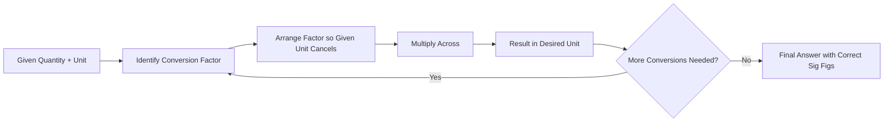

## Units, Dimensional Analysis, and Significant Figures

### The SI System of Units

Chemistry relies on the International System of Units (SI) to provide a standardized, universally reproducible basis for measurement.

#### SI Base Units

| Quantity | Base Unit | Symbol |
| --- | --- | --- |
| Mass | kilogram | kg |
| Length | meter | m |
| Time | second | s |
| Temperature | kelvin | K |
| Amount of substance | mole | mol |
| Electric current | ampere | A |
| Luminous intensity | candela | cd |

#### Common Derived Units in Chemistry

Derived units are formed by combining base units algebraically.

| Quantity | Unit Name | Expression |
| --- | --- | --- |
| Volume | liter (non-SI, accepted) | $1\ L = 1\ dm^3 = 1000\ cm^3$ |
| Density | — | $kg/m^3$ or $g/cm^3$ |
| Force | newton (N) | $kg \cdot m/s^2$ |
| Pressure | pascal (Pa) | $N/m^2$ |
| Energy | joule (J) | $kg \cdot m^2/s^2$ |
| Concentration | molarity (M) | $mol/L$ |

#### Metric Prefixes

| Prefix | Symbol | Multiplier |
| --- | --- | --- |
| tera | T | $10^{12}$ |
| giga | G | $10^9$ |
| mega | M | $10^6$ |
| kilo | k | $10^3$ |
| hecto | h | $10^2$ |
| deca | da | $10^1$ |
| — | — | $10^0$ |
| deci | d | $10^{-1}$ |
| centi | c | $10^{-2}$ |
| milli | m | $10^{-3}$ |
| micro | $\mu$ | $10^{-6}$ |
| nano | n | $10^{-9}$ |
| pico | p | $10^{-12}$ |

#### Temperature Scales

Three temperature scales are commonly used in chemistry, related by the following conversions:

$$T_{(K)} = T_{(°C)} + 273.15$$

$$T_{(°F)} = \frac{9}{5}T_{(°C)} + 32$$

$$T_{(°C)} = \frac{5}{9}(T_{(°F)} - 32)$$

**Key Points**

- Kelvin is the SI unit of temperature and has no negative values; 0 K (absolute zero) represents the theoretical absence of thermal molecular motion
- A temperature change of 1 K is numerically equal to a temperature change of 1 °C, since the Kelvin and Celsius scales share the same increment size

### Dimensional Analysis (Factor-Label Method)

Dimensional analysis is a problem-solving technique in which units are treated as algebraic quantities that can be multiplied, divided, and canceled to convert a measurement from one unit to another while preserving its physical value.

#### Core Principle

A conversion factor is a ratio of two equivalent quantities expressed in different units, and is therefore equal to 1. Multiplying a measurement by a conversion factor changes its units without changing its actual magnitude.

$$Given\ quantity \times \frac{desired\ unit}{given\ unit} = desired\ quantity$$

#### Single-Step Conversion Example

Convert 3.25 kg to grams:

$$3.25\ kg \times \frac{1000\ g}{1\ kg} = 3250\ g = 3.25 \times 10^3\ g$$

#### Multi-Step Conversion Example

Convert 45.0 miles per hour to meters per second, given 1 mile = 1609 m and 1 hour = 3600 s:

$$45.0\ \frac{mi}{hr} \times \frac{1609\ m}{1\ mi} \times \frac{1\ hr}{3600\ s} = 20.1\ m/s$$

#### Conversion Involving Squared or Cubed Units

When converting units raised to a power (such as area or volume), the conversion factor itself must also be raised to that power.

**Example**

Convert 2.50 $m^3$ to $cm^3$:

$$2.50\ m^3 \times \left(\frac{100\ cm}{1\ m}\right)^3 = 2.50\ m^3 \times \frac{10^6\ cm^3}{1\ m^3} = 2.50 \times 10^6\ cm^3$$

**Key Points**

- Always arrange the conversion factor so that the unit to be eliminated appears in the denominator, canceling the corresponding unit in the numerator of the given quantity
- Chained (multi-step) conversions are solved by stringing multiple conversion factors together in a single expression, canceling intermediate units sequentially

### Significant Figures

Significant figures (sig figs) represent the digits in a measured value that carry meaningful information about its precision, including all certain digits plus one estimated (uncertain) digit.

#### Rules for Identifying Significant Figures

1. **Non-zero digits** are always significant (e.g., 4527 → 4 sig figs)
2. **Captive zeros** (zeros between non-zero digits) are significant (e.g., 90.05 → 4 sig figs)
3. **Leading zeros** (zeros before the first non-zero digit) are never significant (e.g., 0.00340 → 3 sig figs)
4. **Trailing zeros after a decimal point** are significant (e.g., 12.500 → 5 sig figs)
5. **Trailing zeros in a number without a decimal point** are ambiguous [Inference: interpretation is convention-dependent] and are best resolved using scientific notation (e.g., 4500 could be 2, 3, or 4 sig figs; $4.500 \times 10^3$ unambiguously has 4)
6. **Exact numbers** (defined quantities or counted values, e.g., 12 eggs in a dozen, or conversion definitions like 1 m = 100 cm) are considered to have infinite significant figures and do not limit the precision of a calculation

#### Significant Figures in Calculations

- **Addition and subtraction**: The result is rounded to match the fewest number of decimal places among the values used
- **Multiplication and division**: The result is rounded to match the fewest number of significant figures among the values used

**Example (Addition)**

$$25.1 + 2.03 + 0.005 = 27.135 \rightarrow \text{rounded to}\ 27.1\ (\text{limited by 25.1's one decimal place})$$

**Example (Multiplication)**

$$3.26 \times 1.8 = 5.868 \rightarrow \text{rounded to}\ 5.9\ (\text{limited by 1.8's two sig figs})$$

#### Rounding Rules

- If the digit following the last retained digit is less than 5, round down (retain as is)
- If the digit following the last retained digit is 5 or greater, round up
- In multi-step calculations, it is standard practice to retain extra guard digits through intermediate steps and round only the final result, to avoid compounding rounding error

### Scientific Notation

Scientific notation expresses numbers as a coefficient between 1 and 10 multiplied by a power of ten, and is the preferred method for clearly conveying significant figures in very large or very small numbers.

$$N = a \times 10^n,\quad 1 \leq |a| < 10,\ n \in \mathbb{Z}$$

**Example**

- $0.0000456\ g = 4.56 \times 10^{-5}\ g$ (3 sig figs)
- $128{,}000{,}000\ m = 1.28 \times 10^8\ m$ (3 sig figs)

#### Operations in Scientific Notation

**Multiplication**: multiply coefficients, add exponents

$$(2.0 \times 10^3) \times (3.0 \times 10^4) = 6.0 \times 10^7$$

**Division**: divide coefficients, subtract exponents

$$\frac{6.0 \times 10^8}{2.0 \times 10^3} = 3.0 \times 10^5$$

**Addition/Subtraction**: exponents must first be made equal before adding/subtracting coefficients

$$3.2 \times 10^4 + 5.0 \times 10^3 = 3.2 \times 10^4 + 0.50 \times 10^4 = 3.7 \times 10^4$$

### Precision, Accuracy, and Uncertainty in Measurement

- **Accuracy**: the closeness of a measured value to the true or accepted value
- **Precision**: the closeness of repeated measurements to one another, independent of their accuracy
- **Uncertainty**: the estimated margin of doubt associated with a measurement, typically expressed as $\pm$ a value, often tied to the smallest graduation of the measuring instrument

**Example**

- A graduated cylinder marked in 1 mL increments allows a reading to be estimated to the nearest 0.1 mL, so a reported volume of 24.6 mL implies an uncertainty of approximately $\pm 0.1\ mL$

#### Percent Error

$$\%\ error = \frac{|experimental\ value - accepted\ value|}{accepted\ value} \times 100\%$$

**Conclusion**

Units, dimensional analysis, and significant figures collectively establish the quantitative rigor required in chemistry. The SI system provides standardized units for communicating measurements, dimensional analysis provides a systematic and error-resistant method for converting between units, and significant figures ensure that reported results accurately reflect the precision of the underlying measurements. Together, these tools are foundational to every quantitative calculation performed throughout the study of chemistry.

**Related Topics**

- Matter and its classification
- The scientific method and measurement
- Density calculations and unit conversions
- Precision, accuracy, and error analysis
- Scientific notation and order-of-magnitude reasoning
- Molarity, molality, and other concentration units
- Stoichiometric calculations using dimensional analysis