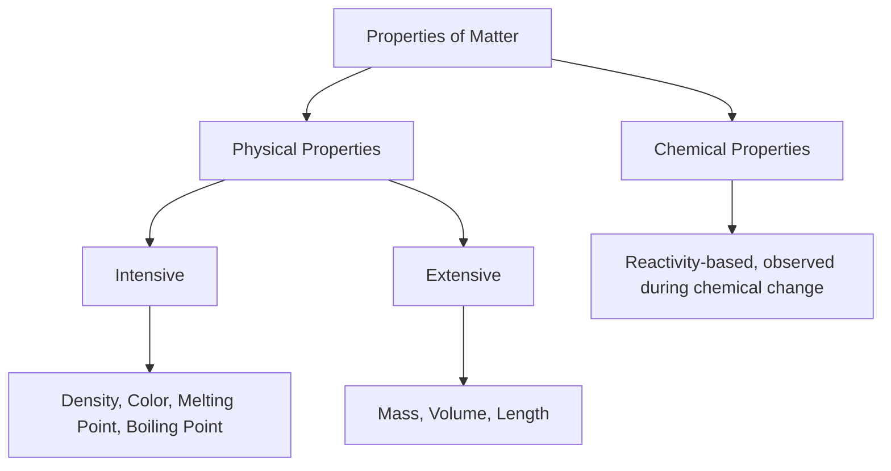

## Physical and Chemical Properties of Matter

### Overview

Every sample of matter can be described by a set of properties — measurable or observable characteristics that allow one substance to be identified, distinguished from others, and understood in terms of how it will behave. These properties are broadly divided into physical properties and chemical properties, and each of these is further classified as intensive or extensive.

### Physical Properties

A physical property is a characteristic of a substance that can be observed or measured without changing the substance's chemical identity or composition.

#### Common Physical Properties

- **Color**: the wavelength(s) of visible light reflected or transmitted by a substance
- **Odor**: the scent detectable by olfactory senses
- **Density**: mass per unit volume ($\rho = m/V$)
- **Melting point**: the temperature at which a solid transitions to a liquid at a given pressure
- **Boiling point**: the temperature at which a liquid transitions to a gas at a given pressure
- **Solubility**: the maximum amount of a solute that can dissolve in a given amount of solvent at a specified temperature
- **Hardness**: resistance to scratching or deformation, often measured on the Mohs scale
- **Malleability**: the ability to be hammered or rolled into thin sheets without breaking
- **Ductility**: the ability to be drawn into wires
- **Electrical conductivity**: the ability to conduct electric current
- **Thermal conductivity**: the ability to conduct heat
- **Viscosity**: a fluid's resistance to flow
- **State of matter**: solid, liquid, gas, or plasma at a given temperature and pressure

**Example**

- Gold is yellow, has a density of 19.3 $g/cm^3$, melts at 1064 °C, and is highly malleable and ductile — all physical properties observable without altering its identity as gold

#### Physical Changes

A physical change alters the form, size, or state of a substance but does not change its chemical composition; the substance retains its original chemical identity and can typically be recovered by reversing the process.

**Example**

- Melting ice into liquid water (still $H_2O$)
- Dissolving table salt in water (NaCl remains chemically intact, dispersed as ions in solution, and can be recovered by evaporation)
- Cutting, crushing, or shredding a solid (only shape/size changes)
- Magnetizing a piece of iron

**Key Points**

- Phase changes (melting, freezing, boiling, condensation, sublimation, deposition) are classified as physical changes because no new substance is formed, even though energy is absorbed or released
- Physical changes are generally reversible, though reversal may sometimes require significant energy input (e.g., re-freezing water)

### Chemical Properties

A chemical property describes a substance's tendency or capacity to undergo a chemical change, transforming into one or more different substances with a distinct chemical composition. Chemical properties can only be observed while (or by inference after) the substance undergoes such a transformation.

#### Common Chemical Properties

- **Flammability**: the ability of a substance to combust in the presence of oxygen
- **Reactivity with acids/bases**: tendency to react with acidic or basic substances
- **Oxidizability**: tendency to lose electrons in a redox reaction (e.g., susceptibility to rusting or tarnishing)
- **Toxicity**: capacity to cause chemical harm to living organisms via reaction with biological systems
- **Stability/instability**: tendency to decompose or react spontaneously under given conditions
- **pH-dependent reactivity**: behavior in acidic or basic environments

**Example**

- Hydrogen gas is flammable, reacting explosively with oxygen: $2H_2 + O_2 \rightarrow 2H_2O$
- Iron is reactive toward oxygen and moisture, forming iron(III) oxide (rust): $4Fe + 3O_2 \rightarrow 2Fe_2O_3$
- Sodium reacts vigorously with water, releasing hydrogen gas: $2Na + 2H_2O \rightarrow 2NaOH + H_2$

#### Chemical Changes

A chemical change (chemical reaction) transforms one or more substances into new substances with different chemical compositions and properties. Chemical changes are typically not reversible by simple physical means.

**Common Indicators of a Chemical Change**

- Formation of a **precipitate** (an insoluble solid forming from solution)
- **Gas evolution** (bubbling not caused by boiling)
- **Color change**
- **Temperature change** (exothermic or endothermic reaction)
- **Light emission**
- **Odor change**

**Example**

- Burning wood (combustion) produces ash, carbon dioxide, and water vapor — new substances with different properties from the original wood
- Mixing vinegar (acetic acid) and baking soda (sodium bicarbonate) produces carbon dioxide gas, water, and sodium acetate: $NaHCO_3 + CH_3COOH \rightarrow CH_3COONa + H_2O + CO_2$

**Key Points**

- The presence of an indicator (bubbling, color change, precipitate, etc.) suggests a chemical change but is not absolute proof by itself, since some physical processes can mimic these signs [Inference: e.g., boiling produces bubbles without a new substance forming]; confirming a genuine chemical change requires verifying that the chemical composition has changed
- Chemical changes obey the Law of Conservation of Mass: the total mass of reactants equals the total mass of products in a closed system

### Intensive vs. Extensive Properties

Both physical and chemical properties can be further categorized by whether they depend on the amount of matter present.

#### Intensive Properties

- Do **not** depend on the amount of substance present
- Remain constant regardless of sample size
- Useful for identifying substances

**Example**

- Density, melting point, boiling point, color, odor, hardness, concentration, specific heat capacity, refractive index

#### Extensive Properties

- **Do** depend on the amount of substance present
- Change proportionally with sample size

**Example**

- Mass, volume, length, total heat content, total energy

**Key Points**

- The ratio of two extensive properties often yields an intensive property; for example, dividing mass (extensive) by volume (extensive) yields density (intensive), since the dependence on sample size cancels out

### Comparative Summary Table

| Aspect | Physical Property/Change | Chemical Property/Change |
| --- | --- | --- |
| Definition | Observed without altering composition | Observed through a transformation in composition |
| New substance formed? | No | Yes |
| Reversibility | Generally reversible | Generally irreversible by physical means |
| Examples of properties | Color, density, melting point | Flammability, reactivity, toxicity |
| Examples of changes | Melting, dissolving, cutting | Combustion, rusting, digestion |

### Diagram: Classifying an Observation (svg_diagram)

<svg xmlns="http://www.w3.org/2000/svg" viewBox="0 0 640 300">
<text x="320" y="25" font-size="16" font-weight="bold" text-anchor="middle">Decision Path: Physical vs Chemical Change (svg_diagram)</text>
<rect x="250" y="45" width="140" height="50" fill="#fff2cc" stroke="#333" stroke-width="2" />
<text x="320" y="75" font-size="13" text-anchor="middle">Observation Made</text>
<line x1="320" y1="95" x2="320" y2="130" stroke="#000" stroke-width="2" marker-end="url(#arrow2)" />
<rect x="220" y="130" width="200" height="55" fill="#d9ead3" stroke="#333" stroke-width="2" />
<text x="320" y="152" font-size="12" text-anchor="middle">Is a new substance formed with</text>
<text x="320" y="170" font-size="12" text-anchor="middle">a different chemical composition?</text>
<line x1="220" y1="157" x2="90" y2="220" stroke="#000" stroke-width="2" marker-end="url(#arrow2)" />
<text x="130" y="200" font-size="12">No</text>
<line x1="420" y1="157" x2="550" y2="220" stroke="#000" stroke-width="2" marker-end="url(#arrow2)" />
<text x="500" y="200" font-size="12">Yes</text>
<rect x="20" y="220" width="140" height="55" fill="#cfe2f3" stroke="#333" stroke-width="2" />
<text x="90" y="245" font-size="13" text-anchor="middle">Physical Change</text>
<text x="90" y="262" font-size="11" text-anchor="middle">(same substance)</text>
<rect x="480" y="220" width="140" height="55" fill="#f4cccc" stroke="#333" stroke-width="2" />
<text x="550" y="245" font-size="13" text-anchor="middle">Chemical Change</text>
<text x="550" y="262" font-size="11" text-anchor="middle">(new substance)</text>
</svg>

**Conclusion**

Physical properties describe characteristics observable without altering a substance's identity, while chemical properties describe its tendency to transform into new substances through chemical reactions. Correctly distinguishing physical from chemical properties and changes — supported by the intensive/extensive classification — is essential for identifying substances, predicting their behavior, and interpreting experimental observations throughout chemistry.

**Related Topics**

- Matter and its classification
- The scientific method and measurement
- Units, dimensional analysis, and significant figures
- Law of conservation of mass
- Chemical reactions and types of reactions
- States of matter and phase changes
- Density and its role in substance identification