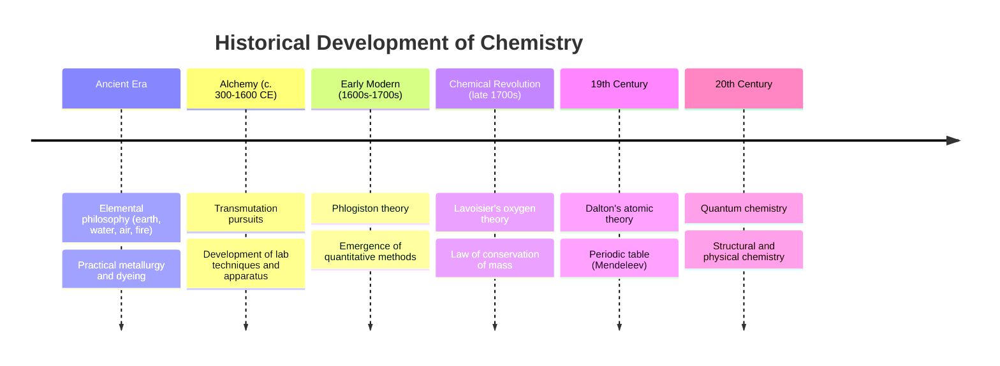

## History and Philosophy of Chemistry

### Overview

The history and philosophy of chemistry traces the discipline's evolution from ancient practical and mystical traditions into a rigorous, quantitative experimental science, while examining the conceptual and methodological frameworks that define chemical knowledge — including the nature of chemical laws, the relationship between chemistry and physics, and the epistemological status of atomic theory.

### Ancient and Classical Origins

#### Elemental Philosophy

Ancient Greek philosophers proposed that all matter was composed of a small number of fundamental elements or principles.

- **Empedocles** (c. 5th century BCE) proposed four classical elements: earth, water, air, and fire
- **Aristotle** expanded this framework by adding four qualities (hot, cold, wet, dry) paired with the elements, and proposed a fifth element (aether) for celestial bodies
- **Democritus and Leucippus** proposed an early atomistic view, suggesting matter was composed of indivisible particles called *atomos* ("uncuttable"), though this idea was largely rejected by Aristotelian philosophy and remained speculative rather than experimentally grounded for many centuries

#### Practical Chemistry in Ancient Civilizations

Early practical chemical knowledge developed independently of philosophical atomism, driven by craft and technological needs:

- **Metallurgy**: extraction and working of metals (copper, bronze, iron) in Mesopotamia, Egypt, and China
- **Dyeing and pigments**: production of natural dyes and pigments in ancient Egypt and the Indus Valley
- **Fermentation**: production of alcoholic beverages and food preservation techniques
- **Egyptian and Mesopotamian chemistry**: embalming practices and early glassmaking

### The Alchemical Period

Alchemy, practiced from antiquity through roughly the 17th century across the Islamic world, Europe, China, and India, combined practical experimentation with mystical, philosophical, and proto-scientific goals.

#### Goals of Alchemy

- **Transmutation**: the pursuit of converting base metals (e.g., lead) into noble metals (e.g., gold)
- **The Philosopher's Stone**: a legendary substance believed capable of enabling transmutation and granting immortality (the elixir of life)
- **Medical alchemy (iatrochemistry)**: the application of chemical processes to prepare medicines, notably advanced by Paracelsus in the 16th century

#### Contributions of Alchemy to Chemistry

Despite its mystical goals, alchemy contributed substantially to the development of chemistry as an empirical practice:

- Development of laboratory apparatus (distillation flasks, furnaces, alembics)
- Discovery and characterization of substances such as sulfuric acid, nitric acid, and various salts
- Refinement of techniques including distillation, sublimation, calcination, and crystallization
- Notable alchemists/proto-chemists include Jabir ibn Hayyan (often considered a foundational figure in the systematization of chemical processes) and later European figures such as Paracelsus

**Key Points**

- Alchemy is best understood as a precursor discipline that bridged mystical/philosophical worldviews and empirical experimentation, rather than a purely pseudoscientific dead end; many of its techniques and apparatus were directly inherited by early modern chemistry

### The Phlogiston Theory

Proposed in the late 17th century (associated with Johann Joachim Becher and later developed by Georg Ernst Stahl), the phlogiston theory attempted to explain combustion and calcination (the formation of metal oxides, called "calx") as the release of a fire-like substance called phlogiston from burning or rusting materials.

- Combustible materials were believed to be rich in phlogiston, which was released during burning, leaving behind an ash or calx
- The theory faced a significant anomaly: calcined metals were observed to *gain* mass rather than lose it, which was difficult to reconcile with the loss of a substance (phlogiston) unless phlogiston was assigned negative mass — an ad hoc and increasingly untenable modification

**Key Points**

- The phlogiston theory is frequently cited in the philosophy of science as a case study in how a scientific paradigm can accommodate anomalies through auxiliary hypotheses before eventually being displaced by a theory with superior explanatory and predictive power [Inference: this framing draws on Kuhnian philosophy of science and is an interpretive lens rather than a historical fact in itself]

### The Chemical Revolution

The late 18th century saw a fundamental paradigm shift in chemistry, largely attributed to the work of Antoine Lavoisier.

#### Lavoisier's Contributions

- Demonstrated through careful quantitative experimentation that combustion and calcination involve the **combination** of a substance with a component of air (which he named oxygen), rather than the release of phlogiston
- Established the **Law of Conservation of Mass**: in a chemical reaction conducted in a closed system, mass is neither created nor destroyed
- Co-developed a systematic chemical nomenclature that named compounds according to their constituent elements, replacing the inconsistent and often obscure naming conventions of alchemy
- Compiled one of the first tables of chemical elements in *Traité élémentaire de chimie* (1789)

**Key Points**

- Lavoisier's emphasis on precise quantitative measurement (notably the use of the balance) is often regarded as marking chemistry's transition from a largely qualitative craft to a quantitative experimental science

### Atomic Theory and the 19th Century

#### Dalton's Atomic Theory (early 1800s)

John Dalton proposed a modern atomic theory based on quantitative chemical evidence, with the following key postulates:

1. All matter is composed of indivisible atoms
2. Atoms of a given element are identical in mass and properties; atoms of different elements differ
3. Compounds form through combinations of atoms in fixed, whole-number ratios (Law of Definite Proportions / Law of Multiple Proportions)
4. Chemical reactions involve the rearrangement of atoms, not their creation or destruction

[Inference: several of Dalton's original postulates, such as the indivisibility of atoms and the strict uniformity of atoms of a given element, were later refined by the discovery of subatomic particles and isotopes]

#### Development of the Periodic Table

- **Dmitri Mendeleev** (1869) organized known elements by increasing atomic mass into a periodic table, arranging them so that elements with similar chemical properties fell into the same columns (groups)
- Mendeleev's table notably left gaps for undiscovered elements and successfully predicted their properties, which was later validated by the discovery of elements such as gallium and germanium — a strong episode of predictive success frequently discussed in the philosophy of science
- **Henry Moseley** (early 20th century) later refined the organizing principle from atomic mass to atomic number, resolving several inconsistencies in Mendeleev's ordering

### 20th Century and Modern Chemistry

- Discovery of the electron (J.J. Thomson, 1897), the nucleus (Ernest Rutherford, 1911), and the development of quantum mechanical models of the atom (Bohr, Schrödinger, Heisenberg) provided a physical, mechanistic basis for chemical bonding and periodicity
- **Quantum chemistry** emerged as a subfield applying quantum mechanics to explain molecular structure, bonding, and spectroscopy
- Chemistry diversified into specialized subfields including organic, inorganic, physical, analytical, and biochemistry

### Philosophy of Chemistry

The philosophy of chemistry is a distinct area of philosophy of science examining the conceptual foundations, methodology, and epistemology specific to chemistry, which emerged as a formally recognized subfield of philosophy of science primarily from the 1990s onward. [Inference: exact dating of the field's formal emergence varies among sources and is not a sharply defined event]

#### Key Philosophical Questions in Chemistry

- **Reductionism**: To what extent can chemical phenomena (e.g., bonding, reactivity) be fully explained/reduced to underlying quantum-mechanical physics, versus requiring distinctly chemical concepts and explanatory frameworks?
- **The nature of chemical laws**: Are laws such as the Law of Definite Proportions strict, exceptionless laws akin to physical laws, or are they better understood as idealized generalizations with recognized exceptions (e.g., non-stoichiometric compounds)?
- **Natural kinds**: Are chemical substances (elements, compounds) natural kinds with essential, mind-independent boundaries, or are classificatory schemes partly conventional?
- **The status of the periodic table**: Is the periodic law a fundamental law of nature or a highly successful classificatory/organizational tool?
- **Realism about theoretical/unobservable entities**: What is the epistemological status of entities such as atoms, orbitals, and bonds, which are not directly observable but are indispensable to chemical explanation?

**Key Points**

- Philosophy of chemistry often engages with the broader philosophy of science debate on scientific realism (the view that successful scientific theories are approximately true descriptions of an observation-independent reality) versus instrumentalism (the view that theories are useful tools for prediction rather than literal descriptions)

### Historical Timeline Diagram (svg_diagram)

<svg xmlns="http://www.w3.org/2000/svg" viewBox="0 0 720 260">
<text x="360" y="22" font-size="15" font-weight="bold" text-anchor="middle">Major Eras in the History of Chemistry (svg_diagram)</text>
<line x1="40" y1="140" x2="680" y2="140" stroke="#333" stroke-width="3" />
<circle cx="80" cy="140" r="7" fill="#6fa8dc" />
<text x="80" y="120" font-size="11" text-anchor="middle">Ancient</text>
<text x="80" y="165" font-size="10" text-anchor="middle">Elemental</text>
<text x="80" y="178" font-size="10" text-anchor="middle">philosophy</text>
<circle cx="220" cy="140" r="7" fill="#93c47d" />
<text x="220" y="120" font-size="11" text-anchor="middle">Alchemy</text>
<text x="220" y="165" font-size="10" text-anchor="middle">Transmutation,</text>
<text x="220" y="178" font-size="10" text-anchor="middle">lab technique</text>
<circle cx="360" cy="140" r="7" fill="#e69138" />
<text x="360" y="120" font-size="11" text-anchor="middle">Phlogiston Era</text>
<text x="360" y="165" font-size="10" text-anchor="middle">Combustion</text>
<text x="360" y="178" font-size="10" text-anchor="middle">theories</text>
<circle cx="500" cy="140" r="7" fill="#cc4125" />
<text x="500" y="120" font-size="11" text-anchor="middle">Chemical Revolution</text>
<text x="500" y="165" font-size="10" text-anchor="middle">Lavoisier,</text>
<text x="500" y="178" font-size="10" text-anchor="middle">conservation of mass</text>
<circle cx="640" cy="140" r="7" fill="#674ea7" />
<text x="640" y="120" font-size="11" text-anchor="middle">Modern Era</text>
<text x="640" y="165" font-size="10" text-anchor="middle">Atomic theory,</text>
<text x="640" y="178" font-size="10" text-anchor="middle">quantum chemistry</text>
</svg>

**Conclusion**

The history of chemistry reflects a long transition from elemental philosophy and mystical alchemical practice toward a quantitative, evidence-based experimental science, propelled by pivotal figures such as Lavoisier, Dalton, and Mendeleev. The philosophy of chemistry, as a complementary field, interrogates the deeper conceptual questions underlying this history — including reductionism, the nature of chemical laws, and the status of theoretical entities — providing a critical lens through which the discipline's methods and knowledge claims can be understood.

**Related Topics**

- Matter and its classification
- The scientific method and measurement
- Law of conservation of mass
- Dalton's atomic theory and subsequent atomic models
- Development of the periodic table
- Philosophy of science: realism vs. instrumentalism
- Quantum chemistry and modern atomic theory