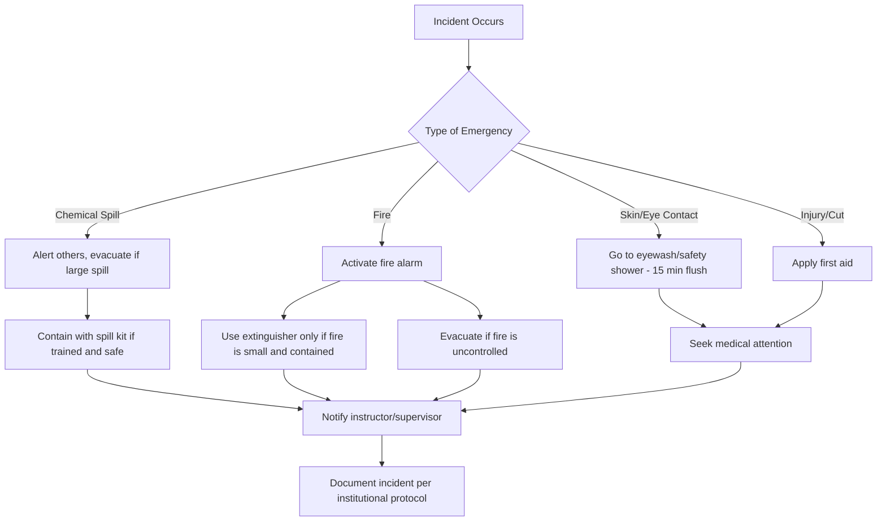

## Basic Laboratory Safety and Equipment

### Overview

Laboratory safety encompasses the practices, protocols, and equipment used to minimize risk of injury, chemical exposure, fire, and environmental contamination during chemical experimentation. Competence in laboratory safety is a prerequisite for all practical chemistry work, not a supplementary topic.

### General Safety Rules

- Never work alone in a laboratory; a second person must be present in case of emergency.
- Wear appropriate personal protective equipment (PPE) at all times when chemicals, glassware, or heat sources are in use.
- Never eat, drink, or apply cosmetics in the laboratory.
- Tie back long hair and avoid loose clothing or dangling jewelry near flames or moving equipment.
- Read all labels and Safety Data Sheets (SDS) before handling any chemical.
- Never pipette by mouth; always use a pipette bulb or pump.
- Know the locations of the nearest exits, fire extinguisher, eyewash station, safety shower, and first-aid kit before beginning work.
- Report all spills, breakages, and injuries to the instructor or supervisor immediately, regardless of severity.
- Keep the workspace clear of unnecessary bags, books, and coats.
- Never taste chemicals; only smell them if instructed, using a wafting motion with the hand rather than inhaling directly over the container.

### Personal Protective Equipment (PPE)

**Key Points**

- **Safety goggles**: Required at all times in the lab; protect eyes from splashes, vapors, and flying debris. Regular eyeglasses are not a substitute.
- **Lab coat/apron**: Made of flame-resistant or chemical-resistant material; protects skin and clothing from spills and prevents contamination from reaching street clothes.
- **Gloves**: Material selection depends on the chemical hazard—nitrile gloves for general use, neoprene or butyl rubber for organic solvents, and heavy-duty gloves for corrosives. [Inference] Glove selection should be cross-checked against the SDS for the specific chemical, since resistance varies by glove material and exposure duration.
- **Closed-toe shoes**: Required to protect feet from spills and dropped objects; sandals and open shoes are prohibited.
- **Face shields**: Used in addition to goggles when working with corrosive or explosive-risk reactions.

### Chemical Hazard Classification

Chemicals are classified according to the Globally Harmonized System (GHS) of Classification and Labelling of Chemicals, which standardizes hazard communication internationally.

| Hazard Class | Description | Example Pictogram Meaning |
| --- | --- | --- |
| Flammable | Ignites easily | Flame symbol |
| Corrosive | Damages skin, eyes, or metal | Corrosion symbol |
| Toxic | Causes harm if inhaled, ingested, or absorbed | Skull and crossbones |
| Oxidizer | Enhances combustion of other materials | Flame over circle |
| Irritant/Harmful | Causes irritation or mild health effects | Exclamation mark |
| Health Hazard | Carcinogen, respiratory sensitizer, reproductive toxin | Silhouette with starburst |
| Environmental Hazard | Toxic to aquatic life | Dead fish/tree symbol |
| Compressed Gas | Contains gas under pressure | Gas cylinder symbol |
| Explosive | Risk of explosion | Exploding bomb symbol |

### Safety Data Sheets (SDS)

An SDS provides detailed information on a chemical's properties and hazards, structured into 16 standardized sections under the GHS framework:

1. Identification
2. Hazard(s) identification
3. Composition/information on ingredients
4. First-aid measures
5. Fire-fighting measures
6. Accidental release measures
7. Handling and storage
8. Exposure controls/personal protection
9. Physical and chemical properties
10. Stability and reactivity
11. Toxicological information
12. Ecological information
13. Disposal considerations
14. Transport information
15. Regulatory information
16. Other information

**Example**

Before using concentrated hydrochloric acid, a student should consult the SDS to confirm required gloves (e.g., neoprene), the appropriate fume hood use, first-aid response for skin/eye contact, and spill neutralization procedure (e.g., sodium bicarbonate).

### Common Laboratory Equipment

#### Glassware

| Equipment | Primary Use |
| --- | --- |
| Beaker | General mixing, heating; approximate volume measurement only |
| Erlenmeyer flask | Swirling/mixing solutions; titration receiving vessel |
| Graduated cylinder | Precise volume measurement of liquids |
| Volumetric flask | Preparing solutions of exact, known concentration |
| Test tube | Small-scale reactions and heating |
| Round-bottom flask | Reflux, distillation; heating under controlled conditions |
| Burette | Precise dispensing of variable liquid volumes (titrations) |
| Pipette (volumetric/graduated) | Accurate transfer of a fixed or variable liquid volume |
| Watch glass | Covering beakers; evaporating small amounts of liquid |
| Funnel | Filtration; transferring liquids into narrow openings |
| Condenser | Cooling and condensing vapors during distillation/reflux |
| Desiccator | Storing substances in a moisture-free environment |

#### Heating and Support Equipment

- **Bunsen burner**: Produces an open flame for heating; requires a gas source and careful flame adjustment (yellow "safety" flame vs. blue "working" flame).
- **Hot plate/stirrer**: Electric heating source, safer than open flame for flammable solvents; often combined with magnetic stirring.
- **Ring stand and clamps**: Provide stable support for glassware during heating or reactions.
- **Wire gauze**: Distributes heat evenly under glassware on a support ring.
- **Crucible and tongs**: Used for high-temperature heating (e.g., ignition tests) and safe handling of hot objects.

#### Measurement Instruments

- **Analytical balance**: Measures mass with high precision (typically ±0.0001 g).
- **Thermometer**: Measures temperature; digital or liquid-filled (non-mercury preferred in modern labs).
- **pH meter**: Measures solution acidity/basicity electronically.

### Emergency Safety Equipment

**Key Points**

- **Eyewash station**: Used to flush eyes for a minimum of 15 minutes following chemical contact; located within 10 seconds' walking distance of hazard areas per typical institutional guidelines. [Unverified] Exact response-time standards vary by jurisdiction and institution (e.g., ANSI Z358.1 in the U.S. specifies a 10-second/55-foot rule).
- **Safety shower**: Drenches the entire body in the event of large chemical spills on skin or clothing.
- **Fire extinguisher**: Classified by fire type—Class A (ordinary combustibles), Class B (flammable liquids), Class C (electrical), Class D (combustible metals); most labs use a multipurpose ABC extinguisher, but Class D fires (e.g., burning sodium or magnesium) require a specialized dry powder extinguisher and must never be treated with water.
- **Fire blanket**: Smothers small fires or is wrapped around a person whose clothing has caught fire.
- **Fume hood**: Ventilated enclosure that removes toxic vapors, dust, and fumes from the breathing zone; essential when handling volatile or noxious chemicals.
- **Spill kit**: Contains absorbents, neutralizers, and PPE for containing chemical spills.
- **First-aid kit**: For treating minor cuts, burns, and injuries before professional medical attention if needed.

### Chemical Storage and Compatibility

Chemicals must be segregated by hazard class to prevent dangerous reactions:

- **Acids** stored separately from **bases** and from **oxidizers**.
- **Flammables** stored in dedicated flammable-storage cabinets, away from ignition sources and oxidizers.
- **Oxidizers** kept away from combustible and flammable materials.
- **Toxic substances** stored in secure, labeled, ventilated cabinets.

$$\text{Example incompatible pair: } \ce{NaOCl (bleach) + HCl -> Cl2(g) + NaCl + H2O}$$

This reaction releases toxic chlorine gas, illustrating why storing acids and hypochlorite bleach together is prohibited.

### Waste Disposal

- Chemical waste must never be poured down the drain unless explicitly confirmed as safe by institutional policy and the SDS.
- Waste is segregated into labeled containers (e.g., halogenated organic waste, non-halogenated organic waste, aqueous heavy metal waste).
- Broken glass is disposed of in a dedicated "sharps" or glass-waste container, never in regular trash.
- Disposal procedures may vary by institution and local environmental regulation. [Unverified] Specific waste-handling protocols should always be confirmed against current local/institutional guidelines rather than assumed universal.

### Basic Laboratory Hazard Symbols (Illustration)

<svg xmlns="http://www.w3.org/2000/svg" viewBox="0 0 640 200" font-family="sans-serif">
<text x="320" y="20" text-anchor="middle" font-size="14" font-weight="bold">Common GHS Pictograms (svg_diagram)</text>

<g transform="translate(20,40)">
<rect x="0" y="0" width="90" height="90" fill="white" stroke="red" stroke-width="3" transform="rotate(45 45 45)" />
<path d="M45 20 C35 40 55 45 45 65 C60 60 65 40 50 25 C50 35 45 30 45 20 Z" fill="black" />
<text x="45" y="105" text-anchor="middle" font-size="10">Flammable</text>
</g>

<g transform="translate(150,40)">
<rect x="0" y="0" width="90" height="90" fill="white" stroke="red" stroke-width="3" transform="rotate(45 45 45)" />
<path d="M25 25 L45 45 L25 65" stroke="black" stroke-width="3" fill="none" />
<path d="M55 20 L55 70" stroke="black" stroke-width="3" />
<text x="45" y="105" text-anchor="middle" font-size="10">Corrosive</text>
</g>

<g transform="translate(280,40)">
<rect x="0" y="0" width="90" height="90" fill="white" stroke="red" stroke-width="3" transform="rotate(45 45 45)" />
<circle cx="45" cy="40" r="15" fill="black" />
<circle cx="38" cy="36" r="3" fill="white" />
<circle cx="52" cy="36" r="3" fill="white" />
<path d="M30 60 L60 60 M35 50 L35 65 M55 50 L55 65" stroke="black" stroke-width="3" />
<text x="45" y="105" text-anchor="middle" font-size="10">Toxic</text>
</g>

<g transform="translate(410,40)">
<rect x="0" y="0" width="90" height="90" fill="white" stroke="red" stroke-width="3" transform="rotate(45 45 45)" />
<circle cx="45" cy="45" r="12" fill="none" stroke="black" stroke-width="3" />
<path d="M45 20 C38 35 52 38 45 50" fill="black" />
<text x="45" y="105" text-anchor="middle" font-size="10">Oxidizer</text>
</g>

<g transform="translate(540,40)">
<rect x="0" y="0" width="90" height="90" fill="white" stroke="red" stroke-width="3" transform="rotate(45 45 45)" />
<circle cx="45" cy="50" r="14" fill="black" />
<path d="M45 20 L48 30 L55 25 L50 35 L60 38 L48 40 L52 50" stroke="black" stroke-width="2" fill="none" />
<text x="45" y="105" text-anchor="middle" font-size="10">Explosive</text>
</g>
</svg>

### Emergency Response Procedures

### Common Mistakes to Avoid

- Adding water to concentrated acid (causes violent exothermic spattering); the correct practice is to always add acid to water slowly, not the reverse.
- Heating a sealed container, which can cause pressure buildup and explosion.
- Pointing a heated test tube's open end toward oneself or others.
- Using a Bunsen burner near flammable solvents or an open bottle of alcohol.
- Mixing unknown chemicals without consulting compatibility charts or the SDS.

### Related Topics

- States of matter and physical properties
- Measurement, significant figures, and uncertainty
- Introduction to the scientific method
- Chemical reactions and stoichiometry basics
- Acid-base chemistry and pH
- Laboratory techniques: filtration, titration, and distillation
- Density and its determination
- Proper use of the analytical balance and volumetric glassware