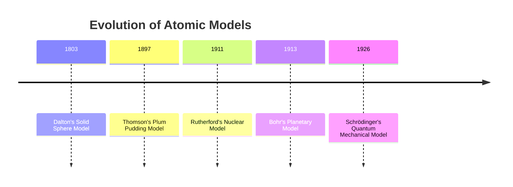

## Historical Development of Atomic Models

### Overview

The atomic model has evolved through successive stages of experimental discovery and theoretical refinement, each model building on, or overturning, the assumptions of its predecessor. This progression illustrates the scientific method in action: hypotheses are proposed, tested against experimental evidence, and revised or replaced when new data contradicts existing theory.

### Timeline Summary

### Democritus and Early Philosophical Atomism (c. 400 BCE)

The Greek philosopher Democritus proposed that matter is composed of indivisible particles called "atomos" (meaning "uncuttable"). This was a philosophical concept rather than an experimentally derived theory, with no empirical basis or predictive framework. It was largely dismissed by contemporaries such as Aristotle in favor of the four-element theory (earth, air, fire, water) and had no direct experimental influence on the atomic theory developed over 2,000 years later.

### Dalton's Atomic Theory (1803)

John Dalton formulated the first scientific atomic theory based on quantitative experimental observations, particularly the law of conservation of mass and the law of definite proportions.

**Key Points**

- All matter is composed of tiny, indivisible particles called atoms.
- Atoms of a given element are identical in mass and properties; atoms of different elements differ.
- Atoms cannot be created, destroyed, or subdivided in chemical reactions.
- Compounds form through combinations of atoms in whole-number ratios (law of multiple proportions).
- Chemical reactions involve rearrangement of atoms, not their transformation.

**Limitations**

Dalton's model treated the atom as a solid, indivisible sphere with no internal structure. Subsequent discoveries of subatomic particles (electrons, protons, neutrons) and isotopes (atoms of the same element with different masses) invalidated the assumptions of indivisibility and uniform atomic mass within an element.

### Thomson's Plum Pudding Model (1897)

J.J. Thomson discovered the electron through cathode ray tube experiments, demonstrating that atoms contain negatively charged subatomic particles and are therefore divisible.

**Key Points**

- Cathode rays were deflected by electric and magnetic fields, indicating they consisted of negatively charged particles.
- Thomson calculated the charge-to-mass ratio ($e/m$) of these particles, finding a value far smaller in mass than the hydrogen atom, the lightest known atom.
- He proposed that atoms consist of a diffuse, positively charged "pudding" with negatively charged electrons ("plums") embedded throughout, maintaining overall electrical neutrality.

**Limitations**

The model could not explain how positive and negative charges were arranged with stability, nor did it anticipate the concentrated nucleus later discovered by Rutherford. [Inference] The model is generally regarded as a transitional step rather than a structurally accurate depiction of atomic architecture.

### Rutherford's Nuclear Model (1911)

Ernest Rutherford, along with Hans Geiger and Ernest Marsden, conducted the gold foil experiment, firing alpha particles at a thin sheet of gold foil.

**Experimental Observations**

- Most alpha particles passed through the foil undeflected.
- A small fraction were deflected at large angles, and a few bounced almost straight back.

**Conclusions**

- Since most particles passed through undeflected, the atom is mostly empty space.
- Since some particles deflected sharply, atoms contain a small, dense, positively charged region—the nucleus—concentrating most of the atom's mass.
- Electrons were proposed to orbit this nucleus at a relative distance, similar to planets orbiting the sun.

**Limitations**

Classical electromagnetic theory predicts that an orbiting (accelerating) charged particle should continuously emit electromagnetic radiation, lose energy, and spiral into the nucleus, causing atomic collapse within a fraction of a second. Since atoms are observed to be stable, this model was physically inconsistent with classical physics.

### Bohr's Planetary/Quantized Model (1913)

Niels Bohr modified Rutherford's model by incorporating quantum theory to resolve the stability problem, applying ideas from Max Planck's quantum hypothesis to atomic structure, specifically for the hydrogen atom.

**Key Postulates**

- Electrons occupy specific, quantized circular orbits (energy levels) around the nucleus without radiating energy while in a stable orbit.
- Each orbit corresponds to a fixed energy level, denoted by principal quantum number $n = 1, 2, 3, ...$
- Electrons can transition between orbits by absorbing or emitting a photon with energy exactly equal to the energy difference between orbits:

$$\Delta E = E_{final} - E_{initial} = h\nu$$

- The model successfully predicted the emission spectrum of hydrogen using the relationship:

$$\frac{1}{\lambda} = R_H \left( \frac{1}{n_1^2} - \frac{1}{n_2^2} \right)$$

where $R_H$ is the Rydberg constant.

**Limitations**

The Bohr model accurately predicted spectral lines only for hydrogen and other single-electron (hydrogen-like) species; it failed to explain the spectra of multi-electron atoms. It also could not account for the fine structure of spectral lines observed with high-resolution spectroscopy, nor did it explain chemical bonding behavior consistently across the periodic table.

### Quantum Mechanical Model (1920s–present)

Building on the wave-particle duality proposed by Louis de Broglie (1924) and Werner Heisenberg's uncertainty principle (1927), Erwin Schrödinger developed a wave equation (1926) that describes the probabilistic behavior of electrons.

**Key Points**

- Electrons do not follow fixed orbits; instead, their position is described by a probability distribution called an atomic orbital.
- The Schrödinger equation, $\hat{H}\psi = E\psi$, yields wavefunctions ($\psi$) whose square, $\psi^2$, gives the probability density of finding an electron at a given point in space.
- Four quantum numbers ($n$, $l$, $m_l$, $m_s$) describe the energy, shape, orientation, and spin of electrons within an atom.
- Heisenberg's uncertainty principle states that the exact position and momentum of an electron cannot both be precisely known simultaneously:

$$\Delta x \cdot \Delta p \geq \frac{h}{4\pi}$$

This model remains the current standard for describing atomic structure and underpins modern quantum chemistry, spectroscopy, and bonding theory.

### Comparative Summary Table

| Model | Scientist(s) | Year | Key Contribution | Major Limitation |
| --- | --- | --- | --- | --- |
| Solid sphere | Dalton | 1803 | Atoms as indivisible units of matter | No internal structure |
| Plum pudding | Thomson | 1897 | Discovery of the electron | No defined nucleus |
| Nuclear model | Rutherford | 1911 | Discovery of the nucleus | Predicted atomic collapse |
| Planetary/quantized | Bohr | 1913 | Quantized energy levels | Failed for multi-electron atoms |
| Quantum mechanical | Schrödinger, Heisenberg, de Broglie | 1926 | Probabilistic electron orbitals | Mathematically complex, non-intuitive |

### Conceptual Progression Diagram

<svg xmlns="http://www.w3.org/2000/svg" viewBox="0 0 700 260" font-family="sans-serif">
<text x="350" y="20" text-anchor="middle" font-size="14" font-weight="bold">Atomic Model Progression (svg_diagram)</text>

<g transform="translate(30,50)">
<circle cx="40" cy="60" r="30" fill="#8a8a8a" />
<text x="40" y="105" text-anchor="middle" font-size="10">Dalton (1803)</text>
</g>

<g transform="translate(160,50)">
<circle cx="40" cy="60" r="30" fill="#e0b060" />
<circle cx="30" cy="50" r="4" fill="black" />
<circle cx="50" cy="45" r="4" fill="black" />
<circle cx="45" cy="70" r="4" fill="black" />
<circle cx="28" cy="72" r="4" fill="black" />
<text x="40" y="105" text-anchor="middle" font-size="10">Thomson (1897)</text>
</g>

<g transform="translate(290,50)">
<circle cx="40" cy="60" r="8" fill="#c0392b" />
<circle cx="40" cy="60" r="30" fill="none" stroke="#999" stroke-dasharray="3,3" />
<circle cx="65" cy="35" r="3" fill="black" />
<text x="40" y="105" text-anchor="middle" font-size="10">Rutherford (1911)</text>
</g>

<g transform="translate(420,50)">
<circle cx="40" cy="60" r="8" fill="#c0392b" />
<circle cx="40" cy="60" r="20" fill="none" stroke="#999" />
<circle cx="40" cy="60" r="30" fill="none" stroke="#999" />
<circle cx="60" cy="60" r="3" fill="black" />
<circle cx="10" cy="60" r="3" fill="black" />
<text x="40" y="105" text-anchor="middle" font-size="10">Bohr (1913)</text>
</g>

<g transform="translate(550,50)">
<circle cx="40" cy="60" r="8" fill="#c0392b" />
<ellipse cx="40" cy="60" rx="30" ry="12" fill="#a0c8e8" opacity="0.6" />
<ellipse cx="40" cy="60" rx="12" ry="30" fill="#a0c8e8" opacity="0.6" />
<text x="40" y="105" text-anchor="middle" font-size="10">Quantum (1926)</text>
</g>
<line x1="110" y1="80" x2="150" y2="80" stroke="black" marker-end="url(#arrow)" />
<line x1="240" y1="80" x2="280" y2="80" stroke="black" marker-end="url(#arrow)" />
<line x1="370" y1="80" x2="410" y2="80" stroke="black" marker-end="url(#arrow)" />
<line x1="500" y1="80" x2="540" y2="80" stroke="black" marker-end="url(#arrow)" />
</svg>

### Conclusion

Each atomic model was not simply discarded but refined in response to experimental anomalies the prior model could not explain: Thomson's discovery of the electron necessitated internal structure beyond Dalton's solid sphere; Rutherford's gold foil experiment revealed the nucleus, contradicting Thomson's diffuse charge distribution; Bohr's quantization resolved the classical stability problem of Rutherford's model; and the quantum mechanical model generalized Bohr's framework beyond hydrogen using wave mechanics and probability. This progression exemplifies how scientific models are provisional, evidence-based approximations refined through iterative testing.

### Related Topics

- Subatomic particles: protons, neutrons, and electrons
- Quantum numbers and electron configuration
- Atomic spectra and emission/absorption lines
- The periodic table and periodic trends
- Isotopes and atomic mass calculations
- Wave-particle duality and de Broglie wavelength
- Heisenberg uncertainty principle
- Orbital shapes (s, p, d, f) and electron probability distributions