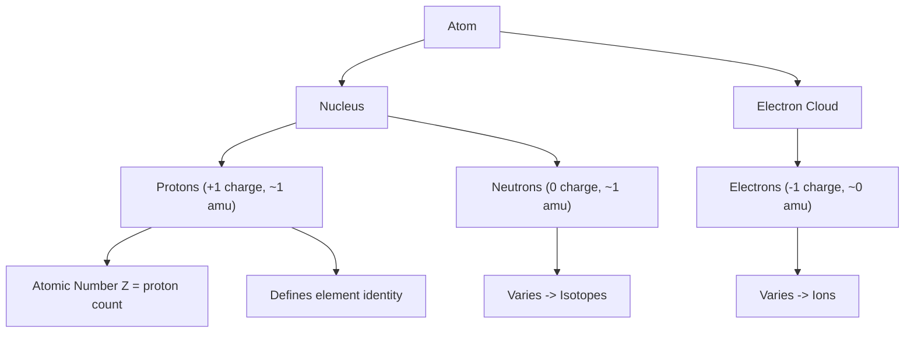

## Subatomic Particles and Atomic Composition

### Overview

Atoms are composed of three fundamental subatomic particles—protons, neutrons, and electrons—whose relative numbers and arrangement determine an element's identity, isotopic variation, and chemical behavior. Understanding atomic composition is foundational to interpreting the periodic table, chemical bonding, and nuclear chemistry.

### The Three Fundamental Subatomic Particles

| Particle | Symbol | Charge | Relative Mass (amu) | Actual Mass (kg) | Location |
| --- | --- | --- | --- | --- | --- |
| Proton | $p^+$ | +1 | 1 | $1.673 \times 10^{-27}$ | Nucleus |
| Neutron | $n^0$ | 0 | 1 | $1.675 \times 10^{-27}$ | Nucleus |
| Electron | $e^-$ | -1 | 1/1836 (≈0.00055) | $9.109 \times 10^{-31}$ | Electron cloud/orbitals |

**Key Points**

- Protons and neutrons collectively are called nucleons and reside in the nucleus, which occupies a tiny fraction of the atom's total volume yet contains nearly all of its mass.
- Electrons occupy the vastly larger surrounding space, described by probability distributions (orbitals) rather than fixed paths.
- The proton and neutron have approximately equal mass (~1 amu), while the electron's mass is negligible by comparison, roughly 1/1836 that of a proton.

### Discovery of Subatomic Particles

- **Electron (1897)**: Discovered by J.J. Thomson through cathode ray tube experiments, which demonstrated the existence of negatively charged particles with a charge-to-mass ratio far exceeding that expected for any known atom.
- **Proton (1917)**: Identified by Ernest Rutherford through experiments bombarding nitrogen gas with alpha particles, which produced hydrogen nuclei, leading him to propose the proton as a fundamental positive particle.
- **Neutron (1932)**: Discovered by James Chadwick, who bombarded beryllium with alpha particles and detected a neutral, penetrating radiation that could not be explained by protons or electrons alone.

### Atomic Number, Mass Number, and Notation

**Atomic number ($Z$)**: The number of protons in an atom's nucleus; defines the element's identity. No two elements share the same atomic number.

**Mass number ($A$)**: The total number of protons and neutrons (nucleons) in the nucleus.

$$A = Z + N$$

where $N$ is the number of neutrons.

**Standard atomic notation**:

$$^{A}_{Z}\text{X}$$

where X is the element symbol.

**Example**

For carbon-14: $^{14}_{6}\text{C}$

- $Z = 6$ (6 protons, defining it as carbon)
- $A = 14$ (14 total nucleons)
- $N = A - Z = 14 - 6 = 8$ neutrons

### Determining Particle Counts from Notation

| Quantity | Formula |
| --- | --- |
| Number of protons | $= Z$ |
| Number of electrons (neutral atom) | $= Z$ |
| Number of neutrons | $= A - Z$ |
| Number of electrons (ion) | $= Z - \text{charge}$ (subtract for negative charge, add for positive charge) |

**Example**

For the ion $^{35}_{17}\text{Cl}^-$:

- Protons $= 17$
- Neutrons $= 35 - 17 = 18$
- Electrons $= 17 - (-1) = 18$ (one extra electron due to the negative charge)

### Isotopes

Isotopes are atoms of the same element (identical $Z$, same number of protons) that differ in neutron number, and therefore mass number.

**Key Points**

- Isotopes have nearly identical chemical properties since chemical behavior is governed primarily by electron configuration, which depends on proton number.
- Isotopes differ in physical properties related to mass, such as density and nuclear stability; some isotopes are radioactive (unstable), while others are stable.
- The atomic mass listed on the periodic table is a weighted average of all naturally occurring isotopes of an element, based on their relative abundance.

**Example**

Carbon has three naturally occurring isotopes:

- Carbon-12 ($^{12}\text{C}$): 6 protons, 6 neutrons, ~98.9% natural abundance
- Carbon-13 ($^{13}\text{C}$): 6 protons, 7 neutrons, ~1.1% natural abundance
- Carbon-14 ($^{14}\text{C}$): 6 protons, 8 neutrons, trace abundance; radioactive, used in radiocarbon dating

**Weighted Average Atomic Mass Calculation**

$$\text{Atomic mass} = \sum (\text{isotope mass} \times \text{fractional abundance})$$

For chlorine, with isotopes $^{35}\text{Cl}$ (mass 34.97 amu, 75.77% abundance) and $^{37}\text{Cl}$ (mass 36.97 amu, 24.23% abundance):

$$\text{Atomic mass} = (34.97 \times 0.7577) + (36.97 \times 0.2423) \approx 35.45 \text{ amu}$$

This matches the standard atomic mass of chlorine shown on the periodic table.

### Ions: Cations and Anions

Atoms are electrically neutral when the number of protons equals the number of electrons. Ions form when this balance is disrupted.

- **Cation**: A positively charged ion, formed when an atom loses one or more electrons (protons > electrons).
- **Anion**: A negatively charged ion, formed when an atom gains one or more electrons (electrons > protons).

**Example**

- Sodium ($\text{Na}$, $Z=11$) loses 1 electron to form $\text{Na}^+$ (11 protons, 10 electrons).
- Chlorine ($\text{Cl}$, $Z=17$) gains 1 electron to form $\text{Cl}^-$ (17 protons, 18 electrons).

### Atomic Structure Diagram

<svg xmlns="http://www.w3.org/2000/svg" viewBox="0 0 500 400" font-family="sans-serif">
<text x="250" y="20" text-anchor="middle" font-size="14" font-weight="bold">Atomic Composition Model (svg_diagram)</text>

<circle cx="250" cy="210" r="150" fill="none" stroke="#a0c8e8" stroke-width="1.5" stroke-dasharray="4,3" />
<circle cx="250" cy="210" r="100" fill="none" stroke="#a0c8e8" stroke-width="1.5" stroke-dasharray="4,3" />
<circle cx="250" cy="210" r="50" fill="none" stroke="#a0c8e8" stroke-width="1.5" stroke-dasharray="4,3" />

<circle cx="240" cy="205" r="10" fill="#c0392b" />
<circle cx="258" cy="205" r="10" fill="#c0392b" />
<circle cx="250" cy="220" r="10" fill="#c0392b" />
<circle cx="232" cy="220" r="10" fill="#7f8c8d" />
<circle cx="266" cy="220" r="10" fill="#7f8c8d" />
<circle cx="250" cy="192" r="10" fill="#7f8c8d" />

<circle cx="250" cy="160" r="5" fill="#2c3e50" />
<circle cx="325" cy="260" r="5" fill="#2c3e50" />
<circle cx="175" cy="260" r="5" fill="#2c3e50" />
<circle cx="370" cy="210" r="5" fill="#2c3e50" />
<circle cx="130" cy="210" r="5" fill="#2c3e50" />
<circle cx="250" cy="360" r="5" fill="#2c3e50" />

<circle cx="60" cy="350" r="8" fill="#c0392b" />
<text x="75" y="354" font-size="11">Proton (+1)</text>
<circle cx="180" cy="350" r="8" fill="#7f8c8d" />
<text x="195" y="354" font-size="11">Neutron (0)</text>
<circle cx="300" cy="350" r="5" fill="#2c3e50" />
<text x="315" y="354" font-size="11">Electron (-1)</text>
</svg>

### Mass and Charge Relationships Diagram

### Nuclear Stability and Binding Forces

The nucleus contains multiple positively charged protons confined in an extremely small volume, which would normally repel one another via electrostatic (Coulomb) repulsion. Nuclear stability is maintained by the strong nuclear force, which acts at very short range between nucleons and overcomes electrostatic repulsion.

**Key Points**

- The neutron-to-proton ratio strongly influences nuclear stability; light elements are most stable near a 1:1 ratio, while heavier elements require a higher proportion of neutrons for stability.
- Nuclei with an imbalanced neutron-to-proton ratio, or those beyond a certain size, tend to be radioactive and undergo decay to reach a more stable configuration.
- [Inference] Nuclear stability trends are generally described by a "band of stability" on a plot of neutrons versus protons, though the precise stability of individual isotopes depends on additional quantum factors such as nuclear shell structure.

### Common Mistakes to Avoid

- Confusing atomic number ($Z$) with mass number ($A$); $Z$ identifies the element, $A$ gives total nucleons.
- Forgetting to adjust electron count for ionic charge when determining ion composition.
- Assuming all isotopes of an element are radioactive; most elements have at least one stable isotope.
- Using atomic mass (a weighted average, often a decimal) in place of mass number (always a whole number for a specific isotope).

### Related Topics

- Historical development of atomic models
- Electron configuration and orbital diagrams
- Quantum numbers and the Pauli exclusion principle
- The periodic table: groups, periods, and trends
- Radioactivity and nuclear decay (alpha, beta, gamma)
- Isotopic abundance and mass spectrometry
- Ionic and covalent bonding
- Average atomic mass calculations