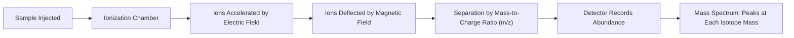

## Isotopes and Atomic Mass

### Overview

Isotopes are variants of an element that share the same number of protons but differ in neutron number, resulting in different mass numbers. The concept of isotopes is essential for understanding atomic mass values on the periodic table, nuclear stability, and applications ranging from radiometric dating to medical imaging.

### Definition of Isotopes

Isotopes are atoms of the same element (identical atomic number, $Z$) that have different numbers of neutrons, and therefore different mass numbers ($A$).

$$A = Z + N$$

Since $Z$ is fixed for a given element, variation in $N$ (neutron number) produces different isotopes of that element.

**Key Points**

- Isotopes of an element have nearly identical chemical properties, because chemical reactivity depends primarily on electron configuration, which is governed by proton number ($Z$), not neutron number.
- Isotopes differ in physical properties related to mass, such as density, diffusion rate, and nuclear behavior.
- Some isotopes are stable indefinitely; others are radioactive (unstable) and undergo spontaneous nuclear decay over time.

### Isotope Notation

Isotopes are represented using either full nuclear notation or hyphen notation:

$$^{A}_{Z}\text{X} \quad \text{or} \quad \text{X-}A$$

**Example**

- $^{12}_{6}\text{C}$ or Carbon-12: 6 protons, 6 neutrons
- $^{14}_{6}\text{C}$ or Carbon-14: 6 protons, 8 neutrons
- $^{235}_{92}\text{U}$ or Uranium-235: 92 protons, 143 neutrons
- $^{238}_{92}\text{U}$ or Uranium-238: 92 protons, 146 neutrons

### Common Isotope Examples

| Element | Isotope | Protons | Neutrons | Natural Abundance | Stability |
| --- | --- | --- | --- | --- | --- |
| Hydrogen | Protium ($^1\text{H}$) | 1 | 0 | ~99.98% | Stable |
| Hydrogen | Deuterium ($^2\text{H}$) | 1 | 1 | ~0.02% | Stable |
| Hydrogen | Tritium ($^3\text{H}$) | 1 | 2 | Trace | Radioactive |
| Carbon | Carbon-12 | 6 | 6 | ~98.9% | Stable |
| Carbon | Carbon-13 | 6 | 7 | ~1.1% | Stable |
| Carbon | Carbon-14 | 6 | 8 | Trace | Radioactive |
| Chlorine | Chlorine-35 | 17 | 18 | ~75.8% | Stable |
| Chlorine | Chlorine-37 | 17 | 20 | ~24.2% | Stable |
| Uranium | Uranium-235 | 92 | 143 | ~0.72% | Radioactive |
| Uranium | Uranium-238 | 92 | 146 | ~99.27% | Radioactive |

### Relative Atomic Mass and the Atomic Mass Unit

The atomic mass unit (amu, or unified atomic mass unit, u) is defined as exactly $\frac{1}{12}$ the mass of a single, unbound, neutral carbon-12 atom in its ground state.

$$1 \text{ amu} = 1.6605 \times 10^{-27} \text{ kg}$$

This standardized reference allows the masses of all other atoms to be expressed relative to carbon-12.

### Average Atomic Mass Calculation

The atomic mass value listed on the periodic table for each element is a weighted average of the masses of all naturally occurring isotopes, weighted according to their relative natural abundance.

$$\text{Average atomic mass} = \sum_{i} (\text{mass of isotope}_i \times \text{fractional abundance}_i)$$

**Worked Example: Chlorine**

Chlorine has two stable isotopes:

- $^{35}\text{Cl}$: mass = 34.969 amu, abundance = 75.77%
- $^{37}\text{Cl}$: mass = 36.966 amu, abundance = 24.23%

$$\text{Average atomic mass} = (34.969 \times 0.7577) + (36.966 \times 0.2423)$$

$$= 26.497 + 8.958 = 35.455 \text{ amu}$$

This closely matches the standard atomic weight of chlorine (35.45 amu) shown on the periodic table.

**Worked Example: Copper**

Copper has two stable isotopes: $^{63}\text{Cu}$ (62.930 amu, 69.17% abundance) and $^{65}\text{Cu}$ (64.928 amu, 30.83% abundance).

$$\text{Average atomic mass} = (62.930 \times 0.6917) + (64.928 \times 0.3083)$$

$$= 43.53 + 20.02 = 63.55 \text{ amu}$$

This matches the periodic table value for copper (63.55 amu).

### Solving for Unknown Abundance

Given two isotopes and the known average atomic mass, the relative abundances can be calculated algebraically by letting $x$ represent the fractional abundance of one isotope and $(1-x)$ the other.

**Example**

Boron has two isotopes: $^{10}\text{B}$ (10.013 amu) and $^{11}\text{B}$ (11.009 amu), with an average atomic mass of 10.81 amu. Let $x$ = fractional abundance of $^{10}\text{B}$:

$$10.013x + 11.009(1-x) = 10.81$$

$$10.013x + 11.009 - 11.009x = 10.81$$

$$-0.996x = -0.199$$

$$x \approx 0.1998 \, (\approx 20\%)$$

Therefore $^{10}\text{B}$ is approximately 20% abundant and $^{11}\text{B}$ is approximately 80% abundant, consistent with published isotopic abundance data.

### Isotope Abundance Determination: Mass Spectrometry

Isotopic composition and relative abundance are experimentally determined using a mass spectrometer, which ionizes a sample, accelerates the ions through a magnetic field, and separates them based on their mass-to-charge ratio ($m/z$).

Lighter isotopes deflect more sharply in the magnetic field than heavier isotopes, producing a spectrum where peak position indicates isotopic mass and peak height/area indicates relative abundance.

### Isotope Diagram

<svg xmlns="http://www.w3.org/2000/svg" viewBox="0 0 600 260" font-family="sans-serif">
<text x="300" y="20" text-anchor="middle" font-size="14" font-weight="bold">Carbon Isotopes Compared (svg_diagram)</text>

<g transform="translate(50,50)">
<text x="70" y="0" text-anchor="middle" font-size="12" font-weight="bold">Carbon-12</text>
<circle cx="55" cy="60" r="10" fill="#c0392b" />
<circle cx="75" cy="60" r="10" fill="#c0392b" />
<circle cx="65" cy="75" r="10" fill="#c0392b" />
<circle cx="45" cy="75" r="10" fill="#7f8c8d" />
<circle cx="85" cy="75" r="10" fill="#7f8c8d" />
<circle cx="65" cy="45" r="10" fill="#7f8c8d" />
<text x="65" y="110" text-anchor="middle" font-size="10">6p, 6n</text>
</g>

<g transform="translate(230,50)">
<text x="70" y="0" text-anchor="middle" font-size="12" font-weight="bold">Carbon-13</text>
<circle cx="55" cy="60" r="10" fill="#c0392b" />
<circle cx="75" cy="60" r="10" fill="#c0392b" />
<circle cx="65" cy="75" r="10" fill="#c0392b" />
<circle cx="45" cy="75" r="10" fill="#7f8c8d" />
<circle cx="85" cy="75" r="10" fill="#7f8c8d" />
<circle cx="65" cy="45" r="10" fill="#7f8c8d" />
<circle cx="65" cy="30" r="10" fill="#7f8c8d" />
<text x="65" y="110" text-anchor="middle" font-size="10">6p, 7n</text>
</g>

<g transform="translate(410,50)">
<text x="70" y="0" text-anchor="middle" font-size="12" font-weight="bold">Carbon-14</text>
<circle cx="55" cy="60" r="10" fill="#c0392b" />
<circle cx="75" cy="60" r="10" fill="#c0392b" />
<circle cx="65" cy="75" r="10" fill="#c0392b" />
<circle cx="45" cy="75" r="10" fill="#7f8c8d" />
<circle cx="85" cy="75" r="10" fill="#7f8c8d" />
<circle cx="65" cy="45" r="10" fill="#7f8c8d" />
<circle cx="65" cy="30" r="10" fill="#7f8c8d" />
<circle cx="45" cy="35" r="10" fill="#7f8c8d" />
<text x="65" y="110" text-anchor="middle" font-size="10">6p, 8n (radioactive)</text>
</g>
<circle cx="60" cy="220" r="8" fill="#c0392b" />
<text x="75" y="224" font-size="11">Proton</text>
<circle cx="180" cy="220" r="8" fill="#7f8c8d" />
<text x="195" y="224" font-size="11">Neutron</text>
</svg>

### Applications of Isotopes

- **Radiocarbon dating**: Carbon-14, a radioactive isotope with a known half-life of approximately 5,730 years, is used to estimate the age of organic materials by measuring the remaining fraction of $^{14}\text{C}$ relative to stable $^{12}\text{C}$.
- **Medical imaging and treatment**: Radioactive isotopes such as iodine-131 and technetium-99m are used in diagnostic imaging and cancer therapy.
- **Nuclear power**: Uranium-235 undergoes fission and is used as fuel in nuclear reactors, while uranium-238 is far more abundant but not directly fissile under thermal neutron conditions.
- **Isotope labeling**: Stable isotopes such as deuterium ($^2\text{H}$) and carbon-13 are used as tracers in chemical and biological research, including reaction mechanism studies and metabolic tracking.

### Common Mistakes to Avoid

- Confusing mass number (a whole number specific to an isotope) with average atomic mass (a decimal value representing a weighted average across all isotopes).
- Assuming isotopes have different chemical properties; their chemistry is nearly identical because it depends on electron/proton count, not neutron count.
- Forgetting that abundance percentages must sum to 100% (or fractions must sum to 1) when solving for unknown isotopic abundances.
- Assuming all isotopes are radioactive; many elements have multiple stable isotopes, and radioactivity depends on the specific neutron-to-proton ratio.

### Related Topics

- Subatomic particles and atomic composition
- Nuclear chemistry and radioactive decay
- Half-life calculations
- Mass spectrometry techniques and interpretation
- The periodic table and atomic mass trends
- Applications of radioisotopes in medicine and dating
- Nuclear fission and fusion