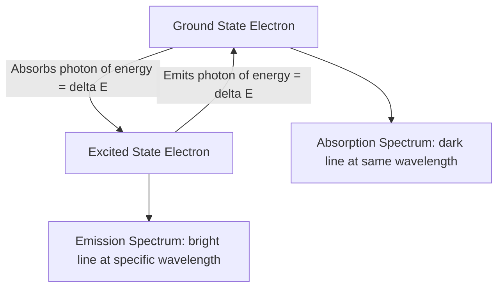

## Electromagnetic Radiation and Atomic Spectra

### Overview

Electromagnetic radiation is energy that travels through space as coupled electric and magnetic field oscillations, exhibiting both wave-like and particle-like behavior. The interaction of electromagnetic radiation with atoms produces atomic spectra, which provide direct experimental evidence for the quantized nature of electron energy levels and form the basis of the quantum mechanical model of the atom.

### Wave Properties of Electromagnetic Radiation

Electromagnetic radiation is characterized by several interrelated wave properties:

- **Wavelength ($\lambda$)**: The distance between successive crests of a wave, typically measured in meters or nanometers.
- **Frequency ($\nu$)**: The number of wave cycles passing a fixed point per second, measured in hertz (Hz, or $s^{-1}$).
- **Amplitude**: The height of the wave, related to the intensity (brightness) of the radiation.
- **Speed**: All electromagnetic radiation travels through a vacuum at the speed of light, $c = 2.998 \times 10^8 \text{ m/s}$.

**Relationship between wavelength and frequency**:

$$c = \lambda \nu$$

Since $c$ is constant, wavelength and frequency are inversely proportional: as wavelength increases, frequency decreases, and vice versa.

### The Electromagnetic Spectrum

The electromagnetic spectrum encompasses the full range of electromagnetic radiation, organized by wavelength and frequency, from longest wavelength (lowest energy) to shortest wavelength (highest energy):

| Region | Approximate Wavelength Range | Relative Energy |
| --- | --- | --- |
| Radio waves | > 1 m | Lowest |
| Microwaves | 1 mm – 1 m | Low |
| Infrared (IR) | 700 nm – 1 mm | Low–moderate |
| Visible light | 400–700 nm | Moderate |
| Ultraviolet (UV) | 10–400 nm | High |
| X-rays | 0.01–10 nm | Very high |
| Gamma rays | < 0.01 nm | Highest |

**Key Points**

- Visible light represents only a narrow band of the full electromagnetic spectrum, ranging approximately from 400 nm (violet) to 700 nm (red).
- Within the visible spectrum, color corresponds to wavelength: violet and blue have shorter wavelengths (higher energy), while orange and red have longer wavelengths (lower energy).

### Particle Nature of Light: Photons and Quantization

Max Planck proposed that electromagnetic energy is not emitted or absorbed continuously but in discrete packets called quanta. Albert Einstein extended this concept to explain the photoelectric effect, proposing that light itself consists of discrete particles called photons.

**Planck's Equation**

The energy of a single photon is directly proportional to its frequency:

$$E = h\nu$$

where $h$ is Planck's constant, $h = 6.626 \times 10^{-34} \text{ J·s}$.

Since $c = \lambda \nu$, this can also be expressed in terms of wavelength:

$$E = \frac{hc}{\lambda}$$

**Key Points**

- Higher frequency (shorter wavelength) radiation carries more energy per photon.
- Energy is quantized: only specific, discrete energy values are possible, not a continuous range.
- This wave-particle duality—light behaving as both a wave and a stream of particles—was a foundational departure from classical physics and directly informed the development of quantum mechanics.

### The Photoelectric Effect

The photoelectric effect refers to the emission of electrons from a metal surface when light of sufficient frequency strikes it.

**Key Observations**

- Electron emission occurs only above a threshold frequency, regardless of light intensity; increasing intensity below this threshold produces no emission.
- Above the threshold frequency, increasing light intensity increases the number of emitted electrons, not their individual kinetic energy.
- Increasing frequency above the threshold increases the kinetic energy of emitted electrons.

These observations could not be explained by classical wave theory, which predicted that sufficiently intense light of any frequency should eventually eject electrons. Einstein's photon model, in which each photon carries discrete energy $E = h\nu$ and interacts with a single electron, successfully accounted for the threshold behavior and earned him the 1921 Nobel Prize in Physics.

$$KE_{electron} = h\nu - \phi$$

where $\phi$ is the work function (minimum energy needed to eject an electron from the metal surface).

### Atomic Emission Spectra

When atoms absorb energy (e.g., from heat or an electric current), electrons are excited from lower to higher energy levels. As excited electrons return to lower energy states, they emit energy as photons of specific wavelengths, producing an emission spectrum.

**Key Points**

- Unlike a continuous spectrum (as produced by an incandescent solid), an atomic emission spectrum consists of discrete, sharp lines at specific wavelengths unique to each element.
- Each element produces a unique line spectrum, functioning like a spectroscopic "fingerprint" that can be used to identify elements, including in stars and distant astronomical objects.
- This line-based (rather than continuous) pattern was key experimental evidence that electron energy levels in atoms are quantized, directly supporting Bohr's atomic model.

### Atomic Absorption Spectra

When white light (containing a continuous range of wavelengths) passes through a gas of atoms, the atoms absorb photons with energies matching the exact energy differences between their electron energy levels. This produces an absorption spectrum: a continuous spectrum with dark lines at the specific wavelengths that were absorbed.

**Key Points**

- The wavelengths absorbed in an absorption spectrum correspond exactly to the wavelengths emitted in that element's emission spectrum, since both reflect the same set of energy level transitions.
- This complementary relationship is illustrated below.

### The Hydrogen Emission Spectrum and Bohr's Model

The hydrogen atom, having only one electron, produces a relatively simple line spectrum that was historically critical to developing quantum theory. Niels Bohr explained this spectrum by proposing that electrons occupy quantized energy levels, and that spectral lines result from electron transitions between these levels.

**Bohr's Frequency Condition**

$$\Delta E = E_{final} - E_{initial} = h\nu$$

**Energy of an electron in hydrogen at level $n$**:

$$E_n = -\frac{2.178 \times 10^{-18} \text{ J}}{n^2}$$

**Rydberg Equation** (predicts wavelengths of hydrogen's spectral lines):

$$\frac{1}{\lambda} = R_H \left( \frac{1}{n_1^2} - \frac{1}{n_2^2} \right)$$

where $R_H = 1.097 \times 10^7 \text{ m}^{-1}$ is the Rydberg constant, and $n_1 < n_2$ are the principal quantum numbers of the lower and higher energy levels involved in the transition.

### Spectral Series of Hydrogen

Transitions in the hydrogen spectrum are grouped into series based on the final energy level ($n_1$) the electron falls to:

| Series Name | Final Level ($n_1$) | Spectral Region |
| --- | --- | --- |
| Lyman series | 1 | Ultraviolet |
| Balmer series | 2 | Visible |
| Paschen series | 3 | Infrared |
| Brackett series | 4 | Infrared |
| Pfund series | 5 | Infrared |

**Example**

A transition from $n_2 = 3$ to $n_1 = 2$ (part of the Balmer series) produces a visible red spectral line at approximately 656 nm, corresponding to the well-known H-alpha emission line observed in astronomical spectra of hydrogen-rich nebulae and stars.

### Hydrogen Energy Level Diagram

<svg xmlns="http://www.w3.org/2000/svg" viewBox="0 0 500 350" font-family="sans-serif">
<text x="250" y="20" text-anchor="middle" font-size="14" font-weight="bold">Hydrogen Electron Transitions (svg_diagram)</text>

<line x1="60" y1="300" x2="440" y2="300" stroke="black" stroke-width="1.5" />
<text x="30" y="304" font-size="11">n=1</text>
<line x1="60" y1="230" x2="440" y2="230" stroke="black" stroke-width="1.5" />
<text x="30" y="234" font-size="11">n=2</text>
<line x1="60" y1="180" x2="440" y2="180" stroke="black" stroke-width="1.5" />
<text x="30" y="184" font-size="11">n=3</text>
<line x1="60" y1="145" x2="440" y2="145" stroke="black" stroke-width="1.5" />
<text x="30" y="149" font-size="11">n=4</text>
<line x1="60" y1="120" x2="440" y2="120" stroke="black" stroke-width="1.5" />
<text x="30" y="124" font-size="11">n=5</text>
<line x1="60" y1="90" x2="440" y2="90" stroke="black" stroke-width="1" stroke-dasharray="2,2" />
<text x="20" y="94" font-size="11">n=∞</text>

<line x1="120" y1="230" x2="120" y2="300" stroke="#8e44ad" stroke-width="1.5" marker-end="url(#arrow2)" />
<line x1="150" y1="180" x2="150" y2="300" stroke="#8e44ad" stroke-width="1.5" marker-end="url(#arrow2)" />
<text x="60" y="320" font-size="10" fill="#8e44ad">Lyman (UV)</text>

<line x1="250" y1="180" x2="250" y2="230" stroke="#c0392b" stroke-width="1.5" marker-end="url(#arrow2)" />
<line x1="290" y1="145" x2="290" y2="230" stroke="#c0392b" stroke-width="1.5" marker-end="url(#arrow2)" />
<text x="230" y="250" font-size="10" fill="#c0392b">Balmer (visible)</text>

<line x1="370" y1="145" x2="370" y2="180" stroke="#2980b9" stroke-width="1.5" marker-end="url(#arrow2)" />
<line x1="400" y1="120" x2="400" y2="180" stroke="#2980b9" stroke-width="1.5" marker-end="url(#arrow2)" />
<text x="340" y="200" font-size="10" fill="#2980b9">Paschen (IR)</text>
</svg>

### Sample Calculation: Photon Energy and Wavelength

**Example**

Calculate the wavelength of light emitted when a hydrogen electron transitions from $n=4$ to $n=2$.

$$\frac{1}{\lambda} = R_H \left( \frac{1}{2^2} - \frac{1}{4^2} \right) = 1.097 \times 10^7 \left( \frac{1}{4} - \frac{1}{16} \right)$$

$$\frac{1}{\lambda} = 1.097 \times 10^7 \times 0.1875 = 2.057 \times 10^6 \text{ m}^{-1}$$

$$\lambda = \frac{1}{2.057 \times 10^6} = 4.86 \times 10^{-7} \text{ m} = 486 \text{ nm}$$

This corresponds to a blue-green visible emission line, part of the Balmer series, consistent with experimentally observed hydrogen spectral data.

### Emission vs. Absorption Spectrum Comparison

| Feature | Emission Spectrum | Absorption Spectrum |
| --- | --- | --- |
| Background | Dark, with bright colored lines | Continuous/bright, with dark lines |
| Process | Electron falls from higher to lower energy level | Electron rises from lower to higher energy level |
| Energy change | Photon released | Photon absorbed |
| Line positions | Identical wavelengths for a given element | Identical wavelengths for a given element |

### Applications of Atomic Spectroscopy

- **Elemental identification**: Flame tests and spectroscopy identify unknown elements based on characteristic emission line patterns.
- **Astronomy**: Absorption and emission spectra of starlight reveal the elemental composition, temperature, and motion (via Doppler shift) of stars and galaxies.
- **Fireworks**: Metal salts produce characteristic colors when heated, due to electron transitions in metal ions (e.g., strontium for red, copper for blue-green, sodium for yellow).
- **Neon and fluorescent lighting**: Gas discharge produces characteristic emission colors based on the specific gas used.

### Common Mistakes to Avoid

- Confusing wavelength and frequency's proportional relationship; they are inversely, not directly, proportional.
- Assuming higher intensity alone can cause photoelectric emission below the threshold frequency; frequency, not intensity, determines whether emission occurs.
- Mixing up emission (energy released, electron falls) and absorption (energy absorbed, electron rises) processes.
- Forgetting that spectral lines are discrete, not continuous, which is the direct evidence for energy level quantization.

### Related Topics

- Historical development of atomic models
- Bohr's model and quantized energy levels
- Quantum numbers and electron configuration
- Wave-particle duality and de Broglie wavelength
- Photoelectric effect calculations
- Flame tests and qualitative elemental analysis
- Spectroscopy techniques in modern chemistry