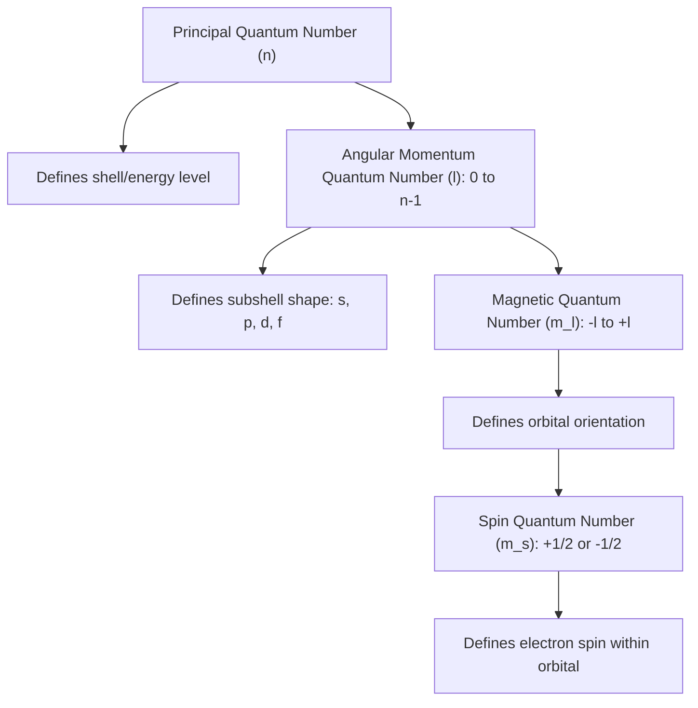

## Quantum Numbers and Atomic Orbitals

### Overview

Quantum numbers are a set of numerical values derived from solving the Schrödinger wave equation for the hydrogen atom. They describe the energy, shape, spatial orientation, and spin of an electron within an atom. Together, quantum numbers define atomic orbitals—three-dimensional regions of space where an electron is most likely to be found—and form the mathematical foundation for electron configuration and periodic trends.

### The Schrödinger Equation and Orbitals

Erwin Schrödinger's wave equation describes electrons not as particles following fixed paths, but as three-dimensional standing waves described by a wavefunction, $\psi$.

$$\hat{H}\psi = E\psi$$

**Key Points**

- The wavefunction ($\psi$) itself has no direct physical meaning, but $\psi^2$ (or $|\psi|^2$ for complex functions) represents the probability density of finding an electron at a given point in space.
- An atomic orbital is defined as the three-dimensional region where the probability of finding an electron is high (conventionally, a boundary surface enclosing ~90% probability).
- Orbitals are not fixed orbits (as in the Bohr model); they represent probability distributions, consistent with the Heisenberg uncertainty principle, which prohibits simultaneous exact knowledge of an electron's position and momentum.

### The Four Quantum Numbers

Four quantum numbers uniquely describe the state of each electron in an atom.

#### 1. Principal Quantum Number ($n$)

- Describes the main energy level (shell) of the electron and its relative distance from the nucleus.
- Allowed values: positive integers, $n = 1, 2, 3, \ldots$
- Higher $n$ values correspond to higher energy and greater average distance from the nucleus.
- The maximum number of electrons in a given shell is $2n^2$.

#### 2. Angular Momentum (Azimuthal) Quantum Number ($l$)

- Describes the shape of the orbital (subshell).
- Allowed values: integers from $0$ to $(n-1)$.
- Each value of $l$ corresponds to a subshell letter designation:

| $l$ value | Subshell letter | Orbital shape |
| --- | --- | --- |
| 0 | s | Spherical |
| 1 | p | Dumbbell (two lobes) |
| 2 | d | Cloverleaf (typically 4 lobes) or dumbbell with torus |
| 3 | f | Complex multi-lobed shapes |

#### 3. Magnetic Quantum Number ($m_l$)

- Describes the spatial orientation of the orbital within a subshell.
- Allowed values: integers from $-l$ to $+l$, including 0.
- The number of allowed $m_l$ values equals $(2l+1)$, which determines the number of orbitals in a subshell.

| Subshell | $l$ | $m_l$ values | Number of orbitals |
| --- | --- | --- | --- |
| s | 0 | 0 | 1 |
| p | 1 | -1, 0, +1 | 3 |
| d | 2 | -2, -1, 0, +1, +2 | 5 |
| f | 3 | -3, -2, -1, 0, +1, +2, +3 | 7 |

#### 4. Spin Quantum Number ($m_s$)

- Describes the intrinsic angular momentum ("spin") of the electron, a purely quantum mechanical property with no true classical analogue.
- Allowed values: $+\frac{1}{2}$ or $-\frac{1}{2}$.
- Each orbital can hold a maximum of two electrons, and those two electrons must have opposite spins (paired spins), consistent with the Pauli exclusion principle.

### Quantum Number Relationships Summary

### The Pauli Exclusion Principle

No two electrons in the same atom can have an identical set of all four quantum numbers. This principle explains why each orbital can hold a maximum of two electrons, and those two electrons must have opposite spins.

**Example**

For the two electrons occupying the 1s orbital of helium:

- Electron 1: $n=1$, $l=0$, $m_l=0$, $m_s=+\frac{1}{2}$
- Electron 2: $n=1$, $l=0$, $m_l=0$, $m_s=-\frac{1}{2}$

The two electrons share identical $n$, $l$, and $m_l$ values but differ in spin, satisfying the exclusion principle.

### Orbital Shapes

#### s Orbitals

Spherically symmetric around the nucleus; probability density depends only on distance from the nucleus, not direction. Each energy level has one s orbital.

#### p Orbitals

Dumbbell-shaped, with two lobes on either side of the nucleus separated by a nodal plane where electron probability is zero. Three p orbitals exist per energy level (beginning at $n=2$), oriented along the x, y, and z axes: $p_x$, $p_y$, $p_z$.

#### d Orbitals

More complex shapes, most commonly four-lobed "cloverleaf" patterns (with one exception, $d_{z^2}$, which has a dumbbell with a torus). Five d orbitals exist per energy level (beginning at $n=3$).

#### f Orbitals

Highly complex multi-lobed shapes with seven orbitals per energy level (beginning at $n=4$); rarely drawn in introductory courses due to their geometric complexity.

### Orbital Shape Illustrations

<svg xmlns="http://www.w3.org/2000/svg" viewBox="0 0 600 260" font-family="sans-serif">
<text x="300" y="20" text-anchor="middle" font-size="14" font-weight="bold">s, p, and d Orbital Shapes (svg_diagram)</text>

<g transform="translate(60,60)">
<circle cx="60" cy="60" r="45" fill="#a0c8e8" opacity="0.6" stroke="#2980b9" stroke-width="1.5" />
<circle cx="60" cy="60" r="3" fill="black" />
<text x="60" y="140" text-anchor="middle" font-size="12">s orbital</text>
</g>

<g transform="translate(240,60)">
<ellipse cx="35" cy="60" rx="30" ry="18" fill="#e8a0a0" opacity="0.6" stroke="#c0392b" stroke-width="1.5" />
<ellipse cx="85" cy="60" rx="30" ry="18" fill="#e8a0a0" opacity="0.6" stroke="#c0392b" stroke-width="1.5" />
<circle cx="60" cy="60" r="3" fill="black" />
<text x="60" y="140" text-anchor="middle" font-size="12">p orbital</text>
</g>

<g transform="translate(420,60)">
<ellipse cx="20" cy="20" rx="22" ry="14" fill="#a0e8b0" opacity="0.6" stroke="#27ae60" stroke-width="1.5" transform="rotate(-45 20 20)" />
<ellipse cx="100" cy="20" rx="22" ry="14" fill="#a0e8b0" opacity="0.6" stroke="#27ae60" stroke-width="1.5" transform="rotate(45 100 20)" />
<ellipse cx="20" cy="100" rx="22" ry="14" fill="#a0e8b0" opacity="0.6" stroke="#27ae60" stroke-width="1.5" transform="rotate(45 20 100)" />
<ellipse cx="100" cy="100" rx="22" ry="14" fill="#a0e8b0" opacity="0.6" stroke="#27ae60" stroke-width="1.5" transform="rotate(-45 100 100)" />
<circle cx="60" cy="60" r="3" fill="black" />
<text x="60" y="140" text-anchor="middle" font-size="12">d orbital (typical)</text>
</g>
</svg>

### Electron Capacity by Shell and Subshell

| Shell ($n$) | Subshells present | Orbitals | Max electrons ($2n^2$) |
| --- | --- | --- | --- |
| 1 | 1s | 1 | 2 |
| 2 | 2s, 2p | 4 | 8 |
| 3 | 3s, 3p, 3d | 9 | 18 |
| 4 | 4s, 4p, 4d, 4f | 16 | 32 |

**Example**

For $n=3$: $l$ can be 0, 1, or 2, giving subshells 3s, 3p, 3d. The 3d subshell has $m_l$ values of $-2, -1, 0, +1, +2$ (5 orbitals), holding up to 10 electrons; combined with 3s (2 electrons) and 3p (6 electrons), the $n=3$ shell holds a maximum of 18 electrons, consistent with $2(3)^2 = 18$.

### Nodes and Orbital Complexity

A node is a region where the probability of finding an electron is zero. The total number of nodes in an orbital is given by $n-1$, comprising both radial nodes (spherical surfaces) and angular nodes (planar or conical surfaces).

$$\text{Total nodes} = n - 1$$

$$\text{Angular nodes} = l$$

$$\text{Radial nodes} = n - l - 1$$

**Example**

For a 3p orbital ($n=3$, $l=1$): total nodes $= 3-1 = 2$; angular nodes $= 1$; radial nodes $= 3-1-1 = 1$.

### Quantum Numbers for the First Three Shells (Summary Table)

| $n$ | $l$ | Subshell | $m_l$ values | Orbitals | Max electrons |
| --- | --- | --- | --- | --- | --- |
| 1 | 0 | 1s | 0 | 1 | 2 |
| 2 | 0 | 2s | 0 | 1 | 2 |
| 2 | 1 | 2p | -1, 0, +1 | 3 | 6 |
| 3 | 0 | 3s | 0 | 1 | 2 |
| 3 | 1 | 3p | -1, 0, +1 | 3 | 6 |
| 3 | 2 | 3d | -2,-1,0,+1,+2 | 5 | 10 |

### Common Mistakes to Avoid

- Assuming $l$ can equal $n$; the correct range is $l = 0$ to $(n-1)$, so $l$ is always strictly less than $n$.
- Forgetting that the number of orbitals in a subshell is $(2l+1)$, not simply $l$.
- Confusing "orbital" (a specific spatial probability region holding up to 2 electrons) with "shell" or "subshell" (broader groupings of orbitals).
- Treating orbitals as fixed circular paths (a common misconception carried over from the Bohr model); orbitals are three-dimensional probability distributions, not trajectories.
- Assigning identical quantum number sets to two electrons in the same atom, which violates the Pauli exclusion principle.

### Related Topics

- Electron configuration and the Aufbau principle
- Hund's rule and orbital filling diagrams
- Historical development of atomic models
- Electromagnetic radiation and atomic spectra
- Heisenberg uncertainty principle
- Periodic table organization by electron configuration
- Valence electrons and chemical bonding