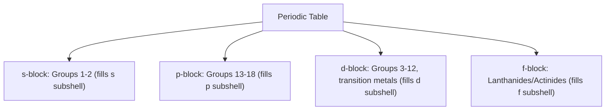

## Electron Configurations


### Overview

Electron configuration describes the distribution of electrons among the orbitals of an atom or ion. This distribution is governed by three fundamental principles—the Aufbau principle, the Pauli exclusion principle, and Hund's rule—and directly determines an element's chemical behavior, bonding capacity, and position on the periodic table.

### Governing Principles

#### Aufbau Principle

Electrons fill atomic orbitals starting from the lowest available energy level before occupying higher energy levels ("Aufbau" is German for "building up").

#### Pauli Exclusion Principle

No two electrons in the same atom can have an identical set of all four quantum numbers; consequently, each orbital can hold a maximum of two electrons, which must have opposite spins.

#### Hund's Rule

Electrons fill degenerate orbitals (orbitals of equal energy within the same subshell) singly, with parallel spins, before any orbital is doubly occupied. This minimizes electron-electron repulsion and results in a lower-energy, more stable configuration.

**Example**

For the three 2p orbitals in nitrogen (2p³), each of the three orbitals receives one electron with parallel spin before any pairing occurs:

$$\uparrow \quad \uparrow \quad \uparrow$$

rather than:

$$\uparrow\downarrow \quad \uparrow \quad \_$$

### Orbital Filling Order

Orbitals do not fill strictly in order of principal quantum number ($n$) because subshell energies overlap between shells (e.g., 4s fills before 3d). The correct filling order is typically visualized using the diagonal rule (Madelung's rule), where orbitals are filled in order of increasing $(n + l)$ value, and for equal $(n+l)$, the orbital with lower $n$ fills first.


**Key Points**

- 4s fills before 3d despite having a higher $n$ value, because $(4+0)=4$ for 4s while $(3+2)=5$ for 3d, giving 4s the lower combined value and thus lower energy at the point of filling.
- Once 3d orbitals are occupied in transition metals, they generally fall below the 4s level in energy for the resulting ion, which is why transition metal cations lose 4s electrons before 3d electrons during ionization. [Inference] This ordering reversal is a well-documented pattern for first-row transition metals; the precise energetic reasoning (orbital penetration and shielding effects) is a more advanced topic in inorganic chemistry.

### The Aufbau Diagram (Diagonal Rule)

<svg xmlns="http://www.w3.org/2000/svg" viewBox="0 0 500 380" font-family="sans-serif">
<text x="250" y="20" text-anchor="middle" font-size="14" font-weight="bold">Aufbau Filling Order Chart (svg_diagram)</text>

<g font-size="12">
<text x="40" y="60">1s</text>
<text x="40" y="90">2s</text><text x="100" y="90">2p</text>
<text x="40" y="120">3s</text><text x="100" y="120">3p</text><text x="160" y="120">3d</text>
<text x="40" y="150">4s</text><text x="100" y="150">4p</text><text x="160" y="150">4d</text><text x="220" y="150">4f</text>
<text x="40" y="180">5s</text><text x="100" y="180">5p</text><text x="160" y="180">5d</text><text x="220" y="180">5f</text>
<text x="40" y="210">6s</text><text x="100" y="210">6p</text><text x="160" y="210">6d</text>
<text x="40" y="240">7s</text>
</g>

<line x1="35" y1="55" x2="35" y2="55" stroke="#c0392b" />
<path d="M35,55 L35,85 L95,85 L35,115 L95,115 L155,115 L35,145 L95,145 L155,145 L215,145 L35,175 L95,175 L155,175 L215,175 L35,205 L95,205 L155,205 L35,235" stroke="#c0392b" stroke-width="1.2" fill="none" stroke-dasharray="2,2" opacity="0.5" />

<text x="250" y="280" font-size="11" text-anchor="middle">Follow diagonal arrows from top to bottom-left for correct filling order</text>

<text x="250" y="300" font-size="11" text-anchor="middle">(1s, 2s, 2p, 3s, 3p, 4s, 3d, 4p, 5s, 4d, 5p, 6s...)</text>

</svg>

### Writing Electron Configurations

Electron configurations are written using the format: subshell label followed by a superscript indicating the number of electrons in that subshell, e.g., $1s^2 2s^2 2p^6$.

**Example: Full Electron Configurations**

| Element | Atomic Number | Electron Configuration |
| --- | --- | --- |
| Hydrogen | 1 | $1s^1$ |
| Helium | 2 | $1s^2$ |
| Carbon | 6 | $1s^2 2s^2 2p^2$ |
| Neon | 10 | $1s^2 2s^2 2p^6$ |
| Sodium | 11 | $1s^2 2s^2 2p^6 3s^1$ |
| Chlorine | 17 | $1s^2 2s^2 2p^6 3s^2 3p^5$ |
| Calcium | 20 | $1s^2 2s^2 2p^6 3s^2 3p^6 4s^2$ |
| Iron | 26 | $1s^2 2s^2 2p^6 3s^2 3p^6 4s^2 3d^6$ |

### Noble Gas (Condensed) Notation

Full electron configurations become lengthy for heavier elements. Noble gas notation abbreviates the configuration by replacing the inner, filled shells with the symbol of the preceding noble gas in brackets, writing only the additional (valence) electrons explicitly.

**Example**

- Sodium (full): $1s^2 2s^2 2p^6 3s^1$
- Sodium (condensed): $[\text{Ne}] 3s^1$, since neon ($1s^2 2s^2 2p^6$) is the preceding noble gas.
- Iron (full): $1s^2 2s^2 2p^6 3s^2 3p^6 4s^2 3d^6$
- Iron (condensed): $[\text{Ar}] 4s^2 3d^6$

### Orbital Diagrams (Box Notation)

Orbital diagrams visually represent electron configuration using boxes (or lines) for orbitals and arrows for electrons, explicitly showing spin pairing and Hund's rule application.

**Example: Nitrogen ($1s^2 2s^2 2p^3$)**

```plaintext
1s: [↑↓]
2s: [↑↓]
2p: [↑] [↑] [↑]
```

Each 2p orbital receives one electron before pairing begins, consistent with Hund's rule, maximizing the number of unpaired electrons.

### Valence Electrons and the Periodic Table

Valence electrons are the electrons in the outermost principal energy level (highest $n$) of an atom, and they are primarily responsible for chemical bonding and reactivity.

**Key Points**

- The number of valence electrons for main-group elements corresponds to the group number pattern on the periodic table (e.g., Group 1 elements have 1 valence electron, Group 17 elements have 7).
- Elements within the same group share the same number of valence electrons, which explains their similar chemical properties.
- The periodic table itself is organized based on electron configuration: its block structure (s, p, d, f) directly corresponds to which subshell is being filled.

### Periodic Table Blocks by Electron Configuration



### Exceptions to the Aufbau Principle

A small number of elements deviate from the predicted filling order because half-filled and fully-filled subshells confer extra stability due to symmetric electron distribution and favorable exchange energy.

**Example**

- Chromium (expected: $[\text{Ar}] 4s^2 3d^4$; actual: $[\text{Ar}] 4s^1 3d^5$), gaining extra stability from a half-filled 3d subshell.
- Copper (expected: $[\text{Ar}] 4s^2 3d^9$; actual: $[\text{Ar}] 4s^1 3d^{10}$), gaining extra stability from a fully-filled 3d subshell.

[Inference] Similar exceptions occur among heavier transition metals (e.g., molybdenum, silver) and are generally attributed to the same half-filled/fully-filled stability principle, though the precise magnitude of stabilization varies by element and is a more advanced topic in inorganic electronic structure theory.

### Electron Configurations of Ions

**Cations**: Electrons are removed from the orbital with the highest principal quantum number first, and for transition metals, the outermost $s$ electrons are removed before $d$ electrons, even though $s$ filled first.

**Example**

- Iron (Fe): $[\text{Ar}] 4s^2 3d^6$
- Fe²⁺ (lose 2 electrons from 4s first): $[\text{Ar}] 3d^6$
- Fe³⁺ (lose 2 from 4s, 1 from 3d): $[\text{Ar}] 3d^5$

**Anions**: Electrons are added to the next available orbital following the standard Aufbau order.

**Example**

- Oxygen (O): $1s^2 2s^2 2p^4$
- O²⁻ (gain 2 electrons): $1s^2 2s^2 2p^6$ (isoelectronic with neon)

### Isoelectronic Species

Isoelectronic species are atoms or ions that share the same electron configuration (same number and arrangement of electrons), though they differ in atomic number and nuclear charge.

**Example**

$\text{N}^{3-}$, $\text{O}^{2-}$, $\text{F}^-$, $\text{Ne}$, $\text{Na}^+$, and $\text{Mg}^{2+}$ are all isoelectronic, each possessing the configuration $1s^2 2s^2 2p^6$ (10 electrons total), despite having different atomic numbers ranging from 7 to 12.

### Common Mistakes to Avoid

- Filling 3d before 4s; the correct Aufbau order places 4s before 3d, though 4s electrons are removed first during ionization.
- Forgetting Hund's rule and pairing electrons within a subshell before every orbital has at least one electron.
- Omitting or mislabeling noble gas notation brackets (e.g., writing $[\text{Ne}]$ for an element whose preceding noble gas is actually argon).
- Assuming all elements follow the Aufbau principle without exception; chromium, copper, and select other transition metals deviate due to subshell stability effects.
- Confusing valence electrons (outermost shell electrons involved in bonding) with total electron count.

### Related Topics

- Quantum numbers and atomic orbitals
- Periodic table organization and periodic trends
- Ionic bonding and ion formation
- Valence electrons and Lewis dot structures
- Transition metal chemistry and oxidation states
- Effective nuclear charge and shielding
- Paramagnetism and diamagnetism