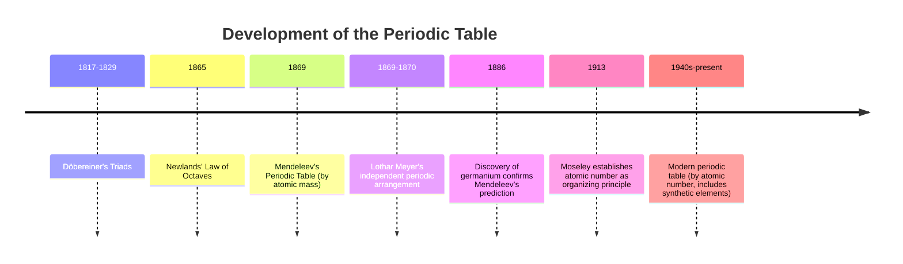

## Development of the Periodic Table

### Overview

The periodic table is the organizing framework of chemistry, arranging all known elements according to their atomic structure and recurring chemical properties. Its development spanned over a century of experimental discovery and theoretical refinement, evolving from early attempts at classification by atomic mass to the modern arrangement based on atomic number and electron configuration.

### Early Classification Attempts

#### Döbereiner's Triads (1817–1829)

Johann Wolfgang Döbereiner, a German chemist, observed that certain groups of three elements with similar chemical properties ("triads") showed a mathematical relationship: the atomic mass of the middle element was approximately the average of the outer two.

**Example**

- Chlorine, bromine, iodine: the atomic mass of bromine (~80) is close to the average of chlorine (~35.5) and iodine (~127), i.e., $(35.5 + 127)/2 \approx 81$.
- Calcium, strontium, barium formed a similar triad.

This was an early, limited pattern that applied to only a small number of element groupings and did not extend to a comprehensive classification system.

#### Newlands' Law of Octaves (1865)

English chemist John Newlands arranged known elements in order of increasing atomic mass and observed that every eighth element exhibited similar properties, drawing an analogy to musical octaves.

**Key Points**

- The pattern held reasonably well for lighter elements but broke down for heavier elements, since the "octave" spacing did not account for the later discovery of transition metals and other groups that disrupted the strict eight-element periodicity.
- Newlands' proposal was initially met with skepticism and even ridicule from the scientific community, partly because the musical analogy seemed unscientific and because the pattern's exceptions were not yet explainable.
- [Inference] Newlands' contribution is now recognized as an important precursor to Mendeleev's more successful periodic law, though it lacked the flexibility (such as leaving gaps for undiscovered elements) that made Mendeleev's table more robust.

### Mendeleev's Periodic Table (1869)

Russian chemist Dmitri Mendeleev is credited with developing the first widely accepted periodic table, arranging the 63 elements known at the time primarily by increasing atomic mass, while grouping elements with similar chemical properties into columns.

**Key Innovations**

- Mendeleev deliberately left gaps in his table for elements he predicted existed but had not yet been discovered, based on breaks in the periodic pattern of properties.
- He used these gaps to accurately predict the existence and properties of undiscovered elements, including "eka-silicon" (later confirmed as germanium), "eka-aluminum" (later confirmed as gallium), and "eka-boron" (later confirmed as scandium).
- Where strict ordering by atomic mass would have placed an element in a column with dissimilar chemical properties, Mendeleev sometimes reordered elements based on observed chemical behavior instead, correctly anticipating that atomic mass measurements of the era might have been imprecise, or that a more fundamental property governed periodicity.

**Example**

Mendeleev's prediction of eka-silicon (1871) specified a density of approximately 5.5 g/cm³ and other properties; when germanium was discovered by Clemens Winkler in 1886, its measured density (approximately 5.35 g/cm³) and other properties closely matched Mendeleev's forecast, providing strong validation for the periodic law.

### Lothar Meyer's Independent Contribution

German chemist Julius Lothar Meyer independently developed a periodic arrangement of elements at approximately the same time as Mendeleev, based on periodic trends in atomic volume plotted against atomic mass. While Meyer's work is historically significant and closely paralleled Mendeleev's, Mendeleev is more widely credited due to the predictive power and specificity of his table, particularly his successful predictions of undiscovered elements.

### Resolving Anomalies: Atomic Mass vs. Atomic Number

Mendeleev's table, based on atomic mass, contained a small number of inversions where strict mass ordering placed elements in incorrect groups based on their chemical properties (e.g., tellurium and iodine, where tellurium has a higher atomic mass but was placed before iodine to preserve correct group properties).

#### Moseley's Contribution (1913)

English physicist Henry Moseley used X-ray spectroscopy to measure the nuclear charge (atomic number) of elements directly, establishing that atomic number—not atomic mass—is the fundamental property governing periodicity.

**Key Points**

- Moseley discovered a mathematical relationship between the frequency of X-rays emitted by an element and its atomic number, allowing direct experimental determination of atomic number for the first time.
- This resolved the tellurium-iodine anomaly and similar inversions, since ordering by atomic number placed all elements correctly according to their chemical properties.
- The modern periodic law is now stated as: the properties of elements are a periodic function of their atomic number (not atomic mass).

$$\text{Modern Periodic Law: properties recur periodically with increasing atomic number } (Z)$$

### Timeline of Periodic Table Development

### Structure of the Modern Periodic Table

The modern periodic table arranges elements in order of increasing atomic number, organized into rows (periods) and columns (groups/families).

**Key Points**

- **Periods** (horizontal rows): Elements in the same period have the same number of principal electron shells; there are 7 periods in the standard table.
- **Groups** (vertical columns): Elements in the same group have the same number of valence electrons and therefore similar chemical properties; there are 18 groups.
- **Blocks**: The table is divided into s-block, p-block, d-block (transition metals), and f-block (lanthanides and actinides) regions based on which subshell is being filled by the outermost electrons.

### Major Regions of the Periodic Table

| Region | Groups/Location | Key Characteristics |
| --- | --- | --- |
| Alkali metals | Group 1 | Highly reactive, 1 valence electron, low ionization energy |
| Alkaline earth metals | Group 2 | Reactive, 2 valence electrons |
| Transition metals | Groups 3–12 | Variable oxidation states, often colored compounds |
| Halogens | Group 17 | Highly reactive nonmetals, 7 valence electrons |
| Noble gases | Group 18 | Largely unreactive, full valence shell |
| Lanthanides | Period 6, f-block | Similar properties, filling 4f subshell |
| Actinides | Period 7, f-block | Mostly radioactive, filling 5f subshell |

### Periodic Table Organization Diagram

<svg xmlns="http://www.w3.org/2000/svg" viewBox="0 0 600 300" font-family="sans-serif">
<text x="300" y="20" text-anchor="middle" font-size="14" font-weight="bold">Periodic Table Block Structure (svg_diagram)</text>

<rect x="40" y="50" width="60" height="140" fill="#e8a0a0" opacity="0.6" stroke="#c0392b" />
<text x="70" y="200" text-anchor="middle" font-size="11">s-block</text>

<rect x="100" y="50" width="300" height="100" fill="#a0c8e8" opacity="0.6" stroke="#2980b9" />
<text x="250" y="200" text-anchor="middle" font-size="11">d-block (transition metals)</text>

<rect x="400" y="50" width="150" height="140" fill="#a0e8b0" opacity="0.6" stroke="#27ae60" />
<text x="475" y="200" text-anchor="middle" font-size="11">p-block</text>

<rect x="100" y="230" width="300" height="40" fill="#e8d0a0" opacity="0.6" stroke="#d68910" />
<text x="250" y="285" text-anchor="middle" font-size="11">f-block (lanthanides/actinides)</text>
</svg>

### Modern Developments: Synthetic Elements

Since the mid-20th century, elements beyond uranium (atomic number 92), which occur negligibly or not at all in nature, have been synthesized in laboratories via particle accelerators and nuclear reactors. As of the most recent complete row of the periodic table, all 118 elements through oganesson (element 118) have been synthesized and officially named, completing period 7.

**Key Points**

- Synthetic (transuranium) elements are typically extremely unstable, with half-lives ranging from seconds to microseconds for the heaviest known elements.
- The International Union of Pure and Applied Chemistry (IUPAC) is the body responsible for officially recognizing and naming newly discovered or synthesized elements.
- [Unverified] Ongoing research into elements beyond 118 continues; the discovery and confirmation status of elements beyond the currently completed periodic table should be verified against current IUPAC announcements, since this is an active area of research subject to change.

### Comparative Summary of Key Contributors

| Scientist | Contribution | Organizing Principle |
| --- | --- | --- |
| Döbereiner | Triads | Atomic mass (limited groups) |
| Newlands | Law of Octaves | Atomic mass (periodicity of 8) |
| Mendeleev | First widely accepted table, predicted new elements | Atomic mass, with gaps for undiscovered elements |
| Lothar Meyer | Independent periodic arrangement | Atomic volume vs. atomic mass |
| Moseley | Established atomic number as the true organizing basis | Atomic number (nuclear charge) |

### Common Mistakes to Avoid

- Crediting Mendeleev with organizing the table by atomic number; his original table was based on atomic mass, and the shift to atomic number came later through Moseley's work.
- Assuming Newlands' Law of Octaves was fully accurate; it broke down for heavier elements and is now understood as a precursor rather than a complete solution.
- Overlooking that Mendeleev's predictive success (not just classification) is what distinguished his table from earlier attempts.
- Confusing periods (rows, sharing the same number of shells) with groups (columns, sharing the same number of valence electrons).

### Related Topics

- Modern periodic law and atomic number
- Periodic trends arising from atomic structure
- Classification of elements: metals, nonmetals, metalloids
- Electron configuration and the periodic table's block structure
- Group and period properties
- Discovery and synthesis of transuranium elements
- Moseley's X-ray spectroscopy and atomic number determination