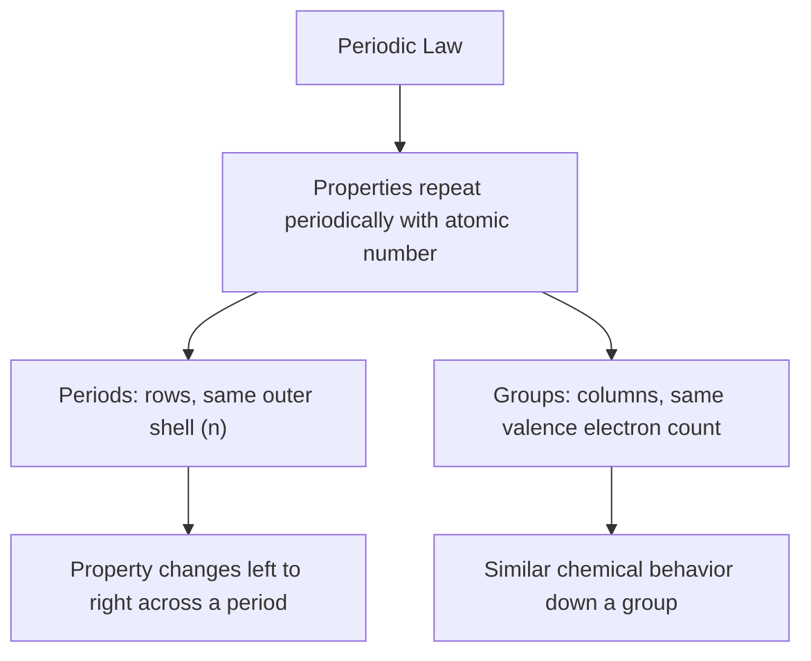

## The Periodic Law and Classification of Elements

### Overview

The periodic law is the fundamental principle stating that the physical and chemical properties of elements recur in a predictable, periodic pattern when elements are arranged in order of increasing atomic number. This law underlies the entire structure of the periodic table and provides the basis for classifying elements into broad categories—metals, nonmetals, and metalloids—according to shared structural and behavioral characteristics.

### Statement of the Modern Periodic Law

$$\text{The physical and chemical properties of elements are periodic functions of their atomic number.}$$

**Key Points**

- The modern periodic law supersedes Mendeleev's original formulation, which was based on atomic mass; Henry Moseley's X-ray spectroscopy work (1913) established atomic number as the correct underlying organizing variable.
- "Periodic" means that properties repeat at regular, predictable intervals as atomic number increases, rather than varying randomly.
- The recurrence of properties arises directly from the repeating pattern of valence electron configurations as successive principal energy levels are filled.

### Why Periodicity Occurs: Electron Configuration Basis

Periodicity is a direct consequence of the recurring pattern in which electrons fill orbitals. As atomic number increases, elements periodically return to similar valence electron configurations, producing similar chemical behavior at regular intervals.

**Example**

Lithium ($1s^2 2s^1$), sodium ($[\text{Ne}]3s^1$), and potassium ($[\text{Ar}]4s^1$) all share a single valence electron in an s orbital, despite substantial differences in atomic number (3, 11, and 19 respectively). This shared valence configuration explains their similar chemical reactivity, particularly their tendency to lose one electron and form +1 cations.

### Periods and Groups

**Periods** (horizontal rows) correspond to the principal quantum number ($n$) of the outermost occupied shell. All elements in a given period have valence electrons in the same principal energy level.

**Groups** (vertical columns) contain elements with the same number and arrangement of valence electrons, resulting in similar chemical properties and reactivity patterns.

### Classification of Elements: Metals, Nonmetals, and Metalloids

Elements are broadly classified into three categories based on their physical and chemical properties, which correlate directly with their position on the periodic table and underlying electron configuration.

#### Metals

**Key Points**

- Located on the left and center of the periodic table (s-block, d-block, f-block, and part of the p-block).
- Comprise the majority of known elements (approximately 75–80% of the periodic table).
- Characteristic physical properties: malleable (can be hammered into sheets), ductile (can be drawn into wires), lustrous (shiny), and good conductors of heat and electricity.
- Chemical behavior: tend to lose electrons in reactions, forming positively charged cations; generally have low ionization energies and low electronegativities.
- Solid at room temperature, with the notable exception of mercury, which is liquid.

#### Nonmetals

**Key Points**

- Located on the upper right of the periodic table (most of the p-block, plus hydrogen).
- Physical properties: brittle in solid form (if solid), lack metallic luster, poor conductors of heat and electricity (with the exception of graphite, a form of carbon).
- Chemical behavior: tend to gain electrons in reactions, forming negatively charged anions; generally have high ionization energies and high electronegativities.
- Exist in all three physical states at room temperature: gases (e.g., oxygen, nitrogen), liquids (e.g., bromine), and solids (e.g., sulfur, carbon).

#### Metalloids (Semimetals)

**Key Points**

- Located along the "staircase" boundary line separating metals and nonmetals on the periodic table.
- Commonly recognized metalloids include boron, silicon, germanium, arsenic, antimony, and tellurium. [Inference] The exact list of elements classified as metalloids varies somewhat between chemistry textbooks and sources, particularly regarding borderline elements such as polonium and astatine.
- Exhibit intermediate properties between metals and nonmetals: they typically have a metallic appearance but are brittle like nonmetals.
- Notably function as semiconductors, meaning their electrical conductivity lies between that of conductors (metals) and insulators (nonmetals) and can be modified by temperature, light, or the addition of impurities (doping)—a property that underlies their extensive use in electronics.

### Periodic Table Regions by Classification (Diagram)

<svg xmlns="http://www.w3.org/2000/svg" viewBox="0 0 600 320" font-family="sans-serif">
<text x="300" y="20" text-anchor="middle" font-size="14" font-weight="bold">Metal, Nonmetal, and Metalloid Regions (svg_diagram)</text>

<rect x="40" y="50" width="360" height="150" fill="#a0c8e8" opacity="0.5" stroke="#2980b9" />
<text x="220" y="210" text-anchor="middle" font-size="12">Metals</text>

<path d="M400,50 L400,90 L440,90 L440,130 L480,130 L480,170 L520,170 L520,200" fill="none" stroke="`#d68910`" stroke-width="3" />

<text x="460" y="225" text-anchor="middle" font-size="11" fill="`#d68910`">Metalloids (staircase)</text>

<rect x="440" y="50" width="110" height="150" fill="#a0e8b0" opacity="0.5" stroke="#27ae60" />
<text x="495" y="250" text-anchor="middle" font-size="12">Nonmetals</text>

<rect x="40" y="50" width="30" height="20" fill="#a0e8b0" opacity="0.7" stroke="#27ae60" />
<text x="90" y="275" font-size="10">H (hydrogen) is classified as a nonmetal despite its left-side position</text>
</svg>

### Comparative Property Table

| Property | Metals | Nonmetals | Metalloids |
| --- | --- | --- | --- |
| Luster | Shiny | Dull | Variable, often shiny |
| Malleability | Malleable/ductile | Brittle (if solid) | Brittle |
| Conductivity | Good conductors | Poor conductors (except graphite) | Semiconductors |
| Ionization energy | Low | High | Intermediate |
| Electronegativity | Low | High | Intermediate |
| Typical ion formed | Cation (loses electrons) | Anion (gains electrons) | Variable |
| State at room temperature | Mostly solid (Hg liquid) | Gas, liquid, or solid | Mostly solid |

### Special Element Classifications

Beyond the broad metal/nonmetal/metalloid division, several elements or groups receive special classification labels based on distinctive shared properties:

- **Alkali metals** (Group 1, excluding hydrogen): Extremely reactive metals with a single valence electron; react vigorously with water to produce hydrogen gas and a metal hydroxide.
- **Alkaline earth metals** (Group 2): Reactive metals with two valence electrons; generally less reactive than alkali metals.
- **Halogens** (Group 17): Highly reactive nonmetals with seven valence electrons; readily gain one electron to achieve a stable octet.
- **Noble gases** (Group 18): Largely chemically inert due to a complete valence electron shell (octet, or duet for helium); historically considered entirely unreactive, though a small number of noble gas compounds (e.g., xenon compounds) have been synthesized under specialized laboratory conditions.
- **Transition metals** (Groups 3–12): Characterized by partially filled d orbitals, giving rise to variable oxidation states, frequently colored compounds, and catalytic activity.
- **Lanthanides and actinides**: f-block elements exhibiting similar chemical properties within each series due to filling of inner f orbitals, which have minimal influence on outer valence chemistry.

### Periodicity of Key Properties

The periodic law manifests concretely in the regular variation of measurable properties across the table, including atomic radius, ionization energy, electron affinity, and electronegativity—each of which follows a predictable increasing or decreasing pattern across periods and down groups, arising from the systematic changes in effective nuclear charge and electron shell structure. (See the related topic on periodic trends for detailed treatment of these individual property patterns.)

### Worked Example: Classifying an Unknown Element

**Example**

An element X has the electron configuration $[\text{Ne}]3s^2 3p^3$, is a dull, brittle solid at room temperature, and is a poor conductor of electricity except under specific conditions.

- Valence configuration $3s^2 3p^3$ places it in Group 15, Period 3, identifying it as phosphorus.
- Its properties (dull, brittle, poor conductor) are consistent with nonmetal classification, matching phosphorus's established classification as a nonmetal on the periodic table.

### Common Mistakes to Avoid

- Assuming hydrogen is a metal because of its position in Group 1; hydrogen is classified as a nonmetal due to its chemical behavior (it does not exhibit metallic properties under standard conditions).
- Treating the metal/nonmetal/metalloid boundary as a rigid, universally agreed-upon line; classification of borderline elements can vary between sources.
- Confusing the periodic law (properties are a function of atomic number) with the outdated historical version based on atomic mass.
- Assuming all noble gases are entirely unreactive; select heavier noble gases (e.g., xenon, krypton) can form compounds under specific laboratory conditions.

### Related Topics

- Development of the periodic table
- Periodic trends arising from atomic structure
- Electron configurations and valence electrons
- Groups, periods, and blocks of the periodic table
- Chemical reactivity of alkali metals and halogens
- Transition metal chemistry and variable oxidation states
- Semiconductors and metalloid applications in electronics