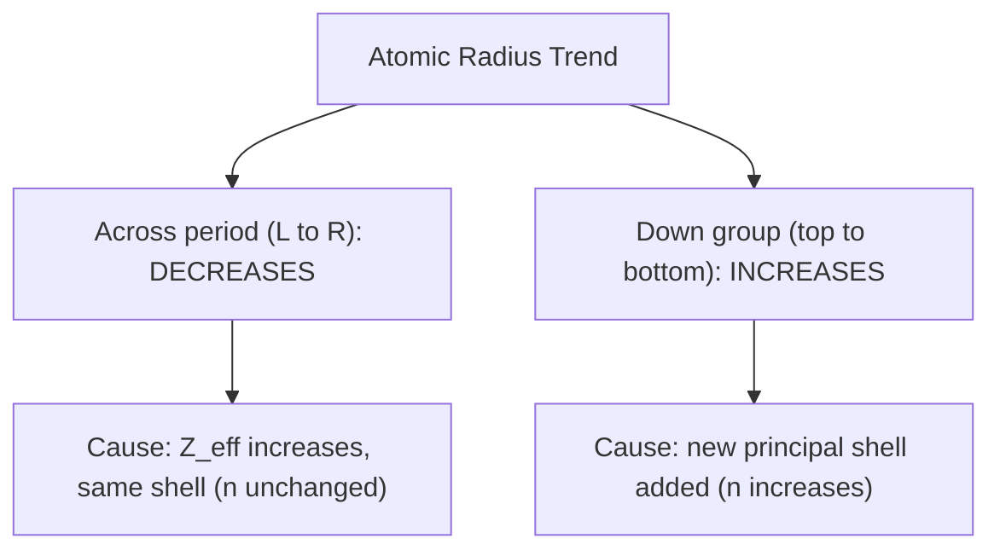

## Trends in Atomic and Ionic Radius

### Overview

Atomic and ionic radius are fundamental periodic properties describing the effective size of atoms and ions. These radii cannot be measured as a single fixed value (since electron probability distributions extend infinitely in theory), but are instead operationally defined through measurable distances between bonded or adjacent atoms. Their systematic variation across the periodic table provides direct evidence for the underlying principles of effective nuclear charge and electron shell structure.

### Defining Atomic Radius

Because electron clouds do not have sharply defined boundaries, atomic radius is defined operationally based on measurable internuclear distances, using one of several conventions depending on the type of bonding present.

**Types of Atomic Radius Measurement**

| Type | Definition | Applies To |
| --- | --- | --- |
| Covalent radius | Half the distance between the nuclei of two identical atoms joined by a single covalent bond | Nonmetals, molecules |
| Metallic radius | Half the distance between adjacent nuclei in a metallic crystal lattice | Metals |
| Van der Waals radius | Half the distance between nuclei of two non-bonded atoms of the same element in contact (e.g., in adjacent molecules) | Noble gases, non-bonded interactions |

**Key Points**

- Van der Waals radii are generally larger than covalent radii for the same element, since they measure the non-bonded contact distance rather than the shorter, tightly bonded distance.
- Atomic radius measurements can vary slightly depending on the measurement technique and the specific compound or environment used as a reference, so published values may differ modestly between sources. [Unverified] Exact radius values can vary by several picometers between different reference tables; the general trend direction, however, is consistently well established.

### Atomic Radius Trend Across a Period

Atomic radius decreases from left to right across a period.

**Explanation**

As atomic number increases across a period, protons are added to the nucleus while additional electrons occupy the same principal energy level (same $n$). Electrons within the same shell shield each other only weakly from the increasing nuclear charge. Consequently, effective nuclear charge ($Z_{eff}$) increases steadily across the period, pulling the valence electron cloud closer to the nucleus and producing a smaller atomic radius.

$$Z_{eff} = Z - S$$

where $S$ (shielding constant) increases only slightly across a period, while $Z$ (nuclear charge) increases by a full unit with each element.

### Atomic Radius Trend Down a Group

Atomic radius increases from top to bottom down a group.

**Explanation**

Each successive element in a group adds a new principal energy level (higher $n$), placing the valence electrons in a shell farther from the nucleus. Complete inner electron shells shield outer electrons from the nucleus effectively, so despite the increase in nuclear charge, the dominant effect is the increased distance from added electron shells, resulting in a larger atomic radius.

### Periodic Trend Diagram: Atomic Radius

### Atomic Radius Visualization

<svg xmlns="http://www.w3.org/2000/svg" viewBox="0 0 600 260" font-family="sans-serif">
<text x="300" y="20" text-anchor="middle" font-size="14" font-weight="bold">Atomic Radius Across Period 3 (svg_diagram)</text>
<g transform="translate(40,60)">
<circle cx="40" cy="80" r="55" fill="#a0c8e8" opacity="0.5" stroke="#2980b9" />
<text x="40" y="160" text-anchor="middle" font-size="11">Na (186 pm)</text>
</g>
<g transform="translate(160,60)">
<circle cx="40" cy="80" r="45" fill="#a0c8e8" opacity="0.5" stroke="#2980b9" />
<text x="40" y="160" text-anchor="middle" font-size="11">Mg (160 pm)</text>
</g>
<g transform="translate(270,60)">
<circle cx="40" cy="80" r="38" fill="#a0c8e8" opacity="0.5" stroke="#2980b9" />
<text x="40" y="160" text-anchor="middle" font-size="11">Al (143 pm)</text>
</g>
<g transform="translate(370,60)">
<circle cx="40" cy="80" r="30" fill="#a0c8e8" opacity="0.5" stroke="#2980b9" />
<text x="40" y="160" text-anchor="middle" font-size="11">Si (117 pm)</text>
</g>
<g transform="translate(460,60)">
<circle cx="40" cy="80" r="25" fill="#a0c8e8" opacity="0.5" stroke="#2980b9" />
<text x="40" y="160" text-anchor="middle" font-size="11">P (110 pm)</text>
</g>
<g transform="translate(540,60)">
<circle cx="30" cy="80" r="20" fill="#a0c8e8" opacity="0.5" stroke="#2980b9" />
<text x="30" y="160" text-anchor="middle" font-size="10">S (104 pm)</text>
</g>

<text x="300" y="200" text-anchor="middle" font-size="11">Radius decreases with increasing atomic number across the period</text>

</svg>

[Unverified] The specific picometer values shown are representative approximations commonly cited in general chemistry references; exact figures vary slightly by source and measurement method.

### Ionic Radius: Cations vs. Anions

Ion formation alters atomic size predictably based on whether electrons are removed or added.

#### Cations (Positive Ions)

- Formed by loss of one or more electrons.
- Cations are always smaller than their parent neutral atom.
- Removing electrons decreases electron-electron repulsion, allowing remaining electrons to be pulled closer to the nucleus; in many cases, removing valence electrons also eliminates an entire outer principal shell, further reducing size substantially.

**Example**

Sodium atom (Na, radius ≈186 pm) loses its single 3s valence electron to form Na⁺ (radius ≈102 pm), eliminating the entire third shell and leaving the smaller, more tightly held second shell as the outermost occupied level.

#### Anions (Negative Ions)

- Formed by gain of one or more electrons.
- Anions are always larger than their parent neutral atom.
- Added electrons increase electron-electron repulsion within the same shell, causing the electron cloud to expand outward, while nuclear charge remains unchanged.

**Example**

Chlorine atom (Cl, radius ≈99 pm) gains one electron to form Cl⁻ (radius ≈181 pm), with increased electron-electron repulsion causing significant expansion of the electron cloud.

### Ionic Radius Trends Within a Group and Period

**Down a group**: Ionic radius increases for ions of the same charge type, following the same logic as atomic radius (additional principal shells).

**Across a period**: Ionic radius trends are more complex, since ion charge changes across the period (cations on the left, anions on the right); however, within a series of cations or within a series of anions separately, radius generally decreases as nuclear charge increases (for the same electron count).

### Isoelectronic Series

An isoelectronic series consists of ions (and sometimes atoms) that possess the identical electron configuration (same total electron count) despite differing atomic numbers. Within an isoelectronic series, ionic radius decreases as nuclear charge (atomic number) increases, since a stronger effective nuclear charge pulls the same fixed number of electrons more tightly toward the nucleus.

**Example**

The isoelectronic series with 18 electrons each (configuration $1s^2 2s^2 2p^6 3s^2 3p^6$):

$$\text{P}^{3-} > \text{S}^{2-} > \text{Cl}^- > \text{K}^+ > \text{Ca}^{2+} > \text{Sc}^{3+}$$

As nuclear charge increases from 15 (P) to 21 (Sc) while electron count remains fixed at 18, ionic radius decreases steadily due to increasing $Z_{eff}$ per electron.

### Ionic Radius Comparison Diagram

<svg xmlns="http://www.w3.org/2000/svg" viewBox="0 0 500 220" font-family="sans-serif">
<text x="250" y="20" text-anchor="middle" font-size="14" font-weight="bold">Atom vs. Ion Size Comparison (svg_diagram)</text>

<g transform="translate(60,50)">
<circle cx="50" cy="70" r="48" fill="#a0c8e8" opacity="0.4" stroke="#2980b9" />
<text x="50" y="150" text-anchor="middle" font-size="11">Na (atom)</text>
<circle cx="150" cy="70" r="25" fill="#2980b9" opacity="0.6" stroke="#2980b9" />
<text x="150" y="150" text-anchor="middle" font-size="11">Na⁺ (cation, smaller)</text>
</g>

<g transform="translate(280,50)">
<circle cx="30" cy="70" r="26" fill="#a0e8b0" opacity="0.4" stroke="#27ae60" />
<text x="30" y="150" text-anchor="middle" font-size="11">Cl (atom)</text>
<circle cx="130" cy="70" r="46" fill="#27ae60" opacity="0.5" stroke="#27ae60" />
<text x="130" y="150" text-anchor="middle" font-size="11">Cl⁻ (anion, larger)</text>
</g>
</svg>

### Summary Table: Radius Trend Directions

| Comparison | Radius Change | Reason |
| --- | --- | --- |
| Atom → cation | Decreases | Loss of electron(s), reduced repulsion, possible shell removal |
| Atom → anion | Increases | Gain of electron(s), increased repulsion |
| Same element, higher positive charge | Decreases further | Progressively less electron-electron repulsion |
| Same element, higher negative charge | Increases further | Progressively more electron-electron repulsion |
| Isoelectronic series, increasing $Z$ | Decreases | Greater nuclear pull on fixed electron count |

### Worked Example: Ranking Ionic Radii

**Example**

Rank the following isoelectronic ions in order of decreasing radius: $\text{Mg}^{2+}$, $\text{O}^{2-}$, $\text{F}^-$, $\text{Na}^+$

All four species share the electron configuration $1s^2 2s^2 2p^6$ (10 electrons). Ranking by increasing nuclear charge ($Z$): O (8) < F (9) < Na (11) < Mg (12). Since ionic radius decreases as nuclear charge increases within an isoelectronic series:

$$\text{O}^{2-} > \text{F}^- > \text{Na}^+ > \text{Mg}^{2+}$$

### Common Mistakes to Avoid

- Assuming atomic radius increases across a period; it decreases due to increasing effective nuclear charge within the same shell.
- Forgetting that cations are always smaller and anions always larger than their respective neutral parent atoms.
- Applying atomic radius trend logic directly to ionic radius comparisons across a period without accounting for the change in charge type (cation to anion) partway through the period.
- Overlooking that isoelectronic species must be compared by nuclear charge, not by their neutral-atom position on the periodic table.
- Treating radius values as fixed, universally agreed-upon constants; measured radius depends on the bonding environment and measurement convention used.

### Related Topics

- Periodic trends arising from atomic structure
- Ionization energy and electron affinity trends
- Lattice energy and its dependence on ionic radius
- Isoelectronic species and electron configuration
- Ionic bonding and crystal lattice structures
- Effective nuclear charge and electron shielding