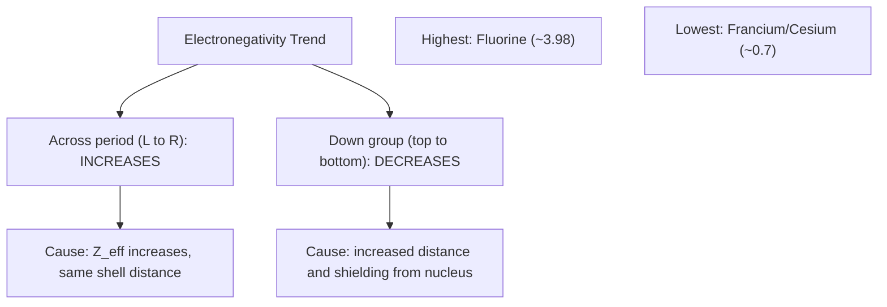

## Electronegativity Trends

### Overview

Electronegativity is a measure of an atom's ability to attract shared electrons toward itself within a chemical bond. Unlike ionization energy or electron affinity, electronegativity is not measured from a single isolated physical process but is instead a derived, relative property calculated from bonding behavior. It is one of the most chemically consequential periodic trends, directly determining bond polarity, molecular shape implications, and the classification of bonds as ionic, polar covalent, or nonpolar covalent.

### Definition and Conceptual Basis

Electronegativity quantifies the tendency of a bonded atom to draw shared electron density toward itself, relative to other atoms.

**Key Points**

- Electronegativity applies specifically to atoms within a bond (a relational property), distinguishing it from ionization energy and electron affinity, which describe isolated atoms.
- Higher electronegativity indicates a stronger pull on shared bonding electrons.
- Electronegativity values are dimensionless on the most common scale (Pauling scale), representing relative comparisons rather than absolute energy measurements.

### The Pauling Electronegativity Scale

Linus Pauling developed the most widely used electronegativity scale in 1932, based on the observation that bond energies between different elements are typically greater than the average of the two elements' homonuclear bond energies—a discrepancy attributable to ionic character arising from electronegativity differences.

**Key Points**

- The Pauling scale assigns fluorine the highest electronegativity value, approximately 3.98 (often rounded to 4.0 in introductory contexts), as the reference maximum.
- Francium and cesium have among the lowest electronegativity values, approximately 0.7–0.79.
- Other electronegativity scales exist, including the Mulliken scale (based on the average of ionization energy and electron affinity) and the Allred-Rochow scale (based on effective nuclear charge and covalent radius); these scales generally agree on relative ordering but can differ somewhat in absolute values. [Inference] The Pauling scale remains the most commonly taught and referenced scale in general and introductory chemistry education.

### Electronegativity Trend Across a Period

Electronegativity generally increases from left to right across a period.

**Explanation**

As effective nuclear charge ($Z_{eff}$) increases across a period while valence electrons remain in the same principal shell, the nucleus exerts an increasingly strong pull on shared bonding electrons, resulting in higher electronegativity for elements further to the right.

### Electronegativity Trend Down a Group

Electronegativity generally decreases from top to bottom down a group.

**Explanation**

As atomic radius increases down a group due to the addition of new principal electron shells, the distance between the nucleus and shared bonding electrons increases, while shielding from inner electron shells also increases. Both factors reduce the nucleus's effective pull on bonding electrons, resulting in lower electronegativity for elements further down a group.

### Periodic Trend Summary Diagram

### Electronegativity Trend Visualization

<svg xmlns="http://www.w3.org/2000/svg" viewBox="0 0 600 300" font-family="sans-serif">
<text x="300" y="20" text-anchor="middle" font-size="14" font-weight="bold">Electronegativity Trend Directions (svg_diagram)</text>
<rect x="60" y="50" width="480" height="200" fill="none" stroke="#999" />

<line x1="80" y1="100" x2="520" y2="100" stroke="#c0392b" stroke-width="2" marker-end="url(#arrEN)" />
<text x="300" y="90" text-anchor="middle" font-size="12" fill="#c0392b">Electronegativity increases →</text>

<line x1="100" y1="120" x2="100" y2="230" stroke="#2980b9" stroke-width="2" marker-end="url(#arrEN)" />
<text x="60" y="180" font-size="11" fill="#2980b9" transform="rotate(-90 60 180)">EN decreases ↓</text>

<circle cx="500" cy="70" r="8" fill="#f39c12" />
<text x="500" y="65" text-anchor="middle" font-size="10">F (highest, 3.98)</text>

<circle cx="100" cy="230" r="8" fill="#8e44ad" />
<text x="140" y="245" font-size="10">Fr/Cs (lowest, ~0.7)</text>
</svg>

### Representative Electronegativity Values

| Element | Approximate Pauling Value | Position |
| --- | --- | --- |
| Fluorine | 3.98 | Period 2, Group 17 |
| Oxygen | 3.44 | Period 2, Group 16 |
| Nitrogen | 3.04 | Period 2, Group 15 |
| Chlorine | 3.16 | Period 3, Group 17 |
| Carbon | 2.55 | Period 2, Group 14 |
| Hydrogen | 2.20 | Period 1, Group 1 |
| Sodium | 0.93 | Period 3, Group 1 |
| Cesium | 0.79 | Period 6, Group 1 |

[Unverified] These values are standard, widely cited Pauling-scale approximations; minor variations exist between different published reference tables.

### Exclusion of Noble Gases

Noble gases are typically excluded from standard electronegativity trend comparisons and tables, since they rarely form conventional chemical bonds under normal conditions, making the concept of "attracting shared electrons" largely inapplicable to them. [Inference] Where electronegativity values are assigned to noble gases in some extended scales (e.g., for heavier noble gases capable of limited compound formation), such values are generally regarded as less reliable or less commonly used than mainstream Pauling-scale data for reactive elements.

### Electronegativity and Bond Type Classification

The difference in electronegativity ($\Delta EN$) between two bonded atoms determines the type and polarity of the resulting chemical bond.

| $\Delta EN$ Range | Bond Type | Electron Distribution |
| --- | --- | --- |
| 0 (same element) | Nonpolar covalent | Equal sharing |
| 0 – ~0.4 | Nonpolar covalent (or very weakly polar) | Nearly equal sharing |
| ~0.4 – ~1.7 | Polar covalent | Unequal sharing, partial charges ($\delta^+$, $\delta^-$) |
| Greater than ~1.7 | Ionic | Electron(s) essentially transferred |

[Inference] The specific numerical cutoffs shown are commonly used teaching approximations rather than sharp physical boundaries; bonding character exists on a continuous spectrum, and real bonds often display intermediate ionic/covalent character regardless of which side of a given cutoff they fall on.

**Example**

- H–H bond: $\Delta EN = 2.20 - 2.20 = 0$ → nonpolar covalent
- H–Cl bond: $\Delta EN = 3.16 - 2.20 = 0.96$ → polar covalent
- Na–Cl bond: $\Delta EN = 3.16 - 0.93 = 2.23$ → ionic

### Dipole Moments and Bond Polarity

When two atoms with differing electronegativity form a covalent bond, the shared electrons are pulled unevenly toward the more electronegative atom, creating a bond dipole with partial positive charge ($\delta^+$) on the less electronegative atom and partial negative charge ($\delta^-$) on the more electronegative atom.

$$\text{H} \overset{\delta^+}{-} \overset{\delta^-}{\text{Cl}}$$

**Key Points**

- The overall polarity of a molecule depends on both individual bond dipoles and molecular geometry; a molecule can contain polar bonds yet be nonpolar overall if bond dipoles cancel due to symmetric arrangement (e.g., carbon dioxide).
- Electronegativity differences directly influence physical properties such as boiling point, solubility, and intermolecular forces (e.g., hydrogen bonding requires a hydrogen atom bonded to a highly electronegative atom such as N, O, or F).

### Relationship to Other Periodic Properties

Electronegativity correlates closely with ionization energy: elements with high ionization energy (strong hold on their own electrons) also tend to have high electronegativity (strong pull on shared electrons), since both properties arise from similar underlying nuclear attraction effects. Electronegativity trends generally mirror ionization energy trends across the periodic table, though electronegativity, being a bonding-context property, does not exhibit the same sharp Group 2→13 and Group 15→16 dips seen in ionization energy.

### Worked Example: Predicting Bond Polarity

**Example**

Rank the following bonds in order of increasing polarity: C–H, O–H, N–H

Using approximate electronegativity values: C (2.55), H (2.20), N (3.04), O (3.44):

- C–H: $\Delta EN = 2.55 - 2.20 = 0.35$
- N–H: $\Delta EN = 3.04 - 2.20 = 0.84$
- O–H: $\Delta EN = 3.44 - 2.20 = 1.24$

Increasing polarity: $\text{C–H} < \text{N–H} < \text{O–H}$

### Common Mistakes to Avoid

- Confusing electronegativity (a relative, bond-context property) with electron affinity (an absolute energy value for an isolated atom gaining an electron); the two properties correlate but are conceptually and numerically distinct.
- Applying electronegativity comparisons to noble gases, which are generally excluded from standard trend discussions due to their general inertness.
- Treating the ionic/covalent $\Delta EN$ cutoff values as rigid physical boundaries rather than teaching approximations along a continuous spectrum of bonding character.
- Assuming higher electronegativity always corresponds to a negative formal charge in a molecule; formal charge and partial charge (from electronegativity) are related but distinct concepts.
- Forgetting that molecular polarity depends on molecular geometry as well as individual bond polarities.

### Related Topics

- Ionization energy and electron affinity
- Trends in atomic and ionic radius
- Covalent bonding and bond polarity
- Ionic bonding and electron transfer
- Molecular geometry and VSEPR theory
- Intermolecular forces and hydrogen bonding
- Lewis structures and formal charge