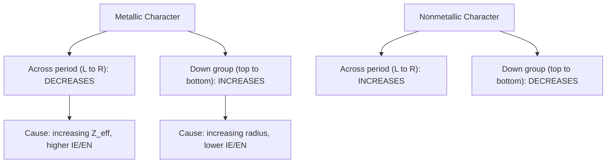

## Metallic, Nonmetallic, and Metalloid Character

### Overview

Metallic and nonmetallic character describe the degree to which an element exhibits the physical and chemical behaviors characteristic of metals or nonmetals. These characteristics vary systematically across the periodic table and arise directly from the same underlying atomic structure factors that govern ionization energy, electronegativity, and atomic radius. Metalloids occupy an intermediate position, exhibiting a blend of metallic and nonmetallic properties.

### Defining Metallic Character

Metallic character refers to the tendency of an element to lose valence electrons and form positive ions (cations), along with associated physical properties such as luster, malleability, ductility, and electrical/thermal conductivity.

**Key Points**

- Metallic character correlates inversely with ionization energy and electronegativity: elements with low ionization energy and low electronegativity readily lose electrons and exhibit strong metallic character.
- Metallic character is strongest toward the lower-left region of the periodic table and weakest toward the upper-right region.

### Defining Nonmetallic Character

Nonmetallic character refers to the tendency of an element to gain electrons and form negative ions (anions), along with associated physical properties such as lack of luster, brittleness (in solid form), and poor electrical/thermal conductivity (with the notable exception of graphite).

**Key Points**

- Nonmetallic character correlates directly with ionization energy and electronegativity: elements with high ionization energy and high electronegativity readily attract or retain electrons and exhibit strong nonmetallic character.
- Nonmetallic character is strongest toward the upper-right region of the periodic table (excluding noble gases, which are generally unreactive) and weakest toward the lower-left region.

### Periodic Trends in Metallic/Nonmetallic Character

**Trend Across a Period (Left to Right)**: Metallic character decreases; nonmetallic character increases.

- This follows directly from the increasing effective nuclear charge ($Z_{eff}$) across a period, which raises ionization energy and electronegativity, making electron loss progressively harder and electron gain progressively more favorable.

**Trend Down a Group (Top to Bottom)**: Metallic character increases; nonmetallic character decreases.

- This follows from increasing atomic radius and shielding down a group, which lowers ionization energy and electronegativity, making electron loss progressively easier.

### Trend Diagram

### Periodic Table Character Map

<svg xmlns="http://www.w3.org/2000/svg" viewBox="0 0 600 320" font-family="sans-serif">
<text x="300" y="20" text-anchor="middle" font-size="14" font-weight="bold">Metallic vs. Nonmetallic Character Gradient (svg_diagram)</text>
<rect x="60" y="50" width="480" height="220" fill="none" stroke="#999" />

<rect x="60" y="50" width="120" height="220" fill="#2980b9" opacity="0.5" />
<rect x="180" y="50" width="120" height="220" fill="#5dade2" opacity="0.4" />
<rect x="300" y="50" width="120" height="220" fill="#82ccdd" opacity="0.3" />
<rect x="420" y="50" width="120" height="220" fill="#82e0aa" opacity="0.4" />
<rect x="540" y="50" width="0" height="220" fill="#27ae60" opacity="0.5" />

<text x="120" y="290" text-anchor="middle" font-size="11">Strongly metallic</text>

<text x="480" y="290" text-anchor="middle" font-size="11">Strongly nonmetallic</text>

<text x="300" y="290" text-anchor="middle" font-size="11">Metalloid boundary region</text>

<line x1="30" y1="60" x2="30" y2="260" stroke="#c0392b" stroke-width="2" marker-end="url(#arrM)" />
<text x="15" y="160" font-size="10" fill="#c0392b" transform="rotate(-90 15 160)">Metallic character increases ↓ (down group)</text>
</svg>

### Metals: Characteristic Properties

**Physical Properties**

- Lustrous (shiny) surface appearance.
- Malleable (can be hammered into thin sheets without breaking).
- Ductile (can be drawn into thin wires).
- Good conductors of heat and electricity due to delocalized (mobile) valence electrons.
- Generally solid at room temperature, with mercury as the primary exception (liquid).
- Higher densities and melting points on average compared to nonmetals, though with wide variation across the metal category.

**Chemical Properties**

- Tend to lose electrons in chemical reactions, forming cations.
- Generally low ionization energies and low electronegativities.
- React with nonmetals to form ionic compounds; many metals react with acids to release hydrogen gas.
- Metal oxides are typically basic (form basic solutions or react with acids), reflecting the electropositive nature of metals.

### Nonmetals: Characteristic Properties

**Physical Properties**

- Lack metallic luster; often dull in appearance.
- Brittle when solid; shatter rather than deform under stress.
- Poor conductors of heat and electricity (graphite, an allotrope of carbon, is a notable exception due to its unique delocalized electron structure).
- Exist in all three physical states at room temperature: gases (e.g., nitrogen, oxygen, fluorine, chlorine), liquid (bromine), and solids (e.g., sulfur, phosphorus, iodine, carbon).

**Chemical Properties**

- Tend to gain electrons in chemical reactions, forming anions.
- Generally high ionization energies and high electronegativities.
- React with metals to form ionic compounds; react with each other to form covalent (molecular) compounds.
- Nonmetal oxides are typically acidic (react with water to form acids, or react with bases), reflecting the electronegative nature of nonmetals.

### Metalloids: Characteristic Properties

Metalloids (semimetals) occupy the diagonal "staircase" boundary region between metals and nonmetals on the periodic table, commonly including boron, silicon, germanium, arsenic, antimony, and tellurium. [Inference] The precise list of elements classified as metalloids varies slightly between different chemistry references, particularly for borderline cases such as polonium and astatine.

**Key Points**

- Exhibit a hybrid combination of metallic and nonmetallic properties: often possess a metallic luster but are brittle like nonmetals.
- Electrical conductivity is intermediate between metals and nonmetals, classifying most metalloids as semiconductors.
- Semiconductor conductivity can be precisely modified through doping (introducing controlled impurities), temperature changes, or exposure to light—properties that make metalloids, especially silicon and germanium, foundational to modern electronics and computing.
- Chemical behavior varies by specific element and reaction context; metalloids can act as either electron donors or acceptors depending on the reacting partner.

### Oxide Acidity/Basicity as a Character Indicator

The acid-base behavior of an element's oxide provides a useful chemical indicator of metallic versus nonmetallic character, forming a systematic trend across the periodic table.

| Oxide Type | Character | Example | Behavior |
| --- | --- | --- | --- |
| Basic oxide | Strongly metallic | $\text{Na}_2\text{O}$ | Reacts with water to form a base; reacts with acids |
| Amphoteric oxide | Metalloid/borderline metal | $\text{Al}_2\text{O}_3$ | Reacts with both acids and bases |
| Acidic oxide | Strongly nonmetallic | $\text{SO}_3$ | Reacts with water to form an acid; reacts with bases |

**Example**

$$\text{Na}_2\text{O (basic oxide)} + \text{H}_2\text{O} \rightarrow 2\text{NaOH}$$

$$\text{SO}_3 \text{ (acidic oxide)} + \text{H}_2\text{O} \rightarrow \text{H}_2\text{SO}_4$$

This trend—oxides becoming progressively more acidic moving left to right across a period, and more basic moving down a group—directly parallels the metallic/nonmetallic character trend.

### Comparative Summary Table

| Property | Metals | Metalloids | Nonmetals |
| --- | --- | --- | --- |
| Location | Left/center of table | Staircase boundary | Upper right of table |
| Luster | Shiny | Often shiny, sometimes dull | Dull |
| Malleability/ductility | Malleable, ductile | Brittle | Brittle (if solid) |
| Conductivity | Good conductor | Semiconductor | Poor conductor (except graphite) |
| Electron behavior | Tends to lose electrons | Variable | Tends to gain electrons |
| Oxide character | Basic | Amphoteric | Acidic |
| Ionization energy | Low | Intermediate | High |
| Electronegativity | Low | Intermediate | High |

### Worked Example: Ranking Metallic Character

**Example**

Rank the following elements in order of increasing metallic character: $\text{Cl}$, $\text{Na}$, $\text{Al}$, $\text{K}$

- Na, Al, Cl are in Period 3; metallic character decreases left to right, so Cl < Al < Na within the period.
- K is directly below Na in Group 1; metallic character increases down a group, so K has greater metallic character than Na.

Increasing metallic character: $\text{Cl} < \text{Al} < \text{Na} < \text{K}$

### Common Mistakes to Avoid

- Assuming hydrogen exhibits metallic character due to its Group 1 position; hydrogen is chemically classified as a nonmetal under standard conditions.
- Treating the metal/metalloid/nonmetal boundary as a rigid, universally fixed line; classification of certain borderline elements can vary between sources.
- Confusing metallic character trends with ionization energy trends in direction; metallic character is inversely related to ionization energy (high IE = low metallic character), so their periodic trend directions are opposite for the period trend comparison framing but consistent when properly interpreted (both increase in the same direction down a group).
- Overlooking that oxide acid-base behavior is a practical chemical test for metallic/nonmetallic character, useful for classifying unfamiliar elements experimentally.

### Related Topics

- The periodic law and classification of elements
- Ionization energy and electron affinity
- Electronegativity trends
- Trends in atomic and ionic radius
- Acid-base chemistry: oxides and their reactivity
- Semiconductors and applications of metalloids
- Ionic and covalent bonding