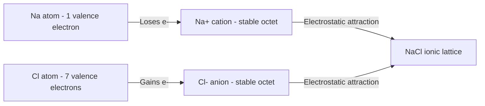
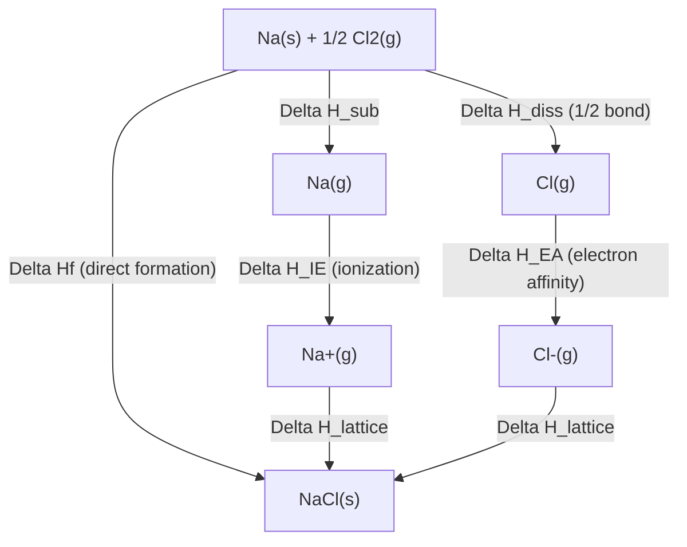

## Ionic Bonding and Lattice Energy

### Overview

Ionic bonding is a type of chemical bonding arising from the electrostatic attraction between oppositely charged ions, typically formed through the transfer of one or more electrons from a metal to a nonmetal. Lattice energy quantifies the strength of this attraction within the resulting crystalline solid and is a key factor governing the physical properties, stability, and solubility of ionic compounds.

### Formation of Ionic Bonds

Ionic bonds form when an element with low ionization energy (typically a metal) transfers one or more valence electrons to an element with a highly negative electron affinity (typically a nonmetal), resulting in the formation of a cation and an anion that are mutually attracted by electrostatic (Coulombic) force.

**Key Points**

- Ionic bonding typically occurs between elements with a large electronegativity difference, conventionally greater than approximately 1.7 on the Pauling scale, though this is a teaching approximation rather than a strict physical boundary.
- The driving force for ionic bond formation is the tendency of both participating atoms to achieve a more stable, often noble-gas-like electron configuration (commonly a full valence octet).
- Ionic compounds do not exist as discrete molecules; instead, they form an extended three-dimensional crystal lattice in which each ion is surrounded by multiple oppositely charged ions.

### Electron Transfer Example

**Example**

Formation of sodium chloride (NaCl) from sodium and chlorine:

$$\text{Na} \rightarrow \text{Na}^+ + e^- \qquad (\text{ionization, requires energy input})$$

$$\text{Cl} + e^- \rightarrow \text{Cl}^- \qquad (\text{electron affinity, releases energy})$$

$$\text{Na}^+ + \text{Cl}^- \rightarrow \text{NaCl (s)} \qquad (\text{lattice formation, releases substantial energy})$$

Sodium loses its single valence electron to achieve the stable electron configuration of neon, while chlorine gains that electron to achieve the stable electron configuration of argon; both ions attain a full octet.

### Ionic Bond Formation Diagram

### Properties of Ionic Compounds

**Key Points**

- **High melting and boiling points**: Strong electrostatic forces throughout the crystal lattice require substantial energy to overcome.
- **Brittleness**: When a lattice is stressed, ions of like charge can be forced into alignment, causing strong repulsion and fracture along crystal planes, rather than deformation.
- **Electrical conductivity**: Ionic compounds do not conduct electricity in the solid state (ions are fixed in place), but conduct well when molten or dissolved in water (ions become mobile).
- **Solubility**: Many ionic compounds are soluble in polar solvents such as water, where solvent molecules can surround and stabilize individual ions (hydration), though solubility varies substantially depending on lattice energy and the specific ions involved.

### Lattice Energy: Definition

Lattice energy is the energy released when gaseous ions combine to form one mole of a solid ionic crystal lattice (or, equivalently by convention, the energy required to separate one mole of an ionic solid into its individual gaseous ions).

$$\text{M}^+\text{(g)} + \text{X}^-\text{(g)} \rightarrow \text{MX (s)} \qquad \Delta H_{lattice} < 0 \text{ (formation convention)}$$

**Key Points**

- Two sign conventions exist for lattice energy: the formation convention (energy released when the lattice forms, negative value) and the dissociation convention (energy required to break the lattice apart, positive value). Both describe the same magnitude of interaction, differing only in reference direction.
- Lattice energy cannot be measured directly through a single experiment; it is typically calculated indirectly using the Born-Haber cycle, a thermodynamic application of Hess's law.

### Factors Affecting Lattice Energy Magnitude

Lattice energy is governed by Coulomb's law, which describes the electrostatic force (and associated potential energy) between charged particles:

$$E \propto \frac{Q_1 Q_2}{r}$$

where $Q_1$ and $Q_2$ are the magnitudes of the ionic charges, and $r$ is the distance between ion centers (related to ionic radii).

**Key Points**

- **Ionic charge**: Lattice energy increases substantially as the magnitude of ionic charge increases, since Coulombic attraction is directly proportional to the product of the charges. This effect is typically the dominant factor in determining lattice energy magnitude.
- **Ionic radius (distance)**: Lattice energy increases as ionic radius decreases, since smaller ions allow for closer approach between oppositely charged ions and thus stronger attraction, following the inverse relationship with distance.
- Because charge has a more pronounced numerical effect on lattice energy than radius, compounds with higher-charged ions (e.g., $\text{MgO}$, with +2/-2 charges) generally have substantially higher lattice energies than compounds with singly-charged ions of similar size (e.g., $\text{NaCl}$, with +1/-1 charges).

### Lattice Energy Comparison Table

| Compound | Ion Charges | Approximate Ionic Radii Sum | Relative Lattice Energy |
| --- | --- | --- | --- |
| NaCl | +1, -1 | Larger | Lower |
| NaF | +1, -1 | Smaller (F⁻ smaller than Cl⁻) | Moderate |
| MgO | +2, -2 | Smaller | Very high |
| MgCl₂ | +2, -1 (x2) | Moderate | High |
| CaO | +2, -2 | Larger than MgO | High, but lower than MgO |

[Unverified] Specific numerical lattice energy values vary by source and calculation method (theoretical Born-Landé equation vs. experimental Born-Haber cycle results); the relative ranking shown reflects the well-established qualitative trend based on charge and radius.

### Lattice Energy Trend Diagram

<svg xmlns="http://www.w3.org/2000/svg" viewBox="0 0 500 260" font-family="sans-serif">
<text x="250" y="20" text-anchor="middle" font-size="14" font-weight="bold">Lattice Energy: Charge and Radius Effects (svg_diagram)</text>

<g transform="translate(40,50)">
<text x="80" y="0" text-anchor="middle" font-size="12" font-weight="bold">Increasing Charge</text>
<circle cx="30" cy="60" r="15" fill="#2980b9" opacity="0.6" />
<text x="30" y="65" text-anchor="middle" font-size="10" fill="white">+1</text>
<circle cx="130" cy="60" r="15" fill="#c0392b" opacity="0.6" />
<text x="130" y="65" text-anchor="middle" font-size="10" fill="white">-1</text>
<line x1="45" y1="60" x2="115" y2="60" stroke="black" stroke-dasharray="2,2" />
<text x="80" y="100" text-anchor="middle" font-size="10">Weaker attraction (NaCl-like)</text>
<circle cx="30" cy="160" r="18" fill="#2980b9" opacity="0.8" />
<text x="30" y="166" text-anchor="middle" font-size="10" fill="white">+2</text>
<circle cx="130" cy="160" r="18" fill="#c0392b" opacity="0.8" />
<text x="130" y="166" text-anchor="middle" font-size="10" fill="white">-2</text>
<line x1="48" y1="160" x2="112" y2="160" stroke="black" stroke-width="3" />
<text x="80" y="200" text-anchor="middle" font-size="10">Stronger attraction (MgO-like)</text>
</g>

<g transform="translate(280,50)">
<text x="80" y="0" text-anchor="middle" font-size="12" font-weight="bold">Decreasing Radius</text>
<circle cx="20" cy="60" r="25" fill="#27ae60" opacity="0.5" />
<circle cx="140" cy="60" r="20" fill="#27ae60" opacity="0.5" />
<line x1="45" y1="60" x2="120" y2="60" stroke="black" stroke-dasharray="2,2" />
<text x="80" y="100" text-anchor="middle" font-size="10">Larger ions: weaker attraction</text>
<circle cx="30" cy="160" r="14" fill="#27ae60" opacity="0.8" />
<circle cx="110" cy="160" r="12" fill="#27ae60" opacity="0.8" />
<line x1="44" y1="160" x2="98" y2="160" stroke="black" stroke-width="3" />
<text x="80" y="200" text-anchor="middle" font-size="10">Smaller ions: stronger attraction</text>
</g>
</svg>

### The Born-Haber Cycle

The Born-Haber cycle is a thermochemical cycle, based on Hess's law, used to calculate lattice energy indirectly by relating it to other experimentally measurable enthalpy values.

**Key Steps in the Cycle**

1. **Sublimation** of the solid metal to gaseous atoms ($\Delta H_{sub}$)
2. **Ionization** of the gaseous metal atom to form a cation ($\Delta H_{IE}$)
3. **Dissociation** of the nonmetal molecule into gaseous atoms ($\Delta H_{diss}$)
4. **Electron affinity**: gaseous nonmetal atom gains an electron to form an anion ($\Delta H_{EA}$)
5. **Lattice formation**: gaseous ions combine to form the solid ionic lattice ($\Delta H_{lattice}$)

These steps sum to equal the overall enthalpy of formation of the ionic compound from its elements ($\Delta H_f$), by Hess's law:

$$\Delta H_f = \Delta H_{sub} + \Delta H_{IE} + \Delta H_{diss} + \Delta H_{EA} + \Delta H_{lattice}$$

Rearranging allows lattice energy to be calculated from the other, more directly measurable quantities:

$$\Delta H_{lattice} = \Delta H_f - (\Delta H_{sub} + \Delta H_{IE} + \Delta H_{diss} + \Delta H_{EA})$$

### Born-Haber Cycle Diagram

### Worked Example: Born-Haber Cycle Calculation

**Example**

Calculate the lattice energy of NaCl given the following approximate values:

- $\Delta H_f(\text{NaCl}) = -411$ kJ/mol
- $\Delta H_{sub}(\text{Na}) = +109$ kJ/mol
- $\Delta H_{IE}(\text{Na}) = +496$ kJ/mol
- $\Delta H_{diss}(\text{Cl}_2, \text{per mole Cl}) = +122$ kJ/mol
- $\Delta H_{EA}(\text{Cl}) = -349$ kJ/mol

$$\Delta H_{lattice} = \Delta H_f - (\Delta H_{sub} + \Delta H_{IE} + \Delta H_{diss} + \Delta H_{EA})$$

$$\Delta H_{lattice} = -411 - (109 + 496 + 122 - 349)$$

$$\Delta H_{lattice} = -411 - 378 = -789 \text{ kJ/mol}$$

This large negative value confirms that lattice formation is strongly exothermic, consistent with the substantial stability of the ionic solid relative to its gaseous ion components.

[Unverified] The specific enthalpy values used are commonly cited approximations for illustrative calculation purposes; precise experimental values can vary slightly between reference sources.

### Lattice Energy and Physical Properties

Lattice energy directly correlates with several measurable physical properties of ionic compounds:

- **Melting/boiling point**: Higher lattice energy generally corresponds to a higher melting point, since more thermal energy is required to disrupt the strong ionic attractions holding the lattice together.
- **Hardness**: Compounds with higher lattice energy tend to be harder, more resistant to mechanical deformation.
- **Solubility**: Lattice energy competes with hydration energy (the energy released when ions are surrounded by solvent molecules) in determining solubility; very high lattice energies can reduce solubility in water if hydration energy cannot sufficiently compensate for the energy required to break apart the lattice.

**Example**

Magnesium oxide (MgO), with +2/-2 ionic charges and a relatively small ionic radius sum, has an extremely high lattice energy and correspondingly high melting point (approximately 2852°C), reflecting the strong electrostatic forces from its doubly-charged ions, compared to sodium chloride (NaCl, +1/-1 charges), which melts at a much lower temperature (approximately 801°C).

### Common Mistakes to Avoid

- Confusing lattice energy sign convention; always identify whether a given value represents formation (negative/exothermic) or dissociation (positive/endothermic) of the lattice.
- Underestimating the dominant effect of ionic charge relative to ionic radius; a doubling of charge has a much larger impact on lattice energy than a modest change in ionic radius.
- Forgetting that ionic compounds exist as extended lattices, not discrete molecules, when describing their structure or properties.
- Applying the Born-Haber cycle incorrectly by omitting a step or misassigning a sign to one of the enthalpy contributions.
- Assuming all ionic compounds are highly soluble in water; solubility depends on the balance between lattice energy and hydration energy, and some ionic compounds are only sparingly soluble.

### Related Topics

- Electronegativity trends and bond type classification
- Trends in atomic and ionic radius
- Ionization energy and electron affinity
- Covalent bonding and molecular compounds
- Hess's law and thermochemical cycles
- Crystal lattice structures and unit cells
- Solubility rules and hydration energy