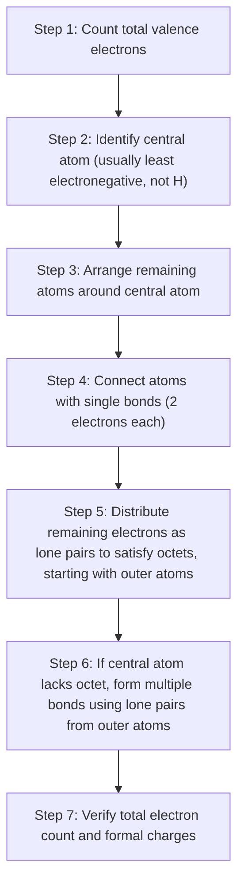

## Covalent Bonding and Lewis Structures

### Overview

Covalent bonding involves the sharing of electron pairs between atoms, typically occurring between two nonmetals with relatively small electronegativity differences. Lewis structures provide a standardized graphical method for representing the arrangement of valence electrons in covalently bonded molecules, serving as an essential tool for predicting molecular geometry, reactivity, and bond properties.

### Formation of Covalent Bonds

A covalent bond forms when two atoms share one or more pairs of electrons, with each atom contributing toward achieving a more stable electron configuration, typically a full valence octet (or duet for hydrogen and helium).

**Key Points**

- Covalent bonding typically occurs between nonmetal atoms with similar electronegativities, where neither atom has a sufficiently strong pull on electrons to fully transfer them (as would occur in ionic bonding).
- Shared electron pairs are attracted simultaneously to both positively charged nuclei, creating a net attractive force that holds the atoms together as a discrete molecule.
- Unlike ionic compounds, covalent compounds typically exist as discrete molecules with defined formulas (e.g., $\text{H}_2\text{O}$, $\text{CO}_2$) rather than as extended lattices.

### The Octet Rule

The octet rule states that atoms tend to gain, lose, or share electrons in order to achieve a valence shell containing eight electrons, resembling the stable electron configuration of the nearest noble gas.

**Key Points**

- Hydrogen and helium are exceptions, following a duet rule (stable with 2 valence electrons), since their valence shell is the first principal energy level, which holds a maximum of 2 electrons.
- The octet rule is a useful guideline but has known exceptions, including electron-deficient species, odd-electron species, and expanded octets (discussed below).

### Types of Covalent Bonds by Electron Count

| Bond Type | Shared Electron Pairs | Example |
| --- | --- | --- |
| Single bond | 1 pair (2 electrons) | H–H, C–C |
| Double bond | 2 pairs (4 electrons) | O=O, C=C |
| Triple bond | 3 pairs (6 electrons) | N≡N, C≡C |

**Key Points**

- Bond order (number of shared electron pairs) directly influences bond length and bond strength: as bond order increases, bond length decreases and bond energy (strength) increases.
- Triple bonds are shorter and stronger than double bonds, which are in turn shorter and stronger than single bonds between the same pair of atoms.

### Polar vs. Nonpolar Covalent Bonds

**Nonpolar covalent bonds** occur when two atoms share electrons equally, typically between identical atoms (e.g., $\text{H}_2$, $\text{Cl}_2$) or atoms with very similar electronegativity.

**Polar covalent bonds** occur when two atoms of differing electronegativity share electrons unequally, resulting in partial charges: $\delta^+$ on the less electronegative atom and $\delta^-$ on the more electronegative atom.

$$\overset{\delta^+}{\text{H}} - \overset{\delta^-}{\text{Cl}}$$

### Steps for Drawing Lewis Structures

Lewis structures (electron dot structures) represent valence electrons as dots around atomic symbols, with shared pairs (bonds) typically drawn as lines between atoms.

### Worked Example: Lewis Structure of CO₂

**Example**

Draw the Lewis structure for carbon dioxide, $\text{CO}_2$.

**Step 1**: Total valence electrons = C(4) + O(6) + O(6) = 16 electrons

**Step 2**: Carbon is the central atom (lower electronegativity, capable of forming multiple bonds)

**Step 3–4**: Arrange as O–C–O and form single bonds (uses 4 electrons, leaving 12)

**Step 5**: Distribute remaining 12 electrons as lone pairs on the oxygen atoms first (3 lone pairs each = 12 electrons); carbon has no lone pairs and only 4 electrons (2 bonds), giving carbon an incomplete octet.

**Step 6**: Since carbon lacks a full octet, convert one lone pair from each oxygen into a second bond, forming two double bonds:

$$\text{O=C=O}$$

**Step 7**: Final structure has carbon with 2 double bonds (8 electrons, octet satisfied) and each oxygen with 1 double bond plus 2 lone pairs (8 electrons, octet satisfied). Total electrons: $2(4) + 2(4) = 16$, matching the original count.

### Lewis Structure Diagram: CO₂

<svg xmlns="http://www.w3.org/2000/svg" viewBox="0 0 400 150" font-family="sans-serif">
<text x="200" y="20" text-anchor="middle" font-size="14" font-weight="bold">Lewis Structure of CO2 (svg_diagram)</text>

<text x="100" y="90" font-size="28" text-anchor="middle">O</text>

<text x="200" y="90" font-size="28" text-anchor="middle">C</text>

<text x="300" y="90" font-size="28" text-anchor="middle">O</text>

<line x1="120" y1="85" x2="175" y2="85" stroke="black" stroke-width="2" />
<line x1="120" y1="95" x2="175" y2="95" stroke="black" stroke-width="2" />
<line x1="225" y1="85" x2="280" y2="85" stroke="black" stroke-width="2" />
<line x1="225" y1="95" x2="280" y2="95" stroke="black" stroke-width="2" />

<circle cx="90" cy="55" r="2" fill="black" /><circle cx="98" cy="55" r="2" fill="black" />

<circle cx="90" cy="125" r="2" fill="black" /><circle cx="98" cy="125" r="2" fill="black" />

<circle cx="65" cy="85" r="2" fill="black" /><circle cx="65" cy="93" r="2" fill="black" />

<circle cx="290" cy="55" r="2" fill="black" /><circle cx="298" cy="55" r="2" fill="black" />

<circle cx="290" cy="125" r="2" fill="black" /><circle cx="298" cy="125" r="2" fill="black" />

<circle cx="335" cy="85" r="2" fill="black" /><circle cx="335" cy="93" r="2" fill="black" />

</svg>

### Formal Charge

Formal charge is a bookkeeping method used to evaluate the most plausible Lewis structure among several possible arrangements, by assigning a hypothetical charge to each atom based on electron distribution.

$$\text{Formal charge} = (\text{valence electrons in free atom}) - (\text{lone pair electrons}) - \frac{1}{2}(\text{bonding electrons})$$

**Key Points**

- The most stable (preferred) Lewis structure typically minimizes formal charges, keeping them as close to zero as possible.
- When formal charges cannot be entirely eliminated, the preferred structure places any negative formal charge on the more electronegative atom.
- The sum of all formal charges in a structure must equal the overall charge of the molecule or ion.

**Example**

For the cyanate ion, $\text{OCN}^-$, comparing two possible arrangements (O–C≡N and O≡C–N with different lone pair distributions) using formal charge calculations helps identify which structure is the more energetically favorable and realistic representation, generally the one with formal charges closest to zero and negative charge on the more electronegative atom.

### Resonance Structures

Resonance occurs when a single Lewis structure cannot adequately represent the true bonding in a molecule or ion, and two or more valid Lewis structures (resonance structures) must be combined conceptually to describe the actual electron distribution, known as a resonance hybrid.

**Key Points**

- Resonance structures differ only in the position of electrons (specifically, multiple bonds and lone pairs), never in the position of atoms.
- The true structure is a hybrid, or weighted average, of all contributing resonance structures, with actual bond lengths and bond orders intermediate between those depicted in the individual structures.
- Resonance structures are connected by double-headed arrows ($\leftrightarrow$) to indicate that they represent the same actual molecule, not different molecules in equilibrium.

**Example**

Ozone, $\text{O}_3$, cannot be accurately represented by a single Lewis structure; instead, it exists as a resonance hybrid of two equivalent structures with the double bond alternating position:

$$\text{O=O–O}^- \leftrightarrow {}^-\text{O–O=O}$$

Experimentally, both O–O bonds in ozone have identical, intermediate bond lengths (between a single and double bond), directly confirming the resonance hybrid concept rather than the molecule oscillating between two discrete structures.

### Exceptions to the Octet Rule

**Incomplete Octets**

Certain elements, particularly boron and beryllium, can form stable compounds with fewer than eight valence electrons around the central atom.

**Example**

Boron trifluoride, $\text{BF}_3$, has boron surrounded by only 6 valence electrons (3 single bonds, no lone pairs), yet is a stable, well-characterized compound.

**Odd-Electron Species**

A small number of molecules have an odd total number of valence electrons, making a complete octet on every atom impossible.

**Example**

Nitrogen monoxide, $\text{NO}$, has 11 valence electrons total, resulting in one unpaired electron (a radical species).

**Expanded Octets**

Central atoms from period 3 and beyond can accommodate more than eight valence electrons, since they have access to energetically accessible d orbitals (or, in more advanced treatments, this is attributed to other bonding models rather than direct d-orbital participation). [Inference] The precise theoretical explanation for expanded octets (traditional d-orbital hybridization versus more modern three-center four-electron bonding models) is a matter of ongoing discussion in advanced inorganic chemistry, though the empirical existence of expanded-octet structures is well established.

**Example**

Sulfur hexafluoride, $\text{SF}_6$, has sulfur surrounded by 12 valence electrons (6 single bonds), exceeding the standard octet.

### Common Molecules and Their Lewis Structures Summary

| Molecule | Central Atom | Total Valence Electrons | Bonding Summary |
| --- | --- | --- | --- |
| $\text{H}_2\text{O}$ | O | 8 | 2 single bonds, 2 lone pairs on O |
| $\text{NH}_3$ | N | 8 | 3 single bonds, 1 lone pair on N |
| $\text{CH}_4$ | C | 8 | 4 single bonds, no lone pairs |
| $\text{CO}_2$ | C | 16 | 2 double bonds, no lone pairs on C |
| $\text{N}_2$ | — | 10 | 1 triple bond, 1 lone pair per N |

### Common Mistakes to Avoid

- Miscounting total valence electrons, particularly for polyatomic ions, where electrons must be added (for negative charge) or subtracted (for positive charge) from the neutral atom total.
- Placing hydrogen as a central atom; hydrogen can form only one bond and is always a terminal (outer) atom.
- Forgetting to verify the octet rule for every atom after distributing electrons, and neglecting to form multiple bonds when a central atom's octet is incomplete.
- Treating resonance structures as if the molecule rapidly interconverts between them; the actual molecule is a single, stable hybrid structure at all times.
- Applying the octet rule rigidly without recognizing legitimate exceptions (incomplete octets, odd-electron species, expanded octets).

### Related Topics

- Ionic bonding and lattice energy
- Electronegativity trends and bond polarity
- Molecular geometry and VSEPR theory
- Formal charge and oxidation states
- Hybridization and valence bond theory
- Intermolecular forces
- Bond energy and bond length relationships