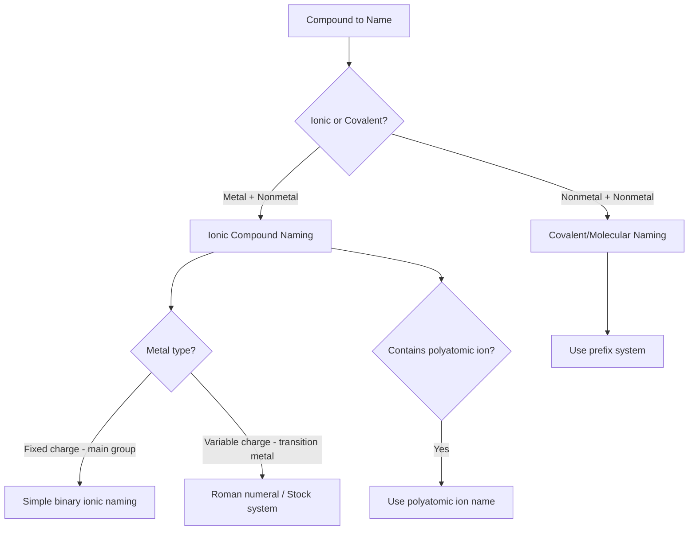

## Naming Ionic and Covalent Compounds

### Overview

Chemical nomenclature is the systematic set of rules for naming compounds based on their composition and bonding type, established primarily by the International Union of Pure and Applied Chemistry (IUPAC). Correct nomenclature allows unambiguous identification of a compound's chemical formula from its name, and vice versa, forming an essential communication tool across all areas of chemistry.

### General Classification for Naming

The naming approach for a compound depends primarily on whether it is ionic (typically metal + nonmetal) or covalent/molecular (typically nonmetal + nonmetal).

### Naming Binary Ionic Compounds (Fixed-Charge Metals)

Binary ionic compounds consist of two elements: a metal cation and a nonmetal anion. For metals that form only one common ionic charge (most main-group metals, Groups 1, 2, and aluminum), naming follows a straightforward pattern.

**Naming Rule**

1. Name the metal cation first, unchanged from its elemental name.
2. Name the nonmetal anion second, modifying the ending to "-ide."

**Example**

| Formula | Cation Name | Anion Name | Compound Name |
| --- | --- | --- | --- |
| NaCl | Sodium | Chloride | Sodium chloride |
| MgO | Magnesium | Oxide | Magnesium oxide |
| $\text{Al}_2\text{S}_3$ | Aluminum | Sulfide | Aluminum sulfide |
| CaBr₂ | Calcium | Bromide | Calcium bromide |
| $\text{K}_3\text{N}$ | Potassium | Nitride | Potassium nitride |

**Key Points**

- Subscripts in the formula are determined by charge balance (the total positive charge must equal the total negative charge) and are never indicated by prefixes in ionic compound names.
- The anion name is derived by taking the root of the nonmetal's elemental name and adding the suffix "-ide" (e.g., chlorine → chloride, oxygen → oxide, nitrogen → nitride).

### Naming Ionic Compounds with Variable-Charge Metals (Stock System)

Many transition metals and a few main-group metals (e.g., tin, lead) can form more than one stable cation charge. For these metals, a Roman numeral indicating the specific cationic charge must be included in the compound name, following the Stock system.

**Naming Rule**

1. Determine the charge on the metal cation by balancing it against the known charge of the anion.
2. Write the metal name followed immediately by the charge in Roman numerals, enclosed in parentheses.
3. Name the anion as usual, ending in "-ide."

**Example**

| Formula | Metal Charge Determination | Compound Name |
| --- | --- | --- |
| FeCl₂ | Fe must be +2 to balance 2 Cl⁻ | Iron(II) chloride |
| FeCl₃ | Fe must be +3 to balance 3 Cl⁻ | Iron(III) chloride |
| CuO | Cu must be +2 to balance O²⁻ | Copper(II) oxide |
| $\text{Cu}_2\text{O}$ | Cu must be +1 to balance O²⁻ | Copper(I) oxide |
| $\text{SnF}_4$ | Sn must be +4 to balance 4 F⁻ | Tin(IV) fluoride |

**Key Points**

- An older naming convention (still occasionally encountered) uses the suffixes "-ous" (lower charge) and "-ic" (higher charge) attached to the Latin root of the metal name (e.g., ferrous for Fe²⁺, ferric for Fe³⁺); the Stock system with Roman numerals is now the IUPAC-preferred standard.
- Common metals requiring Roman numerals include iron, copper, tin, lead, mercury, chromium, manganese, and cobalt, among others, since these elements form more than one stable oxidation state in compounds.
- Charge determination requires working backward from the known, fixed charge of the anion, since the metal's charge is not otherwise indicated in the formula alone.

### Naming Ionic Compounds with Polyatomic Ions

Polyatomic ions are charged species composed of two or more covalently bonded atoms, and they are named as a single unit within ionic compounds, without modification.

**Common Polyatomic Ions Reference Table**

| Ion Formula | Name | Charge |
| --- | --- | --- |
| $\text{NO}_3^-$ | Nitrate | -1 |
| $\text{NO}_2^-$ | Nitrite | -1 |
| $\text{SO}_4^{2-}$ | Sulfate | -2 |
| $\text{SO}_3^{2-}$ | Sulfite | -2 |
| $\text{CO}_3^{2-}$ | Carbonate | -2 |
| $\text{PO}_4^{3-}$ | Phosphate | -3 |
| $\text{OH}^-$ | Hydroxide | -1 |
| $\text{NH}_4^+$ | Ammonium | +1 |
| $\text{CN}^-$ | Cyanide | -1 |
| $\text{C}_2\text{H}_3\text{O}_2^-$ | Acetate | -1 |
| $\text{ClO}^-$ | Hypochlorite | -1 |
| $\text{ClO}_2^-$ | Chlorite | -1 |
| $\text{ClO}_3^-$ | Chlorate | -1 |
| $\text{ClO}_4^-$ | Perchlorate | -1 |

**Key Points**

- Within the chlorine oxyanion series (hypochlorite, chlorite, chlorate, perchlorate), the prefix "hypo-" indicates one fewer oxygen than the "-ite" form, and "per-" indicates one more oxygen than the "-ate" form; this pattern generalizes to other halogen oxyanion series (e.g., bromine, iodine).
- The "-ate" ion typically has one more oxygen atom than the corresponding "-ite" ion for the same central element and overall charge (e.g., sulfate $\text{SO}_4^{2-}$ vs. sulfite $\text{SO}_3^{2-}$).

**Example**

- $\text{Ca(NO}_3)_2$: calcium nitrate (parentheses indicate two full nitrate ions, required since more than one polyatomic ion unit is present)
- $\text{(NH}_4)_2\text{SO}_4$: ammonium sulfate
- $\text{Na}_3\text{PO}_4$: sodium phosphate

### Naming Binary Covalent (Molecular) Compounds

Binary covalent compounds are formed between two nonmetals. Since nonmetal-nonmetal combinations can form multiple different compounds with the same two elements in different ratios (e.g., CO and $\text{CO}_2$), Greek numerical prefixes are used to explicitly indicate the number of atoms of each element in the formula.

**Greek Prefix Table**

| Number | Prefix |
| --- | --- |
| 1 | Mono- (typically omitted for the first element) |
| 2 | Di- |
| 3 | Tri- |
| 4 | Tetra- |
| 5 | Penta- |
| 6 | Hexa- |
| 7 | Hepta- |
| 8 | Octa- |
| 9 | Nona- |
| 10 | Deca- |

**Naming Rule**

1. Name the first element as listed in the formula, using a prefix only if more than one atom is present (mono- is omitted for the first element).
2. Name the second element with the appropriate prefix (including "mono-" if only one atom is present) and change its ending to "-ide."
3. When a prefix ending in "a" or "o" precedes an element name beginning with a vowel, the final vowel of the prefix is dropped for pronunciation (e.g., "monoxide" rather than "monooxide").

**Example**

| Formula | Compound Name |
| --- | --- |
| CO | Carbon monoxide |
| $\text{CO}_2$ | Carbon dioxide |
| $\text{N}_2\text{O}$ | Dinitrogen monoxide |
| $\text{N}_2\text{O}_4$ | Dinitrogen tetroxide |
| $\text{SF}_6$ | Sulfur hexafluoride |
| $\text{P}_2\text{O}_5$ | Diphosphorus pentoxide |
| $\text{Cl}_2\text{O}_7$ | Dichlorine heptoxide |

### Ionic vs. Covalent Naming: Comparative Summary

| Feature | Ionic Compounds | Covalent Compounds |
| --- | --- | --- |
| Typical composition | Metal + nonmetal | Nonmetal + nonmetal |
| Subscripts determined by | Charge balance | Explicit atom count |
| Numerical prefixes used | No | Yes (Greek prefixes) |
| Variable charge indicated by | Roman numerals (Stock system) | Not applicable |
| Polyatomic ions | Named as a unit | Not applicable |
| Anion/second element ending | "-ide" (or polyatomic ion name) | "-ide" with prefix |

### Naming Acids

Acids, compounds that release hydrogen ions ($\text{H}^+$) in aqueous solution, follow their own distinct naming conventions based on whether the acid is binary (hydrogen + one other nonmetal) or an oxyacid (containing oxygen, typically derived from a polyatomic ion).

**Binary Acids**: Named using the prefix "hydro-" and the suffix "-ic acid," based on the anion root.

**Example**

- HCl (aqueous): hydrochloric acid
- $\text{H}_2\text{S}$ (aqueous): hydrosulfuric acid

**Oxyacids**: Named based on the corresponding polyatomic ion, with "-ate" ions becoming "-ic acid" and "-ite" ions becoming "-ous acid."

**Example**

| Polyatomic Ion | Acid Formula | Acid Name |
| --- | --- | --- |
| $\text{SO}_4^{2-}$ (sulfate) | $\text{H}_2\text{SO}_4$ | Sulfuric acid |
| $\text{SO}_3^{2-}$ (sulfite) | $\text{H}_2\text{SO}_3$ | Sulfurous acid |
| $\text{NO}_3^-$ (nitrate) | $\text{HNO}_3$ | Nitric acid |
| $\text{NO}_2^-$ (nitrite) | $\text{HNO}_2$ | Nitrous acid |
| $\text{PO}_4^{3-}$ (phosphate) | $\text{H}_3\text{PO}_4$ | Phosphoric acid |

### Nomenclature Decision Diagram

<svg xmlns="http://www.w3.org/2000/svg" viewBox="0 0 600 300" font-family="sans-serif">
<text x="300" y="20" text-anchor="middle" font-size="14" font-weight="bold">Compound Naming Decision Path (svg_diagram)</text>
<rect x="230" y="40" width="140" height="35" rx="5" fill="#a0c8e8" opacity="0.6" stroke="#2980b9" />
<text x="300" y="62" text-anchor="middle" font-size="11">Identify compound type</text>
<line x1="300" y1="75" x2="150" y2="110" stroke="black" />
<line x1="300" y1="75" x2="450" y2="110" stroke="black" />
<rect x="80" y="110" width="140" height="35" rx="5" fill="#a0e8b0" opacity="0.6" stroke="#27ae60" />
<text x="150" y="132" text-anchor="middle" font-size="11">Ionic (metal+nonmetal)</text>
<rect x="380" y="110" width="140" height="35" rx="5" fill="#e8b0a0" opacity="0.6" stroke="#c0392b" />
<text x="450" y="132" text-anchor="middle" font-size="11">Covalent (nonmetal+nonmetal)</text>
<line x1="150" y1="145" x2="150" y2="180" stroke="black" />
<rect x="60" y="180" width="180" height="50" rx="5" fill="#a0e8b0" opacity="0.4" stroke="#27ae60" />
<text x="150" y="200" text-anchor="middle" font-size="10">Fixed charge: name directly</text>
<text x="150" y="218" text-anchor="middle" font-size="10">Variable charge: use (Roman numeral)</text>
<line x1="450" y1="145" x2="450" y2="180" stroke="black" />
<rect x="360" y="180" width="180" height="50" rx="5" fill="#e8b0a0" opacity="0.4" stroke="#c0392b" />
<text x="450" y="200" text-anchor="middle" font-size="10">Use Greek prefixes for</text>
<text x="450" y="218" text-anchor="middle" font-size="10">both elements' atom counts</text>
</svg>

### Common Mistakes to Avoid

- Using Greek numerical prefixes (di-, tri-, etc.) when naming ionic compounds; ionic compound formulas are determined by charge balance, not explicitly stated ratios, so prefixes are never used.
- Omitting the Roman numeral for transition metals capable of multiple charges; without it, the compound's identity is ambiguous (e.g., "iron chloride" could refer to either FeCl₂ or FeCl₃).
- Forgetting to change the anion ending to "-ide" for simple monatomic ions, or incorrectly modifying the ending of polyatomic ions (which should be used exactly as named, without alteration).
- Confusing "-ate" and "-ite" oxyanion naming, or misapplying "hypo-" and "per-" prefixes within a given halogen oxyanion series.
- Omitting necessary parentheses around a polyatomic ion when more than one unit of that ion is present in the formula (e.g., writing "CaNO32" instead of $\text{Ca(NO}_3)_2$).

### Related Topics

- Ionic bonding and lattice energy
- Covalent bonding and Lewis structures
- Polyatomic ions and their charges
- Acid-base nomenclature and classification
- Oxidation states and the Stock system
- Chemical formula writing and balancing charges
- Stoichiometry and molar mass calculations