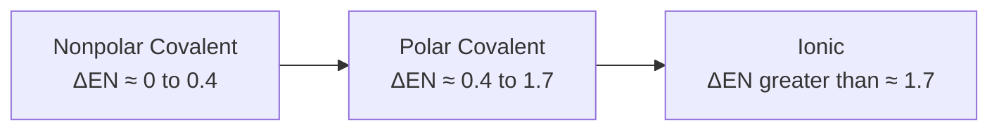

## Bond Polarity and Electronegativity

### Overview

Bond polarity describes the unequal distribution of electron density within a covalent bond, arising directly from differences in electronegativity between bonded atoms. This concept bridges the gap between purely ionic and purely covalent bonding models, and is essential for predicting molecular polarity, intermolecular forces, solubility behavior, and reactivity patterns.

### Electronegativity as the Basis for Bond Polarity

Electronegativity, the relative ability of an atom to attract shared bonding electrons, directly determines how evenly electron density is distributed within a covalent bond.

**Key Points**

- When two identical atoms bond (or atoms of very similar electronegativity), electrons are shared essentially equally, producing a nonpolar covalent bond.
- When two atoms of differing electronegativity bond, the more electronegative atom pulls the shared electron density toward itself, producing an unequal distribution and a polar covalent bond.
- The greater the electronegativity difference ($\Delta EN$) between two bonded atoms, the greater the resulting bond polarity.

### The Bonding Continuum

Chemical bonds exist along a continuous spectrum ranging from purely nonpolar covalent to purely ionic, with polar covalent bonds occupying the intermediate range. No sharp, universally fixed boundary separates these categories; instead, commonly used $\Delta EN$ ranges serve as practical teaching approximations.

[Inference] The specific numerical cutoffs shown (0.4 and 1.7) are widely used introductory teaching conventions; actual bonding character exists on a continuous spectrum, and compounds near these boundary values often display intermediate ionic/covalent characteristics rather than falling cleanly into one category.

### Bond Dipoles and Partial Charges

When a polar covalent bond forms, the resulting unequal electron distribution creates a bond dipole, represented using partial charge notation ($\delta^+$ and $\delta^-$) or a dipole arrow.

$$\overset{\delta^+}{\text{H}} \! - \! \overset{\delta^-}{\text{Cl}}$$

**Key Points**

- The partial positive charge ($\delta^+$) develops on the less electronegative atom, which has a comparatively weaker pull on the shared electrons.
- The partial negative charge ($\delta^-$) develops on the more electronegative atom, which has a comparatively stronger pull on the shared electrons.
- A dipole arrow is conventionally drawn pointing from the positive end toward the negative end of the bond, often with a crossed tail (+) marking the positive end.

### Bond Dipole Illustration

<svg xmlns="http://www.w3.org/2000/svg" viewBox="0 0 400 160" font-family="sans-serif">
<text x="200" y="20" text-anchor="middle" font-size="14" font-weight="bold">Bond Dipole in H-Cl (svg_diagram)</text>

<text x="100" y="90" font-size="26" text-anchor="middle">H</text>

<text x="300" y="90" font-size="26" text-anchor="middle">Cl</text>

<line x1="120" y1="85" x2="275" y2="85" stroke="black" stroke-width="2" />

<text x="100" y="55" text-anchor="middle" font-size="14" fill="`#2980b9`">δ+</text>

<text x="300" y="55" text-anchor="middle" font-size="14" fill="`#c0392b`">δ−</text>

<line x1="120" y1="120" x2="270" y2="120" stroke="#8e44ad" stroke-width="2" marker-end="url(#dipArrow)" />
<line x1="120" y1="113" x2="120" y2="127" stroke="#8e44ad" stroke-width="2" />
<text x="195" y="140" text-anchor="middle" font-size="10" fill="#8e44ad">Dipole points toward more electronegative atom</text>
</svg>

### Quantifying Bond Polarity: Dipole Moment

The dipole moment ($\mu$) is a quantitative measure of bond (or molecular) polarity, calculated as the product of the magnitude of partial charge and the distance separating the charges.

$$\mu = Q \times r$$

where $Q$ is the magnitude of charge separation and $r$ is the distance between the charge centers. Dipole moment is measured in debye units (D).

**Key Points**

- Larger electronegativity differences generally correlate with larger dipole moments, though bond length also influences the numerical value.
- Dipole moment is a vector quantity, possessing both magnitude and direction, which becomes especially important when considering overall molecular polarity (discussed below).

### Worked Example: Comparing Bond Polarities

**Example**

Rank the following bonds in order of increasing polarity: C–F, C–Cl, C–Br

Using approximate electronegativity values: C (2.55), F (3.98), Cl (3.16), Br (2.96):

- C–Br: $\Delta EN = 2.96 - 2.55 = 0.41$
- C–Cl: $\Delta EN = 3.16 - 2.55 = 0.61$
- C–F: $\Delta EN = 3.98 - 2.55 = 1.43$

Increasing polarity: $\text{C–Br} < \text{C–Cl} < \text{C–F}$

### From Bond Polarity to Molecular Polarity

While individual bond polarity depends solely on electronegativity difference, overall molecular polarity depends on both the polarity of individual bonds and the molecular geometry (shape) of the molecule, since bond dipoles are vector quantities that can reinforce or cancel depending on their spatial arrangement.

**Key Points**

- A molecule with polar bonds can still be nonpolar overall if the bond dipoles are arranged symmetrically and cancel out.
- A molecule with polar bonds arranged asymmetrically will be polar overall, since the individual bond dipoles do not fully cancel.
- Molecules composed entirely of nonpolar bonds (or a single atom) are necessarily nonpolar overall.

### Comparative Example: CO₂ vs. H₂O

**Example**

**Carbon dioxide ($\text{CO}_2$)**: Contains two polar C=O bonds ($\Delta EN \approx 0.89$), but the molecule is linear (bond angle 180°), causing the two equal and opposite bond dipoles to cancel exactly. Net result: nonpolar molecule despite polar bonds.

**Water ($\text{H}_2\text{O}$)**: Contains two polar O–H bonds ($\Delta EN \approx 1.24$), but the molecule is bent (approximately 104.5° bond angle due to lone pair repulsion), so the two bond dipoles do not cancel and instead combine to produce a significant net molecular dipole. Net result: polar molecule.

### Molecular Polarity Diagram: CO₂ vs. H₂O

<svg xmlns="http://www.w3.org/2000/svg" viewBox="0 0 500 220" font-family="sans-serif">
<text x="250" y="20" text-anchor="middle" font-size="14" font-weight="bold">Bond Dipole Cancellation: CO2 vs H2O (svg_diagram)</text>

<g transform="translate(40,60)">
<text x="60" y="0" text-anchor="middle" font-size="12" font-weight="bold">CO2 (linear, nonpolar)</text>
<text x="20" y="60" font-size="20">O</text>
<text x="60" y="60" font-size="20">C</text>
<text x="100" y="60" font-size="20">O</text>
<line x1="35" y1="50" x2="55" y2="50" stroke="#8e44ad" stroke-width="2" marker-end="url(#d1)" />
<line x1="105" y1="50" x2="85" y2="50" stroke="#8e44ad" stroke-width="2" marker-end="url(#d1)" />
<text x="60" y="100" text-anchor="middle" font-size="10">Dipoles cancel (opposite directions)</text>
</g>

<g transform="translate(300,60)">
<text x="60" y="0" text-anchor="middle" font-size="12" font-weight="bold">H2O (bent, polar)</text>
<text x="60" y="40" font-size="20">O</text>
<text x="20" y="90" font-size="18">H</text>
<text x="100" y="90" font-size="18">H</text>
<line x1="60" y1="55" x2="35" y2="78" stroke="black" stroke-width="1.5" />
<line x1="70" y1="55" x2="95" y2="78" stroke="black" stroke-width="1.5" />
<line x1="60" y1="105" x2="60" y2="140" stroke="#8e44ad" stroke-width="2" marker-end="url(#d1)" />
<text x="60" y="155" text-anchor="middle" font-size="10">Net dipole (dipoles add)</text>
</g>
</svg>

### Symmetry and Molecular Polarity Rules

| Molecular Geometry | Example | Bond Dipoles | Net Polarity |
| --- | --- | --- | --- |
| Linear, identical outer atoms | $\text{CO}_2$ | Cancel | Nonpolar |
| Bent | $\text{H}_2\text{O}$ | Do not cancel | Polar |
| Trigonal planar, identical outer atoms | $\text{BF}_3$ | Cancel | Nonpolar |
| Trigonal pyramidal | $\text{NH}_3$ | Do not cancel | Polar |
| Tetrahedral, identical outer atoms | $\text{CH}_4$ | Cancel | Nonpolar |
| Tetrahedral, mixed outer atoms | $\text{CH}_3\text{Cl}$ | Do not cancel | Polar |

### Consequences of Bond and Molecular Polarity

**Key Points**

- **Intermolecular forces**: Polar molecules experience dipole-dipole interactions and, when hydrogen is bonded to N, O, or F, hydrogen bonding, both of which are stronger than the dispersion forces present in nonpolar molecules alone.
- **Solubility**: Polar molecules tend to dissolve well in polar solvents (e.g., water), while nonpolar molecules dissolve better in nonpolar solvents, following the general principle "like dissolves like."
- **Boiling and melting points**: Polar molecules generally have higher boiling and melting points than nonpolar molecules of comparable molar mass, due to stronger intermolecular attractions requiring more energy to overcome.
- **Reactivity**: Bond polarity influences reaction mechanisms, since regions of partial positive and negative charge serve as sites for nucleophilic or electrophilic attack in many organic and inorganic reactions.

### The Relationship Between Bond Polarity and Ionic Character

As electronegativity difference increases, a covalent bond acquires progressively greater "ionic character," reflecting an increasingly unequal (asymmetric) distribution of the shared electron pair toward the more electronegative atom. At sufficiently large $\Delta EN$, the bond is conventionally reclassified as ionic, though this represents a continuous transition rather than an abrupt change in bonding mechanism.

$$\text{Percent ionic character} \propto \Delta EN$$

[Inference] Percent ionic character can be estimated using empirical relationships (such as those originally proposed by Pauling), but these are approximations rather than precise physical measurements, and different calculation methods can yield somewhat different values for the same bond.

### Common Mistakes to Avoid

- Assuming that a molecule containing polar bonds must always be polar overall; molecular geometry must also be considered, since symmetric arrangements can cause bond dipoles to cancel.
- Confusing bond polarity (a property of an individual bond, based on $\Delta EN$) with molecular polarity (a property of the entire molecule, based on both bond polarities and geometry).
- Treating the polar covalent/ionic boundary as a strict, universally fixed numerical cutoff rather than a continuous spectrum of bonding character.
- Misplacing partial charge symbols; $\delta^+$ belongs on the less electronegative atom, and $\delta^-$ on the more electronegative atom.
- Overlooking that dipole moment is a vector quantity, requiring both magnitude and direction to be considered when combining multiple bond dipoles within a molecule.

### Related Topics

- Electronegativity trends
- Covalent bonding and Lewis structures
- Ionic bonding and lattice energy
- Molecular geometry and VSEPR theory
- Intermolecular forces and hydrogen bonding
- Solubility and "like dissolves like" principle