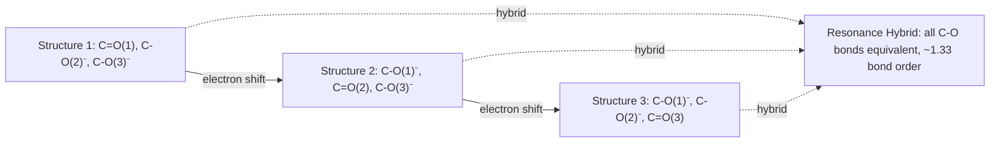

## Resonance Structures

### Definition

Resonance structures are two or more valid Lewis structures for a single molecule or ion that differ only in the placement of electrons (specifically π electrons and lone pairs), not in the positions of atoms or atomic nuclei. No single structure accurately depicts the true electronic distribution; the actual molecule is a **weighted composite** (resonance hybrid) of all contributing structures.

**Key Points**

- Only electrons move between resonance structures — atomic connectivity and geometry remain fixed
- The molecule does not "oscillate" between structures; it exists as one single hybrid structure at all times
- Resonance arises when a single Lewis structure fails to account for known bond lengths, bond energies, or charge distributions
- Curved (double-headed) arrows depict formal electron reorganization between contributing structures, not actual physical electron motion

### Why Resonance Is Needed

A single Lewis structure often predicts bond lengths or bond orders inconsistent with experimental data. For example, ozone (O₃) has two experimentally equivalent O–O bonds of length ~127.8 pm — intermediate between a typical O–O single bond (~148 pm) and O=O double bond (~121 pm). A single Lewis structure would force one bond to be a single bond and the other a double bond, which contradicts the observed symmetry. Resonance resolves this by averaging both possibilities.

### Drawing Resonance Structures — Rules

1. Only atoms with lone pairs, π bonds, or formal charges adjacent to a π system can participate
2. Atomic positions must remain identical across all structures
3. The total number of electrons (and formal charge on the ion/molecule overall) must be conserved in every structure
4. All structures must be valid Lewis structures individually (correct octets where applicable, appropriate formal charges)
5. Curved arrows show movement of electron pairs — from a lone pair to form a π bond, or from a π bond to become a lone pair or shift to an adjacent atom

**Example: Carbonate ion (CO₃²⁻)**

In CO₃²⁻, three equivalent resonance structures exist, each placing the C=O double bond on a different oxygen. The true structure is a hybrid where all three C–O bonds have equal length (~128 pm) and equal bond order (1.33), with the −2 charge delocalized evenly across all three oxygens (each bearing partial charge of −2/3).

### Evaluating Relative Importance of Contributing Structures

Not all resonance structures contribute equally to the hybrid. Structures are weighted more heavily (are "major contributors") when they satisfy more of the following criteria:

- **Maximum number of octets satisfied** (complete octets on all atoms, where possible)
- **Minimum formal charges** (structures with formal charges closer to zero are favored)
- **Negative formal charge on the more electronegative atom** (and positive charge on the less electronegative atom)
- **Greater number of covalent bonds**, generally correlating with lower overall energy
- Like charges on adjacent atoms are strongly disfavored (high-energy, minor contributors)

### Formal Charge Calculation

$$FC = V - N - \frac{B}{2}$$

Where $V$ = valence electrons of free atom, $N$ = nonbonding (lone pair) electrons, $B$ = total bonding electrons around that atom.

**Example:** For nitrate ion (NO₃⁻), the structure with one N=O double bond and two N–O single bonds (one bearing −1 formal charge) is preferred over a hypothetical structure with three N–O single bonds and additional charge separation, because it minimizes formal charges while satisfying octets.

### Resonance Energy (Delocalization Energy)

The resonance hybrid is always **lower in energy** (more stable) than any single contributing structure would suggest. This stabilization is called resonance energy or delocalization energy.

$$E_{resonance} = E_{observed} - E_{most\ stable\ contributor}$$

For benzene (C₆H₆), the experimentally measured heat of hydrogenation is significantly less exothermic than predicted for a hypothetical structure with three isolated double bonds (the Kekulé structure), yielding a resonance stabilization energy of approximately 36 kcal/mol (~150 kJ/mol). [Unverified: exact numerical value varies slightly by measurement method and reference source]

### Common Examples

| Species | Delocalized System | Bond Order Result |
| --- | --- | --- |
| Benzene (C₆H₆) | 6 π electrons over 6 C atoms | All C–C bonds = 1.5 |
| Carbonate (CO₃²⁻) | 2 π electrons over 3 C–O bonds | All C–O bonds ≈ 1.33 |
| Nitrate (NO₃⁻) | 2 π electrons over 3 N–O bonds | All N–O bonds ≈ 1.33 |
| Ozone (O₃) | 2 π electrons over 2 O–O bonds | Both O–O bonds ≈ 1.5 |
| Carboxylate (RCOO⁻) | 2 π electrons over 2 C–O bonds | Both C–O bonds ≈ 1.5 |
| Allyl cation (C₃H₅⁺) | 2 π electrons over 2 C–C bonds | Both C–C bonds ≈ 1.5, +charge delocalized |

### Resonance vs. Tautomers vs. Isomers — Common Misconception

**Key distinction:**

- **Resonance structures**: same atoms, same connectivity, only electron placement differs — these are NOT separate molecules, just alternate depictions of one molecule
- **Tautomers**: constitutional isomers that interconvert via atom (typically H) migration — these ARE distinct molecules in equilibrium (e.g., keto-enol tautomerism)
- **Isomers**: genuinely different molecules with different atomic connectivity or spatial arrangement

A frequent student error is treating resonance structures as if the molecule "flips" between them like tautomers — this is incorrect. Resonance structures are drawings of the *same* electronic state viewed as idealized limiting cases; no bonds actually break or reform.

### Visualizing the Hybrid — Dashed-Line/Partial Bond Notation

Chemists often represent the resonance hybrid directly using dashed lines for partial-order bonds and δ (delta) symbols for partial charges, rather than drawing every contributing structure.

<svg xmlns="http://www.w3.org/2000/svg" viewBox="0 0 500 200" font-family="sans-serif">
<text x="20" y="25" font-size="15" font-weight="bold">Carbonate Resonance Hybrid Representation (svg_diagram)</text>
<g stroke="#333" stroke-width="2" fill="none">
<line x1="150" y1="100" x2="90" y2="60" />
<line x1="150" y1="100" x2="90" y2="140" />
<line x1="150" y1="100" x2="230" y2="100" stroke-dasharray="6,4" />
</g>
<circle cx="150" cy="100" r="18" fill="#dceeff" stroke="#333" stroke-width="2" />
<text x="144" y="106" font-size="14">C</text>
<circle cx="90" cy="60" r="16" fill="#ffe0e0" stroke="#333" stroke-width="2" />
<text x="83" y="65" font-size="13">O</text>
<text x="60" y="55" font-size="12">δ⁻⅔</text>
<circle cx="90" cy="140" r="16" fill="#ffe0e0" stroke="#333" stroke-width="2" />
<text x="83" y="145" font-size="13">O</text>
<text x="55" y="160" font-size="12">δ⁻⅔</text>
<circle cx="230" cy="100" r="16" fill="#ffe0e0" stroke="#333" stroke-width="2" />
<text x="223" y="106" font-size="13">O</text>
<text x="255" y="100" font-size="12">δ⁻⅔</text>
<text x="20" y="185" font-size="11" fill="#555">Dashed bonds indicate partial (1.33) bond order; charge delocalized equally over all three O atoms</text>
</svg>

### Impact on Physical/Chemical Properties

- **Bond lengths**: intermediate between single and double bond values, and all equivalent positions become identical (e.g., all three CO₃²⁻ bonds are the same length, not two short and one long)
- **Reactivity**: delocalization lowers electrophilicity/nucleophilicity at specific sites compared to a localized structure (e.g., carboxylate ions are poor nucleophiles compared to alkoxides because negative charge is spread over two oxygens)
- **Acidity**: resonance stabilization of the conjugate base increases acid strength — this is why carboxylic acids ($pK_a \approx 4$–5) are far more acidic than alcohols ($pK_a \approx 16$–18); the carboxylate anion is resonance-stabilized while the alkoxide is not
- **Color/UV-Vis absorption**: extended conjugation (many contributing resonance structures) lowers the HOMO–LUMO gap, shifting absorption to longer wavelengths (relevant in dyes, chromophores)

### Related Topics

- Formal charge calculation and its role in structure evaluation
- Delocalization energy and aromatic stabilization
- Hybridization and molecular orbital theory (MO treatment of delocalized π systems)
- Aromaticity and Hückel's rule
- Conjugated π systems and UV-Vis spectroscopy
- Acid-base strength and resonance stabilization of conjugate bases
- VSEPR theory and molecular geometry